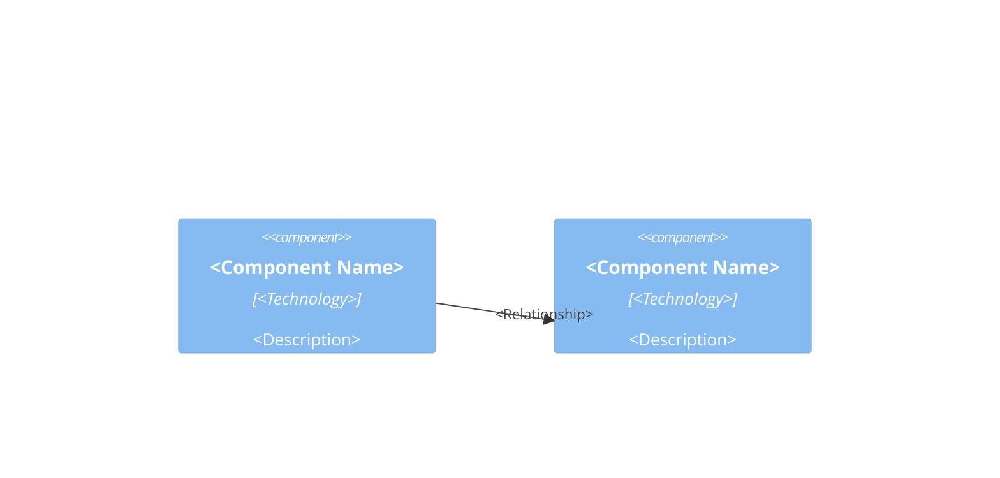

# Architecture: `<FILE>`

## Purpose
- <One or two sentences: what this module does and its role in the broader
  system>

## Public API
- `<function_or_class_name>()`: <what it does>
- `<function_or_class_name>()`: <what it does>

## Architecture Diagram

## Code Organization
- `<Section 1>`: <what lives here>
- `<Section 2>`: <what lives here>

## Key Dependencies
- `<external_module>`: <why it's used>

## Design Notes
- <Fact, code-derived>: e.g., "The function `process_data()` calls
  `validate_input()` before computing results"
- **Assumption**: <flagged inference not directly visible in the code>: e.g.,
  "This likely handles error cases based on the try-except blocks present"

## Maintainability and Extensibility
- <How easy it is to modify and extend this code>
- <How well the design accommodates new features>
