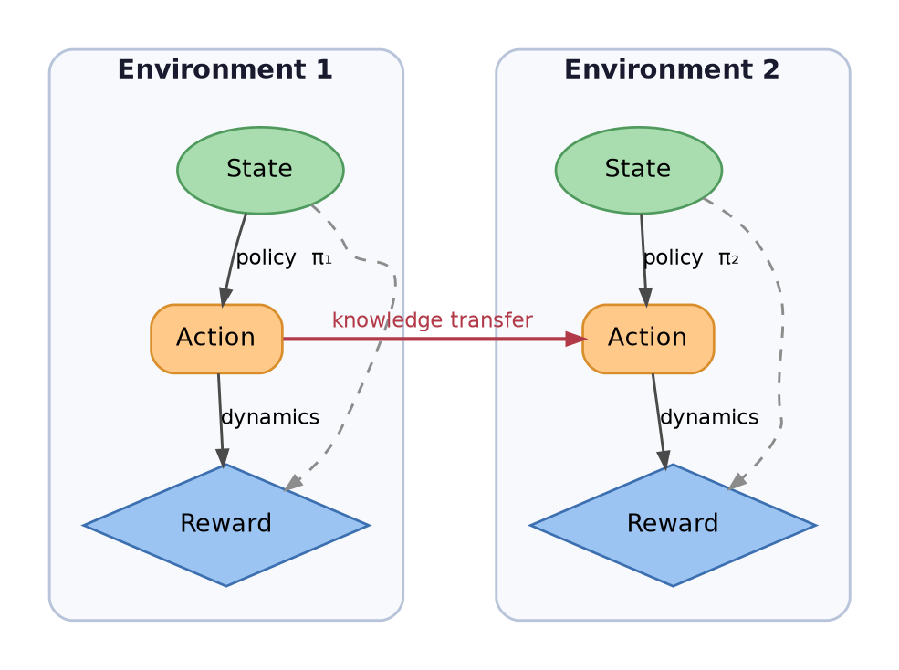

- Maintain the structure of the text as it is

## Template
- All graphviz dot diagram must follow the template below
  ```graphviz
  digraph <name> {
      splines=true;
      nodesep=0.8;
      ranksep=0.8;

      node [shape=box, style="rounded,filled", fontname="Helvetica", fontsize=12, penwidth=1.7];

      // Nodes
      Rain       [label="Rain", fillcolor="#A6C8F4"];
      WetGrass   [label="WetGrass", fillcolor="#B2E2B2"];
      Cover      [label="Cover", fillcolor="#FFD1A6"];
      Evaporate  [label="Evaporate", fillcolor="#F4A6A6"];
      Sprinkler  [label="Sprinkler", fillcolor="#A0D6D1"];
      Dew        [label="Dew", fillcolor="#A6E7F4"];

      // Force ranks
      { rank=same; Cover; Evaporate; }
      { rank=same; Sprinkler; Dew; }

      // Edges
      Rain -> WetGrass;
      Rain -> Cover;
      Rain -> Evaporate;
      Cover -> WetGrass [label="blocks", style=dashed];
      Evaporate -> WetGrass [label="blocks", style=dashed];
      Sprinkler -> WetGrass;
      Dew -> WetGrass;
  }
  ```

## Annotating Nodes with Probability Expressions

- Use `xlabel` to display conditional probability expressions inline on GraphViz
  nodes:
  ```graphviz
  Rain [label="Rain", fillcolor="#A6C8F4", xlabel="P(R | W)"];
  ```
  - The `xlabel` text appears outside the node box, not inside
  - Use it to annotate Bayesian network nodes with their CPT expressions:
    - Source nodes: `xlabel="P(W)"`
    - Conditional nodes: `xlabel="P(R | W)"`, `xlabel="P(G | R, S)"`
    - Nodes with known probabilities: `xlabel="P(B) = 0.001"`

- Example:
  ```graphviz
  digraph AgentEnv {
      splines=true;
      nodesep=1.0;
      ranksep=0.75;

      node [shape=box, style="rounded,filled", fontname="Helvetica", fontsize=12, penwidth=1.4];

      Agent [label="Agent", fillcolor="#F4A6A6"];
      Env [label="Environment", fillcolor="#B2E2B2"];

      Agent -> Env [label="  Action"];
      Env -> Agent [label="  Reward"];
  }
  ```

### Graph-Level Settings

```
digraph MyGraph {
    rankdir=TB;           # Top-to-Bottom (LR, RL, BT alternatives)
    splines=spline;       # Curved edges (orthogonal, polyline alternatives)
    nodesep=0.6;          # Horizontal spacing between nodes
    ranksep=0.5;          # Vertical spacing between ranks
    bgcolor="white";      # Background color
    compound=true;        # Enable compound edges
    newrank=true;         # Better ranking with subgraphs
}
```

- Use `splines=spline` for organic, curved edges; `orthogonal` for grid-like diagrams
- Adjust `nodesep` and `ranksep` based on diagram complexity
- Set `compound=true` for complex edge routing with subgraphs
- Use `newrank=true` for better layout when mixing rank-constrained nodes

### Node Styling

#### Standard Node Attributes

```
node [
    fontname="Helvetica",
    fontsize=13,
    style="filled",
    shape="box",
    penwidth=1.3,
    margin="0.18,0.12"
];
```

#### Common Shapes & Use Cases

- **`box`**: Default for most nodes, decision points
- **`ellipse`**: State, concepts, inputs/outputs
- **`diamond`**: Decision outcomes, rewards, final values
- **`circle`**: Compact nodes, simple states
- **`plaintext`**: Labels without borders
- **`Mrecord`**: Structured data with ports

#### Color Strategy

Use semantic color mapping:

```
fillcolor="#A9DDB0", color="#4F9A5C"    # Green → states, inputs
fillcolor="#FFC98A", color="#D98E2B"    # Orange → actions, processes
fillcolor="#9CC4F2", color="#3C6FB0"    # Blue → outputs, rewards
fillcolor="#FFB3B3", color="#D64545"    # Red → errors, warnings
fillcolor="#E8D9F7", color="#9B7DB1"    # Purple → metadata, annotations
```

- `fillcolor`: Interior color
- `color`: Border/outline color
- Use darker shade of fillcolor for the border
- Avoid high-contrast combinations that strain eyes

#### Individual Node Styling

```
N1 [label="Label", shape="ellipse", fillcolor="#A9DDB0", color="#4F9A5C"];
N2 [label="Multi\nLine\nLabel", shape="box", style="filled,rounded"];
N3 [label="Important", style="filled,bold", penwidth=2.0];
```

- Use `\n` for line breaks in labels
- Add `rounded` style to box shapes for softer appearance
- Increase `penwidth` for emphasis or importance

### Edge Styling

#### Standard Edge Attributes

```
edge [
    fontname="Helvetica",
    fontsize=11,
    color="#4A4A4A",
    penwidth=1.4,
    arrowsize=0.8
];
```

#### Edge Styles & Semantics

```
N1 -> N2 [label="normal"];                              # Solid, regular flow
N1 -> N3 [style="dashed", color="#8C8C8C"];            # Weak link, optional
N1 -> N4 [style="dotted", color="#AAAAAA"];            # Implied, reference
N1 -> N5 [style="bold", penwidth=2.0, color="#B23A48"]; # Strong, critical
```

#### Label Positioning

```
E1 -> E2 [
    label="  action  ",
    labelpos="t",           # top, c (center, default), b (bottom)
    fontcolor="#B23A48",
    fontsize=10
];
```

- Center label text with spaces: `"  label  "` (looks better than default)
- Use `fontcolor` to match or contrast with edge `color`
- `labelpos="t"` places label at top; useful for tall diagrams

#### Arrow Types

```
A -> B [arrowhead="normal"];     # Standard arrow (default)
A -> B [arrowhead="diamond"];    # Diamond-headed
A -> B [arrowhead="none"];       # No arrow (directional via position)
A -> B [dir="both"];             # Bidirectional arrows
A -> B [dir="back"];             # Reverse direction
```

### Subgraph Clustering

#### Basic Cluster Structure

```
subgraph cluster_name {
    label="Display Name";
    fontname="Helvetica-Bold";
    fontsize=14;
    fontcolor="#1A1A2E";
    style="rounded,filled";
    fillcolor="#F7F9FC";
    color="#B8C4D9";
    penwidth=1.4;
    margin=18;
    
    N1 [label="Node in cluster"];
    N2 [label="Another node"];
}
```

**Rules:**
- Cluster name must start with `cluster_` prefix
- `label` is displayed title
- `style="rounded,filled"` gives modern appearance
- `margin=18` adds padding inside cluster box
- `fontcolor` should contrast with `fillcolor`

#### Nested Clusters

Use multiple subgraphs for hierarchical organization:

```
subgraph cluster_level1 {
    label="Outer";
    style="rounded,filled";
    fillcolor="#EEEEEE";
    
    subgraph cluster_level2 {
        label="Inner";
        style="rounded,filled";
        fillcolor="#F7F9FC";
        N1 [label="Nested node"];
    }
}
```

### Layout Control

#### Rank Control

```
{ rank=same; A; B; C; }         # Force nodes to same horizontal level
S1 -> S2 [style=invis];          # Invisible edge for alignment
{ rank=min; START; }             # Force to top
{ rank=max; END; }               # Force to bottom
```

Use invisible edges to guide layout without visual noise:

```
R1 -> R2 [style=invis];          # Aligns R1 and R2 vertically
A1 -> A2 [style=invis];          # Without showing connection
```

#### Alignment & Spacing

```
newrank=true;                     # Better rank handling
compound=true;                    # Enable compound edge routing
constraint=false;                 # Don't use edge for ranking
```

### Typography & Labels

#### Font Choices

```
fontname="Helvetica"              # Clean, professional
fontname="Courier"                # Code, monospace
fontname="Times"                  # Formal, serif
```

Use consistent font across graphs. Helvetica is default recommended.

#### Unicode & Special Characters

```
label="State →"                   # Arrow
label="π₁"                        # Greek letter pi with subscript
label="≤ 0.5"                     # Mathematical symbols
label="●"                         # Bullet
label="◆"                         # Diamond
```

Most Unicode works; test in your PDF viewer before final render.

#### HTML-like Labels

For complex formatting, avoid HTML labels — they render inconsistently. Instead use multiple lines with `\n`.

## Color Palettes for Different Domains

### Machine Learning / Reinforcement Learning

```
State:      fillcolor="#A9DDB0", color="#4F9A5C"      # Soft green
Action:     fillcolor="#FFC98A", color="#D98E2B"      # Warm orange
Reward:     fillcolor="#9CC4F2", color="#3C6FB0"      # Cool blue
Value:      fillcolor="#E8D9F7", color="#9B7DB1"      # Purple
Policy:     fillcolor="#FFD4D4", color="#B23A48"      # Soft red
```

### Data Flow / ETL

```
Source:     fillcolor="#C8E6C9", color="#2E7D32"      # Green
Transform:  fillcolor="#FFECB3", color="#F57F17"      # Amber
Sink:       fillcolor="#BBDEFB", color="#1565C0"      # Blue
Error:      fillcolor="#FFCDD2", color="#C62828"      # Red
```

### System Architecture

```
Frontend:   fillcolor="#E1BEE7", color="#6A1B9A"      # Purple
Backend:    fillcolor="#B3E5FC", color="#0277BD"      # Light blue
Database:   fillcolor="#C8E6C9", color="#558B2F"      # Dark green
Cache:      fillcolor="#FFE0B2", color="#E65100"      # Orange
External:   fillcolor="#F8BBD0", color="#AD1457"      # Pink
```

### Legacy Simple Palette

Use consistently throughout all diagrams (for backward compatibility):
- **Red/Pink** `#F4A6A6`: Agents, actors, primary entities
- **Orange** `#FFD1A6`: Input data, sources
- **Green** `#B2E2B2`: Processed data, environments
- **Teal** `#A0D6D1`: Algorithms, processes, transformations
- **Light Blue** `#A6E7F4`: Parameters, configuration, settings
- **Blue** `#A6C8F4`: Outputs, results, final states
- **Purple** `#C6A6F4`: External entities, mixed dependencies

# Complete Example Structure

1. Global graph attributes (rankdir, splines, nodesep, ranksep)
2. Consistent node/edge defaults
3. Semantic color mapping for node types
4. Rounded, filled subgraph clusters with margin
5. Invisible edges for alignment
6. Bold/prominent edges for key relationships
7. Unicode labels for mathematical notation
8. Dashed edges for weak or optional flows


