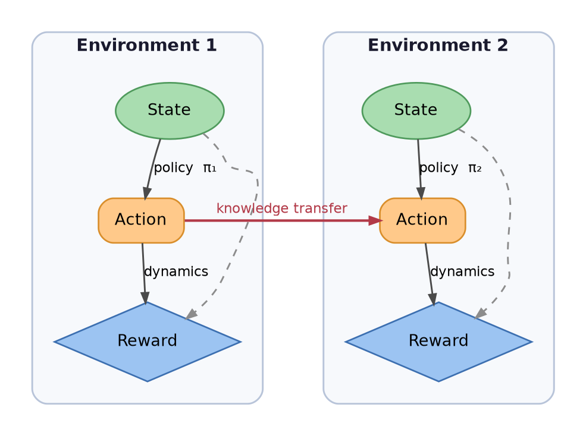

- Maintain the structure of the text as it is
- For the conventions behind this template (color strategy, shape/edge
  semantics, typography, palettes), see `.claude/skills/graphviz.rules.md`

## Template
- All graphviz dot diagram must follow the template below
  ```graphviz
  digraph <name> {
      splines=true;
      nodesep=0.8;
      ranksep=0.8;

      node [shape=box, style="rounded,filled", fontname="Helvetica", fontsize=12, penwidth=1.7];

      // Nodes
      Rain       [label="Rain", fillcolor="#A6C8F4"];
      WetGrass   [label="WetGrass", fillcolor="#B2E2B2"];
      Cover      [label="Cover", fillcolor="#FFD1A6"];
      Evaporate  [label="Evaporate", fillcolor="#F4A6A6"];
      Sprinkler  [label="Sprinkler", fillcolor="#A0D6D1"];
      Dew        [label="Dew", fillcolor="#A6E7F4"];

      // Force ranks
      { rank=same; Cover; Evaporate; }
      { rank=same; Sprinkler; Dew; }

      // Edges
      Rain -> WetGrass;
      Rain -> Cover;
      Rain -> Evaporate;
      Cover -> WetGrass [label="blocks", style=dashed];
      Evaporate -> WetGrass [label="blocks", style=dashed];
      Sprinkler -> WetGrass;
      Dew -> WetGrass;
  }
  ```

## Annotating Nodes with Probability Expressions

- Use `xlabel` to display conditional probability expressions inline on GraphViz
  nodes:
  ```
  Rain [label="Rain", fillcolor="#A6C8F4", xlabel="P(R | W)"];
  ```
  - The `xlabel` text appears outside the node box, not inside
  - Use it to annotate Bayesian network nodes with their CPT expressions:
    - Source nodes: `xlabel="P(W)"`
    - Conditional nodes: `xlabel="P(R | W)"`, `xlabel="P(G | R, S)"`
    - Nodes with known probabilities: `xlabel="P(B) = 0.001"`

- Example:
  ```graphviz
  digraph AgentEnv {
      splines=true;
      nodesep=1.0;
      ranksep=0.75;

      node [shape=box, style="rounded,filled", fontname="Helvetica", fontsize=12, penwidth=1.4];

      Agent [label="Agent", fillcolor="#F4A6A6"];
      Env [label="Environment", fillcolor="#B2E2B2"];

      Agent -> Env [label="  Action"];
      Env -> Agent [label="  Reward"];
  }
  ```

### Graph-Level Settings

```
digraph MyGraph {
    rankdir=TB;           # Top-to-Bottom (LR, RL, BT alternatives)
    splines=spline;       # Curved edges (orthogonal, polyline alternatives)
    nodesep=0.6;          # Horizontal spacing between nodes
    ranksep=0.5;          # Vertical spacing between ranks
    bgcolor="white";      # Background color
    compound=true;        # Enable compound edges
    newrank=true;         # Better ranking with subgraphs
}
```

### Node Styling

#### Standard Node Attributes

```
node [
    fontname="Helvetica",
    fontsize=13,
    style="filled",
    shape="box",
    penwidth=1.3,
    margin="0.18,0.12"
];
```

#### Individual Node Styling

```
N1 [label="Label", shape="ellipse", fillcolor="#A9DDB0", color="#4F9A5C"];
N2 [label="Multi\nLine\nLabel", shape="box", style="filled,rounded"];
N3 [label="Important", style="filled,bold", penwidth=2.0];
```

### Edge Styling

#### Standard Edge Attributes

```
edge [
    fontname="Helvetica",
    fontsize=11,
    color="#4A4A4A",
    penwidth=1.4,
    arrowsize=0.8
];
```

#### Label Positioning

```
E1 -> E2 [
    label="  action  ",
    labelpos="t",           # top, c (center, default), b (bottom)
    fontcolor="#B23A48",
    fontsize=10
];
```

### Subgraph Clustering

#### Basic Cluster Structure

```
subgraph cluster_name {
    label="Display Name";
    fontname="Helvetica-Bold";
    fontsize=14;
    fontcolor="#1A1A2E";
    style="rounded,filled";
    fillcolor="#F7F9FC";
    color="#B8C4D9";
    penwidth=1.4;
    margin=18;

    N1 [label="Node in cluster"];
    N2 [label="Another node"];
}
```

#### Nested Clusters

```
subgraph cluster_level1 {
    label="Outer";
    style="rounded,filled";
    fillcolor="#EEEEEE";

    subgraph cluster_level2 {
        label="Inner";
        style="rounded,filled";
        fillcolor="#F7F9FC";
        N1 [label="Nested node"];
    }
}
```

### Layout Control

#### Rank Control

```
{ rank=same; A; B; C; }         # Force nodes to same horizontal level
S1 -> S2 [style=invis];          # Invisible edge for alignment
{ rank=min; START; }             # Force to top
{ rank=max; END; }               # Force to bottom
```

# Complete Example Structure

1. Global graph attributes (rankdir, splines, nodesep, ranksep)
2. Consistent node/edge defaults
3. Semantic color mapping for node types
4. Rounded, filled subgraph clusters with margin
5. Invisible edges for alignment
6. Bold/prominent edges for key relationships
7. Unicode labels for mathematical notation
8. Dashed edges for weak or optional flows


```graphviz
digraph Transfer {
    rankdir=TB;
    splines=spline;
    nodesep=0.6;
    ranksep=0.5;
    bgcolor="white";
    compound=true;
    newrank=true;

    graph [
        fontname="Helvetica",
        pad="0.25"
    ];

    node [
        fontname="Helvetica",
        fontsize=13,
        style="filled",
        shape="box",
        penwidth=1.3,
        margin="0.18,0.12"
    ];

    edge [
        fontname="Helvetica",
        fontsize=11,
        color="#4A4A4A",
        penwidth=1.4,
        arrowsize=0.8
    ];

    subgraph cluster_env1 {
        label="Environment 1";
        fontname="Helvetica-Bold";
        fontsize=14;
        fontcolor="#1A1A2E";
        style="rounded,filled";
        fillcolor="#F7F9FC";
        color="#B8C4D9";
        penwidth=1.4;
        margin=18;

        S1 [label="State", shape="ellipse", fillcolor="#A9DDB0", color="#4F9A5C"];
        A1 [label="Action", shape="box", style="filled,rounded", fillcolor="#FFC98A", color="#D98E2B"];
        R1 [label="Reward", shape="diamond", fillcolor="#9CC4F2", color="#3C6FB0"];

        S1 -> A1 [label="policy  π₁"];
        A1 -> R1 [label="dynamics"];
        S1 -> R1 [style="dashed", color="#8C8C8C", constraint="false"];
    }

    subgraph cluster_env2 {
        label="Environment 2";
        fontname="Helvetica-Bold";
        fontsize=14;
        fontcolor="#1A1A2E";
        style="rounded,filled";
        fillcolor="#F7F9FC";
        color="#B8C4D9";
        penwidth=1.4;
        margin=18;

        S2 [label="State", shape="ellipse", fillcolor="#A9DDB0", color="#4F9A5C"];
        A2 [label="Action", shape="box", style="filled,rounded", fillcolor="#FFC98A", color="#D98E2B"];
        R2 [label="Reward", shape="diamond", fillcolor="#9CC4F2", color="#3C6FB0"];

        S2 -> A2 [label="policy  π₂"];
        A2 -> R2 [label="dynamics"];
        S2 -> R2 [style="dashed", color="#8C8C8C", constraint="false"];
    }

    { rank=same; S1; S2; }
    { rank=same; A1; A2; }
    { rank=same; R1; R2; }

    S1 -> S2 [style=invis];
    R1 -> R2 [style=invis];

    A1 -> A2 [
        label="  knowledge transfer  ",
        style="bold",
        color="#B23A48",
        fontcolor="#B23A48",
        penwidth=2.0
    ];
}
```
