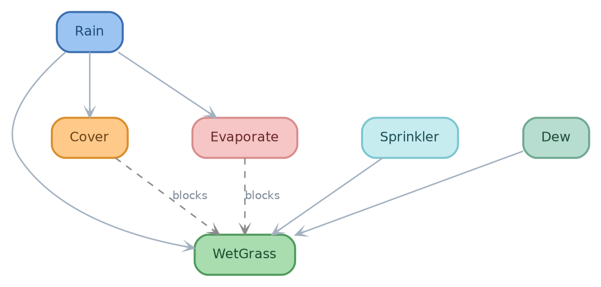
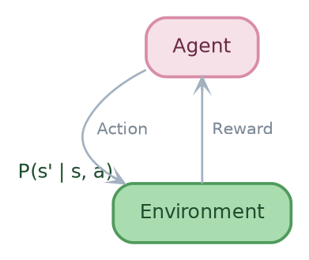
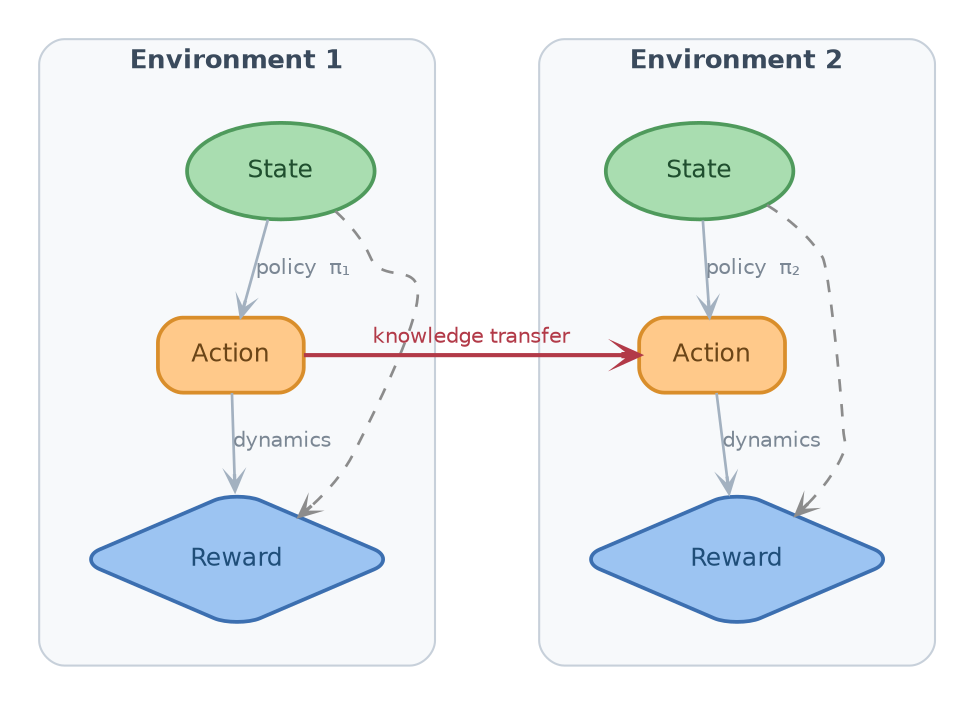
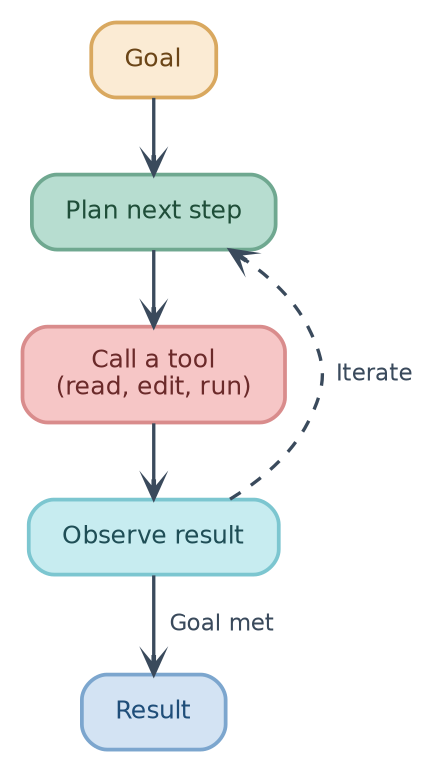
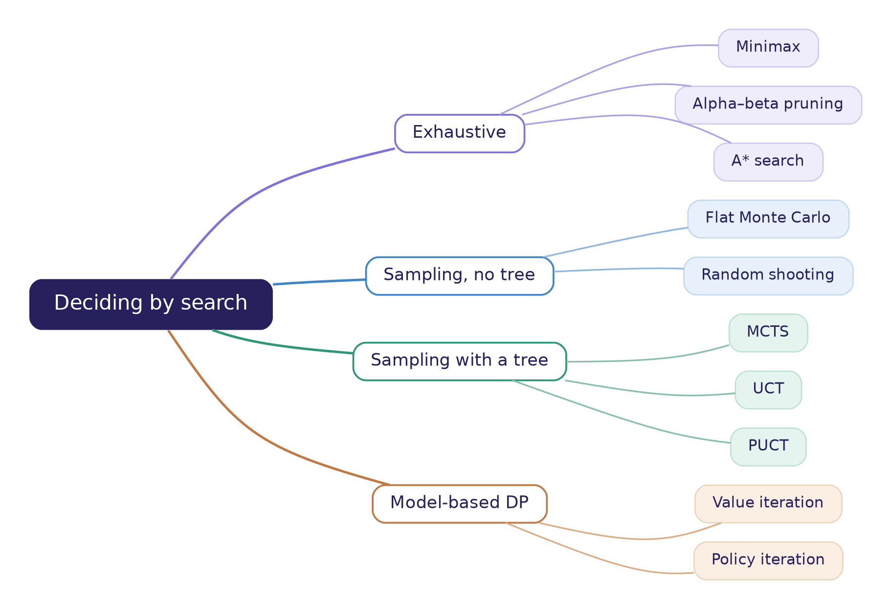

This template covers both GraphViz styles used in this repo: the default flat
style for flowcharts, causal graphs, networks, and process flows (e.g.
Bayesian networks, reinforcement-learning diagrams, ETL pipelines), and the
hierarchy-aware architecture style for diagrams that group components into
subsystems and highlight feedback loops (e.g. service architectures,
market/pipeline diagrams, agent loops). Both share the same muted color
triads, rounded nodes, and soft edge styling; the architecture style adds
subsystem clustering, two-tier (name + subtitle) labels, and a color legend

- For the conventions behind these templates (when to use each style, color
  scheme, shape/edge semantics, typography), see
  `.claude/skills/graphviz.rules.md`
- Draw the diagram as a fenced ` ```graphviz ` code block
- Maintain the structure of the surrounding text as it is when inserting a
  diagram
- Use `xlabel` on a node for an inline annotation that sits outside the node
  box, e.g. a conditional-probability expression on a Bayesian network node
  (`xlabel="P(R | W)"`); see Flat Style Examples below
- An architecture-style diagram ends with two footer lines after the closing
  code fence: `label=fig:<slug>` and `caption=<one sentence>` (see Footer in
  `.claude/skills/graphviz.rules.md`); flat-style diagrams do not need a
  footer

# Flat Style

## Skeleton

```
digraph <name> {
    bgcolor="transparent";
    pad="0.15";
    splines=spline;                  # or orthogonal for grid-like diagrams
    nodesep=0.4;
    ranksep=0.5;
    rankdir=TB;                      # or LR for pipelines / parallel lanes

    node [shape=box,
          style="rounded,filled",
          penwidth=1.8,
          fontname="Helvetica",
          fontsize=12,
          margin="0.22,0.14",
          height=0.50];

    edge [color="#A3B1C0",
          penwidth=1.3,
          arrowhead=vee,
          arrowsize=0.75,
          fontname="Helvetica",
          fontsize=10,
          fontcolor="#7B8794"];

    <A> [label="<A>", fillcolor="FILL", color="BORDER", fontcolor="FONT"];
    <B> [label="<B>", fillcolor="FILL", color="BORDER", fontcolor="FONT"];

    subgraph cluster_<name> {
        label     = "Group name";
        labelloc  = "t";
        fontname  = "Helvetica-Bold";
        fontsize  = 12.5;
        fontcolor = "#3A4A5C";
        style     = "rounded,filled";
        fillcolor = "#F7F9FB";
        color     = "#C7D0DA";
        penwidth  = 1.0;
        margin    = 18;

        ...
    }

    <A> -> <B> [label="normal flow"];
    <A> -> <C> [style=dashed, color="#8C8C8C", label="weak / optional link"];
}
```

## Flat Style Examples

### Bayesian Network


```graphviz
digraph Sprinkler {
    bgcolor="transparent";
    pad="0.15";
    splines=spline;
    nodesep=0.8;
    ranksep=0.8;

    node [shape=box,
          style="rounded,filled",
          penwidth=1.8,
          fontname="Helvetica",
          fontsize=12,
          margin="0.22,0.14",
          height=0.50];

    edge [color="#A3B1C0",
          penwidth=1.3,
          arrowhead=vee,
          arrowsize=0.75,
          fontname="Helvetica",
          fontsize=10,
          fontcolor="#7B8794"];

    // Nodes
    Rain       [label="Rain", fillcolor="#9CC4F2", color="#3C6FB0", fontcolor="#1F4E79"];
    WetGrass   [label="WetGrass", fillcolor="#A9DDB0", color="#4F9A5C", fontcolor="#1F4E2E"];
    Cover      [label="Cover", fillcolor="#FFC98A", color="#D98E2B", fontcolor="#6B4517"];
    Evaporate  [label="Evaporate", fillcolor="#F6C6C6", color="#D98C8C", fontcolor="#6B2A2A"];
    Sprinkler  [label="Sprinkler", fillcolor="#C7ECF0", color="#7CC6D0", fontcolor="#1F4E56"];
    Dew        [label="Dew", fillcolor="#B7DDD0", color="#6FA890", fontcolor="#1F4E39"];

    // Force ranks
    { rank=same; Cover; Evaporate; }
    { rank=same; Sprinkler; Dew; }

    // Edges
    Rain -> WetGrass;
    Rain -> Cover;
    Rain -> Evaporate;
    Cover -> WetGrass [label="blocks", style=dashed, color="#8C8C8C"];
    Evaporate -> WetGrass [label="blocks", style=dashed, color="#8C8C8C"];
    Sprinkler -> WetGrass;
    Dew -> WetGrass;
}
```

### Agent-Environment Loop with Probability Annotation

- `xlabel` displays a conditional-probability expression outside the node,
  e.g. a source node's prior (`xlabel="P(W)"`), a conditional
  (`xlabel="P(R | W)"`), or a known value (`xlabel="P(B) = 0.001"`)


```graphviz
digraph AgentEnv {
    bgcolor="transparent";
    pad="0.15";
    splines=spline;
    nodesep=1.0;
    ranksep=0.75;

    node [shape=box,
          style="rounded,filled",
          penwidth=1.8,
          fontname="Helvetica",
          fontsize=12,
          margin="0.22,0.14",
          height=0.50];

    edge [color="#A3B1C0",
          penwidth=1.3,
          arrowhead=vee,
          arrowsize=0.75,
          fontname="Helvetica",
          fontsize=10,
          fontcolor="#7B8794"];

    Agent [label="Agent", fillcolor="#F6E1E8", color="#D98CA8", fontcolor="#6B2A44"];
    Env   [label="Environment", fillcolor="#A9DDB0", color="#4F9A5C", fontcolor="#1F4E2E", xlabel="P(s' | s, a)"];

    Agent -> Env [label="  Action"];
    Env -> Agent [label="  Reward"];
}
```

### Knowledge Transfer Between Environments


```graphviz
digraph Transfer {
    bgcolor="transparent";
    pad="0.15";
    rankdir=TB;
    splines=spline;
    nodesep=0.6;
    ranksep=0.5;
    compound=true;
    newrank=true;

    node [shape=box,
          style="rounded,filled",
          penwidth=1.8,
          fontname="Helvetica",
          fontsize=12,
          margin="0.22,0.14",
          height=0.50];

    edge [color="#A3B1C0",
          penwidth=1.3,
          arrowhead=vee,
          arrowsize=0.75,
          fontname="Helvetica",
          fontsize=10,
          fontcolor="#7B8794"];

    subgraph cluster_env1 {
        label     = "Environment 1";
        labelloc  = "t";
        fontname  = "Helvetica-Bold";
        fontsize  = 12.5;
        fontcolor = "#3A4A5C";
        style     = "rounded,filled";
        fillcolor = "#F7F9FB";
        color     = "#C7D0DA";
        penwidth  = 1.0;
        margin    = 18;

        S1 [label="State", shape="ellipse", fillcolor="#A9DDB0", color="#4F9A5C", fontcolor="#1F4E2E"];
        A1 [label="Action", fillcolor="#FFC98A", color="#D98E2B", fontcolor="#6B4517"];
        R1 [label="Reward", shape="diamond", fillcolor="#9CC4F2", color="#3C6FB0", fontcolor="#1F4E79"];

        S1 -> A1 [label="policy  π₁"];
        A1 -> R1 [label="dynamics"];
        S1 -> R1 [style="dashed", color="#8C8C8C", constraint="false"];
    }

    subgraph cluster_env2 {
        label     = "Environment 2";
        labelloc  = "t";
        fontname  = "Helvetica-Bold";
        fontsize  = 12.5;
        fontcolor = "#3A4A5C";
        style     = "rounded,filled";
        fillcolor = "#F7F9FB";
        color     = "#C7D0DA";
        penwidth  = 1.0;
        margin    = 18;

        S2 [label="State", shape="ellipse", fillcolor="#A9DDB0", color="#4F9A5C", fontcolor="#1F4E2E"];
        A2 [label="Action", fillcolor="#FFC98A", color="#D98E2B", fontcolor="#6B4517"];
        R2 [label="Reward", shape="diamond", fillcolor="#9CC4F2", color="#3C6FB0", fontcolor="#1F4E79"];

        S2 -> A2 [label="policy  π₂"];
        A2 -> R2 [label="dynamics"];
        S2 -> R2 [style="dashed", color="#8C8C8C", constraint="false"];
    }

    { rank=same; S1; S2; }
    { rank=same; A1; A2; }
    { rank=same; R1; R2; }

    S1 -> S2 [style=invis];
    R1 -> R2 [style=invis];

    A1 -> A2 [
        label="  knowledge transfer  ",
        style="bold",
        color="#B23A48",
        fontcolor="#B23A48",
        penwidth=2.0
    ];
}
```

# Architecture Style

## Skeleton

```
digraph <name> {
  bgcolor="transparent";
  pad="0.15";
  splines=spline;
  nodesep=0.30;
  ranksep=0.50;
  rankdir=LR;                      # or TB for sequential/vertical flows

  node [shape=box,
        style="rounded,filled",
        penwidth=1.8,
        fontname="Helvetica",
        fontsize=12,
        margin="0.22,0.14",
        height=0.50];

  edge [color="#A3B1C0",
        penwidth=1.3,
        arrowhead=vee,
        arrowsize=0.75,
        fontname="Helvetica",
        fontsize=10,
        fontcolor="#7B8794"];

  <NodeName> [label=<<b>Main Name</b><br/><font point-size="10" color="DARK_HUE">Smaller subtitle</font>>,
              fillcolor="FILL", color="BORDER", fontcolor="DARK_HUE"];

  subgraph cluster_<name> {
    label     = "Group name";
    labelloc  = "t";
    fontname  = "Helvetica-Bold";
    fontsize  = 12.5;
    fontcolor = "#3A4A5C";
    style     = "rounded,filled";
    fillcolor = "#F7F9FB";
    color     = "#C7D0DA";
    penwidth  = 1.0;
    margin    = 16;

    ...
  }

  <A> -> <B> [label="normal flow"];
  <A> -> <C> [style=dashed, label="optional / feedback"];
}
```
```
label=fig:<short-kebab-slug>
caption=<one sentence: what the diagram shows, plus what the colors mean>
```

## Architecture Style Examples

### Noesis Architecture


```graphviz
digraph NoesisArchitecture {
  // ---------------------------------------------------------------
  bgcolor="transparent";
  pad="0.15";
  splines=spline;
  nodesep=0.30;
  ranksep=0.50;

  node [shape=box,
        style="rounded,filled",
        fillcolor="#FFFFFF",
        color="#9AA9B8",
        penwidth=1.8,
        fontname="Helvetica",
        fontcolor="#243B53",
        fontsize=12,
        margin="0.22,0.14",
        height=0.50];

  edge [color="#A3B1C0",
        penwidth=1.3,
        arrowhead=vee,
        arrowsize=0.75,
        fontname="Helvetica",
        fontsize=10,
        fontcolor="#7B8794"];

  // ---------------------------------------------------------------
  rankdir=LR;
  newrank=true;

  subgraph cluster_participants {
    label     = "Market participants";
    labelloc  = "t";
    fontname  = "Helvetica-Bold";
    fontsize  = 12.5;
    fontcolor = "#3A4A5C";
    style     = "rounded,filled";
    fillcolor = "#F7F9FB";
    color     = "#C7D0DA";
    penwidth  = 1.0;
    margin    = 16;

    Supply [label=<<b>Supply</b><br/><font point-size="10" color="#946A2E">Model &amp; compute providers</font>>,
            fillcolor="#FBEBD4", color="#D9A85F", fontcolor="#6B4517"];
    Demand [label=<<b>Demand</b><br/><font point-size="10" color="#A34F6C">Applications / agents</font>>,
            fillcolor="#F6E1E8", color="#D98CA8", fontcolor="#6B2A44"];
  }

  subgraph cluster_noesis_market {
    label     = "NoesisMarket";
    labelloc  = "t";
    fontname  = "Helvetica-Bold";
    fontsize  = 12.5;
    fontcolor = "#3A4A5C";
    style     = "rounded,filled";
    fillcolor = "#F7F9FB";
    color     = "#C7D0DA";
    penwidth  = 1.0;
    margin    = 16;

    ReputationLoop [label=<<b>Reputation and feedback</b><br/><font point-size="10" color="#41719C">Pluggable</font>>,
                    fillcolor="#D3E3F3", color="#7CA6CE", fontcolor="#1F4E79"];
    MatchingEngine [label=<<b>Matching engine</b><br/><font point-size="10" color="#41719C">Pluggable</font>>,
                    fillcolor="#D3E3F3", color="#7CA6CE", fontcolor="#1F4E79"];
    PricingFeed    [label=<<b>Pricing dissemination</b><br/><font point-size="10" color="#41719C">Pluggable</font>>,
                    fillcolor="#D3E3F3", color="#7CA6CE", fontcolor="#1F4E79"];
    ReputationLoop -> MatchingEngine [label="Gates eligibility", style=dashed];
    MatchingEngine -> PricingFeed [label="Cleared prices", style=dashed];
  }

  subgraph cluster_noesis_server {
    label     = "NoesisServer";
    labelloc  = "t";
    fontname  = "Helvetica-Bold";
    fontsize  = 12.5;
    fontcolor = "#3A4A5C";
    style     = "rounded,filled";
    fillcolor = "#F7F9FB";
    color     = "#C7D0DA";
    penwidth  = 1.0;
    margin    = 16;

    Gateway           [label=<<b>API gateway</b>>,
                        fillcolor="#D3E3F3", color="#7CA6CE", fontcolor="#1F4E79"];
    Metering          [label=<<b>Metering logic</b><br/><font point-size="10" color="#4F7A5A">Fulfillment monitoring</font>>,
                        fillcolor="#DFEDE0", color="#8FB79A", fontcolor="#2E5A3D"];
    CapabilityMeasure [label=<<b>Capability measurement</b><br/><font point-size="10" color="#41719C">Pluggable</font>>,
                        fillcolor="#D3E3F3", color="#7CA6CE", fontcolor="#1F4E79"];
    Fusion            [label=<<b>Answer fusion</b><br/><font point-size="10" color="#41719C">Pluggable</font>>,
                        fillcolor="#D3E3F3", color="#7CA6CE", fontcolor="#1F4E79"];
    Gateway -> Metering [label="Logged traffic"];
    Gateway -> Fusion [label="Multi-provider fan-out", style=dashed];
    CapabilityMeasure -> Metering [label="Delivered capability", style=dashed];
  }

  ProviderAPIs        [label=<<b>Provider APIs</b><br/><font point-size="10" color="#6B52A8">Per-provider endpoints</font>>,
                        fillcolor="#E9E1F7", color="#A88FD9", fontcolor="#45296B"];
  IntelligenceMeasure [label=<<font point-size="10">Intelligence-measure providers<br/>e.g. artificialanalysis.ai</font>>,
                        shape=note, fillcolor="#E9E1F7", color="#A88FD9", fontcolor="#45296B"];

  Supply -> ReputationLoop [style=invis];
  Demand -> CapabilityMeasure [style=invis];
  Demand -> MatchingEngine [label="Bids"];
  Supply -> MatchingEngine [label="Asks"];
  MatchingEngine -> Gateway [label="Contracts", penwidth=1.6, color="#8592A3", constraint=false];
  Gateway -> ProviderAPIs [label="Requests /\nresponses", dir=both];
  Fusion -> ProviderAPIs [label="Fan-out", style=dashed, constraint=false];
  IntelligenceMeasure -> CapabilityMeasure [label="Capability reference", style=dashed, constraint=false];
  Metering -> ReputationLoop [
    label="Reputation & pricing feedback",
    style=dashed, penwidth=1.6,
    color="#C0455B", fontcolor="#C0455B",
    constraint=false
  ];

  // Column alignment between NoesisMarket and NoesisServer
  { rank=same; ReputationLoop; CapabilityMeasure; IntelligenceMeasure; }
  CapabilityMeasure -> IntelligenceMeasure [style=invis];
  { rank=same; MatchingEngine; Gateway; }
  { rank=same; PricingFeed; Metering; Fusion; }

  // Legend
  subgraph cluster_legend {
    label     = "Legend";
    labelloc  = "t";
    fontname  = "Helvetica-Bold";
    fontsize  = 12.5;
    fontcolor = "#3A4A5C";
    style     = "rounded,filled";
    fillcolor = "#FBFBFD";
    color     = "#C7D0DA";
    penwidth  = 1.0;
    margin    = 14;

    node [shape=box, style="rounded,filled", fontsize=10, height=0.32, margin="0.14,0.08"];
    LegendDemand   [label="Demand / Supply", fillcolor="#F6E1E8", color="#D98CA8", fontcolor="#6B2A44"];
    LegendNoesis   [label="Noesis component (pluggable)", fillcolor="#D3E3F3", color="#7CA6CE", fontcolor="#1F4E79"];
    LegendMonitor  [label="Fulfillment monitoring", fillcolor="#DFEDE0", color="#8FB79A", fontcolor="#2E5A3D"];
    LegendExternal [label="External reference", fillcolor="#E9E1F7", color="#A88FD9", fontcolor="#45296B"];
    { rank=same; LegendDemand; LegendNoesis; LegendMonitor; LegendExternal; }
  }
}
```
label=fig:architecture
caption=The Noesis architecture, with its five pluggable components shaded in teal, and a color legend for demand/supply, Noesis components, fulfillment monitoring, and external references.

### Agentic Loop


```graphviz[width=40%]
digraph AgenticLoop {
  // ---------------------------------------------------------------
  bgcolor="transparent";
  pad="0.15";
  splines=spline;
  nodesep=0.30;
  ranksep=0.50;

  node [shape=box,
        style="rounded,filled",
        fillcolor="#FFFFFF",
        color="#9AA9B8",
        penwidth=1.8,
        fontname="Helvetica",
        fontcolor="#243B53",
        fontsize=12,
        margin="0.22,0.14",
        height=0.50];

  edge [color="#3A4A5C",
        penwidth=1.6,
        arrowhead=vee,
        arrowsize=0.85,
        fontname="Helvetica",
        fontsize=11,
        fontcolor="#3A4A5C"];

  // ---------------------------------------------------------------
  rankdir=TB;

  Goal          [label="Goal", fillcolor="#FBEBD4", color="#D9A85F", fontcolor="#6B4517"];
  Plan          [label="Plan next step", fillcolor="#B7DDD0", color="#6FA890", fontcolor="#1F4E39"];
  CallTool      [label="Call a tool\n(read, edit, run)", fillcolor="#F6C6C6", color="#D98C8C", fontcolor="#6B2A2A"];
  Observe       [label="Observe result", fillcolor="#C7ECF0", color="#7CC6D0", fontcolor="#1F4E56"];
  Result        [label="Result", fillcolor="#D3E3F3", color="#7CA6CE", fontcolor="#1F4E79"];

  Goal -> Plan;
  Plan -> CallTool;
  CallTool -> Observe;
  Observe -> Result [label="  Goal met"];
  Observe -> Plan [label="  Iterate", style=dashed, constraint=false];
}
```
label=fig:agentic-loop
caption=The agentic loop: an agent plans the next step, calls a tool, and observes the result, iterating until the goal is met and it produces the final result.

## Decision Diagram / Mindmap


```graphviz[width=40%]
digraph deciding_by_search {
  graph [rankdir=LR, splines=curved, bgcolor="white",
         ranksep="1.1 equally", nodesep=0.26, pad=0.4, fontname="Helvetica"];
  node  [shape=box, style="filled,rounded", fontname="Helvetica", fontsize=15,
         fontcolor="#26215C", color="#D8D6EE", penwidth=1.2,
         height=0.52, margin="0.24,0.10"];
  edge  [arrowhead=none, penwidth=1.6, color="#B9B6D6"];

  root [label="Deciding by search", shape=box, style="filled,rounded",
        fillcolor="#26215C", fontcolor="white", fontsize=20, penwidth=0,
        margin="0.34,0.20"];

  // ── Exhaustive · violet ────────────────────────────────────────────────
  exhaustive [label="Exhaustive", fillcolor="white", color="#7C74D6", penwidth=1.8, fontsize=17];
  minimax    [label="Minimax",              fillcolor="#EFEDFC", color="#CBC7F0"];
  alphabeta  [label="Alpha–beta pruning",   fillcolor="#EFEDFC", color="#CBC7F0"];
  astar      [label="A* search",            fillcolor="#EFEDFC", color="#CBC7F0"];

  // ── Sampling, no tree · blue ───────────────────────────────────────────
  flat       [label="Sampling, no tree", fillcolor="white", color="#3E86C8", penwidth=1.8, fontsize=17];
  flatmc     [label="Flat Monte Carlo",  fillcolor="#E8F1FB", color="#BFD8F1"];
  shooting   [label="Random shooting",   fillcolor="#E8F1FB", color="#BFD8F1"];

  // ── Sampling with a tree · green ───────────────────────────────────────
  tree       [label="Sampling with a tree", fillcolor="white", color="#2F9678", penwidth=1.8, fontsize=17];
  mcts       [label="MCTS", fillcolor="#E5F4EE", color="#BCE0D2"];
  uct        [label="UCT",  fillcolor="#E5F4EE", color="#BCE0D2"];
  puct       [label="PUCT", fillcolor="#E5F4EE", color="#BCE0D2"];

  // ── Model-based DP · amber ─────────────────────────────────────────────
  dp         [label="Model-based DP",  fillcolor="white", color="#C07A45", penwidth=1.8, fontsize=17];
  valueit    [label="Value iteration",  fillcolor="#FBEEE2", color="#EBD3B9"];
  policyit   [label="Policy iteration", fillcolor="#FBEEE2", color="#EBD3B9"];

  root -> exhaustive [color="#7C74D6", penwidth=2.4];
  root -> flat       [color="#3E86C8", penwidth=2.4];
  root -> tree       [color="#2F9678", penwidth=2.4];
  root -> dp         [color="#C07A45", penwidth=2.4];

  exhaustive -> {minimax alphabeta astar}  [color="#A9A3E6"];
  flat       -> {flatmc shooting}          [color="#8FB6DE"];
  tree       -> {mcts uct puct}            [color="#89C0AC"];
  dp         -> {valueit policyit}         [color="#DCAE86"];

  { rank=same; minimax; alphabeta; astar; flatmc; shooting; mcts; uct; puct; valueit; policyit; }
}
```
