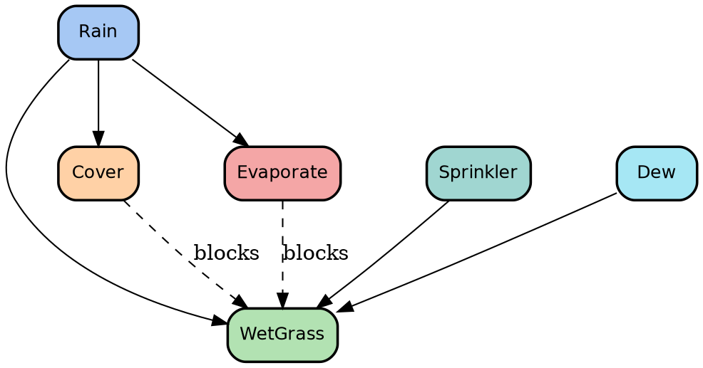
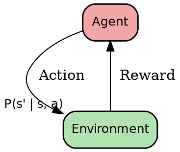
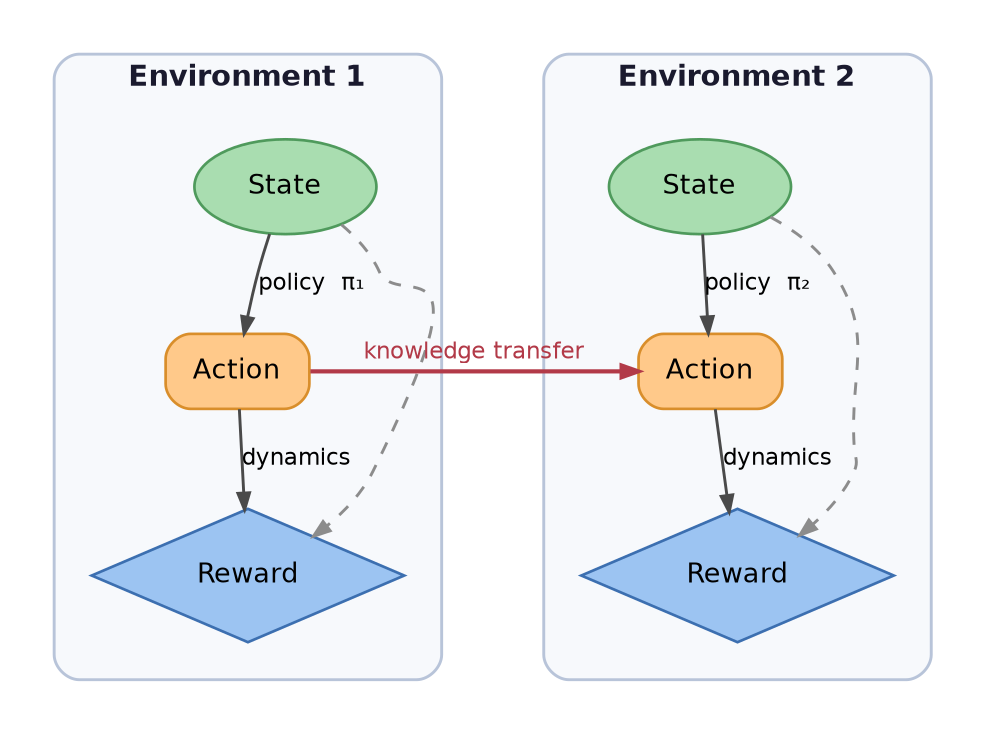

This is the default flat GraphViz style for flowcharts, causal graphs,
networks, and process flows (e.g. Bayesian networks, reinforcement-learning
diagrams, ETL pipelines)

- For the conventions behind this template (when to use it, color scheme,
  shape/edge semantics, typography), see `.claude/skills/graphviz.rules.md`
- Draw the diagram as a fenced ` ```graphviz ` code block
- Maintain the structure of the surrounding text as it is when inserting a
  diagram
- Use `xlabel` on a node for an inline annotation that sits outside the node
  box, e.g. a conditional-probability expression on a Bayesian network node
  (`xlabel="P(R | W)"`); see Examples below

# Skeleton

```
digraph <name> {
    rankdir=TB;                      # or LR for pipelines / parallel lanes
    splines=spline;                  # or orthogonal for grid-like diagrams
    nodesep=0.6;
    ranksep=0.5;
    bgcolor="white";

    node [shape=box,
          style="rounded,filled",
          fontname="Helvetica",
          fontsize=12,
          penwidth=1.4,
          margin="0.18,0.12"];

    edge [color="#4A4A4A",
          fontname="Helvetica",
          fontsize=11,
          penwidth=1.3,
          arrowsize=0.8];

    <A> [label="<A>", fillcolor="FILL", color="BORDER"];
    <B> [label="<B>", fillcolor="FILL", color="BORDER"];

    subgraph cluster_<name> {
        label     = "Group name";
        fontname  = "Helvetica-Bold";
        fontsize  = 14;
        fontcolor = "#1A1A2E";
        style     = "rounded,filled";
        fillcolor = "#F7F9FC";
        color     = "#B8C4D9";
        penwidth  = 1.4;
        margin    = 18;

        ...
    }

    <A> -> <B> [label="normal flow"];
    <A> -> <C> [style=dashed, color="#8C8C8C", label="weak / optional link"];
}
```

# Examples

## Bayesian Network


```graphviz
digraph Sprinkler {
    splines=true;
    nodesep=0.8;
    ranksep=0.8;

    node [shape=box, style="rounded,filled", fontname="Helvetica", fontsize=12, penwidth=1.7];

    // Nodes
    Rain       [label="Rain", fillcolor="#A6C8F4"];
    WetGrass   [label="WetGrass", fillcolor="#B2E2B2"];
    Cover      [label="Cover", fillcolor="#FFD1A6"];
    Evaporate  [label="Evaporate", fillcolor="#F4A6A6"];
    Sprinkler  [label="Sprinkler", fillcolor="#A0D6D1"];
    Dew        [label="Dew", fillcolor="#A6E7F4"];

    // Force ranks
    { rank=same; Cover; Evaporate; }
    { rank=same; Sprinkler; Dew; }

    // Edges
    Rain -> WetGrass;
    Rain -> Cover;
    Rain -> Evaporate;
    Cover -> WetGrass [label="blocks", style=dashed];
    Evaporate -> WetGrass [label="blocks", style=dashed];
    Sprinkler -> WetGrass;
    Dew -> WetGrass;
}
```

## Agent-Environment Loop with Probability Annotation

- `xlabel` displays a conditional-probability expression outside the node,
  e.g. a source node's prior (`xlabel="P(W)"`), a conditional
  (`xlabel="P(R | W)"`), or a known value (`xlabel="P(B) = 0.001"`)


```graphviz
digraph AgentEnv {
    splines=true;
    nodesep=1.0;
    ranksep=0.75;

    node [shape=box, style="rounded,filled", fontname="Helvetica", fontsize=12, penwidth=1.4];

    Agent [label="Agent", fillcolor="#F4A6A6"];
    Env   [label="Environment", fillcolor="#B2E2B2", xlabel="P(s' | s, a)"];

    Agent -> Env [label="  Action"];
    Env -> Agent [label="  Reward"];
}
```

## Knowledge Transfer Between Environments


```graphviz
digraph Transfer {
    rankdir=TB;
    splines=spline;
    nodesep=0.6;
    ranksep=0.5;
    bgcolor="white";
    compound=true;
    newrank=true;

    graph [
        fontname="Helvetica",
        pad="0.25"
    ];

    node [
        fontname="Helvetica",
        fontsize=13,
        style="filled",
        shape="box",
        penwidth=1.3,
        margin="0.18,0.12"
    ];

    edge [
        fontname="Helvetica",
        fontsize=11,
        color="#4A4A4A",
        penwidth=1.4,
        arrowsize=0.8
    ];

    subgraph cluster_env1 {
        label="Environment 1";
        fontname="Helvetica-Bold";
        fontsize=14;
        fontcolor="#1A1A2E";
        style="rounded,filled";
        fillcolor="#F7F9FC";
        color="#B8C4D9";
        penwidth=1.4;
        margin=18;

        S1 [label="State", shape="ellipse", fillcolor="#A9DDB0", color="#4F9A5C"];
        A1 [label="Action", shape="box", style="filled,rounded", fillcolor="#FFC98A", color="#D98E2B"];
        R1 [label="Reward", shape="diamond", fillcolor="#9CC4F2", color="#3C6FB0"];

        S1 -> A1 [label="policy  π₁"];
        A1 -> R1 [label="dynamics"];
        S1 -> R1 [style="dashed", color="#8C8C8C", constraint="false"];
    }

    subgraph cluster_env2 {
        label="Environment 2";
        fontname="Helvetica-Bold";
        fontsize=14;
        fontcolor="#1A1A2E";
        style="rounded,filled";
        fillcolor="#F7F9FC";
        color="#B8C4D9";
        penwidth=1.4;
        margin=18;

        S2 [label="State", shape="ellipse", fillcolor="#A9DDB0", color="#4F9A5C"];
        A2 [label="Action", shape="box", style="filled,rounded", fillcolor="#FFC98A", color="#D98E2B"];
        R2 [label="Reward", shape="diamond", fillcolor="#9CC4F2", color="#3C6FB0"];

        S2 -> A2 [label="policy  π₂"];
        A2 -> R2 [label="dynamics"];
        S2 -> R2 [style="dashed", color="#8C8C8C", constraint="false"];
    }

    { rank=same; S1; S2; }
    { rank=same; A1; A2; }
    { rank=same; R1; R2; }

    S1 -> S2 [style=invis];
    R1 -> R2 [style=invis];

    A1 -> A2 [
        label="  knowledge transfer  ",
        style="bold",
        color="#B23A48",
        fontcolor="#B23A48",
        penwidth=2.0
    ];
}
```
