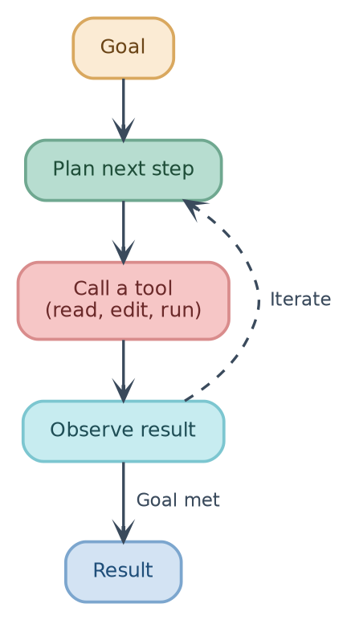

This is a muted, compact GraphViz style for system and architecture diagrams
that group components into subsystems and highlight feedback loops (e.g.
service architectures, market/pipeline diagrams, agent loops)

- For the conventions behind this template (when to use it, color scheme,
  edge semantics, hierarchy styling), see `.claude/skills/graphviz.rules.md`
- Draw the diagram as a fenced ` ```graphviz ` code block, followed by two
  footer lines: `label=fig:<slug>` and `caption=<one sentence>` (see Footer in
  `.claude/skills/graphviz.rules.md`)

# Skeleton

```
digraph <name> {
  bgcolor="transparent";
  pad="0.15";
  splines=spline;
  nodesep=0.30;
  ranksep=0.50;
  rankdir=LR;                      # or TB for sequential/vertical flows

  node [shape=box,
        style="rounded,filled",
        penwidth=1.8,
        fontname="Helvetica",
        fontsize=12,
        margin="0.22,0.14",
        height=0.50];

  edge [color="#A3B1C0",
        penwidth=1.3,
        arrowhead=vee,
        arrowsize=0.75,
        fontname="Helvetica",
        fontsize=10,
        fontcolor="#7B8794"];

  // <category> : <hue>   |   <category> : <hue>   |   ...

  <NodeName> [label=<<b>Main Name</b><br/><font point-size="10" color="DARK_HUE">Smaller subtitle</font>>,
              fillcolor="FILL", color="BORDER", fontcolor="DARK_HUE"];

  subgraph cluster_<name> {
    label     = "Group name";
    labelloc  = "t";
    fontname  = "Helvetica-Bold";
    fontsize  = 12.5;
    fontcolor = "#3A4A5C";
    style     = "rounded,dotted";
    fillcolor = "#F7F9FB";
    color     = "#C7D0DA";
    penwidth  = 1.0;
    margin    = 16;

    ...
  }

  <A> -> <B> [label="normal flow"];
  <A> -> <C> [style=dashed, label="optional / feedback"];
}
```
```
label=fig:<short-kebab-slug>
caption=<one sentence: what the diagram shows, plus what the colors mean>
```

# Examples

## Noesis Architecture

```graphviz
digraph NoesisArchitecture {
  // ---------------------------------------------------------------
  bgcolor="transparent";
  pad="0.15";
  splines=spline;
  nodesep=0.30;
  ranksep=0.50;

  node [shape=box,
        style="rounded,filled",
        fillcolor="#FFFFFF",
        color="#9AA9B8",
        penwidth=1.8,
        fontname="Helvetica",
        fontcolor="#243B53",
        fontsize=12,
        margin="0.22,0.14",
        height=0.50];

  edge [color="#A3B1C0",
        penwidth=1.3,
        arrowhead=vee,
        arrowsize=0.75,
        fontname="Helvetica",
        fontsize=10,
        fontcolor="#7B8794"];

  // ---------------------------------------------------------------
  rankdir=LR;
  newrank=true;

  // actor : rose   |   process : blue   |   fulfillment monitoring : sage green   |   external : violet

  subgraph cluster_participants {
    label     = "Market participants";
    labelloc  = "t";
    fontname  = "Helvetica-Bold";
    fontsize  = 12.5;
    fontcolor = "#3A4A5C";
    style     = "rounded,filled";
    fillcolor = "#F7F9FB";
    color     = "#C7D0DA";
    penwidth  = 1.0;
    margin    = 16;

    Supply [label=<<b>Supply</b><br/><font point-size="10" color="#946A2E">Model &amp; compute providers</font>>,
            fillcolor="#FBEBD4", color="#D9A85F", fontcolor="#6B4517"];
    Demand [label=<<b>Demand</b><br/><font point-size="10" color="#A34F6C">Applications / agents</font>>,
            fillcolor="#F6E1E8", color="#D98CA8", fontcolor="#6B2A44"];
  }

  subgraph cluster_noesis_market {
    label     = "NoesisMarket";
    labelloc  = "t";
    fontname  = "Helvetica-Bold";
    fontsize  = 12.5;
    fontcolor = "#3A4A5C";
    style     = "rounded,filled";
    fillcolor = "#F7F9FB";
    color     = "#C7D0DA";
    penwidth  = 1.0;
    margin    = 16;

    ReputationLoop [label=<<b>Reputation and feedback</b><br/><font point-size="10" color="#41719C">Pluggable</font>>,
                    fillcolor="#D3E3F3", color="#7CA6CE", fontcolor="#1F4E79"];
    MatchingEngine [label=<<b>Matching engine</b><br/><font point-size="10" color="#41719C">Pluggable</font>>,
                    fillcolor="#D3E3F3", color="#7CA6CE", fontcolor="#1F4E79"];
    PricingFeed    [label=<<b>Pricing dissemination</b><br/><font point-size="10" color="#41719C">Pluggable</font>>,
                    fillcolor="#D3E3F3", color="#7CA6CE", fontcolor="#1F4E79"];
    ReputationLoop -> MatchingEngine [label="Gates eligibility", style=dashed];
    MatchingEngine -> PricingFeed [label="Cleared prices", style=dashed];
  }

  subgraph cluster_noesis_server {
    label     = "NoesisServer";
    labelloc  = "t";
    fontname  = "Helvetica-Bold";
    fontsize  = 12.5;
    fontcolor = "#3A4A5C";
    style     = "rounded,filled";
    fillcolor = "#F7F9FB";
    color     = "#C7D0DA";
    penwidth  = 1.0;
    margin    = 16;

    Gateway           [label=<<b>API gateway</b>>,
                        fillcolor="#D3E3F3", color="#7CA6CE", fontcolor="#1F4E79"];
    Metering          [label=<<b>Metering logic</b><br/><font point-size="10" color="#4F7A5A">Fulfillment monitoring</font>>,
                        fillcolor="#DFEDE0", color="#8FB79A", fontcolor="#2E5A3D"];
    CapabilityMeasure [label=<<b>Capability measurement</b><br/><font point-size="10" color="#41719C">Pluggable</font>>,
                        fillcolor="#D3E3F3", color="#7CA6CE", fontcolor="#1F4E79"];
    Fusion            [label=<<b>Answer fusion</b><br/><font point-size="10" color="#41719C">Pluggable</font>>,
                        fillcolor="#D3E3F3", color="#7CA6CE", fontcolor="#1F4E79"];
    Gateway -> Metering [label="Logged traffic"];
    Gateway -> Fusion [label="Multi-provider fan-out", style=dashed];
    CapabilityMeasure -> Metering [label="Delivered capability", style=dashed];
  }

  ProviderAPIs        [label=<<b>Provider APIs</b><br/><font point-size="10" color="#6B52A8">Per-provider endpoints</font>>,
                        fillcolor="#E9E1F7", color="#A88FD9", fontcolor="#45296B"];
  IntelligenceMeasure [label=<<font point-size="10">Intelligence-measure providers<br/>e.g. artificialanalysis.ai</font>>,
                        shape=note, fillcolor="#E9E1F7", color="#A88FD9", fontcolor="#45296B"];

  Supply -> ReputationLoop [style=invis];
  Demand -> CapabilityMeasure [style=invis];
  Demand -> MatchingEngine [label="Bids"];
  Supply -> MatchingEngine [label="Asks"];
  MatchingEngine -> Gateway [label="Contracts", penwidth=1.6, color="#8592A3", constraint=false];
  Gateway -> ProviderAPIs [label="Requests /\nresponses", dir=both];
  Fusion -> ProviderAPIs [label="Fan-out", style=dashed, constraint=false];
  IntelligenceMeasure -> CapabilityMeasure [label="Capability reference", style=dashed, constraint=false];
  Metering -> ReputationLoop [
    label="Reputation & pricing feedback",
    style=dashed, penwidth=1.6,
    color="#C0455B", fontcolor="#C0455B",
    constraint=false
  ];

  // Column alignment between NoesisMarket and NoesisServer
  { rank=same; ReputationLoop; CapabilityMeasure; IntelligenceMeasure; }
  CapabilityMeasure -> IntelligenceMeasure [style=invis];
  { rank=same; MatchingEngine; Gateway; }
  { rank=same; PricingFeed; Metering; Fusion; }

  // Legend
  subgraph cluster_legend {
    label     = "Legend";
    labelloc  = "t";
    fontname  = "Helvetica-Bold";
    fontsize  = 12.5;
    fontcolor = "#3A4A5C";
    style     = "rounded,filled";
    fillcolor = "#FBFBFD";
    color     = "#C7D0DA";
    penwidth  = 1.0;
    margin    = 14;

    node [shape=box, style="rounded,filled", fontsize=10, height=0.32, margin="0.14,0.08"];
    LegendDemand   [label="Demand / Supply", fillcolor="#F6E1E8", color="#D98CA8", fontcolor="#6B2A44"];
    LegendNoesis   [label="Noesis component (pluggable)", fillcolor="#D3E3F3", color="#7CA6CE", fontcolor="#1F4E79"];
    LegendMonitor  [label="Fulfillment monitoring", fillcolor="#DFEDE0", color="#8FB79A", fontcolor="#2E5A3D"];
    LegendExternal [label="External reference", fillcolor="#E9E1F7", color="#A88FD9", fontcolor="#45296B"];
    { rank=same; LegendDemand; LegendNoesis; LegendMonitor; LegendExternal; }
  }
}
```


label=fig:architecture
caption=The Noesis architecture, with its five pluggable components shaded in teal, and a color legend for demand/supply, Noesis components, fulfillment monitoring, and external references.

## Agentic Loop


label=fig:agentic-loop
caption=The agentic loop: an agent plans the next step, calls a tool, and observes the result, iterating until the goal is met and it produces the final result.
