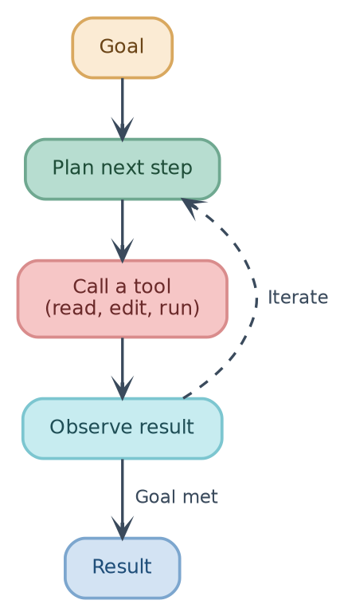

This is a muted, compact GraphViz style for system and architecture diagrams
that group components into subsystems and highlight feedback loops (e.g.
service architectures, market/pipeline diagrams, agent loops)

- It is a separate, hierarchy-aware variant of the default flat style in
  `graphviz.template.md` (flowcharts, causal graphs, simple networks)

- Use this one when the diagram needs subsystem clustering, a two-tier label
  (name + subtitle), or a color legend.

- Draw the diagram as a fenced ` ```graphviz ` code block, followed by two footer
  lines: `label=fig:<slug>` and `caption=<one sentence>` (see Footer below).

# Canvas and layout

- `bgcolor="transparent"`, `pad="0.15"`, `splines=spline`.
- `nodesep=0.30`, `ranksep=0.50`.
- Pick `rankdir=LR` for pipelines/architectures with parallel lanes,
  `rankdir=TB` for sequential/vertical flows (e.g. a loop or process).
- Use `{ rank=same; A; B; C; }` to align nodes into columns/rows when two
  parallel groups should line up.

# Node shape

- All real entities are rounded boxes:
  `node [shape=box, style="rounded,filled", penwidth=1.8, fontname="Helvetica",
  fontsize=12, margin="0.22,0.14", height=0.50]`.
- Never use plain rectangles, circles, or diamonds for entities. Reserve
  `shape=note` only for a document/reference-style node (e.g. an external
  citation or data sheet).

# Typography: large label + smaller caption

Build node labels as HTML-like labels with two font sizes, not two separate
nodes:

```
Node [label=<<b>Main Name</b><br/><font point-size="10" color="DARK_HUE">Smaller subtitle</font>>,
      fillcolor="FILL", color="BORDER", fontcolor="DARK_HUE"];
```

- Main name: bold, inherits the default node `fontsize=12` (or the cluster
  title size below), set in the node's `fontcolor`.
- Subtitle: same font family (Helvetica), `point-size="10"`, colored with the
  category's dark accent color (see palette below) so it reads as
  "secondary/descriptive" without a separate legend entry.
- Simple one-line nodes (no subtitle needed) may use a plain quoted string
  label instead of the HTML form.
- Cluster/section titles use `fontname="Helvetica-Bold"`, `fontsize=12.5`,
  `fontcolor="#3A4A5C"`, `labelloc="t"`.
- Legend swatches use the same palette at a smaller scale: `fontsize=10`,
  `height=0.32`, `margin="0.14,0.08"`.

# Hierarchy and containment (dotted, light gray)

When one element conceptually contains others (a subsystem, a grouping, a
bounding context — not a real edge), draw it as a `subgraph cluster_X`, not a
node:

```
subgraph cluster_X {
  label     = "Group name";
  labelloc  = "t";
  fontname  = "Helvetica-Bold";
  fontsize  = 12.5;
  fontcolor = "#3A4A5C";
  style     = "rounded,dotted";
  fillcolor = "#F7F9FB";
  color     = "#C7D0DA";
  penwidth  = 1.0;
  margin    = 16;
  ...
}
```

- Fill: very light neutral gray `#F7F9FB` (near white, never a saturated
  color — containment must recede behind the entities it holds).
- Border: light gray `#C7D0DA`, drawn `dotted` (not solid) so the eye reads
  "this is a boundary/grouping," visually distinct from the solid borders
  used on real entities and from dashed edges (which mean "optional/feedback
  flow," see below).
- Never fill a hierarchy cluster with a category color — that color budget is
  reserved for the entities inside it.
- Nest clusters for multi-level hierarchy; each level keeps the same gray
  fill/dotted-border convention, only the label changes.

# Edges

```
edge [color="#A3B1C0", penwidth=1.3, arrowhead=vee, arrowsize=0.75,
      fontname="Helvetica", fontsize=10, fontcolor="#7B8794"];
```

- Solid edge = normal/required data or control flow.
- `style=dashed` edge = optional, pluggable, feedback, or "iterate/loop back"
  flow. Label it with the short verb phrase describing the flow (e.g.
  "iterate", "Gates eligibility", "Fan-out").
- `constraint=false` on an edge that would otherwise distort the rank order
  (e.g. a feedback loop drawn on the side, or a cross-cluster shortcut).
- Bump `penwidth` (e.g. 1.6) and give a saturated `color`/`fontcolor` (e.g.
  `#C0455B`) only on the one or two edges that carry the diagram's key
  narrative (the "so what" flow), to make them pop against the neutral
  default edges.
- Use `dir=both` for a request/response pair on one edge instead of two
  separate arrows.
- Use `style=invis` edges purely to coax layout/alignment (e.g. to align a
  node with a column it doesn't otherwise connect to); never for a real
  relationship.

# Color scheme

Every semantic category gets a triad — `fillcolor` (pastel), `color`
(saturated border, same hue), `fontcolor` (dark, same hue) — so fill/border/
text always belong to one hue family and stay legible on their own fill:

| Category (example use)               | fill      | border    | font      |
|---------------------------------------|-----------|-----------|-----------|
| Rose (actor / demand)                  | `#F6E1E8` | `#D98CA8` | `#6B2A44` |
| Orange (source / goal / supply)        | `#FBEBD4` | `#D9A85F` | `#6B4517` |
| Blue (core process / pluggable step)   | `#D3E3F3` | `#7CA6CE` | `#1F4E79` |
| Teal (planning / stateful step)        | `#B7DDD0` | `#6FA890` | `#1F4E39` |
| Cyan (observation / feedback capture)  | `#C7ECF0` | `#7CC6D0` | `#1F4E56` |
| Sage green (monitoring / verification) | `#DFEDE0` | `#8FB79A` | `#2E5A3D` |
| Violet (external reference)            | `#E9E1F7` | `#A88FD9` | `#45296B` |
| Rose/red (critical feedback edge)      | n/a       | `#C0455B` | `#C0455B` |
| Neutral gray (hierarchy/containment)   | `#F7F9FB` | `#C7D0DA` (dotted) | `#3A4A5C` |

Rules for adding a new category not in the table:
1. Pick a hue not already used in the diagram.
2. Fill = that hue mixed ~85-90% toward white (pastel, low saturation).
3. Border = same hue at medium saturation/lightness (readable as an outline,
   not neon).
4. Font = same hue, dark and desaturated enough for body-text contrast on
   the pastel fill.
5. Keep one category = one meaning throughout the whole diagram (e.g. "blue
   always means pluggable component"); state that mapping in a `//` comment
   near the top of the DOT source, e.g.
   `// actor : rose | process : blue | monitoring : sage green | external : violet`.

# Legend

For any diagram with 3+ color categories, add a trailing
`subgraph cluster_legend` with one small swatch node per category (label =
the category's meaning, not its name), all on `{ rank=same; ... }` so they
sit in one row. Style the legend cluster like any hierarchy container:
light-gray dotted border, no title color coding of its own.

# Footer

After the closing code fence, always emit:

```
label=fig:<short-kebab-slug>
caption=<one sentence: what the diagram shows, plus what the colors mean>
```

# Examples

## Noesis Architecture

```graphviz
digraph NoesisArchitecture {
  // ---------------------------------------------------------------
  bgcolor="transparent";
  pad="0.15";
  splines=spline;
  nodesep=0.30;
  ranksep=0.50;

  node [shape=box,
        style="rounded,filled",
        fillcolor="#FFFFFF",
        color="#9AA9B8",
        penwidth=1.8,
        fontname="Helvetica",
        fontcolor="#243B53",
        fontsize=12,
        margin="0.22,0.14",
        height=0.50];

  edge [color="#A3B1C0",
        penwidth=1.3,
        arrowhead=vee,
        arrowsize=0.75,
        fontname="Helvetica",
        fontsize=10,
        fontcolor="#7B8794"];

  // ---------------------------------------------------------------
  rankdir=LR;
  newrank=true;

  // actor : rose   |   process : blue   |   fulfillment monitoring : sage green   |   external : violet

  subgraph cluster_participants {
    label     = "Market participants";
    labelloc  = "t";
    fontname  = "Helvetica-Bold";
    fontsize  = 12.5;
    fontcolor = "#3A4A5C";
    style     = "rounded,filled";
    fillcolor = "#F7F9FB";
    color     = "#C7D0DA";
    penwidth  = 1.0;
    margin    = 16;

    Supply [label=<<b>Supply</b><br/><font point-size="10" color="#946A2E">Model &amp; compute providers</font>>,
            fillcolor="#FBEBD4", color="#D9A85F", fontcolor="#6B4517"];
    Demand [label=<<b>Demand</b><br/><font point-size="10" color="#A34F6C">Applications / agents</font>>,
            fillcolor="#F6E1E8", color="#D98CA8", fontcolor="#6B2A44"];
  }

  subgraph cluster_noesis_market {
    label     = "NoesisMarket";
    labelloc  = "t";
    fontname  = "Helvetica-Bold";
    fontsize  = 12.5;
    fontcolor = "#3A4A5C";
    style     = "rounded,filled";
    fillcolor = "#F7F9FB";
    color     = "#C7D0DA";
    penwidth  = 1.0;
    margin    = 16;

    ReputationLoop [label=<<b>Reputation and feedback</b><br/><font point-size="10" color="#41719C">Pluggable</font>>,
                    fillcolor="#D3E3F3", color="#7CA6CE", fontcolor="#1F4E79"];
    MatchingEngine [label=<<b>Matching engine</b><br/><font point-size="10" color="#41719C">Pluggable</font>>,
                    fillcolor="#D3E3F3", color="#7CA6CE", fontcolor="#1F4E79"];
    PricingFeed    [label=<<b>Pricing dissemination</b><br/><font point-size="10" color="#41719C">Pluggable</font>>,
                    fillcolor="#D3E3F3", color="#7CA6CE", fontcolor="#1F4E79"];
    ReputationLoop -> MatchingEngine [label="Gates eligibility", style=dashed];
    MatchingEngine -> PricingFeed [label="Cleared prices", style=dashed];
  }

  subgraph cluster_noesis_server {
    label     = "NoesisServer";
    labelloc  = "t";
    fontname  = "Helvetica-Bold";
    fontsize  = 12.5;
    fontcolor = "#3A4A5C";
    style     = "rounded,filled";
    fillcolor = "#F7F9FB";
    color     = "#C7D0DA";
    penwidth  = 1.0;
    margin    = 16;

    Gateway           [label=<<b>API gateway</b>>,
                        fillcolor="#D3E3F3", color="#7CA6CE", fontcolor="#1F4E79"];
    Metering          [label=<<b>Metering logic</b><br/><font point-size="10" color="#4F7A5A">Fulfillment monitoring</font>>,
                        fillcolor="#DFEDE0", color="#8FB79A", fontcolor="#2E5A3D"];
    CapabilityMeasure [label=<<b>Capability measurement</b><br/><font point-size="10" color="#41719C">Pluggable</font>>,
                        fillcolor="#D3E3F3", color="#7CA6CE", fontcolor="#1F4E79"];
    Fusion            [label=<<b>Answer fusion</b><br/><font point-size="10" color="#41719C">Pluggable</font>>,
                        fillcolor="#D3E3F3", color="#7CA6CE", fontcolor="#1F4E79"];
    Gateway -> Metering [label="Logged traffic"];
    Gateway -> Fusion [label="Multi-provider fan-out", style=dashed];
    CapabilityMeasure -> Metering [label="Delivered capability", style=dashed];
  }

  ProviderAPIs        [label=<<b>Provider APIs</b><br/><font point-size="10" color="#6B52A8">Per-provider endpoints</font>>,
                        fillcolor="#E9E1F7", color="#A88FD9", fontcolor="#45296B"];
  IntelligenceMeasure [label=<<font point-size="10">Intelligence-measure providers<br/>e.g. artificialanalysis.ai</font>>,
                        shape=note, fillcolor="#E9E1F7", color="#A88FD9", fontcolor="#45296B"];

  Supply -> ReputationLoop [style=invis];
  Demand -> CapabilityMeasure [style=invis];
  Demand -> MatchingEngine [label="Bids"];
  Supply -> MatchingEngine [label="Asks"];
  MatchingEngine -> Gateway [label="Contracts", penwidth=1.6, color="#8592A3", constraint=false];
  Gateway -> ProviderAPIs [label="Requests /\nresponses", dir=both];
  Fusion -> ProviderAPIs [label="Fan-out", style=dashed, constraint=false];
  IntelligenceMeasure -> CapabilityMeasure [label="Capability reference", style=dashed, constraint=false];
  Metering -> ReputationLoop [
    label="Reputation & pricing feedback",
    style=dashed, penwidth=1.6,
    color="#C0455B", fontcolor="#C0455B",
    constraint=false
  ];

  // Column alignment between NoesisMarket and NoesisServer
  { rank=same; ReputationLoop; CapabilityMeasure; IntelligenceMeasure; }
  CapabilityMeasure -> IntelligenceMeasure [style=invis];
  { rank=same; MatchingEngine; Gateway; }
  { rank=same; PricingFeed; Metering; Fusion; }

  // Legend
  subgraph cluster_legend {
    label     = "Legend";
    labelloc  = "t";
    fontname  = "Helvetica-Bold";
    fontsize  = 12.5;
    fontcolor = "#3A4A5C";
    style     = "rounded,filled";
    fillcolor = "#FBFBFD";
    color     = "#C7D0DA";
    penwidth  = 1.0;
    margin    = 14;

    node [shape=box, style="rounded,filled", fontsize=10, height=0.32, margin="0.14,0.08"];
    LegendDemand   [label="Demand / Supply", fillcolor="#F6E1E8", color="#D98CA8", fontcolor="#6B2A44"];
    LegendNoesis   [label="Noesis component (pluggable)", fillcolor="#D3E3F3", color="#7CA6CE", fontcolor="#1F4E79"];
    LegendMonitor  [label="Fulfillment monitoring", fillcolor="#DFEDE0", color="#8FB79A", fontcolor="#2E5A3D"];
    LegendExternal [label="External reference", fillcolor="#E9E1F7", color="#A88FD9", fontcolor="#45296B"];
    { rank=same; LegendDemand; LegendNoesis; LegendMonitor; LegendExternal; }
  }
}
```


label=fig:architecture
caption=The Noesis architecture, with its five pluggable components shaded in teal, and a color legend for demand/supply, Noesis components, fulfillment monitoring, and external references.

## Agentic Loop


label=fig:agentic-loop
caption=The agentic loop: an agent plans the next step, calls a tool, and observes the result, iterating until the goal is met and it produces the final result.
