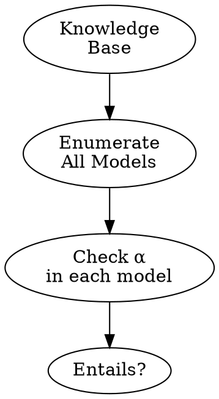
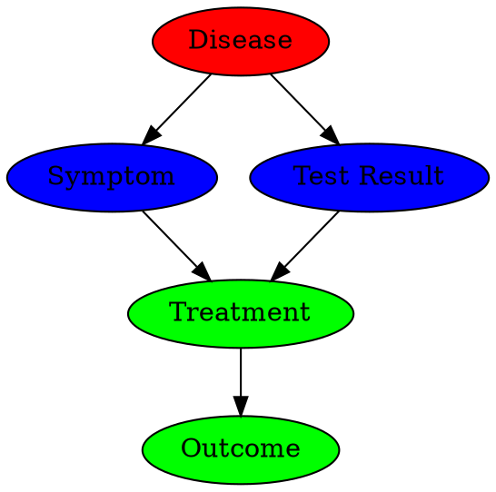

# Slide Templates & Examples

## Frontmatter

```markdown
// type=UMD_slides
// course_title=MSML610: Advanced Machine Learning
// lesson_title=L03.1: Knowledge Representation
// slides_engine=typst
// references=
// - Russell et al.: _"Artificial Intelligence: A Modern Approach"_ (4th ed, 2020)
//  - Chap 7: Logical agents
```

## Slide Structure

Each slide starts with `*` and contains hierarchical bullet points. Every
first-level bullet must have a bold label or tag:

```markdown
* Slide Title

- @Tag@: bullet content
- @Tag@: more content
```

## Core Tags & Examples

### Definition
- Use `@Definition@` with the term in **bold**:
  ```markdown
  * Time Series: Definition

  - @Definition@: A **time series** is modeled as a random process, typically indexed
    by time with sequential observations
    - Property 1
    - Property 2
  ```

### Question
- Introduce problems or engagement:
  ```markdown
  - @Question@: does the data provide evidence for or against a specific
    hypothesis, such as "this coin is fair" or "this treatment has no effect"?
  ```

### Goal
- State what you're trying to achieve:
  ```markdown
  - @Goal@: Analyze and study algorithms for the _simple_ end of the decision
    spectrum
  ```

### Assumptions
- Preconditions or constraints:
  ```markdown
  - @Assumptions@
    - Single agent, one objective, a model either fully known or learnable
    - No hierarchy, no policy-gradient search
  ```

### Problem
- Difficulty motivating a solution:
  ```markdown
  - @Problem@: a purely predictive model learns $\Pr(Y | X)$ from historical
    data and absorbs any association, spurious or not
  ```

### (Naive) Solution
- First, flawed attempt whose cons motivate a better one:
  ```markdown
  - @Naive Solution@: grid the parameter space and evaluate the posterior pointwise
    - Cons: the grid grows exponentially with the number of parameters,
      infeasible beyond a handful of dimensions
  ```

### Solution
- Solution to a previously introduced problem:
  ```markdown
  - @Solution@: Markov Chain Monte Carlo (MCMC)
    - Build a Markov chain whose stationary distribution is the posterior
    - Simulate to generate samples
  ```

### Pros / Cons
- Advantages and disadvantages:
  ```markdown
  - @Pros@
    - Express precise theory of the human mind as a computer program
    - Provides theoretical foundation

  - @Cons@
    - Unknown workings of the human mind
    - Anthropocentric definition (not applicable to non-human intelligence)
  ```

### Example
- Concrete illustration:
  ```markdown
  - @Example@: ice cream sales and drowning deaths are highly correlated
    - Predictor: _"more ice cream → predict more drownings"_ (accurate)
    - Decision built on it: _"ban ice cream to cut drownings"_ (disastrous)
    - Confounder: hot weather drives both
  ```

### Intuition
- Explains the "why it makes sense":
  ```markdown
  - @Intuition@: the posterior is a compromise between what was believed
    before and what the data says now
    - A narrow, confident prior needs more data to move
    - A flat, uninformative prior lets the likelihood dominate
  ```

### Key Idea
- Single most important takeaway:
  ```markdown
  - @Key idea@: shipping a prediction when the business needs a decision delivers
    little or no business value, however accurate the prediction is
  ```

### Remark
- Simple but useful fact:
  ```markdown
  - @Remark@: sequential updating (one toss at a time) and batch updating
    (all tosses at once) reach the same posterior
    - The order evidence arrives in does not change the final belief
  ```

### Other Tags
- `@Fact@`: A statement asserted as true, used without proof
- `@Theorem@`: A central, proven result
- `@Proof@`: The argument establishing a theorem (often numbered steps)
- `@Proposition@`: A result worth stating, but not as central as a theorem
- `@Lemma@`: Stepping stone used to prove a bigger result
- `@Claim@`: A smaller assertion inside a proof or argument
- `@Algorithm@`: A step-by-step procedure (with @Input@/@Output@)
- `@Input@` / `@Output@`: What an algorithm consumes and produces
- `@Limitations@`: Conditions under which the approach fails or is weak
- `@Counterexample@`: Shows what doesn't work

## Slide Types

### Definition Slide

```markdown
* Machine Learning: Definition

- @Definition@: **Machine learning** is the field of building systems to perform
  useful tasks without being explicitly programmed
  - Learns from experience
  - Improves with data
  - Performs tasks without hardcoded rules

- Formally: _"A computer program is said to learn from experience E with respect
  to some task T and some performance measure P, if P(T) improves with experience E"_
  (Mitchell, 1998)

- @Example@: Computer vision system learning to recognize cats from labeled
  image datasets without being programmed with detection rules
```

### Algorithm Slide

```markdown
* Gradient Descent

- @Input@: differentiable loss function $L$, learning rate $\alpha$
- @Output@: parameters minimizing $L$

- @Steps@:
  1. Initialize parameters randomly
  2. Compute gradient $\nabla L$ w.r.t. current parameters
  3. Update: $\theta \leftarrow \theta - \alpha \nabla L$
  4. Repeat until convergence

- @Complexity@:
  - Time: $O(n \cdot d \cdot \text{iterations})$ where $n$ = samples, $d$ = dimensions
  - Space: $O(d)$
```

### Problem-Solution Arc

Introduce hard topics progressively:

```markdown
* Problem: Uncertainty in AI

- @Problem@: logic-based AI fails under uncertainty
  - Partial observability (agent can't see full state)
  - Non-determinism (actions don't have predictable outcomes)

- @Naive Solution@: belief states + exhaustive rules
  - Cons: exponential blowup in state space with each new source of uncertainty

- @Solution@: combine _probability_ and _utility functions_
  - Probability handles uncertainty
  - Utility expresses preferences
```

### Pros/Cons Slide

```markdown
* AI Approaches: Thinking Humanly vs. Thinking Rationally

- **Thinking Humanly Approach**
  - _Pros_
    - Express precise theory of the human mind as a computer program
  - _Cons__
    - Unknown workings of the human mind
    - Anthropocentric (not applicable to non-human intelligence)

- **Thinking Rationally Approach**
  - _Pros_
    - Well-defined, mathematically grounded
    - Applicable to any intelligent agent
  - _Cons_
    - Requires complete knowledge representation
    - Computationally intractable for complex domains
```

### Theorem / Proof Slide

```markdown
* Bayes' Theorem

- @Theorem@: For any random variables $X$ and $E$,
  $$
  \Pr(X | E) = \frac{\Pr(E | X) \Pr(X)}{\Pr(E)}
  $$

- @Proof@:
  1. Start with definition of conditional probability:
     $$\Pr(X, E) = \Pr(X | E) \Pr(E) = \Pr(E | X) \Pr(X)$$
  2. Rearrange to isolate $\Pr(X | E)$:
     $$\Pr(X | E) = \frac{\Pr(E | X) \Pr(X)}{\Pr(E)}$$
```

### Side-by-Side: Text + Diagram

```markdown
* Model Checking Example

::: columns
:::: {.column width=65%}
- @Problem@: Determine if sentence $\alpha$ is entailed by knowledge base $KB$

- @Approach@: Model enumeration
  - Generate all possible models
  - Check if $\alpha$ is true in every model where $KB$ is true
  - If yes, then $KB \models \alpha$

- @Complexity@: $O(2^n)$ where $n$ = number of variables
::::
:::: {.column width=30%}

::::
:::
```

### Side-by-Side: Symmetric Content (Table)

```markdown
* Chatbot vs. Agent Comparison

| Property | Chatbot | Agent |
|---|---|---|
| Output | Text only | Text and side effects (files, API calls) |
| State | Conversation history | Environment state + memory |
| Loop | Single turn → response | Perceive → plan → act (repeated) |
| Failure | Wrong answer | Wrong answer _or_ wrong action |
```

### Annotated Diagram (Roles)

```markdown
* Markov Blanket: Medical Diagnosis Example

::: columns
:::: {.column width=30%}
- The variables that shield a target node from all others
::::
:::: {.column width=70%}

::::
:::

- **\red{Target}**: Disease — what we want to predict
- **\blue{Parents}**: Symptom, Test Result — direct evidence about disease
- **\green{Children}**: Treatment, Outcome — affected by the disease
- **Key insight**: Knowing parents and children is sufficient to predict Disease;
  other variables are conditionally independent
```

### Running Example Across Multiple Slides

- Keep the same diagram and expand the question:

```markdown
* Weather World: Conditional Independence (1/3)

::: columns
:::: {.column width=50%}
- Variables: $Rain$, $Sprinkler$, $WetGrass$, $Weather$

- @Question@: Is $Rain \perp Sprinkler$?
::::
:::: {.column width=45%}
[diagram showing all nodes, no edges]
::::
:::

- @Answer@: No, they are not independent
  - Both cause wet grass, so observing wet grass creates dependence

* Weather World: Conditional Independence (2/3)

::: columns
:::: {.column width=50%}
- @Question@: Is $Rain \perp Sprinkler | WetGrass$?
  - Given that we observe wet grass
::::
:::: {.column width=45%}
[same diagram]
::::
:::

- @Answer@: No, they are _explained-away dependent_
  - If grass is wet and sprinkler is off, rain becomes more likely

* Weather World: Conditional Independence (3/3)

::: columns
:::: {.column width=50%}
- @Question@: Is $Rain \perp Sprinkler | Weather$?
  - Given that we know the weather
::::
:::: {.column width=45%}
[same diagram]
::::
:::

- @Answer@: Yes, they are conditionally independent given weather
  - Weather is the common cause; conditioning on it blocks the path
```

## Column Layout

- For side-by-side content:
  ```markdown
  ::: columns
  :::: {.column width=60%}
  Left content here
  ::::
  :::: {.column width=35%}
  Right content here (diagram, etc.)
  ::::
  :::
  ```

- Common widths: 50/50, 60/40, 70/30

## Mathematical Equations

Indented LaTeX for complex expressions to show nesting:

```markdown
$$
a^*
  = \arg\max_{a \in \mathcal{A}}
      \EE_{\theta \sim \Pr(\theta | \mathcal{D})}
      \left[
        \EE_{Y \sim \Pr(Y | do(a), \theta)}[U(Y)]
      \right]
$$
```

- Multi-line alignment:

```markdown
\begin{align*}
& \Pr(x_1, x_2) \\
& = \Pr(x_1) \Pr(x_2 | x_1)
\end{align*}
```

## Typst Tables

```markdown
```{=typst}
#styled-table(
  headers: ("Method", "Accuracy", "Speed"),
  rows: (
    ("Baseline", "75%", "Fast"),
    ("Proposed", "92%", "Slow"),
    ("Optimized", "90%", "Fast"),
  ),
)
```
```

- Parameters: `headers` (required), `rows` (required), `caption`, `col-widths`, `bold-first-col`
