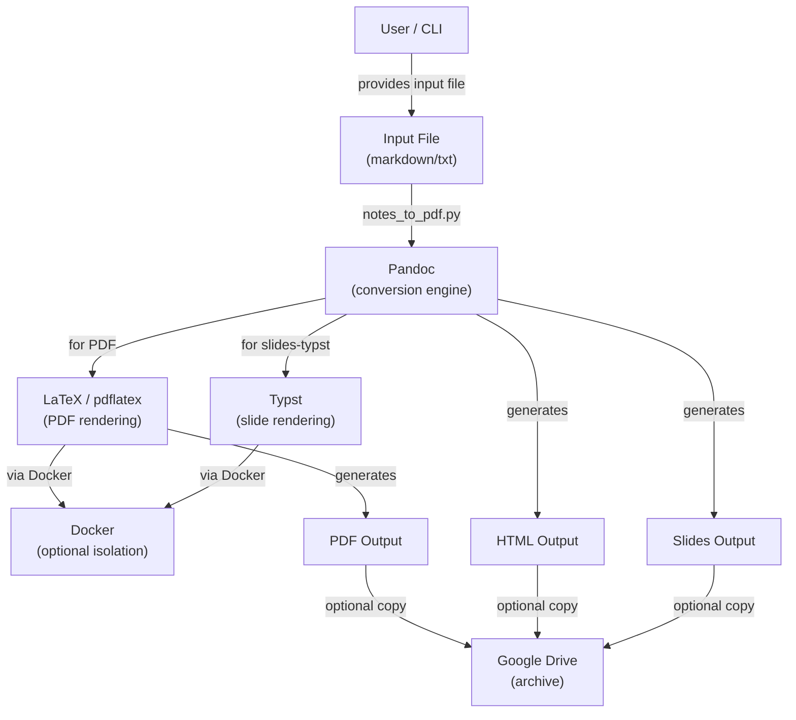
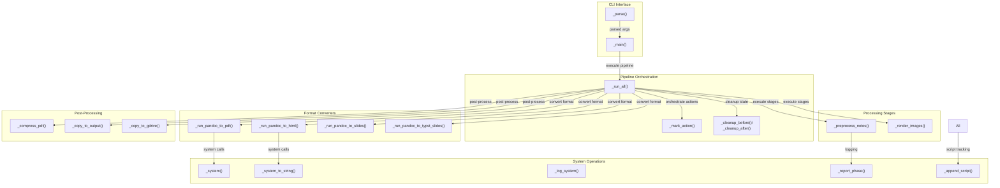
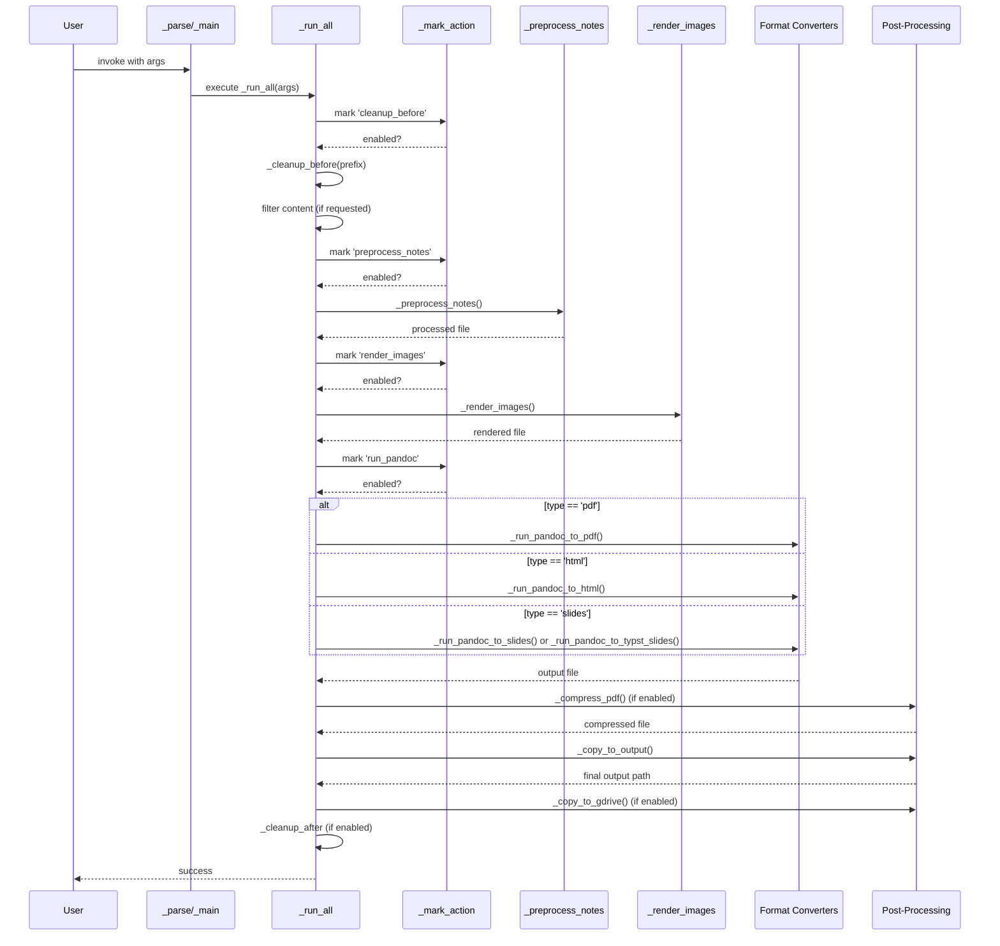

## Overview

`notes_to_pdf.py` is a comprehensive document conversion orchestrator that
transforms markdown/text files into multiple output formats (PDF, HTML,
presentation slides) using Pandoc and LaTeX/Typst toolchains. It manages a
complete multi-stage pipeline including preprocessing, image rendering, format
conversion, and post-processing with optional Docker containerization for tool
isolation.

The module solves the problem of converting research notes, lecture materials,
and educational content into professional-grade documents and presentations. Its
modular action-based architecture allows users to selectively enable/disable
pipeline stages for iterative development and debugging.

## Architecture (C4 Model)

### C1 - Context



The module acts as a central orchestrator, coordinating multiple external tools (Pandoc, LaTeX, Typst, Ghostscript) and optional Docker containers for tool execution. Users interact with the CLI, providing input files and output specifications, and the module manages the complete workflow including preprocessing, rendering, conversion, and post-processing.

### C2 - Container



**Responsibilities:**
- **CLI Interface**: Argument parsing and main entry point
- **Pipeline Orchestration**: Manages action selection, sequencing, and phase reporting
- **Processing Stages**: External preprocessing and image rendering via subprocess calls
- **Format Converters**: Format-specific Pandoc command builders and execution logic for PDF, HTML, and two slide engines
- **Post-Processing**: Output finalization, compression, copying, and archival
- **System Operations**: Wrapper functions for command execution, logging, and optional script generation

### C3 - Component



**Key Component Interactions:**
1. **Action Selection**: `_mark_action()` returns whether an action should execute, managing state across the pipeline
2. **File Threading**: Each processing stage receives an input file path and returns an output path for the next stage
3. **System Command Wrapping**: All external tools invoked through `_system()` and `_system_to_string()` for consistent logging
4. **Script Logging**: Commands optionally appended to a bash script via global `_SCRIPT` list

### C4 - Code

**Notable Code Patterns:**

1. **Global Script Accumulation**: The `_SCRIPT` global list (initialized as `None`) accumulates all executed commands if `--script` flag is used, enabling script generation for reproducibility.

2. **File Path Staging**: Each processing function takes input file path and returns output path, creating a pipeline of transformations:
   ```
   original.txt 
   → tmp.preprocess_notes.txt 
   → tmp.render_image2.txt 
   → tmp.tex (or .html, .pdf)
   → output.pdf (final)
   ```

3. **Docker Containerization**: Functions like `_run_pandoc_to_pdf()` check `use_host_tools` flag and conditionally wrap commands via `dshdlipa.run_dockerized_pandoc()` and `dshdlila.run_dockerized_latex()`.

4. **Two-Pass LaTeX Compilation**: PDF generation runs `pdflatex` twice by default (controlled by `no_run_latex_again` flag) to resolve cross-references.

5. **Multiple Slide Engines**: `--slides_engine` flag switches between Beamer (LaTeX-based) and Typst/Touying engines, with engine-specific command building and compilation logic.

6. **Common Pandoc Options**: Shared options stored in `_COMMON_PANDOC_OPTS` list (margins, highlighting, numbering) to ensure consistency across PDF and HTML converters.

## Key Functions and Call Flow

| Function | Signature | Purpose |
|----------|-----------|---------|
| `_run_all(args)` | `_run_all(args: argparse.Namespace) -> None` | Main orchestrator; manages entire pipeline execution and action sequencing |
| `_preprocess_notes()` | `_preprocess_notes(file_name: str, prefix: str, type_: str, toc_type: str) -> str` | Calls external preprocessor script; returns processed file path |
| `_render_images()` | `_render_images(file_name: str, prefix: str) -> str` | Renders inline diagram/image specs; filters commented code; returns file path |
| `_run_pandoc_to_pdf()` | `_run_pandoc_to_pdf(curr_path: str, file_name: str, prefix: str, toc_type: str, no_run_latex_again: bool, use_host_tools: bool, dockerized_force_rebuild: bool, dockerized_use_sudo: bool, *, tex_only: bool = False) -> str` | Converts markdown → LaTeX → PDF via Pandoc and pdflatex (2 passes); returns PDF path |
| `_run_pandoc_to_html()` | `_run_pandoc_to_html(file_in: str, prefix: str, toc_type: str) -> str` | Converts markdown to HTML via Pandoc; returns HTML path |
| `_run_pandoc_to_slides()` | `_run_pandoc_to_slides(file_name: str, toc_type: str, use_host_tools: bool, dockerized_force_rebuild: bool, dockerized_use_sudo: bool, *, debug: bool = False, tex_only: bool = False) -> str` | Converts markdown to Beamer PDF slides; returns PDF path or .tex if `tex_only=True` |
| `_run_pandoc_to_typst_slides()` | `_run_pandoc_to_typst_slides(curr_path: str, file_name: str, use_host_tools: bool, dockerized_force_rebuild: bool, dockerized_use_sudo: bool, *, typst_only: bool = False) -> str` | Converts markdown → Typst/Touying → PDF slides; returns PDF path or .typ if `typst_only=True` |
| `_compress_pdf()` | `_compress_pdf(file_name: str) -> str` | Compresses PDF via ghostscript; in-place modification; returns file path |
| `_copy_to_output()` | `_copy_to_output(file_in: str, output: str) -> str` | Copies processed file to output location; returns output path |
| `_copy_to_gdrive()` | `_copy_to_gdrive(file_name: str, ext: str, input_: str, gdrive_dir: str) -> None` | Copies output to Google Drive archive directory |
| `_cleanup_before()` | `_cleanup_before(prefix: str) -> None` | Removes intermediate files matching prefix pattern and cache files |
| `_cleanup_after()` | `_cleanup_after(prefix: str) -> None` | Removes intermediate files matching prefix pattern |
| `_system()` | `_system(cmd: str, *, log_level: int = logging.DEBUG, **kwargs: Any) -> int` | Executes shell command; logs output; optionally appends to script; returns exit code |
| `_system_to_string()` | `_system_to_string(cmd: str, *, log_level: int = logging.DEBUG, **kwargs: Any) -> Tuple[int, str]` | Executes shell command; captures stdout; returns (exit_code, output) |

**Primary Call Flow:**
```
_main() 
  → _run_all(args)
    → _cleanup_before()
    → _preprocess_notes() → _render_images()
    → [_run_pandoc_to_pdf() | _run_pandoc_to_html() | _run_pandoc_to_slides() | _run_pandoc_to_typst_slides()]
    → _compress_pdf() [optional]
    → _copy_to_output() → _copy_to_gdrive() [optional]
    → _cleanup_after() [optional]
```

## External Dependencies

| Module | Purpose |
|--------|---------|
| `helpers.hdbg` | Assertions and debugging (dassert_*, init_logger) |
| `helpers.hio` | File I/O (from_file, to_file, create_dir) |
| `helpers.hgit` | Git operations (find_file to locate helper scripts) |
| `helpers.hmarkdown` | Markdown processing (filter_by_header, filter_by_slides, process_single_line_comment) |
| `helpers.hopen` | File opening utilities (open_file) |
| `helpers.hdocker` | Docker CLI integration (add_dockerized_script_arg) |
| `helpers.hparser` | Argument parsing utilities (add_verbosity_arg) |
| `helpers.hselect_action` | Action state management (mark_action, select_actions, actions_to_string) |
| `helpers.hprint` | Colored output and formatting (color_highlight, frame, func_signature_to_str) |
| `helpers.hsystem` | System command execution (system, system_to_string) |
| `dev_scripts_helpers.dockerize.lib_latex` | LaTeX Docker wrapper (run_dockerized_latex) |
| `dev_scripts_helpers.dockerize.lib_pandoc` | Pandoc Docker wrapper (run_dockerized_pandoc) |
| `dev_scripts_helpers.dockerize.lib_typst` | Typst Docker wrapper (run_dockerized_typst) |
| External CLI tools | `pandoc`, `pdflatex`, `typst`, `/opt/homebrew/bin/gs` (ghostscript) |

## Critique and Improvements

### Strengths

- **Modular Pipeline Design**: Action-based architecture allows users to selectively enable/disable stages for iterative development and debugging without re-running expensive operations.
- **Dual-Engine Slide Support**: Supports both Beamer (LaTeX-based) and Typst/Touying engines, providing flexibility for different presentation needs and simplifying slide generation (single Typst pass vs. two LaTeX passes).
- **Optional Containerization**: Docker support with `use_host_tools` flag enables tool isolation while remaining optional for faster development on local machines.
- **Script Logging**: Optional `--script` flag generates reproducible bash script from executed commands, valuable for debugging and documentation.
- **Comprehensive Filtering**: Supports filtering by header, line range, slide range, and slide name before processing, enabling partial document generation for testing.
- **Rich CLI Interface**: Well-structured argparse with action flags, docker options, and format-specific parameters (e.g., `toc_type`, `slides_engine`).

### Weaknesses & Assumptions

1. **Hardcoded Ghostscript Path** (Line 604): `/opt/homebrew/bin/gs` is hardcoded for macOS homebrew. This fails on Linux or different macOS installations.
   - **Fact**: Line 604 has hardcoded path
   - **Impact**: `_compress_pdf()` will crash if ghostscript is not at this exact location

2. **Global Mutable State** (Line 47): `_SCRIPT = None` used as global accumulator. This is fragile if the module is imported or called multiple times in the same process.
   - **Assumption**: Assumed single execution per process

3. **Silent LaTeX Failures on Comment Processing** (Lines 152-163): `_render_images()` silently removes commented lines from `render_images.py` output but doesn't validate that images were actually rendered. If image rendering fails, the pipeline continues with incomplete content.
   - **Fact**: No validation of image existence after `_render_images()`

4. **No Retry Logic for External Tools**: If `pdflatex` fails intermittently (e.g., due to temporary Docker issues), there's no retry mechanism. Users must manually re-run the entire pipeline.

5. **File Path Assumptions**: Code assumes `os.path.basename()` and simple `.replace('.tex', '.pdf')` work correctly. Edge case: files with multiple dots in names (e.g., `file.v1.2.txt`) may fail.
   - **Assumption**: Filenames follow simple naming convention

6. **Hardcoded Google Drive Directory** (Line 569): Default path `/Users/saggese/GoogleDrive/pdf_notes` is user-specific and won't work on other systems.

### Improvement Suggestions

1. **Make Ghostscript Path Configurable**: Replace hardcoded path with `shutil.which('gs')` or `--ghostscript-path` CLI argument to support different system configurations.

2. **Decouple Global Script State**: Replace `_SCRIPT` global with a `ScriptAccumulator` class or pass script state through function parameters. This enables safe concurrent/multiple invocations.

3. **Add Image Rendering Validation**: After `_render_images()`, verify that expected image files exist. Log warnings if images are missing.

4. **Implement Retry Logic**: Wrap external tool calls (especially Docker commands) with exponential backoff retry logic to handle transient failures.

5. **Normalize File Path Handling**: Use `pathlib.Path` instead of `os.path` for more robust file path manipulation and extension handling.

6. **Make Google Drive Path a Required Argument**: Instead of hardcoding, require `--gdrive-dir` when `--copy_to_gdrive` is enabled, or raise an error with clear guidance.

7. **Add Dry-Run Mode**: Implement `--dry-run` flag that prints commands without executing them, helping users validate configurations before expensive operations.

8. **Separate Concerns in `_run_all()`**: The function is 160+ lines handling filtering, action management, and format-specific logic. Break into smaller functions for filtering and format-specific dispatch (e.g., `_handle_filtering()`, `_execute_conversion()`).

## Notable Implementation Details

- **Pandoc Template System**: PDF generation uses custom `pandoc.latex` template (referenced at line 222) and slides use `pandoc_touying.typ` template (line 487), allowing customization of document structure and styling.
- **Resource Path Handling**: Image paths calculated relative to input file location using `os.path.relpath()` (lines 359, 499), ensuring images resolve correctly in both host and Docker environments.
- **LaTeX Compilation Directory**: pdflatex requires `latex_abbrevs.sty` in the output directory (line 266), necessitating file copying for multi-directory workflows.
- **Beamer Slide-Level Config**: Beamer uses `--slide-level 4`, controlling which markdown headers map to slide boundaries (line 348).
- **Typst Single-Pass Compilation**: Unlike Beamer's two-pass approach, Typst compiles in one pass (line 524), reducing processing time for slide generation.
