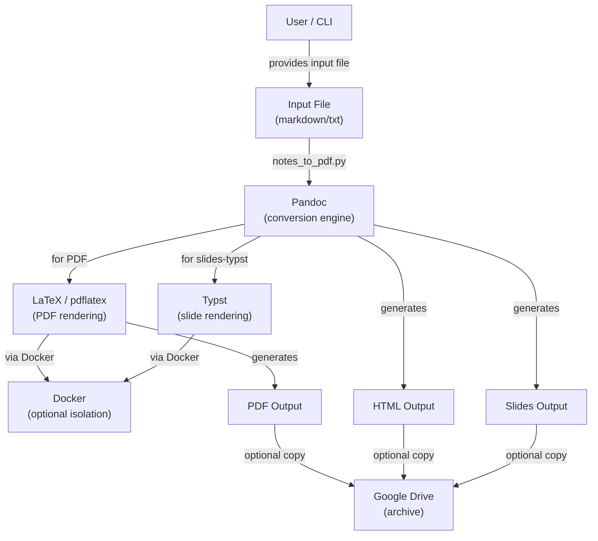
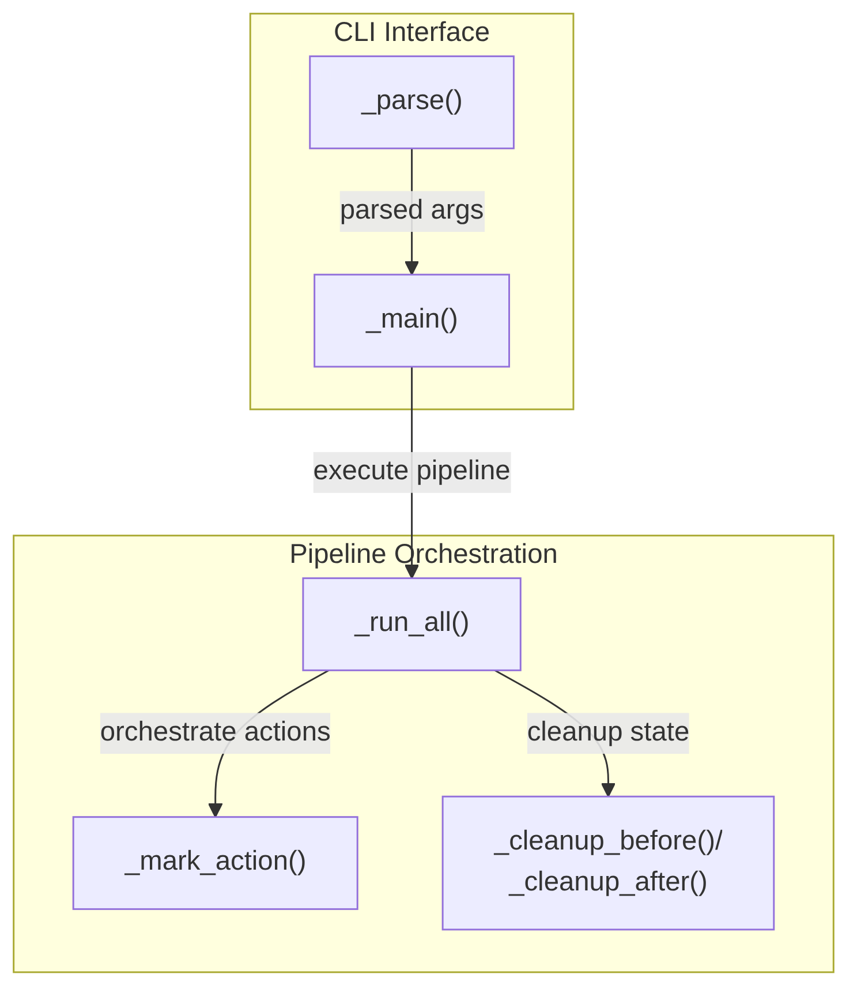
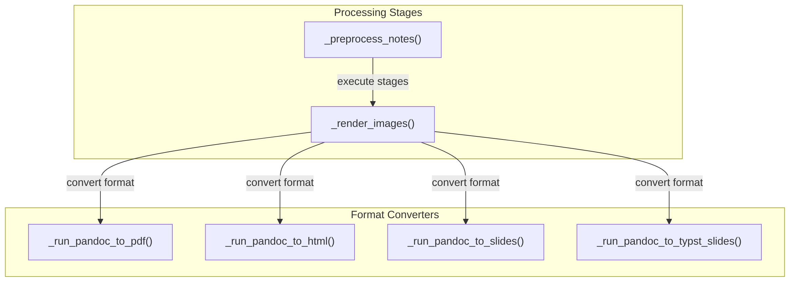
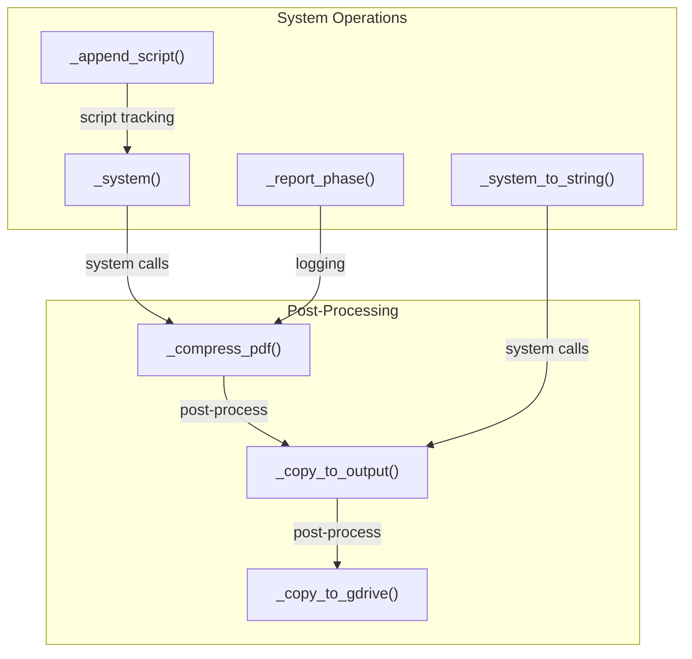
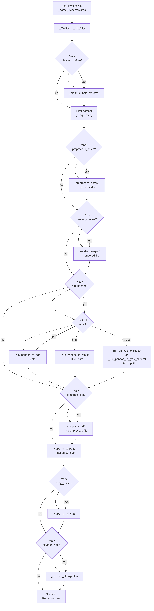

# Overview
- `notes_to_pdf.py` is a comprehensive document conversion orchestrator that
  transforms markdown/text files into multiple output formats (PDF, HTML,
  presentation slides) using Pandoc/LaTeX/Typst toolchains
- Manages a complete multi-stage pipeline including
  - Preprocessing
  - Image rendering
  - Format conversion
  - Post-processing
- Uses optional Docker containerization for tool isolation
- Converts research notes, lecture materials, and educational content into
  professional-grade documents and presentations
- Users can selectively enable/disable pipeline stages for iterative development
  and debugging

# Architecture (C4 Model)

## C1 (Context)
- This section describes how the system fits in the world

<!--  rendered_images:begin -->
<!--  ```mermaid -->
<!--  graph TB -->
<!--      User["User / CLI"] -->
<!--      InputFile["Input File<br/>(markdown/txt)"] -->
<!--      Pandoc["Pandoc<br/>(conversion engine)"] -->
<!--      LaTeX["LaTeX / pdflatex<br/>(PDF rendering)"] -->
<!--      Typst["Typst<br/>(slide rendering)"] -->
<!--      Docker["Docker<br/>(optional isolation)"] -->
<!--      OutputPDF["PDF Output"] -->
<!--      OutputHTML["HTML Output"] -->
<!--      OutputSlides["Slides Output"] -->
<!--      GoogleDrive["Google Drive<br/>(archive)"] -->
<!--       -->
<!--      User -->|"provides input file"| InputFile -->
<!--      InputFile -->|"notes_to_pdf.py"| Pandoc -->
<!--      Pandoc -->|"for PDF"| LaTeX -->
<!--      Pandoc -->|"for slides-typst"| Typst -->
<!--      LaTeX -->|"via Docker"| Docker -->
<!--      Typst -->|"via Docker"| Docker -->
<!--      LaTeX -->|"generates"| OutputPDF -->
<!--      Pandoc -->|"generates"| OutputHTML -->
<!--      Pandoc -->|"generates"| OutputSlides -->
<!--      OutputPDF -->|"optional copy"| GoogleDrive -->
<!--      OutputHTML -->|"optional copy"| GoogleDrive -->
<!--      OutputSlides -->|"optional copy"| GoogleDrive -->
<!--  ``` -->
<!--  rendered_images:end -->
<!--  render_images:begin -->

<!--  render_images:end -->

- `notes_to_pdf.py` acts as a central orchestrator, coordinating multiple
  external tools (Pandoc, LaTeX, Typst, Ghostscript) and optional Docker
  containers for tool execution

- Users interact with the CLI, providing input files and output specifications,
  and the module manages the complete workflow including preprocessing,
  rendering, conversion, and post-processing

## C2 (Container)

- This section describes the high-level technical blocks

### C2.1: CLI & Orchestration

<!--  rendered_images:begin -->
<!--  ```mermaid -->
<!--  graph TB -->
<!--      subgraph CLI["CLI Interface"] -->
<!--          Parse["_parse()"] -->
<!--          Main["_main()"] -->
<!--      end -->
<!--       -->
<!--      subgraph Pipeline["Pipeline Orchestration"] -->
<!--          RunAll["_run_all()"] -->
<!--          MarkAction["_mark_action()"] -->
<!--          Cleanup["_cleanup_before()/<br/>_cleanup_after()"] -->
<!--      end -->
<!--       -->
<!--      Parse -->|"parsed args"| Main -->
<!--      Main -->|"execute pipeline"| RunAll -->
<!--      RunAll -->|"orchestrate actions"| MarkAction -->
<!--      RunAll -->|"cleanup state"| Cleanup -->
<!--  ``` -->
<!--  rendered_images:end -->
<!--  render_images:begin -->

<!--  render_images:end -->

### C2.2: Processing & Conversion Pipeline

<!--  rendered_images:begin -->
<!--  ```mermaid -->
<!--  graph TB -->
<!--      subgraph Processing["Processing Stages"] -->
<!--          Preprocess["_preprocess_notes()"] -->
<!--          RenderImg["_render_images()"] -->
<!--      end -->
<!--       -->
<!--      subgraph Conversion["Format Converters"] -->
<!--          ToPDF["_run_pandoc_to_pdf()"] -->
<!--          ToHTML["_run_pandoc_to_html()"] -->
<!--          ToSlides["_run_pandoc_to_slides()"] -->
<!--          ToTypstSlides["_run_pandoc_to_typst_slides()"] -->
<!--      end -->
<!--       -->
<!--      Preprocess -->|"execute stages"| RenderImg -->
<!--      RenderImg -->|"convert format"| ToPDF -->
<!--      RenderImg -->|"convert format"| ToHTML -->
<!--      RenderImg -->|"convert format"| ToSlides -->
<!--      RenderImg -->|"convert format"| ToTypstSlides -->
<!--  ``` -->
<!--  rendered_images:end -->
<!--  render_images:begin -->

<!--  render_images:end -->

### C2.3: Post-Processing & System Operations

<!--  rendered_images:begin -->
<!--  ```mermaid -->
<!--  graph TB -->
<!--      subgraph PostProc["Post-Processing"] -->
<!--          Compress["_compress_pdf()"] -->
<!--          CopyOut["_copy_to_output()"] -->
<!--          CopyGDrive["_copy_to_gdrive()"] -->
<!--      end -->
<!--       -->
<!--      subgraph SystemOps["System Operations"] -->
<!--          System["_system()"] -->
<!--          SystemStr["_system_to_string()"] -->
<!--          Report["_report_phase()"] -->
<!--          Script["_append_script()"] -->
<!--      end -->
<!--       -->
<!--      Compress -->|"post-process"| CopyOut -->
<!--      CopyOut -->|"post-process"| CopyGDrive -->
<!--      System -->|"system calls"| Compress -->
<!--      SystemStr -->|"system calls"| CopyOut -->
<!--      Report -->|"logging"| Compress -->
<!--      Script -->|"script tracking"| System -->
<!--  ``` -->
<!--  rendered_images:end -->
<!--  render_images:begin -->

<!--  render_images:end -->


- **Responsibilities:**
  - _CLI Interface_: Argument parsing and main entry point
  - _Pipeline Orchestration_: Manages action selection, sequencing, and phase
    reporting
  - _Processing Stages_: External preprocessing and image rendering via
    subprocess calls
  - _Format Converters_: Format-specific Pandoc command builders and execution
    logic for PDF, HTML, and two slide engines
  - _Post-Processing_: Output finalization, compression, copying, and archival
  - _System Operations_: Wrapper functions for command execution, logging, and
    optional script generation

## C3 (Component)

- Shows the components inside a container

<!--  rendered_images:begin -->
<!--  ```mermaid -->
<!--  graph TD -->
<!--      Start["User invokes CLI<br/>_parse() receives args"] -->
<!--      Main["_main() → _run_all()"] -->
<!--      -->
<!--      CleanBefore{"Mark<br/>cleanup_before?"}--> -->
<!--      CleanBeforeExec["_cleanup_before(prefix)"] -->
<!--      -->
<!--      FilterContent["Filter content<br/>(if requested)"] -->
<!--      -->
<!--      PreprocessMark{"Mark<br/>preprocess_notes?"}--> -->
<!--      PreprocessExec["_preprocess_notes()<br/>→ processed file"] -->
<!--      -->
<!--      RenderImagesMark{"Mark<br/>render_images?"}--> -->
<!--      RenderImagesExec["_render_images()<br/>→ rendered file"] -->
<!--      -->
<!--      MarkPandoc{"Mark<br/>run_pandoc?"}--> -->
<!--      ConvertType{"Output<br/>type?"}--> -->
<!--      ConvertPDF["_run_pandoc_to_pdf()<br/>→ PDF path"] -->
<!--      ConvertHTML["_run_pandoc_to_html()<br/>→ HTML path"] -->
<!--      ConvertSlides["_run_pandoc_to_slides()<br/>or _run_pandoc_to_typst_slides()<br/>→ Slides path"] -->
<!--      -->
<!--      CompressMark{"Mark<br/>compress_pdf?"}--> -->
<!--      CompressExec["_compress_pdf()<br/>→ compressed file"] -->
<!--      -->
<!--      CopyOutput["_copy_to_output()<br/>→ final output path"] -->
<!--      -->
<!--      CopyGDriveMark{"Mark<br/>copy_gdrive?"}--> -->
<!--      CopyGDriveExec["_copy_to_gdrive()"] -->
<!--      -->
<!--      CleanAfterMark{"Mark<br/>cleanup_after?"}--> -->
<!--      CleanAfterExec["_cleanup_after(prefix)"] -->
<!--      -->
<!--      Success["Success<br/>Return to User"] -->
<!--      -->
<!--      Start --> Main -->
<!--      Main --> CleanBefore -->
<!--      CleanBefore -->|yes| CleanBeforeExec -->
<!--      CleanBefore -->|no| FilterContent -->
<!--      CleanBeforeExec --> FilterContent -->
<!--      -->
<!--      FilterContent --> PreprocessMark -->
<!--      PreprocessMark -->|yes| PreprocessExec -->
<!--      PreprocessMark -->|no| RenderImagesMark -->
<!--      PreprocessExec --> RenderImagesMark -->
<!--      -->
<!--      RenderImagesMark -->|yes| RenderImagesExec -->
<!--      RenderImagesMark -->|no| MarkPandoc -->
<!--      RenderImagesExec --> MarkPandoc -->
<!--      -->
<!--      MarkPandoc -->|yes| ConvertType -->
<!--      MarkPandoc -->|no| CompressMark -->
<!--      -->
<!--      ConvertType -->|pdf| ConvertPDF -->
<!--      ConvertType -->|html| ConvertHTML -->
<!--      ConvertType -->|slides| ConvertSlides -->
<!--      ConvertPDF --> CompressMark -->
<!--      ConvertHTML --> CompressMark -->
<!--      ConvertSlides --> CompressMark -->
<!--      -->
<!--      CompressMark -->|yes| CompressExec -->
<!--      CompressMark -->|no| CopyOutput -->
<!--      CompressExec --> CopyOutput -->
<!--      -->
<!--      CopyOutput --> CopyGDriveMark -->
<!--      CopyGDriveMark -->|yes| CopyGDriveExec -->
<!--      CopyGDriveMark -->|no| CleanAfterMark -->
<!--      CopyGDriveExec --> CleanAfterMark -->
<!--      -->
<!--      CleanAfterMark -->|yes| CleanAfterExec -->
<!--      CleanAfterMark -->|no| Success -->
<!--      CleanAfterExec --> Success -->
<!--  ``` -->
<!--  rendered_images:end -->
<!--  render_images:begin -->

<!--  render_images:end -->

- **Key Component Interactions:**
  1. _Action Selection_: `_mark_action()` returns whether an action should
     execute, managing state across the pipeline
  2. _File Threading_: Each processing stage receives an input file path and
     returns an output path for the next stage
  3. _System Command Wrapping_: All external tools invoked through `_system()`
     and `_system_to_string()` for consistent logging
  4. _Script Logging_: Commands optionally appended to a bash script via global
     `_SCRIPT` list

## C4 (Code)

- This section shows how components are implemented

- **Primary Call Flow:**
  ```
  _main() 
    - _run_all(args)
      - _cleanup_before()
      - _preprocess_notes()
        - _render_images()
      - [_run_pandoc_to_pdf() | _run_pandoc_to_html() | _run_pandoc_to_slides() | _run_pandoc_to_typst_slides()]
      - _compress_pdf() [optional]
      - _copy_to_output()
        - _copy_to_gdrive() [optional]
      - _cleanup_after() [optional]
  ```

- **Function List**

| Function | Purpose |
|----------|---------|
| `_run_all(args)` | Main orchestrator; manages entire pipeline execution and action sequencing |
| `_preprocess_notes()` | Calls external preprocessor script; returns processed file path |
| `_render_images()` | Renders inline diagram/image specs; filters commented code; returns file path |
| `_run_pandoc_to_pdf()` | Converts markdown → LaTeX → PDF via Pandoc and pdflatex (2 passes); returns PDF path |
| `_run_pandoc_to_html()` | Converts markdown to HTML via Pandoc; returns HTML path |
| `_run_pandoc_to_slides()` | Converts markdown to Beamer PDF slides; returns PDF path or .tex if `tex_only=True` |
| `_run_pandoc_to_typst_slides()` | Converts markdown → Typst/Touying → PDF slides via a 3-step pipeline (markdown → AST → divved-fence transform → typst); prepends LaTeX math abbreviation definitions so pandoc expands them |
| `_extract_latex_math_defs()` | Reads `latex_abbrevs.sty` and returns the `\newcommand` / `\def` math macros (dropping packages, colors, list config, and `\textcolor` helpers) for prepending to the typst input |
| `_compress_pdf()` | Compresses PDF via ghostscript; in-place modification; returns file path |
| `_copy_to_output()` | Copies processed file to output location; returns output path |
| `_copy_to_gdrive()` | Copies output to Google Drive archive directory |
| `_cleanup_before()` | Removes intermediate files matching prefix pattern and cache files |
| `_cleanup_after()` | Removes intermediate files matching prefix pattern |
| `_system()` | Executes shell command; logs output; optionally appends to script; returns exit code |
| `_system_to_string()` | Executes shell command; captures stdout; returns (exit_code, output) |

- **Notable Code Patterns:**

  1. _Global Script Accumulation_: The `_SCRIPT` global list accumulates all
     executed commands if `--script` flag is used, enabling script generation for
     reproducibility.

  2. _File Path Staging_: Each processing function takes input file path and
     returns output path, creating a pipeline of transformations:
     ```
     - original.txt 
     - tmp.preprocess_notes.txt
     - tmp.render_image2.txt
     - tmp.tex (or .html, .pdf)
     - output.pdf (final)
     ```

  3. _Docker Containerization_: Functions like `_run_pandoc_to_pdf()` check
     `use_host_tools` flag and conditionally wrap commands via
     `dshdlipa.run_dockerized_pandoc()` and `dshdlila.run_dockerized_latex()`.

  4. _Two-Pass LaTeX Compilation_: PDF generation runs `pdflatex` twice by
     default (controlled by `no_run_latex_again` flag) to resolve
     cross-references.

  5. _Multiple Slide Engines_: `--slides_engine` flag switches between Beamer
     (LaTeX-based) and Typst/Touying engines, with engine-specific command
     building and compilation logic.

  6. _Common Pandoc Options_: Shared options stored in `_COMMON_PANDOC_OPTS` list
     (margins, highlighting, numbering) to ensure consistency across PDF and HTML
     converters.

  7. _Pandoc AST Transform Flag_: `--use_pandoc_ast_transform` (default off) opts
     into a two-stage AST pipeline (markdown → JSON → target format) instead of the
     default single-shot pandoc call. For PDF, HTML, and beamer slides, the
     single-shot path is the default. The typst slides path always uses a 3-step
     pipeline regardless of this flag (see next point).

  8. _Typst Divved-Fence Conversion_: `_run_pandoc_to_typst_slides()` always
     runs a 3-step pipeline:
     ```
     markdown (+ prepended math defs) → JSON AST (pandoc)
              → transformed AST (convert_pandoc_divved_fence.py)
              → typst file (pandoc)
              → PDF (typst compile)
     ```
     `convert_pandoc_divved_fence.py` replaces pandoc `Div[columns]` AST nodes
     (produced from `:::columns` / `::::column` markdown fences) with
     `RawBlock[typst #grid(...)]` so that multi-column slides render correctly in
     Typst.

  9. _LaTeX → Typst Math Abbreviation Expansion_:
     - Lecture markdown uses LaTeX macros (`\vx`, `\mA`, `\EE`, ...) defined in
       `latex_abbrevs.sty`
     - In the LaTeX/beamer flows these are resolved by including the `.sty` file
       at compile time. Typst cannot do this because pandoc rejects an unknown
       control sequence in math (e.g., `$\vx$` → "unexpected control sequence
       \vx"), emitting it as escaped literal text
     - The `#let` definitions in `typst_abbrevs.typ` therefore cannot resolve
       macros used inside math
     - The working strategy is expansion of the latex macros in step 1, calling
       `_extract_latex_math_defs()` to pull the `\newcommand` / `\def` math
       macros out of `latex_abbrevs.sty` and prepends them (as a raw-LaTeX block,
       not wrapped in `$...$`) to the input, writing `{file}.with_defs.txt`
     - Pandoc's `latex_macros` extension then expands each macro to its full
       LaTeX form before converting math to Typst:
       ```
       $\vx$  →  \boldsymbol{\underline{x}}  →  $bold(underline(x))$
       $\EE$  →  \mathbb{E}                  →  $bb(E)$
       ```
     - Placement matters: the definitions must be a top-level raw-LaTeX block.
       since defs wrapped in `$...$` (inline or display math) do not persist
       across pandoc math blocks

- **External Dependencies**

| Module | Purpose |
|--------|---------|
| `helpers.hdbg` | Assertions and debugging (dassert_*, init_logger) |
| `helpers.hio` | File I/O (from_file, to_file, create_dir) |
| `helpers.hgit` | Git operations (find_file to locate helper scripts) |
| `helpers.hmarkdown` | Markdown processing (filter_by_header, filter_by_slides, process_single_line_comment) |
| `helpers.hopen` | File opening utilities (open_file) |
| `helpers.hdocker` | Docker CLI integration (add_dockerized_script_arg) |
| `helpers.hparser` | Argument parsing utilities (add_verbosity_arg) |
| `helpers.hselect_action` | Action state management (mark_action, select_actions, actions_to_string) |
| `helpers.hprint` | Colored output and formatting (color_highlight, frame, func_signature_to_str) |
| `helpers.hsystem` | System command execution (system, system_to_string) |
| `dev_scripts_helpers.dockerize.lib_latex` | LaTeX Docker wrapper (run_dockerized_latex) |
| `dev_scripts_helpers.dockerize.lib_pandoc` | Pandoc Docker wrapper (run_dockerized_pandoc) |
| `dev_scripts_helpers.dockerize.lib_typst` | Typst Docker wrapper (run_dockerized_typst) |
| `convert_pandoc_divved_fence.py` | AST transformer: converts `Div[columns]` nodes to `RawBlock[typst #grid()]` for multi-column typst slides |
| `latex_abbrevs.sty` | LaTeX math macro definitions; included at compile time in the LaTeX flows and mined by `_extract_latex_math_defs()` for the typst flow |
| `typst_abbrevs.typ` | Typst `#let` companion definitions; `#include`d by `pandoc_touying.typ` for the Typst document layer (colors, tables, text helpers) — not for in-math macros |
| `pandoc_touying.typ` | Pandoc Typst template producing Touying slides |
| `typst_abbrevs_example.md` | Runnable example exercising the abbreviation expansion, with the mechanism documented in its header comment |
| External CLI tools | `pandoc`, `pdflatex`, `typst`, `/opt/homebrew/bin/gs` (ghostscript) |

# Critique and Improvements

## Strengths

- **Modular Pipeline Design**: Action-based architecture allows users to
  selectively enable/disable stages for iterative development and debugging
  without re-running expensive operations.
- **Dual-Engine Slide Support**: Supports both Beamer (LaTeX-based) and
  Typst/Touying engines (single Typst pass vs two LaTeX passes).
- **Optional Containerization**: Docker support with `use_host_tools` flag
  enables tool isolation while remaining optional for faster development on local
  machines.
- **Script Logging**: Optional `--script` flag generates reproducible bash script
  from executed commands for debugging and documentation.
- **Comprehensive Filtering**: Supports filtering by header, line range, slide
  range, and slide name before processing, enabling partial document generation
  for testing.
- **Rich CLI Interface**: Well-structured argparse with action flags, docker
  options, and format-specific parameters (e.g., `toc_type`, `slides_engine`).

## Weaknesses & Assumptions

1. **Hardcoded Ghostscript Path**: `/opt/homebrew/bin/gs` is hardcoded
   for macOS homebrew. This fails on Linux or different macOS installations.
   - **Fact**: Line 604 has hardcoded path
   - **Impact**: `_compress_pdf()` will crash if ghostscript is not at this exact location

2. **Global Mutable State**: `_SCRIPT = None` used as global
   accumulator. This is fragile if the module is imported or called multiple
   times in the same process.
   - **Assumption**: Assumed single execution per process

3. **Silent LaTeX Failures on Comment Processing**:
   `_render_images()` silently removes commented lines from `render_images.py`
   output but doesn't validate that images were actually rendered. If image
   rendering fails, the pipeline continues with incomplete content.
   - **Fact**: No validation of image existence after `_render_images()`

4. **No Retry Logic for External Tools**: If `pdflatex` fails intermittently
   (e.g., due to temporary Docker issues), there's no retry mechanism. Users must
   manually re-run the entire pipeline.

5. **File Path Assumptions**: Code assumes `os.path.basename()` and simple
   `.replace('.tex', '.pdf')` work correctly. Edge case: files with multiple dots
   in names (e.g., `file.v1.2.txt`) may fail.
   - **Assumption**: Filenames follow simple naming convention

6. **Hardcoded Google Drive Directory**: Default path
   `/Users/saggese/GoogleDrive/pdf_notes` is user-specific and won't work on
   other systems.
