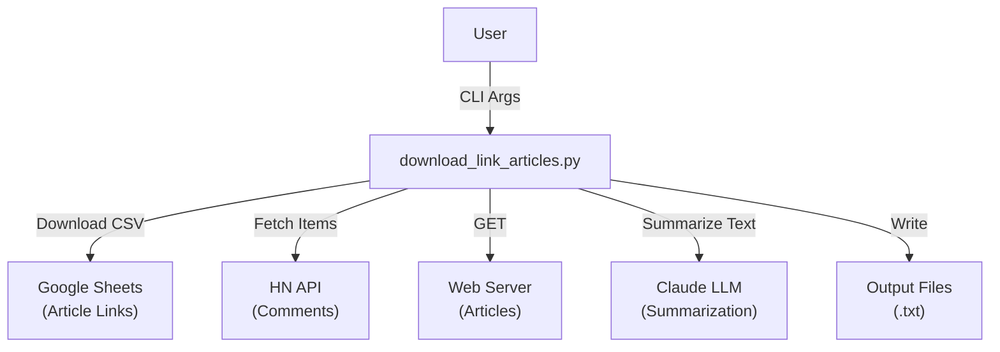
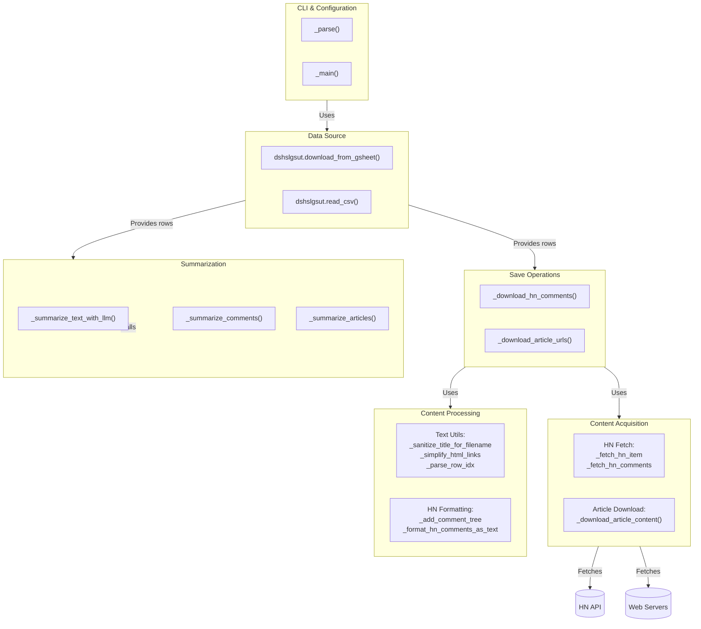
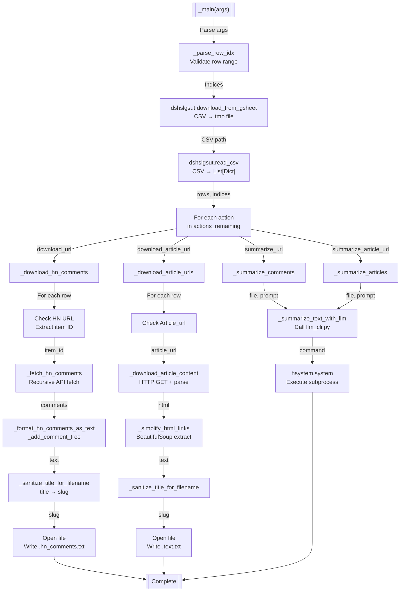

# Overview
Downloads article content and Hacker News comments from links stored in Google
Sheets. Supports four actions: fetching HN comments, downloading article
content, and summarizing both using Claude (via `llm_cli.py`). Output files are
stored locally with sanitized titles from the spreadsheet. Designed to work with
Google Sheets as a data source, the official HN API for comments, web scraping
for article extraction, and optional LLM-based summarization

# Architecture (C4 Model)

## C1 (Context)
System boundary showing how the script interacts with external systems and
users


The script orchestrates four independent operations that consume Google Sheets
data as the central input. All operations reference the same row indices and
title column for consistent output naming. External systems include the HN API
(for comments), arbitrary web servers (for articles), and Claude LLM (for
summarization). Users interact through command-line arguments specifying which
rows to process and which actions to execute

## C2 (Container)
High-level functional blocks and their primary responsibilities


The script is organized around six functional domains: CLI parsing and
orchestration, data source management (Google Sheets), content acquisition (HN
API and web scraping), content processing (text utilities and formatting), file
save operations (writing downloaded content), and summarization (delegating to
`llm_cli.py`)

## C3 (Component)
Main execution flow and data transformations through key components


Execution follows a strict orchestration pattern: parse arguments, validate row
indices, download CSV, read rows into memory, then iterate through selected
actions. Each action independently processes the same set of rows. HN comment
fetching is recursive (up to depth 3) with API caching. Article downloading uses
BeautifulSoup to extract paragraph text. Summarization delegates to `llm_cli.py`
via subprocess with temporary prompt files

## C4 (Code)
Implementation patterns and key call hierarchies
```
_main(parser)
  - args = parser.parse_args()
  - hdbg.init_logger(args.log_level)
  - actions = hselacti.select_actions(args, VALID_ACTIONS, DEFAULT_ACTIONS)
  - gsheet_csv = dshslgsut.get_tmp_file_path("gsheet.csv", ...)
  - dshslgsut.download_from_gsheet(args.url, gsheet_csv)
  - rows = dshslgsut.read_csv(gsheet_csv)
  - indices = _parse_row_idx(args.row_idx, len(rows))
  
  - for action in actions_remaining:
      - if action == "download_url":
          - _download_hn_comments(rows, indices, dry_run=...)
            - for idx in indices:
                - url = rows[idx]["Url"]
                - dshslgsut.is_hackernews_url(url)
                - item_id = dshslgsut.extract_item_id(url)
                - hn_comments = _fetch_hn_comments(item_id, max_depth=3)
                  - [recursive: _fetch_hn_item() with caching]
                  - [each item: extract id, by, text, time, score]
                  - [limit kids to first 10 per comment]
                - formatted = _format_hn_comments_as_text(hn_comments)
                  - _add_comment_tree(comments, lines, depth=0)
                - write to {sanitized_title}.hn_comments.txt
      
      - if action == "download_article_url":
          - _download_article_urls(rows, indices, dry_run=...)
            - for idx in indices:
                - article_url = rows[idx]["Article_url"]
                - article_content = _download_article_content(article_url)
                  - [BeautifulSoup parse]
                  - [extract <p> tags or fallback to raw HTML]
                  - _simplify_html_links(text)
                  - BeautifulSoup.get_text()
                - write to {sanitized_title}.text.txt
      
      - if action == "summarize_url":
          - _summarize_comments(rows, indices, dry_run=...)
            - for idx in indices:
                - _summarize_text_with_llm(
                    input_file={sanitized_title}.hn_comments.txt,
                    output_file={sanitized_title}.hn_comments.summary.txt,
                    prompt=comments_prompt,
                    model="gpt-4o-mini"
                  )
      
      - if action == "summarize_article_url":
          - _summarize_articles(rows, indices, dry_run=...)
            - [similar to _summarize_comments]
            - input_file={sanitized_title}.text.txt
            - output_file={sanitized_title}.text.summary.txt
```

**Notable patterns:**

- **Recursive HN API fetching**: `_fetch_hn_comments()` recursively traverses
  comment replies up to `max_depth=3`, caching each item fetch via
  `@hcacsimp.simple_cache()`
- **Title sanitization**: Non-alphanumeric characters replaced with underscores,
  consecutive underscores collapsed, leading/trailing underscores stripped
- **Caching**: Both `_fetch_hn_item()` and `_download_article_content()` use
  write-through JSON caching to avoid redundant API/network calls
- **Lazy dry-run**: All download/summarize functions accept `dry_run` flag for
  testing without side effects

# Key Functions and Classes
| Name                                                                              | Purpose                                                                               | Returns                                           |
| --------------------------------------------------------------------------------- | ------------------------------------------------------------------------------------- | ------------------------------------------------- |
| `_parse()`                                                                        | Parse command-line arguments for URL, row indices, action selection, dry-run mode     | `argparse.ArgumentParser`                         |
| `_main(parser)`                                                                   | Main orchestration: download CSV, validate rows, execute selected actions in sequence | None (writes files)                               |
| `_sanitize_title_for_filename(title)`                                             | Replace bash-unfriendly characters with underscores for use as filename slug          | `str` (sanitized slug)                            |
| `_simplify_html_links(text)`                                                      | Extract URLs from `<a>` tags and unescape HTML entities                               | `str` (text with simplified links)                |
| `_parse_row_idx(row_idx_str, num_rows)`                                           | Parse row range specification (e.g., "1:10") into 0-indexed list                      | `List[int]` (row indices)                         |
| `_fetch_hn_item(item_id)`                                                         | Fetch single HN item from API (cached)                                                | `Optional[Dict[str, Any]]` (item data)            |
| `_fetch_hn_comments(item_id, max_depth=3, current_depth=0)`                       | Recursively fetch HN comment tree up to max depth (caching individual items)          | `List[Dict[str, Any]]` (nested comment structure) |
| `_download_article_content(url)`                                                  | Download HTML and extract article text via BeautifulSoup                              | `str` (article text or empty string on failure)   |
| `_add_comment_tree(comment_list, lines, depth=0)`                                 | Recursively format comments with indentation, updating lines list in-place            | None (modifies `lines` list)                      |
| `_format_hn_comments_as_text(comments)`                                           | Convert comment tree to readable text representation                                  | `str` (formatted comments)                        |
| `_download_hn_comments(rows, indices, dry_run=False)`                             | Download HN comments for selected rows, save to `{title}.hn_comments.txt`             | None (writes files)                               |
| `_download_article_urls(rows, indices, dry_run=False)`                            | Download article content from `Article_url` column, save to `{title}.text.txt`        | None (writes files)                               |
| `_summarize_text_with_llm(input_file, output_file, prompt, model, dry_run=False)` | Delegate summarization to `llm_cli.py` via subprocess                                 | None (writes summary file)                        |
| `_summarize_articles(rows, indices, dry_run=False)`                               | Summarize article text using LLM, save to `{title}.text.summary.txt`                  | None (writes files)                               |
| `_summarize_comments(rows, indices, dry_run=False)`                               | Summarize HN comments using LLM, save to `{title}.hn_comments.summary.txt`            | None (writes files)                               |

# External Dependencies
| Module                                           | Purpose                                                                |
| ------------------------------------------------ | ---------------------------------------------------------------------- |
| `argparse`                                       | CLI argument parsing                                                   |
| `html`                                           | HTML entity unescaping (`html.unescape()`)                             |
| `re`                                             | Regex for title sanitization, HTML link extraction, item ID extraction |
| `os`                                             | File existence checking (`os.path.exists()`)                           |
| `requests`                                       | HTTP GET for article downloads and HN API calls                        |
| `BeautifulSoup` (bs4)                            | HTML parsing and text extraction from paragraphs                       |
| `pandas`                                         | CSV reading (via `dshslgsut.read_csv()` which uses `csv` module)       |
| `tqdm`                                           | Progress bars for loop iterations                                      |
| `helpers.hdbg`                                   | Assertion and debugging utilities                                      |
| `helpers.hio`                                    | File I/O utilities (`hio.to_file()`)                                   |
| `helpers.hparser`                                | Argument parser helpers (`hparser.add_verbosity_arg()`)                |
| `helpers.hprint`                                 | Logging/printing helpers (`hprint.func_signature_to_str()`)            |
| `helpers.hcache_simple`                          | Write-through JSON caching decorator                                   |
| `helpers.hselect_action`                         | Action selection and filtering helpers                                 |
| `helpers.hsystem`                                | System execution (`hsystem.system()`)                                  |
| `dev_scripts_helpers.scraping.link_gsheet_utils` | Google Sheets download, CSV utilities, HN URL validation               |
| `dev_scripts_helpers.llms.llm_cli`               | (Called via subprocess) Handles LLM summarization                      |

# Critique and Improvements

## Strengths
- **Modular action system**: Four independent actions (download HN, download
  articles, summarize HN, summarize articles) can be mixed and matched via
  `--action` and `--skip_action` flags, supporting flexible workflows
- **Caching strategy**: Both `_fetch_hn_item()` and
  `_download_article_content()` use write-through JSON caching, avoiding
  redundant network calls while providing transparent persistence
- **Recursive comment handling**: `_fetch_hn_comments()` gracefully traverses
  nested replies up to configurable depth with automatic limiting (first 10 kids
  per comment) to prevent API exhaustion
- **Title-based file naming**: Using sanitized titles from the spreadsheet as
  filenames creates human-readable outputs and implicit linkage back to source
  rows
- **Dry-run mode**: All operations support `--dry_run` flag, allowing safe
  testing and preview of actions before execution

## Weaknesses and Assumptions
1. **No error recovery or retry logic for network failures**
   - **Fact**: Functions like `_fetch_hn_item()` and
     `_download_article_content()` use 10s and 15s timeouts respectively but do
     not implement exponential backoff or retry
   - **Impact**: Transient network errors cause silent failures (logged as
     warnings) and incomplete data. Users must re-run the entire script to
     retry; no resume mechanism exists for partial failures

2. **Assumes title uniqueness for output filenames**
   - **Fact**: Output filename is derived solely from the `Title` column via
     sanitization. If two rows have identical titles, the second will overwrite
     the first (due to `if os.path.exists(output_file): continue` check)
   - **Impact**: Data loss if spreadsheet contains duplicate titles. No warning
     or error is issued for potential collisions

3. **Hardcoded model name in summarization**
   - **Fact**: Both `_summarize_articles()` and `_summarize_comments()` call
     `_summarize_text_with_llm(..., model="gpt-4o-mini", ...)` with no way to
     override
   - **Impact**: Users cannot choose a different model without code
     modification. Model name is detached from CLI configuration

4. **Assumes Google Sheets CSV export format stability**
   - **Fact**: Script reads `Url`, `Article_url`, and `Title` columns from CSV;
     column names must match exactly and headers must be present
   - **Impact**: If column names differ (e.g., "Url" vs. "URL" or
     "article_link"), rows are silently skipped as having missing columns. No
     validation of expected schema

5. **HTML content extraction fallback is crude**
   - **Fact**: `_download_article_content()` extracts `<p>` tags but falls back
     to raw HTML if no paragraphs found. The "get_text()" call on raw HTML may
     lose formatting context
   - **Impact**: Some articles (e.g., those heavy on images, lists, or custom
     markup) may produce incomplete or poorly formatted text

6. **No concurrency or parallelization**
   - **Fact**: All downloads and API calls are sequential; progress bars show
     iteration but not true parallelism
   - **Impact**: Large row batches may take minutes due to 10-15s network
     timeouts per row. No benefit from multiple cores or async I/O

7. **Assumes LLM CLI availability and success**
   - **Fact**: Summarization delegates to `dev_scripts_helpers.llms.llm_cli.py`
     via `hsystem.system()` without checking return code or output validation
   - **Impact**: If `llm_cli.py` is unavailable, fails, or is misconfigured, the
     error is printed but not caught; summary files may be empty or corrupted
