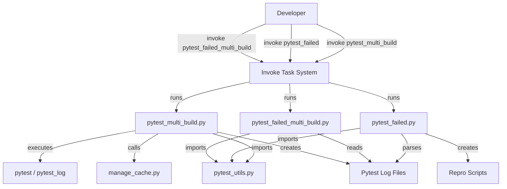

# Pytest Testing System Architecture

## Overview
The pytest testing system provides three coordinated CLI tools for multi-build
test execution, failure analysis, and result consolidation across different
environments (native Docker, Apple, and dev containers). The system enables
developers to:

- Run pytest across 3 build configurations with isolated cache and environment
  setup
- Parse pytest logs to extract, categorize, and analyze test failures
- Consolidate failures across multiple build runs to identify cross-platform
  issues

**Role in codebase**: These are standalone CLI tools invoked via invoke tasks
(`pytest_multi_build`, `pytest_failed`, `pytest_failed_multi_build`). They
support the test execution and debugging workflow for both CI/CD pipelines and
local development

**Key design decision**: Shared `BUILD_CONFIG` constant centralizes build
environment configuration, ensuring consistency across all three tools when
defining how different engines (docker, apple, dev_container) execute commands

## Architecture (C4 Model)

### C1 (Context)
Developers interact with three CLI tools to manage multi-build test execution
and failure analysis. These tools integrate with pytest output, the invoke task
system, and the local filesystem


**External systems and integrations**:

- **pytest / pytest_log**: Test execution command that generates structured
  output
- **manage_cache.py**: Cache clearing utility for consistent multi-build state
- **invoke task system**: CLI entry point and task orchestration
- **Filesystem**: Logs, repro scripts, and build-specific output files

### C2 (Container)
The system consists of four Python modules organized by responsibility:

```mermaid
graph TB
    subgraph "pytest_utils"
        Config["BUILD_CONFIG<br/>Build environment definitions"]
    end
    
    subgraph "pytest_multi_build"
        Parse["_parse()"]
        Build["_run_build()"]
        Clear["_clear_cache()"]
        Cleanup["_cleanup_old_files()"]
        Main["_main()"]
    end
    
    subgraph "pytest_failed"
        PFailed["_parse()"]
        AddEnv["_add_build_env_to_repro()"]
        ProcessFile["_process_single_file()"]
        GetOut["_get_output_filename()"]
        PFMain["_main()"]
    end
    
    subgraph "pytest_failed_multi_build"
        PFMParse["_parse()"]
        ReadFailed["_read_failed_tests()"]
        ReadRepro["_read_repro_script()"]
        Extract["_extract_pytest_cmd()"]
        Consolidate["_consolidate_failed_tests()"]
        Summary["_summary_to_str()"]
        CreateRepro["_create_consolidated_repro()"]
        PFMMain["_main()"]
    end
    
    Config -->|used by| Build
    Config -->|used by| AddEnv
    Config -->|used by| Cleanup
    Config -->|used by| CreateRepro
    
    PFMain -->|calls| ProcessFile
    ProcessFile -->|calls| AddEnv
    ProcessFile -->|calls| GetOut
    
    Main -->|calls| Build
    Main -->|calls| Clear
    Main -->|calls| Cleanup
    
    PFMMain -->|calls| Consolidate
    PFMMain -->|calls| Summary
    PFMMain -->|calls| CreateRepro
```


**Module responsibilities**:

- **pytest_utils**: Centralized configuration defining 3 build environments
  (docker, apple, dev_container) and their execution parameters
- **pytest_multi_build**: Orchestrates parallel pytest execution across all 3
  builds with cache management and isolated environment variables
- **pytest_failed**: Parses pytest logs to extract test results, generate
  categorized reports, and produce environment-specific repro scripts
- **pytest_failed_multi_build**: Consolidates failures across multiple build
  runs and creates cross-platform failure analysis

### C3 (Component)
**Multi-build execution flow** (pytest_multi_build.py):
```
_main(parser)
  ├─ _cleanup_old_files()
  │   └─ Remove old tmp.pytest_multi_build.{build}.txt files
  ├─ _build_pytest_cmd(targets) [if --target provided]
  │   └─ Build: "pytest_log <targets>"
  └─ For each build in BUILD_CONFIG:
      ├─ _clear_cache() [unless --no_delete_cache]
      │   └─ Run: manage_cache.py --action clear_all
      └─ _run_build(build_name, cmd, docker_engine, use_docker_cmd)
          ├─ Set CSFY_DOCKER_ENGINE env var
          ├─ If use_docker_cmd: wrap with invoke docker_cmd
          └─ Execute & tee output to tmp.pytest_multi_build.{build}.txt
```

**Failure parsing and categorization** (pytest_failed.py):
```
_main(parser)
  └─ _process_single_file(file_path, build_name)
      ├─ Parse pytest log via hpytest.parse_failed_tests()
      ├─ Generate categorized output files:
      │   ├─ tmp.pytest_failed.{build}.failed_tests.txt
      │   ├─ tmp.pytest_failed.{build}.passed_tests.txt
      │   ├─ tmp.pytest_failed.{build}.skipped_tests.txt
      │   └─ ...duration stats, stacktraces, etc.
      ├─ Generate repro scripts:
      │   ├─ _get_output_filename() to encode build name
      │   └─ _add_build_env_to_repro() to prepend env setup
      └─ Return summary dict (num_passed, num_failed, etc.)
```

**Cross-build failure consolidation** (pytest_failed_multi_build.py):
```
_main(parser)
  ├─ _consolidate_failed_tests(build_names)
  │   └─ For each build: _read_failed_tests() → build a map of test→builds
  ├─ _summary_to_str(build_names, test_to_builds)
  │   └─ Format consolidated summary as string
  ├─ _create_consolidated_repro(build_names)
  │   └─ For each build: _extract_pytest_cmd() from _read_repro_script()
  └─ Write outputs:
      ├─ tmp.pytest_failed_multi_build.repro.sh
      └─ tmp.pytest_failed_multi_build.failed_tests.txt
```

**Key data flows**:

- Build names flow from BUILD_CONFIG through all modules to ensure consistent
  naming
- Test result lists flow from pytest logs → \_read_failed_tests() →
  consolidation
- Environment setup is injected via \_add_build_env_to_repro() before returning
  scripts
- Repro scripts embed both the pytest command and build-specific environment
  setup

### C4 (Code)
**Entry points and call chains**:
```
pytest_multi_build.py::_main()
  ├─ Argument parsing via argparse
  ├─ BUILD_CONFIG lookup for each build
  └─ Subprocess execution with env var export

pytest_failed.py::_main()
  ├─ Parses input file or defaults to "tmp.pytest_log.txt"
  ├─ Calls hpytest module for log parsing
  └─ Writes multiple categorized output files

pytest_failed_multi_build.py::_main()
  ├─ Reads per-build outputs from pytest_failed.py
  ├─ Builds test_to_builds map: Dict[str, Set[str]]
  └─ Returns consolidated view (tests failing across multiple builds)
```

**Notable patterns**:

- **Environment variable injection**:
  `export CSFY_DOCKER_ENGINE='{engine}'; (cmd) 2>&1 | tee output.txt`
- **Filename encoding**: build_name embedded in output filenames to support
  parallel builds
- **Assertion-based validation**: `hdbg.dassert_in()`,
  `hdbg.dassert_file_exists()` for early failure
- **List-based composition**: Header parts built as list, then joined (lines
  60-70 in pytest_failed.py)

## Key Functions / Classes
| Name                                                    | Purpose                                                     | Returns                     |
| ------------------------------------------------------- | ----------------------------------------------------------- | --------------------------- |
| `pytest_multi_build._run_build()`                       | Execute pytest with specific build env and Docker config    | None (writes output file)   |
| `pytest_multi_build._clear_cache()`                     | Invoke manage_cache.py to clear all caches                  | None                        |
| `pytest_failed._process_single_file()`                  | Parse pytest log and generate all categorized outputs       | Dict with summary stats     |
| `pytest_failed._add_build_env_to_repro()`               | Prepend build-specific env setup to repro script            | None (modifies file)        |
| `pytest_failed._get_output_filename()`                  | Encode build_name into output filename                      | str                         |
| `pytest_failed_multi_build._consolidate_failed_tests()` | Build map of test → Set[builds where it failed]             | Dict[str, Set[str]]         |
| `pytest_failed_multi_build._summary_to_str()`           | Format cross-build failure summary                          | str                         |
| `pytest_failed_multi_build._read_failed_tests()`        | Load failed test list from per-build output                 | List[str]                   |
| `pytest_utils.BUILD_CONFIG`                             | Constant dict: build_name → (docker_engine, use_docker_cmd) | Dict[str, Tuple[str, bool]] |

## External Dependencies
| Module              | Purpose                                                           |
| ------------------- | ----------------------------------------------------------------- |
| `helpers.hdbg`      | Assertions (dassert_in, dassert_file_exists, dassert_ne)          |
| `helpers.hio`       | File I/O (from_file, to_file)                                     |
| `helpers.hparser`   | Argument parsing helpers (add_verbosity_arg)                      |
| `helpers.hprint`    | Formatting (frame, dedent)                                        |
| `helpers.hpytest`   | Pytest log parsing (parse_failed_tests, write_repro_script, etc.) |
| `helpers.hsystem`   | System calls (system, shell invocation)                           |
| `subprocess`        | Subprocess execution for pytest and docker_cmd                    |
| `argparse`          | CLI argument parsing                                              |
| `logging`           | Logging setup                                                     |
| `os`                | File operations (path.exists, remove)                             |
| `pytest_log`        | External command for running pytest with structured logging       |
| `manage_cache.py`   | External script to clear caches                                   |
| `invoke docker_cmd` | External task for Docker container execution                      |

## Critique and Improvements

### Strengths
- **Centralized configuration**: `BUILD_CONFIG` in pytest_utils eliminates
  duplication and makes adding new build targets (e.g., "k8s") a single-point
  change
- **Composable repro scripts**: Environment setup is injected via
  \_add_build_env_to_repro(), keeping build logic separate from log parsing
- **Parallel execution support**: Filename encoding with build_name allows
  independent per-build logs and repro scripts, enabling true parallelization
- **Clear separation of concerns**: pytest_multi_build handles execution,
  pytest_failed handles parsing, pytest_failed_multi_build handles cross-build
  analysis
- **Assertion-based safety**: Early validation with
  dassert_in/dassert_file_exists prevents downstream errors with helpful
  messages
- **List-based result handling**: Changed from Set to List in
  \_read_failed_tests() preserves ordering for deterministic output

### Weaknesses and Assumptions
1. **No atomic multi-build transaction**: Executes builds sequentially; if build
   2 fails before build 3 starts, build 3 output is missing but consolidation
   continues
   - **Fact**: Code loops through \_BUILDS.items() with no rollback or atomic
     checkpoint
   - **Impact**: Partial failures silently produce incomplete consolidated
     reports
   - **Mitigation**: Could add pre-flight check that all per-build log files
     exist before consolidation, or track which builds succeeded

2. **BUILD_CONFIG hardcoding limits portability**: Defines 3 specific build
   targets; adding environment-specific variants (dev vs. staging Docker
   engines) requires code change
   - **Assumption**: Only 3 build configurations needed (docker, apple,
     dev_container)
   - **Impact**: New build environments require code modification, not config
     file change
   - **Mitigation**: Could load BUILD_CONFIG from external JSON/YAML if
     extensibility becomes needed

3. **No retry or partial-failure recovery**: If manage_cache.py fails or
   pytest_log crashes, the script exits rather than continuing to next build
   - **Fact**: \_run_build() uses check=False on subprocess but \_clear_cache()
     does not wrap in try-except
   - **Impact**: Single broken cache leads to test suite stopping rather than
     proceeding with cache from previous build
   - **Mitigation**: Could add explicit error handling in \_main() to continue
     despite cache clear failures

4. **Filename encoding assumes unique build_name values**: If two build configs
   have the same name, output files collide
   - **Assumption**: build_name is unique within BUILD_CONFIG
   - **Impact**: Silently overwrites results if duplicate names exist
   - **Mitigation**: dassert_no_duplicates on BUILD_CONFIG.keys() at module load
     time

5. **No timestamp or build sequence tracking**: Output files have no indication
   of when builds ran or their order
   - **Assumption**: Single invocation per day, or user manually tracks runs
   - **Impact**: Difficult to correlate results when running pytest_multi_build
     multiple times in same session
   - **Mitigation**: Could add optional --run-id parameter to embed in all
     output filenames

6. **hpytest dependency obscured**: pytest_failed delegates all log parsing to
   hpytest.parse_failed_tests(); logic for extracting test categories lives
   elsewhere
   - **Assumption**: hpytest.parse_failed_tests() correctly returns all test
     categories
   - **Impact**: Bugs in pytest log parsing are hard to debug without
     understanding hpytest internals
   - **Mitigation**: Could add debug mode that logs raw hpytest output before
     filtering
