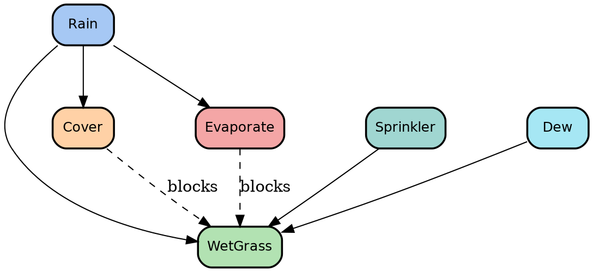

```graphviz
digraph BayesianFlow {
    splines=true;
    nodesep=1.0;
    ranksep=0.75;

    node [shape=box, style="rounded,filled", fontname="Helvetica", fontsize=12, penwidth=1.7];

    // Nodes
    Rain       [label="Rain", fillcolor="#A6C8F4"];
    WetGrass   [label="WetGrass", fillcolor="#B2E2B2"];
    Cover      [label="Cover", fillcolor="#FFD1A6"];
    Evaporate  [label="Evaporate", fillcolor="#F4A6A6"];
    Sprinkler  [label="Sprinkler", fillcolor="#A0D6D1"];
    Dew        [label="Dew", fillcolor="#A6E7F4"];

    // Force ranks
    { rank=same; Cover; Evaporate; }
    { rank=same; Sprinkler; Dew; }

    // Edges
    Rain -> WetGrass;
    Rain -> Cover;
    Rain -> Evaporate;
    Cover -> WetGrass [label="blocks", style=dashed];
    Evaporate -> WetGrass [label="blocks", style=dashed];
    Sprinkler -> WetGrass;
    Dew -> WetGrass;
}
```

