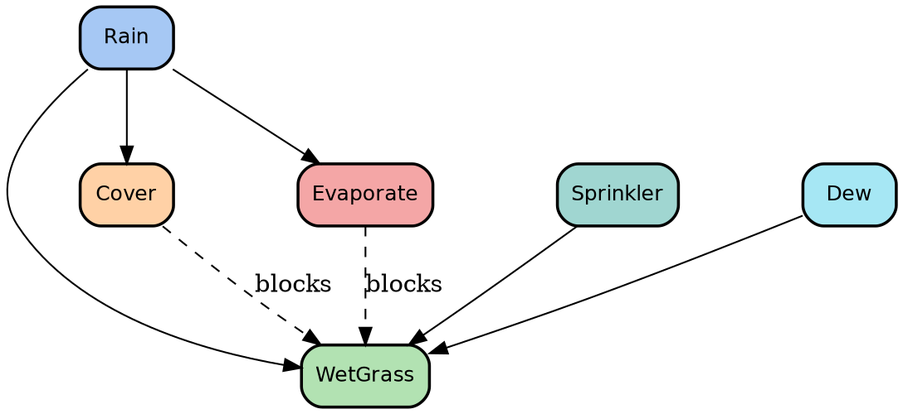

# Graphviz diagram
- Any graphviz diagram should be follow the template below



# Tikz diagram
- Any Tikz diagram should be follow the template below

```latex
\usepackage{tikz}
\begin{document}

\newcommand{\gridpattern}[2]{
...
}

%\begin{center}
\begin{tikzpicture}
...
%\end{center}
\end{document}
```

# Graphic image

- Any graphic image should follow the template below

```image
High-end editorial illustration for a business technology magazine. 

Lighting is studio-grade and cinematic, with realistic reflections on glass and
metal. Materials look physically accurate (optical glass, brushed aluminum, matte
screens).

Color palette is restrained and corporate: cool whites, slate blues, soft greens,
with small warm amber highlights for contrast.

Style is photorealistic illustration with the polish of a Fortune-500 annual
report or The Economist technology cover — no fantasy, no cyberpunk, no glowing
neon, no cartoon outlines.

<description of the content>
```
