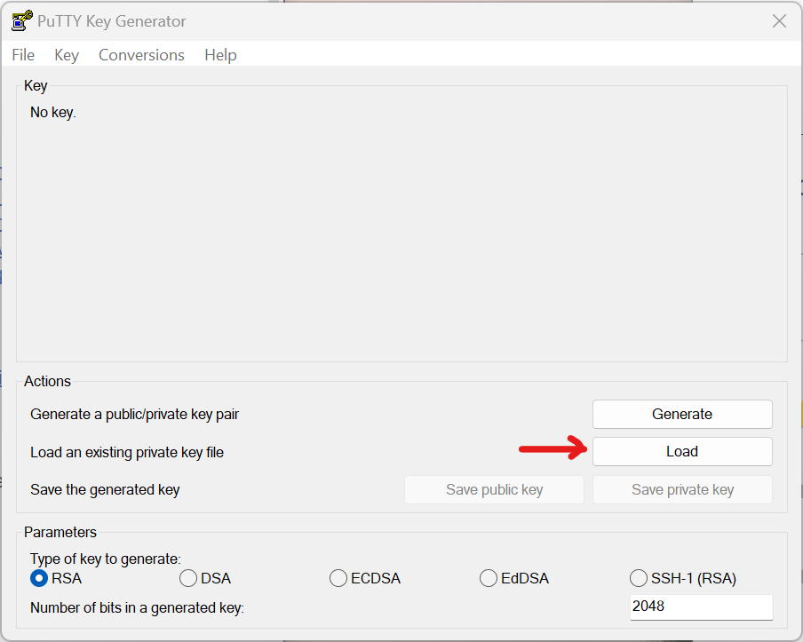
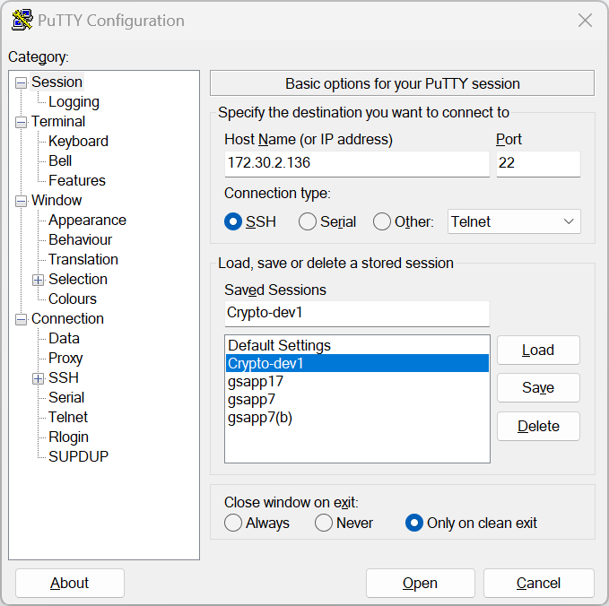
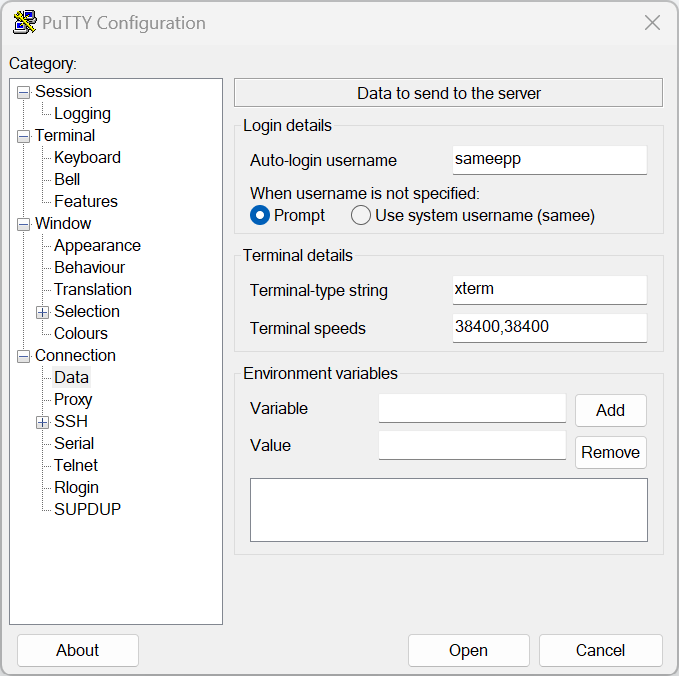
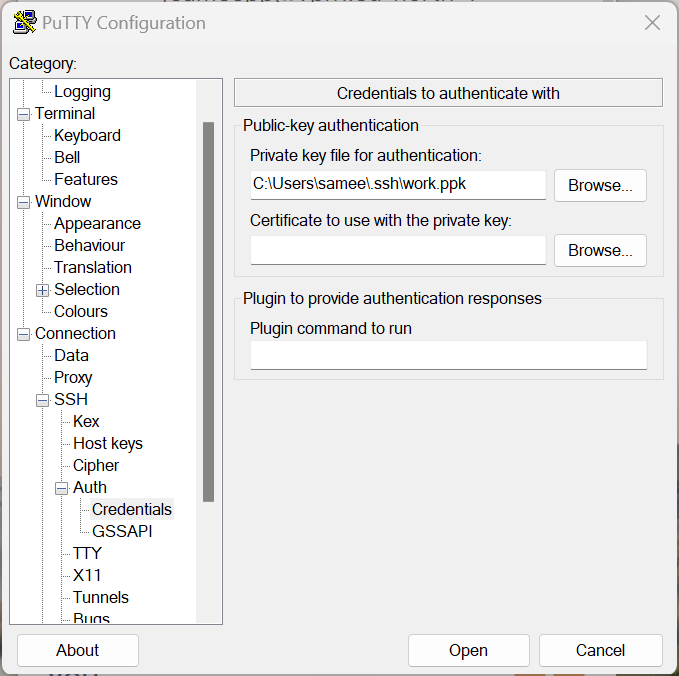
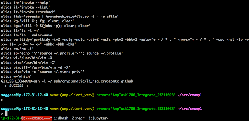
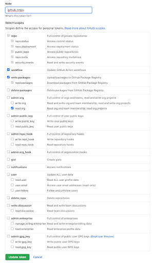

# Development Setup

<!-- toc -->

- [High-level view](#high-level-view)
- [Configure bash for your laptop](#configure-bash-for-your-laptop)
  * [Linux and MacOS](#linux-and-macos)
  * [Windows](#windows)
- [Configure .ssh for your laptop](#configure-ssh-for-your-laptop)
- [Configure .ssh for the server](#configure-ssh-for-the-server)
- [Configure bash for the server (advanced)](#configure-bash-for-the-server-advanced)
  * [Configure bash](#configure-bash)
    + [Linux and MacOS](#linux-and-macos-1)
    + [Windows](#windows-1)
  * [Configure tmux (optional)](#configure-tmux-optional)
  * [Spruce up your environment](#spruce-up-your-environment)
  * [Set up AWS](#set-up-aws)
  * [Set up Telegram token](#set-up-telegram-token)
  * [Clone the Hub repo](#clone-the-hub-repo)
  * [Create a tmux session](#create-a-tmux-session)
  * [Configure `gh`](#configure-gh)
    + [Fix permissions](#fix-permissions)
  * [Begin working](#begin-working)

<!-- tocstop -->

## High-level view

- In order to develop in `cmamp` you must run on one of our `dev` servers, by
  creating a VPN connection to our VPC and then ssh-ing to a `dev` server from
  your laptop

- Don't waste time trying to setting up the dev env on your laptop since certain
  resources (e.g., AWS resources, DBs, etc) are not visible outside our VPN

- If there is a problem with the `dev` servers (e.g., too slow, tools that you
  want that don't work, etc) we can make your dev env better, so that everyone
  can benefit

## Configure bash for your laptop

- Make sure you are connected to the VPN before proceeding

### Linux and MacOS

- Locally on your laptop tweak your `.bashrc` to add your server credentials:

  ```bash
  > vi .bashrc

  # Append at the end.
  export CM_SSH_KEY=~/.ssh/cryptomatic.pem
  # E.g., export CM_SSH_KEY=~/.ssh/ck/saggese-cryptomatic.pem

  # XYZ for your remote Linux username, e.g., saggese, danya, maxs
  export CM_USER=saggese
  export CM_IP=172.30.2.136
  ```

- For MacOS you might want to tweak `.bash_profile`. After tweaking your bashrc,
  you need to restart the shell session with `exit; bash` or do `source ~/.bash`

### Windows

- Download and install `putty.exe`, `pscp.exe`, and `puttygen.exe` from the
  [PuTTY Download Page](https://www.chiark.greenend.org.uk/~sgtatham/putty/latest.html)

- Open `PuTTYgen` and click on the load button
  

- Locate the private SSH key that you have downloaded

- Click the Save private key button to create the ppk file
  

- Open `PuTTY`, under Session, enter your Hostname i.e. our server IP:
  172.30.2.136

  

- Under Connection, click Data and Enter your username as the Auto-login
  username 

- Under SSH, choose 2 from the Preferred SSH Protocol Version
  

- Under SSH -> Auth -> Credentials, you will need to specify where your private
  key can be found

- Remember, this is the ppk file you generated using `PuTTygen` earlier

- Click the Browse to locate the file on your computer
  

- Under Sessions, type a name (such as "my site") in the Saved Sessions box and
  then click Save. Hit Open to Run the session

## Configure .ssh for your laptop

- To connect to the server use your previously generated private key, i.e. not
  the public key that the Infra team sends you back
- Move the public-private key pair to `~/.ssh` and set `pem` as the private key
  extension, see
  [more about `pem` extension](https://fileinfo.com/extension/pem). E.g.,
  `~/.ssh/cryptomatic.pem` (private key) that you will use to connect.
- Set the permissions for your private key
  ```bash
  laptop> chmod 600 ~/.ssh/cryptomatic.pem
  ```
- Now you can connect to the server through a VPN (see
  `docs/onboarding/ck.setup_vpn_and_dev_server_access.how_to_guide.md`)

  ```bash
  laptop> ssh -i $CM_SSH_KEY $CM_USER@$CM_IP

  E.g.,
  laptop> ssh -i ~/.ssh/cryptomatic.pem $CM_USER@$CM_IP
  ```

- You can also pass the user and IP manually, but adding those exports above
  saves time in the long run.

## Configure .ssh for the server

- `ssh` into the server with
  ```bash
  laptop> ssh -i $CM_SSH_KEY $CM_USER@$CM_IP
  ```
- Your home directory should be under `/data`
  ```bash
  server> echo $HOME
  /data/saggese
  ```
- The directory on the server should look like:
  ```bash
  server> ls -l ~/.ssh/
  total 16
  -rw------- 1 saggese saggese  382 Nov 19 18:15 authorized_keys
  -rw------- 1 saggese saggese  381 Nov 25 17:41 cryptomatic.pem.pub
  -rw-r--r-- 1 saggese saggese  666 Nov 25 17:43 known_hosts
  ```
- (Optional step) If that's not the case, talk to IT to copy the public ssh key
  to the server from your laptop.

## Configure bash for the server (advanced)

### Configure bash

#### Linux and MacOS

- Now you want to configure the server `~/.bash` and the environment to your
  preference.
- E.g., you might want to copy `.vimrc`, pimp `.bashrc`

  ```bash
  ## Copy your hub keys to the dev server
  laptop> export CM_SSH_KEY=~/.ssh/cryptomatic/saggese-cryptomatic.pem
  laptop> export CM_USER=saggese
  laptop> export CM_IP=172.30.2.136

  laptop> scp -i $CM_SSH_KEY ~/.ssh/id_rsa $CM_USER@$CM_IP:/data/$CM_USER/.ssh/id_rsa.gpsaggese.hub

  laptop> scp -i ~/.ssh/cryptomatic/saggese-cryptomatic.pem ~/.ssh/id_rsa.pub saggese@172.30.2.136:/data/saggese/.ssh/id_rsa.gpsaggese.hub.pub

  laptop> scp -i ~/.ssh/cryptomatic/saggese-cryptomatic.pem ~/.ssh/cryptomatic/id_rsa.cryptomtc.hub saggese@172.30.2.136:/data/saggese/.ssh/id_rsa.cryptomtc.github

  laptop> scp -i ~/.ssh/cryptomatic/saggese-cryptomatic.pem ~/.ssh/cryptomatic/id_rsa.cryptomtc.hub.pub saggese@172.30.2.136:/data/saggese/.ssh/id_rsa.cryptomtc.github.pub
  ```

- Tweak permissions on the server
  ```bash
  server> ls -l ~/.ssh
  total 32
  -rw------- 1 saggese saggese  382 Nov 19 18:15 authorized_keys
  -r-------- 1 saggese saggese 1679 Nov 25 17:40 cryptomatic.pem
  -r-------- 1 saggese saggese  381 Nov 25 17:41 cryptomatic.pem.pub
  -r-------- 1 saggese saggese 3243 Nov 30 17:54 id_rsa.cryptomtc.hub
  -r-------- 1 saggese saggese  732 Nov 30 17:54 id_rsa.cryptomtc.hub.pub
  -r-------- 1 saggese saggese 1675 Nov 30 17:48 id_rsa.gpsaggese.hub
  -r-------- 1 saggese saggese  389 Nov 30 17:50 id_rsa.gpsaggese.hub.pub
  -rw-r--r-- 1 saggese saggese  888 Nov 30 17:43 known_hosts
  ```

#### Windows

- Use the above steps from Configure bash of Linux and MacOS. Just use scp in
  the following way:

  ```bash
  laptop> scp -i $CM_SSH_KEY ~/.ssh/id_rsa $CM_USER@$CM_IP:/data/$CM_USER/.ssh/id_rsa.gpsaggese.hub

  laptop> pscp -scp -i $PPK_KEY_GENERATED_USING_PUTTYGEN ~/.ssh/id_rsa $CM_USER@$CM_IP:/data/$CM_USER/.ssh/id_rsa.gpsaggese.hub
  ```

### Configure tmux (optional)

- Create this file under `~/.tmux.conf` on the server. The prefix is `CTRL-g`.
  Copy-paste the code below into the `.tmux.conf` and save the changes.

  ```bash
  # Use C-x.
  #set -g prefix C-x
  set -g prefix C-g
  unbind-key C-b
  bind-key C-g send-prefix

  # Set status bar.
  set -g status-bg black
  set -g status-fg white
  set -g status-left '#[fg=green]#H'

  # Use vi shortcuts.
  set-window-option -g mode-keys vi

  # set -g status-right "#[fg=blue]#S #I:#P #[fg=yellow]:: %d %b %Y #[fg=green]:: %l:%M %p :: #(date -u | awk '{print $4}')::"

  # 100k lines
  set-option -g history-limit 100000

  # Highlight active window.
  # set-window-option -g window-status-current-bg red
  set -g window-status-current-style bg=red

  # Try to speed up the processing of shortcuts.
  set-option -g repeat-time 0
  set -sg escape-time 0

  # To get notification when a command is done.
  # TODO: This seems to give problems with my mac and being removed.
  # set -g visual-content on
  # setw -g monitor-content CMD_DONE

  # For Mac only.
  # Workaround to 'LSOpenURLsWithRole() failed with error -10810'.
  # set -g default-command "reattach-to-user-namespace -l /bin/bash"
  # set-option -g default-command "which reattach-to-user-namespace > /dev/null && #reattach-to-user-namespace -l $SHELL || $SHELL"
  ```

### Spruce up your environment

- If you have multiple users, you can decide which one to use

  ```bash
  # Test hub connection
  > ssh -i ~/.ssh/id_rsa.gpsaggese.hub -T git@github.com
  > _SSH_COMMAND="ssh -i ~/.ssh/id_rsa.gpsaggese.github" git clone git@github.com:gpsaggese/dotted_files.git

  > _SSH_COMMAND="ssh -i ~/.ssh/id_rsa.gpsaggese.github" git clone --recurse git@github.com:alphamatic/amp.git amp1
  ```

### Set up AWS

- We use AWS profile called `ck`
  - It is used to access S3 bucket data and other AWS resources
  - API credentials are included in the `zip` archive sent via e-mail during
    on-boarding process
  - Ask the Infra team if you have not obtained the credentials

- Create dir with proper permissions:
  ```bash
  > mkdir ~/.aws; chmod 700 ~/.aws
  ```
- Put the following into `~/.aws/config`:

  ```bash
  [profile ck]
  region = eu-north-1
  ```

- Put the following into `~/.aws/credentials`:

  ```bash
  [ck]
  aws_access_key_id=***
  aws_secret_access_key=***
  aws_s3_bucket=cryptokaizen-data
  ```

- Note that AWS uses `[profile XYZ]` vs `[XYZ]` in the two types of files
  (config and credentials), yes, this is insane
- Change permissions to ready-only and only for your user since it contains
  credentials:
  ```bash
  > chmod 400 ~/.aws/*
  ```
- You should get to permissions that look like:

  ```bash
  saggese@ip-172-30-2-136:~$ ls -ld ~/.aws
  drwx------ 2 saggese saggese 4096 Dec  3 17:09 /data/saggese/.aws

  saggese@ip-172-30-2-136:~$ ls -l ~/.aws
  total 8
  -r-------- 1 saggese saggese  32 Dec  3 17:08 config
  -r-------- 1 saggese saggese 403 Dec  3 17:09 credentials
  ```

- Test the access to the S3 bucket
  - For the ck:
    ```bash
    > aws s3 ls s3://cryptokaizen-data --profile ck
         PRE daily_staged/
         PRE db_archive/
         PRE historical/
         PRE reorg/
         PRE unit_test/
    ```

- Test accessing AWS ECR to pull containers:

  ```bash
  > eval $(aws ecr get-login --profile am --no-include-email --region us-east-1)
  WARNING! Using --password via the CLI is insecure. Use --password-stdin.
  WARNING! Your password will be stored unencrypted in /data/saggese/.docker/config.json.
  Configure a credential helper to remove this warning. See
  https://docs.docker.com/engine/reference/commandline/login/#credentials-store

  Login Succeeded
  ```

### Clone the Hub repo

- For hub you can use your key otherwise you can generate an ssh key for hub
- Note:
  - You can use any SSH key, even a “personal” one that one uses for his/her
    projects
  - In practice, the logic is “user authenticates with GH, we tell GH to grant
    access to a private repo, GH is happy"
- Typically you can save the Hub authentication in `~/.ssh/id_rsa` and
  `~/.ssh/id_rsa.pub`
- Note: make sure permissions are read-only, otherwise change permissions, e.g.,
  `chmod 400 ~/.ssh/id_ed25519`
- In order to use our automation scripts, the path to local copy of the repos
  needs look like this `${HOME}/src/{REPO_NAME}{IDX}`, e.g.,
  `/data/saggese/src/cmamp1`.
- Clone the repo with:
  ```bash
  > mkdir ~/src
  > cd ~/src
  >  clone git@github.com:causify-ai/cmamp.git ~/src/cmamp1
  ```
- You can have multiple cloned repos like `cmamp2`, `cmamp3` and so on to work
  on unrelated changes at the same time
- Build the thin environment we use to call invoke and Docker:
  ```bash
  > cd ~/src/cmamp1
  > dev_scripts/client_setup/build.sh 2>&1 | tee tmp.build.log
  ...
  # docker=Docker version 20.10.10, build b485636
  # Configure your client with:
  > source dev_scripts/setenv_amp.sh
  ```
- This script to build the environment is run rarely when the dependencies are
  changed.
- This environment is shared by multiple repos (e.g., all the `cmamp` and
  `dev_tools`), so once you build the environment you can use it for all the
  repos and for multiple clients
- The same setup applies to any set-up including `amp` (e.g., `orange`,
  `dev_tools`), one needs to recursively clone into the `amp` folder (see
  ` --clone ...`) then follow the same procedure by sourcing the script from top
  of the supermodule: `amp/dev_scripts/client_setup/build.sh`

### Create a tmux session

- Create a link from the script in the repo creating a tmux session to your
  home:

  ```bash
  > ln -sf $(pwd)/dev_scripts/go_amp.sh ~/go_amp.sh

  > ls -l ~/go_amp.sh
  lrwxrwxrwx 1 saggese saggese 46 Dec  3 18:26 /data/saggese/go_amp.sh ->     /data/saggese/src/cmamp1/dev_scripts/go_amp.sh
  ```

- To create the standard tmux view on a cloned environment run
  `~/go_amp.sh cmamp 1`.

  

- You need to create the tmux environment once per client and then you can
  re-connect with:

  ```bash
  # Check the available environments.
  > tmux ls
  cmamp1: 4 windows (created Fri Dec  3 18:27:09 2021) (attached)

  # Attach an environment.
  > tmux attach -t cmamp1
  ```

- You can re-run `~/go_amp.sh` when your tmux gets corrupted and you want to
  restart Of course this doesn't impact the underlying repo

### Configure `gh`

- We enjoy using Hub CLI
  - Create a Personal Access Token (classic) on Hub following the official guide
  - Put the following permissions:

    

- Create personal access token (aka PAT) as done above and save it to
  `~/hub_pat.txt`
- You can login with a single command
  ```bash
  > cat ~/hub_pat.txt | gh auth login --hostname github.com --with-token
  ```
- Sometimes you need to create the file to make `gh` happy
  ```bash
  > touch ~/.config/gh/config.yml
  ```
- Check the current authentication status of `gh`:
  ```bash
  > gh auth status
  hub.com
    ✓ Logged in to hub.com as gpsaggese (/Users/saggese/.config/gh/hosts.yml)
    ✓  operations for github.com configured to use ssh protocol.
    ✓ Token: *******************
  ```

#### Fix permissions

- Sometimes for whatever reason a file is created by `root` which prevents
  executing certain commands being a non-root user w/o sudo privileges
- To change permissions we need sudo privileges that we do not have outside a
  Docker container but we have inside a Docker container
  ```bash
  (amp.client_venv) dan@ip-172-31-12-40:~/src/cmamp1$ gh auth login
  ? What account do you want to log into? Hub.com
  ? What is your preferred protocol for  operations? SSH
  ? Upload your SSH public key to your Hub account? Skip
  ? How would you like to authenticate Hub CLI? Paste an authentication token
  Tip: you can generate a Personal Access Token here https://hub.com/settings/tokens
  The minimum required scopes are 'repo', 'read:org'.
  ? Paste your authentication token: ****************************************
  - gh config set -h hub.com git_protocol ssh
  ✓ Configured  protocol
  open /data/dan/.config/gh/config.yml: permission denied
  (amp.client_venv) dan@ip-172-31-12-40:~/src/cmamp1$ cat ~/hub_pat.txt | gh auth login --hostname github.com --with-token
  open /data/dan/.config/gh/config.yml: permission denied
  ```
  - Get inside the docker container using `i docker_bash`
  - Change dir using `cd ~/.config`
  - Run `sudo chown -R username:username gh` where username is your username
    inside the container, e.g. `user_1022:user_1022`
  - Run `ls -l gh | grep root` if nothing, it’s a good sign
  - Close container printing `exit` or ctrl+D
  - Log in again using `gh auth login` and follow the instructions above
  - Check your auth status using `gh auth status`

### Begin working

- Conceptually the steps are:
  - Clone a repo in `~/src/...`
    - You can have as many clients as you want (`cmamp1`, `cmamp2`, ...,
      `dev_tools1`, ...)
  - Build the "thin" environment:
    - Needs to be done only once for all your clients
      ```bash
      > ~/src/cmamp1/dev_scripts/client_setup/build.sh 2>1 | tee tmp.build.log
      ```
  - Start a tmux session
    - You should have one session per client, e.g., for the Git client
      `~/src/cmamp1`
      ```bash
      > ~/go_amp.sh cmamp 1
      ```
  - Activate environment:
    - This is done by `~/go_amp.sh` automatically in all the tmux panes
    - You change `dev_scripts/setenv_amp.sh` you might need to run
      ```bash
      > source dev_scripts/setenv_amp.sh
      ```
  - Pull `cmamp` docker images:
    - This image is shared all your clients (actually all users on the server
      use the same image)
      ```bash
      > i docker_pull
      Digest: sha256:308d52a0354845d1a2aa2014282efa66864329e7e22bf15dad518c219b5d5a3d
      Status: Downloaded newer image for 665840871993.dkr.ecr.us-east-1.amazonaws.com/cmamp:dev
      665840871993.dkr.ecr.us-east-1.amazonaws.com/cmamp:dev
      ```
  - Check `docker_bash`:
    ```bash
    > i docker_bash
    INFO: > cmd='/data/saggese/src/venv/dev_tools.client_venv/bin/invoke docker_bash'
    ## docker_bash:
    IMAGE=665840871993.dkr.ecr.us-east-1.amazonaws.com/dev_tools:dev \
            docker-compose \
            --file /data/saggese/src/dev_tools1/devops/compose/docker-compose.yml \
            --env-file devops/env/default.env \
            run \
            --rm \
            --user $(id -u):$(id -g) \
            app \
            bash
        user_1005@9e4373e01213:/app$
    ```
    - Exit the container with `exit` and get back to the server prompt
  - Run regressions:
    ```bash
    > i run_fast_tests
    ```
    - If you can run all the regressions without errors, then you are totally
      set up to start developing
