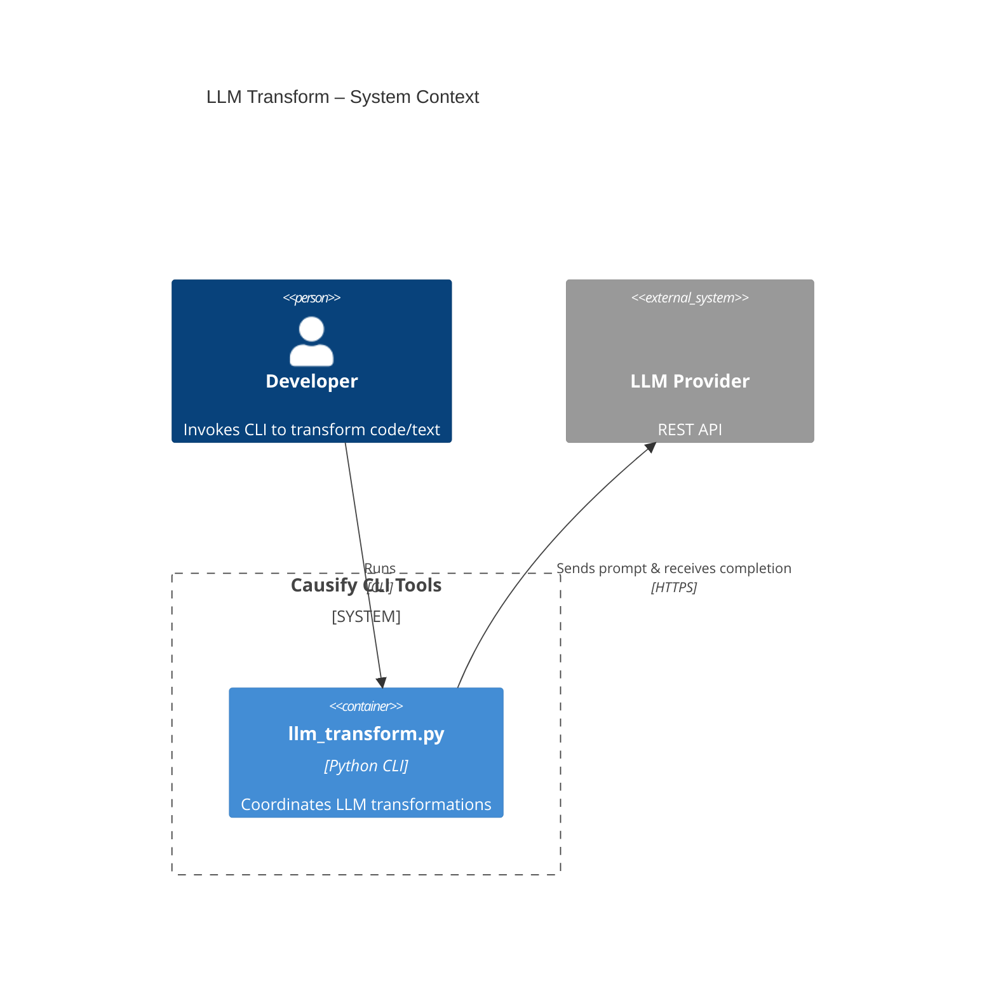
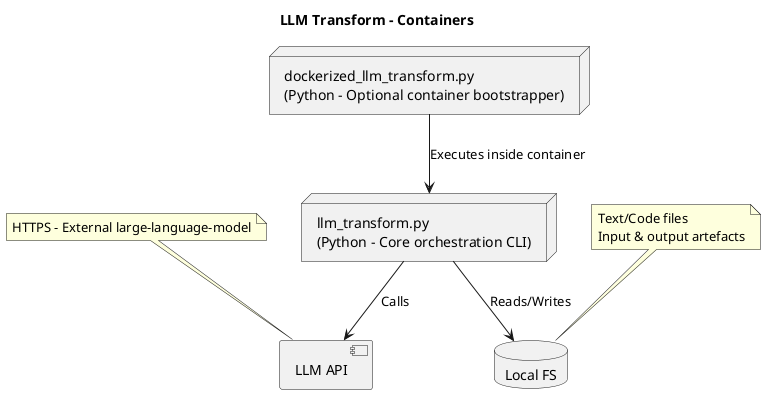
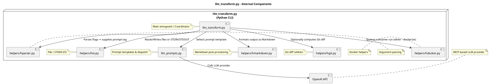

<!-- toc -->

- [llm_transform.py - Architecture & Flow Explanation](#llm_transformpy---architecture--flow-explanation)
  * [High Level Flow](#high-level-flow)
  * [Architecture Diagrams (C4)](#architecture-diagrams-c4)
    + [System Context](#system-context)
    + [Container](#container)
    + [Component](#component)

<!-- tocstop -->

# llm_transform.py - Architecture & Flow Explanation

## High Level Flow

- **Argument parsing** – uses [`/helpers/hparser.py`](/helpers/hparser.py) to
  normalise CLI flags.
- **Input acquisition** – [`/helpers/hio.py`](/helpers/hio.py) resolves `‑i` or
  stdin and reads bytes.
- **Prompt selection** – `llm_prompts.py` maps the `‑p/--prompt-tag` value to a
  concrete system/assistant prompt.
- **LLM invocation** – the request is handed to the generic client in
  [`/helpers/hserver.py`](/helpers/hserver.py) through `llm_prompts.py`.
- **Post‑processing** – raw LLM text may be re‑formatted by
  [`/helpers/hmarkdown.py`](/helpers/hmarkdown.py) (e.g. bold top‑level
  bullets).
- **Output emission** – [`/helpers/hio.py`](/helpers/hio.py) writes to stdout or
  the `‑o` file.
- **Optional Dockerisation** – if `‑‑dockerize` is set, control reroutes via
  `dockerized_llm_transform.py`, which uses
  [`/helpers/hdocker.py`](/helpers/hdocker.py) to spin up a container and
  re‑invoke the script inside it.

## Architecture Diagrams (C4)

### System Context

### Container

### Component

