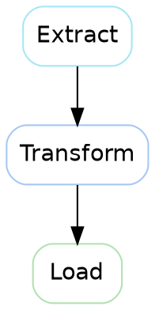

<!-- toc -->

- [`llm_transform.py`](#llm_transformpy)
  * [Interface](#interface)
  * [Basic Usage](#basic-usage)
  * [List of transforms](#list-of-transforms)
  * [Prompt Tags](#prompt-tags)
    + [Code Prompts](#code-prompts)
      - [`code_apply_cfile`](#code_apply_cfile)
        * [Input](#input)
        * [Output](#output)
      - [`code_fix_by_using_f_strings`](#code_fix_by_using_f_strings)
        * [Input](#input-1)
        * [Output](#output-1)
      - [`code_fix_by_using_perc_strings`](#code_fix_by_using_perc_strings)
        * [Input](#input-2)
        * [Output](#output-2)
      - [`code_fix_code`](#code_fix_code)
        * [Input](#input-3)
        * [Output](#output-3)
      - [`code_fix_comments`](#code_fix_comments)
        * [Input](#input-4)
        * [Output](#output-4)
      - [`code_fix_complex_assignments`](#code_fix_complex_assignments)
        * [Input](#input-5)
        * [Output](#output-5)
      - [`code_fix_docstrings`](#code_fix_docstrings)
        * [Input](#input-6)
        * [Output](#output-6)
      - [`code_fix_from_imports`](#code_fix_from_imports)
        * [Input](#input-7)
        * [Output](#output-7)
      - [`code_fix_function_type_hints`](#code_fix_function_type_hints)
        * [Input](#input-8)
        * [Output](#output-8)
      - [`code_fix_log_string`](#code_fix_log_string)
        * [Input](#input-9)
        * [Output](#output-9)
      - [`code_fix_logging_statements`](#code_fix_logging_statements)
        * [Input](#input-10)
        * [Output](#output-10)
      - [`code_fix_star_before_optional_parameters`](#code_fix_star_before_optional_parameters)
        * [Input](#input-11)
        * [Output](#output-11)
      - [`code_fix_unit_test`](#code_fix_unit_test)
        * [Input](#input-12)
        * [Output](#output-12)
      - [`code_transform_apply_csfy_style`](#code_transform_apply_csfy_style)
        * [Input](#input-13)
        * [Output](#output-13)
      - [`code_transform_apply_linter_instructions`](#code_transform_apply_linter_instructions)
        * [Input](#input-14)
        * [Output](#output-14)
      - [`code_transform_remove_redundancy`](#code_transform_remove_redundancy)
        * [Input](#input-15)
        * [Output](#output-15)
      - [`code_write_1_unit_test`](#code_write_1_unit_test)
        * [Input](#input-16)
        * [Output](#output-16)
      - [`code_write_unit_test`](#code_write_unit_test)
        * [Output for the same input as above](#output-for-the-same-input-as-above)
    + [Documentation Prompts](#documentation-prompts)
      - [`latex_rewrite`](#latex_rewrite)
        * [Input](#input-17)
        * [Output](#output-17)
      - [`md_add_good_bad_examples`](#md_add_good_bad_examples)
        * [Input](#input-18)
        * [Output](#output-18)
      - [`md_clean_up_how_to_guide`](#md_clean_up_how_to_guide)
        * [Input](#input-19)
        * [Output (Sections Added)](#output-sections-added)
      - [`md_convert_table_to_bullet_points`](#md_convert_table_to_bullet_points)
        * [Input](#input-20)
        * [Output](#output-19)
      - [`md_convert_text_to_bullet_points`](#md_convert_text_to_bullet_points)
        * [Input](#input-21)
        * [Output](#output-20)
      - [`md_create_bullets`](#md_create_bullets)
        * [Input](#input-22)
        * [Output](#output-21)
      - [`md_expand`](#md_expand)
        * [Input](#input-23)
        * [Output](#output-22)
      - [`md_format`](#md_format)
        * [Input](#input-24)
        * [Output](#output-23)
      - [`md_remove_formatting`](#md_remove_formatting)
        * [Input](#input-25)
        * [Output](#output-24)
      - [`md_rewrite`](#md_rewrite)
        * [Input](#input-26)
        * [Output](#output-25)
      - [`md_summarize_short`](#md_summarize_short)
        * [Input](#input-27)
        * [Output](#output-26)
    + [Slide Prompts](#slide-prompts)
      - [`slide_add_figure`](#slide_add_figure)
        * [Input](#input-28)
        * [Output](#output-27)
      - [`slide_bold`](#slide_bold)
        * [Input](#input-29)
        * [Output](#output-28)
      - [`slide_check`](#slide_check)
        * [Input](#input-30)
        * [Output](#output-29)
      - [`slide_expand`](#slide_expand)
        * [Input](#input-31)
        * [Output](#output-30)
      - [`slide_reduce`](#slide_reduce)
        * [Input](#input-32)
        * [Output](#output-31)
      - [`slide_reduce_bullets`](#slide_reduce_bullets)
        * [Input](#input-33)
        * [Output](#output-32)
      - [`slide_smart_colorize`](#slide_smart_colorize)
        * [Input](#input-34)
        * [Output](#output-33)
      - [`slide_to_bullet_points`](#slide_to_bullet_points)
        * [Input](#input-35)
        * [Output](#output-34)
    + [Text Prompts](#text-prompts)
      - [`text_idea`](#text_idea)
        * [Input](#input-36)
        * [Output](#output-35)
      - [`text_rephrase`](#text_rephrase)
        * [Input](#input-37)
        * [Output](#output-36)
      - [`text_rewrite`](#text_rewrite)
        * [Input](#input-38)
        * [Output](#output-37)
    + [Review Prompts](#review-prompts)
      - [`review_correctness`](#review_correctness)
        * [Input](#input-39)
        * [Output](#output-38)
      - [`review_linter`](#review_linter)
        * [Input](#input-40)
        * [Output](#output-39)
      - [`review_llm`](#review_llm)
        * [Input](#input-41)
        * [Output](#output-40)
      - [`review_refactoring`](#review_refactoring)
        * [Input](#input-42)
        * [Output](#output-41)
    + [Miscellaneous Prompts](#miscellaneous-prompts)
      - [`misc_categorize_topics`](#misc_categorize_topics)
        * [Input](#input-43)
        * [Output](#output-42)
      - [`test`](#test)
        * [Input](#input-44)
        * [Output](#output-43)

<!-- tocstop -->

# `llm_transform.py`

The script is capable of performing certain transformations using OpenAI's LLMs
on the input text or the stdin. The transformed output is then stored in the
output file or the stdout depending upon the arguments passed by the user.

## Interface

```bash
llm_transform.py -h
usage: llm_transform.py [-h] -i INPUT -o OUTPUT -p PROMPT
                        [--compare]
                        [-b | --bold_first_level_bullets]
                        [-s | --skip-post-transforms]
                        [--dockerized_force_rebuild]
                        [--dockerized_use_sudo]
                        [-v {TRACE,DEBUG,INFO,WARNING,ERROR,CRITICAL}]

Apply an LLM prompt‑based transformation to text input and save the result.

options:
  -h, --help            show this help message and exit
  -i INPUT, --input INPUT
                        Source text ("-" = stdin)
  -o OUTPUT, --output OUTPUT
                        Destination ("-" = stdout)
  -p PROMPT, --prompt PROMPT
                        Prompt tag to apply (`list`, `code_review`, `slide_colorize`, ...)
  -c, --compare         Print both the original & transformed blocks to stdout
  -b, --bold_first_level_bullets
                        Post‑format tweak for slide prompts
  -s, --skip-post-transforms
                        Return raw LLM output, skip prettier/cleanup
  --dockerized_force_rebuild
                        Force rebuild of the Docker container
  --dockerized_use_sudo
                        Run the container with sudo inside
  -v {TRACE,DEBUG,INFO,WARNING,ERROR,CRITICAL}
                        Set the logging level
```

## Basic Usage

```bash
> llm_transform.py -i input.txt -o output.txt -p <prompt-tag>
# or
> llm_transform.py -i - -o - <prompt-tag>
```

The script generates output from an LLM based on the user-specified prompt tag,
pplying the transformation to the input file. Using - for `-i` and `-o`
signifies stdin and stdout.

> Note: Use the -s flag to see the LLM output without any post-processing.

## List of transforms

The above line will generate a list of available prompt tags that a user can
select to transform the input file.

```bash
> llm_transform.py  -p list
# Available prompt tags:
code_apply_cfile
code_fix_by_using_f_strings
code_fix_by_using_perc_strings
code_fix_code
code_fix_comments
code_fix_complex_assignments
code_fix_docstrings
code_fix_from_imports
code_fix_function_type_hints
code_fix_log_string
code_fix_logging_statements
code_fix_star_before_optional_parameters
code_fix_unit_test
code_transform_apply_csfy_style
code_transform_apply_linter_instructions
code_transform_remove_redundancy
code_write_1_unit_test
code_write_unit_test
latex_rewrite
md_add_good_bad_examples
md_clean_up_how_to_guide
md_convert_table_to_bullet_points
md_convert_text_to_bullet_points
md_create_bullets
md_expand
md_format
md_remove_formatting
md_rewrite
md_summarize_short
misc_categorize_topics
review_correctness
review_linter
review_llm
review_refactoring
slide_add_figure
slide_bold
slide_check
slide_expand
slide_reduce
slide_reduce_bullets
slide_smart_colorize
slide_to_bullet_points
test
text_idea
text_rephrase
text_rewrite
```

## Prompt Tags

### Code Prompts

#### `code_apply_cfile`

- Correct `from ... import ...` statements

##### Input

```python
from X import Y as y
```

##### Output

```python
import X

y = X.Y
```

#### `code_fix_by_using_f_strings`

- Replace `%%`/`.format()` strings with f‑strings

##### Input

```python
print("Hello %s, you are %d years old" % (name, age))
```

##### Output

```python
print(f"Hello {name}, you are {age} years old")
```

#### `code_fix_by_using_perc_strings`

- Convert f‑strings to lazy %% formatting for logging

##### Input

```python
_LOG.debug(f"Rows processed: {rows}")
```

##### Output

```python
_LOG.debug("Rows processed: %s" % rows)
```

#### `code_fix_code`

- Apply the standard bundle of minor Causify code fixes

##### Input

```python
from os.path import join

def foo(x,y=2):return x+y
```

##### Output

```python
import os

def foo(x: int, *, y: int = 2) -> int:
    """
    Add two numbers, with the second number being optional.

    :param x: the first number to add
    :param y: the second number to add, default is 2
    :return: the sum of the two numbers
    """
    return x + y
```

#### `code_fix_comments`

- Rewrite and add clear imperative comments

##### Input

```python
# does sum
result = a+b
```

##### Output

```python
# Calculate the sum of `a` and `b` and store it in `result`.
result = a + b
```

//TODO(indro): Replace with a better generated example.

#### `code_fix_complex_assignments`

- Expand inline conditionals or comprehensions into explicit blocks

##### Input

```python
sign = 1 if value >= 0 else -1
```

##### Output

```python
if value >= 0:
    sign = 1
else:
    sign = -1
```

#### `code_fix_docstrings`

- Insert or correct REST‑style docstrings

##### Input

```python
def inc(x):
    return x+1
```

##### Output

```python
def inc(x):
    """
    Increment the given number by one.

    :param x: the number to be incremented
    :return: the incremented number
    """
    return x + 1
```

#### `code_fix_from_imports`

- Corrects `from ... import ...` statements

##### Input

```python
from X import Y as y
```

##### Output

```python
import X

y = X.Y
```

#### `code_fix_function_type_hints`

- Add type hints to function signatures

##### Input

```python
def area(r):
    return 3.14*r*r
```

##### Output

```python
def area(r: float) -> float:
    return 3.14 * r * r
```

#### `code_fix_log_string`

- Convert eager f‑string logs to lazy %% logging format

##### Input

```python
_LOG.info(f"Loaded {n_rows} rows from {path}")
```

##### Output

```python
_LOG.info("Loaded %d rows from %s", n_rows, path)
```

#### `code_fix_logging_statements`

- Inject informative logging statements

##### Input

```python
data = load(path)
```

##### Output

```python
data = load(path)
print(f"[DEBUG] Loaded data from {path}: {data}")
```

#### `code_fix_star_before_optional_parameters`

- Enforce \*, before keyword‑only optional parameters

##### Input

```python
def greet(name, greeting="Hi"):
    ...
```

##### Output

```python
def greet(name, *, greeting="Hi"):
    ...
```

#### `code_fix_unit_test`

- Repair broken unit‑test expectations or structure

##### Input

```python
```

##### Output

```python
```

//TODO(indro): Add example.

#### `code_transform_apply_csfy_style`

- Reformat Python code to match Causify's style

##### Input

```python
from os.path import join

def Foo(x):return x+1
```

##### Output

```python
from os.path import join as tecode

def Foo(x):
    return x + 1
```

#### `code_transform_apply_linter_instructions`

- Auto‑fix code based on provided linter error list

##### Input

```python
```

##### Output

```python
```

//TODO(indro): Add examples after getting the command working.

#### `code_transform_remove_redundancy`

- Remove duplicated or dead code logic

##### Input

```python
if mode=="train":
    verbose=True
elif mode=="train":
    verbose=True
```

##### Output

```python
The code contains redundancy because the same condition and action are repeated. You can refactor it by removing the duplicate `elif` block:

'''python
if mode == "train":
    verbose = True
'''

This single `if` statement is sufficient to achieve the desired behavior.
```

//TODO(indro): Improve example.

#### `code_write_1_unit_test`

- Generate a single illustrative unit test

##### Input

```python
def add(a,b):return a+b
```

##### Output

```python
import unittest
import uut

class TestAddFunction(unittest.TestCase):
    def test_add_positive_numbers(self):
        self.assertEqual(uut.add(2, 3), 5)

if __name__ == '__main__':
    unittest.main()
```

#### `code_write_unit_test`

- Generate a full unit‑test suite

##### Output for the same input as above

```python
import unittest
import uut

class TestAddFunction(unittest.TestCase):

    def test_add_positive_numbers(self):
        self.assertEqual(uut.add(2, 3), 5, "Adding 2 and 3 should be 5")

    def test_add_negative_numbers(self):
        self.assertEqual(uut.add(-1, -1), -2, "Adding -1 and -1 should be -2")

    def test_add_positive_and_negative(self):
        self.assertEqual(uut.add(5, -3), 2, "Adding 5 and -3 should be 2")

    def test_add_zero(self):
        self.assertEqual(uut.add(0, 5), 5, "Adding 0 and 5 should be 5")

    def test_add_large_numbers(self):
        self.assertEqual(uut.add(1000000, 2000000), 3000000, "Adding 1000000 and 2000000 should be 3000000")

if __name__ == '__main__':
    unittest.main()
```

### Documentation Prompts

#### `latex_rewrite`

- Rewrite LaTeX prose for clarity while preserving math

##### Input

```latex
We shows that $x$ converges.
```

##### Output

```latex
We demonstrate that $x$ converges.
```

#### `md_add_good_bad_examples`

- Append Good/Bad example bullets to guidelines text

##### Input

```md
Variable names should be descriptive.
```

##### Output

```md
Variable names should be descriptive.

- Good: `userAge`, `totalPrice`, `isVerified`
- Bad: `x`, `temp`, `data`
```

#### `md_clean_up_how_to_guide`

- Restructure markdown into a how‑to guide format

##### Input

```md
Install foo by cloning repo. Run make.
```

##### Output (Sections Added)

```md
# How to Install Foo by Cloning the Repository

## Goal / Use Case

The goal of this guide is to help you install the software package "Foo" by
cloning its repository and compiling it using `make`. This is useful if you want
to access the latest version of Foo directly from the source or if the package
is not available through your package manager.

## Assumptions / Requirements

Before you begin, ensure you have the following:

- A Unix-like operating system (Linux, macOS, etc.)
- Git installed on your system to clone the repository
- `make` utility installed to compile the software
- Internet connection to access the repository

## Step-by-Step Instructions

1. **Open a Terminal:**
   - Access your terminal application to enter commands.

2. **Clone the Repository:**
   - Use the following command to clone the Foo repository: bash git clone
     <repository-url>
   - Replace `<repository-url>` with the actual URL of the Foo repository.

3. **Navigate to the Cloned Directory:** (...)

By following these steps, you should be able to successfully install Foo from
its repository. If you encounter any issues, refer to the troubleshooting
section or consult the repository's documentation for further assistance.
```

#### `md_convert_table_to_bullet_points`

- Convert markdown tables into bullet lists

##### Input

```md
| Key | Desc     |
| --- | -------- |
| a   | letter a |
```

##### Output

```md
- Key:
  - a
- Desc:
  - letter a
```

#### `md_convert_text_to_bullet_points`

- Split prose paragraphs into bullet points

##### Input

```md
Foo is fast. Foo is easy. Foo is scalable.
```

##### Output

```md
- Foo
  - Fast
  - Easy
  - Scalable
```

#### `md_create_bullets`

- Convert a chunk of text directly into bullet points

##### Input

```md
Foo is fast and easy. It simplifies a complicated process.
```

##### Output

```md
- Foo
  - is fast and easy
  - simplifies a complicated process
```

#### `md_expand`

- Add missing bullets or examples without altering structure

##### Input

```md
Use `foo()` to parse data.
```

##### Output

```md
- Use `foo()` to parse data
  - `foo()` is a function designed to process and interpret data
  - It can handle various data formats, such as JSON, XML, or CSV
  - The function is efficient and optimized for large datasets
  - It provides error handling to manage unexpected data formats E.g., if you
    have a JSON string, you can use `foo()` to convert it into a Python
    dictionary for easier manipulation: json_data = '{"name": "John", "age":
    30}' parsed_data = foo(json_data) print(parsed_data) # Output: {'name':
    'John', 'age': 30}
- Ensure that the data passed to `foo()` is correctly formatted to avoid parsing
  errors
- Consider using `foo()` in conjunction with other data processing functions for
  comprehensive data analysis
```

#### `md_format`

- Normalize markdown bullet syntax and formatting

##### Input

```md
* item one
```

##### Output

```md
- item one
```

#### `md_remove_formatting`

- Strip bold/italic and other non‑essential markup

##### Input

```md
**Bold text** _italicized text_
```

##### Output

```md
Bold text italicized text
```

#### `md_rewrite`

- Rewrite markdown for improved clarity and flow

##### Input

```md
Foo is very very powerful tool.
```

##### Output

```md
Foo is an incredibly powerful tool.
```

#### `md_summarize_short`

- Summarize content in 30 words or fewer

##### Input

```md
Foo accelerates data processing by parallelising I/O operations and distributing
computational tasks simultaneously. This means that instead of executing
processes sequentially, the system can handle multiple data streams at once,
which significantly reduces wait times and improves overall throughput.

- Key benefits include:
  - Reduced latency due to concurrent data access.
  - Improved efficiency in utilizing CPU and other hardware resources.
  - Enhanced scalability when handling large or complex datasets.

By leveraging parallelisation, Foo optimizes both data input/output and internal
processing, ensuring faster execution and more responsive performance even under
heavy loads.
```

##### Output

```md
Foo enhances data processing by parallelizing I/O operations, reducing latency,
improving resource efficiency, and increasing scalability for large datasets,
resulting in faster and more responsive performance.
```

### Slide Prompts

#### `slide_add_figure`

- Generate a Graphviz figure to illustrate concepts

##### Input

```md
A simple ETL pipeline has Extract, Transform, Load stages.
```

##### Output



#### `slide_bold`

- Bold the most critical phrases in slide markdown

##### Input

```md
- Foo improves accuracy
```

##### Output

```md
- **Foo improves accuracy**
```

#### `slide_check`

- Assess slide clarity and suggest concise fixes

##### Input
```
Lorem ipsum dolor sit amet, consectetur adipiscing elit. Mauris pharetra, velit id sollicitudin placerat, lectus augue facilisis lacus, ut pulvinar eros urna non sem. Cras ut purus vitae metus convallis accumsan. Suspendisse potenti. Pellentesque habitant morbi tristique senectus et netus et malesuada fames ac turpis egestas. Sed tempus, justo id vestibulum malesuada, urna justo pretium libero, a feugiat justo nulla a sem.
```

##### Output
```
- Is the content of the slide clear and correct?
  - The slide is not clear

- Is there anything that can be clarified?
  - The slide uses placeholder text (Lorem Ipsum) which does not convey any meaningful information.
  - Replace the placeholder text with actual content relevant to the topic being discussed.
  - Ensure that the slide has a clear title or heading to indicate its subject.
  - Provide context or examples if necessary to support the information presented.
  - Check for any specific terminology or jargon that may need explanation for clarity.
```

#### `slide_expand`

- Add supporting bullets or examples to slides

##### Input

```md
- Foo benefits
```

##### Output

```md
- Foo benefits
  - Foo is a versatile tool that can be used in various applications
  - It enhances productivity by automating repetitive tasks
  - It is user-friendly and easy to integrate with existing systems
  - It provides robust security features to protect data
  - It is cost-effective, reducing the need for additional resources
  - E.g., In a software development environment, Foo can automate the build and
    deployment process, saving time and reducing errors
  - E.g., In a data analysis context, Foo can quickly process large datasets,
    providing insights faster than manual methods
```

#### `slide_reduce`

- Condense verbose slide text while keeping meaning

##### Input

```md
- Foo benefits
  - Foo is a versatile tool that can be used in various applications
  - It enhances productivity by automating repetitive tasks
  - It is user-friendly and easy to integrate with existing systems
  - It provides robust security features to protect data
  - It is cost-effective, reducing the need for additional resources
  - E.g., In a software development environment, Foo can automate the build and
    deployment process, saving time and reducing errors
  - E.g., In a data analysis context, Foo can quickly process large datasets,
    providing insights faster than manual methods
```

##### Output

```md
- Foo benefits
  - Foo is versatile for various applications
  - Enhances productivity by automating tasks
  - User-friendly and integrates with systems
  - Provides robust security for data
  - Cost-effective, reducing resource needs
  - E.g., In software development, Foo automates build and deployment, saving
    time and reducing errors
  - E.g., In data analysis, Foo processes large datasets quickly, providing
    insights faster than manual methods
```

#### `slide_reduce_bullets`

- Remove redundant bullets, keep essentials

##### Input

```md
- Foo benefits
  - Foo is versatile for various applications
  - Enhances productivity by automating tasks
  - User-friendly and integrates with systems
  - Provides robust security for data
  - Cost-effective, reducing resource needs
  - E.g., In software development, Foo automates build and deployment, saving
    time and reducing errors
  - E.g., In data analysis, Foo processes large datasets quickly, providing
    insights faster than manual methods
```

##### Output

```md
- Foo benefits
  - Enhances productivity by automating tasks
  - User-friendly and integrates with systems
  - Provides robust security for data
  - Cost-effective, reducing resource needs
  - E.g., In software development, Foo automates build and deployment, saving
    time and reducing errors
  - E.g., In data analysis, Foo processes large datasets quickly, providing
    insights faster than manual methods
```

#### `slide_smart_colorize`

- Apply color‑tag markup to highlight repeated tokens

##### Input

```md
P(A|B) = P(B|A)P(A)/P(B)
```

##### Output

```latex
\red{P(A|B)} = \frac{\green{P(B|A)}\blue{P(A)}}{\violet{P(B)}}
```

#### `slide_to_bullet_points`

- Convert prose into structured slide bullet points

##### Input

```md
Foo is fast. Foo is scalable.
```

##### Output

```md
- Foo is fast
- Foo is scalable
```

### Text Prompts

#### `text_idea`

- Brainstorm or list creative ideas on a topic

##### Input
```
Write about edge‑AI.
```

##### Output

```md
Edge AI refers to the deployment of artificial intelligence algorithms and
models directly on devices at the edge of a network, rather than relying on
centralized cloud-based systems. This approach allows data to be processed
locally on devices such as smartphones, IoT devices, sensors, and other edge
hardware, enabling faster decision-making, reduced latency, and improved
privacy.

### Key Features of Edge AI:

1. **Low Latency**: By processing data locally, edge AI reduces the time it
   takes to analyze data and make decisions. This is crucial for applications
   requiring real-time responses, such as autonomous vehicles, industrial
   automation, and augmented reality.

2. **Improved Privacy and Security**: Since data is processed on the device
   itself, sensitive information does not need to be transmitted to the cloud,
   reducing the risk of data breaches and enhancing user privacy.

(...)
```

#### `text_rephrase`

- Paraphrase text while preserving meaning

##### Input
```
Turkey is a melting pot of cultures.
```

##### Output
```
Yes, Turkey is indeed a melting pot of cultures, owing to its unique geographical location and rich history. Situated at the crossroads of Europe and Asia, Turkey has been a bridge between different civilizations for centuries. This has resulted in a diverse cultural heritage that includes influences from the Greeks, Romans, Byzantines, and Ottomans, among others.

(...)
```

#### `text_rewrite`

- Rewrite text for clarity and readability

##### Input
```
Yes, Turkey is indeed a melting pot of cultures, owing to its unique geographical location and rich history. Situated at the crossroads of Europe and Asia, Turkey has been a bridge between different civilizations for centuries. This has resulted in a diverse cultural heritage that includes influences from the Greeks, Romans, Byzantines, and Ottomans, among others.
```

##### Output
```
Turkey is a true melting pot of cultures, thanks to its unique geographical position and rich historical background. Located at the intersection of Europe and Asia, Turkey has served as a bridge between various civilizations for centuries. This has led to a diverse cultural heritage, with influences from:

- Greeks
- Romans
- Byzantines
- Ottomans

And many others.
```

### Review Prompts

#### `review_correctness`

- Report potential logical errors in code

##### Input

```py
return x/len(lst)
```

##### Output
```
/app/helpers_root/docs/tools/scratch.txt:1: Add error handling for division by zero and ensure `lst` is not empty before performing the division.
```

#### `review_linter`

- Report style/lint violations in vim‑cfile format

##### Input

```python
from os.path import join

def Foo(x):return x+1
```

##### Output
```
/app/helpers_root/docs/tools/scratch.txt:3: Naming-93: Function name `Foo` should be a verb or verb/action, not a noun.
```

#### `review_llm`

- Fact‑check or critique statements with LLM guidelines

##### Input

```python
```

##### Output
```
```

//TODO(indro): Add examples after prompt works.

#### `review_refactoring`

- Highlight refactoring opportunities for readability/DRY

##### Input

```python
if mode==1: do_a() else: do_a()
```

##### Output
```
/app/helpers_root/docs/tools/scratch.txt:1: Simplify the conditional statement since both branches execute the same function `do_a()`.
```

### Miscellaneous Prompts

#### `misc_categorize_topics`

- Classify article titles into predefined topics

##### Input
```
Reinforcement Learning with Large Language Models
```

##### Output
```
Reinforcement Learning with | LLM Reasoning
```

#### `test`

- Return SHA‑256 hash of the input

##### Input
```
Information
```

##### Output
```
d25c105adac26e714d55906fdb5d3451a12483f71948db1d7fd6cbdaa8ee231a
```
