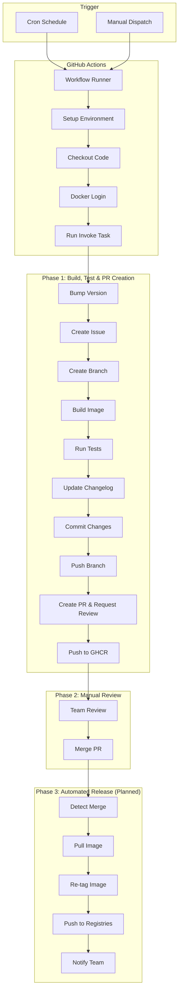

<!-- toc -->

- [Automated Docker Release System Architecture](#automated-docker-release-system-architecture)
  * [Summary](#summary)
  * [Architecture Overview](#architecture-overview)
    + [Core Components](#core-components)
    + [System Diagram](#system-diagram)
  * [Phase 1: Automated Build and Test (Implemented)](#phase-1-automated-build-and-test-implemented)
    + [Components](#components)
  * [Phase 2: Manual Review](#phase-2-manual-review)
  * [Phase 3: Automated Release (Planned)](#phase-3-automated-release-planned)
    + [Team-Based Assignment](#team-based-assignment)
    + [PR Labeling](#pr-labeling)
    + [Invoke Target `docker_release_dev_image_from_ghcr()`](#invoke-target-docker_release_dev_image_from_ghcr)
    + [Release Workflow (`.github/workflows/release_dev_image.yml`)](#release-workflow-githubworkflowsrelease_dev_imageyml)
  * [Resources](#resources)

<!-- tocstop -->

# Automated Docker Release System Architecture

## Summary

- This document explains the architecture and design decisions for the automated
  Docker dev image release system
- The system automatically builds, tests, and releases Docker images on a
  periodic schedule
- It consists of three phases:
  - **Phase 1**: Automated build and test (implemented)
  - **Phase 2**: Manual review - Team member reviews and merges the PR
  - **Phase 3**: Automated release to registries (planned)
- The system uses GitHub Actions, invoke tasks, and GitHub CLI helpers to
  orchestrate the entire workflow

## Architecture Overview

### Core Components

- **Invoke Task** (`docker_build_test_dev_image`): Core automation logic
  - Bumps version (minor by default)
  - Creates GitHub issue and branch
  - Builds local Docker image
  - Runs test suites (currently commented out)
  - Updates changelog
  - Commits and pushes changes
  - Creates PR (ready for review, with reviewer)
  - Tags and pushes `dev-{version}` to GHCR

- **GitHub Actions Workflow**
  (`.github/workflows/periodic_dev_image_release.yml`): Orchestrates the entire
  automated release process
  - Triggered weekly by cron schedule or manually
  - Calls `invoke docker_build_test_dev_image --assignee=<username>`

- **GitHub CLI Helpers**: New team management functions
  - `gh_get_org_team_names()`: Fetch organization teams
  - `gh_get_team_member_names()`: Fetch team members
  - Enhanced `gh_create_pr()`: Support for reviewer parameter

- **Version Management** (`bump_version()` in
  [`/helpers/hversion.py`](/helpers/hversion.py)): New semantic versioning
  function
  - Bumps version numbers (major/minor/patch)
  - Default: minor bump (e.g., 2.2.0 → 2.3.0)

### System Diagram



## Phase 1: Automated Build and Test (Implemented)

Triggered weekly by schedule, the workflow bumps the version, creates a GitHub
issue and branch, builds a Docker image, runs tests (currently commented out),
updates the changelog, commits and pushes changes, creates a PR with reviewer
assigned, and pushes the versioned image (`dev-{version}`) to GHCR for
verification before production release.

### Components

1. **GitHub Actions Workflow**
   (`.github/workflows/periodic_dev_image_release.yml`) - Weekly scheduled
   workflow with manual trigger and PR event support
2. **Invoke Target** (`docker_build_test_dev_image()` in
   [`/helpers/lib_tasks_docker_release.py`](/helpers/lib_tasks_docker_release.py)) -
   Orchestrates the complete build, test, and release pipeline
3. **GitHub CLI Helpers** (`helpers/lib_tasks_gh.py`) - New team management
   functions (`gh_get_org_team_names()`, `gh_get_team_member_names()`) and
   enhanced `gh_create_pr()` with reviewer support
4. **Version Management** (`bump_version()` in
   [`/helpers/hversion.py`](/helpers/hversion.py)) - Semantic version bumping
   (minor by default: 2.2.0 → 2.3.0)

## Phase 2: Manual Review

This is the critical human gate between automated build and automated release.
After Phase 1 completes, the assigned team member reviews the PR, validates the
changes (changelog, version, poetry.lock), optionally tests the image from GHCR,
and merges to master. The PR is automatically created as "Ready for review" with
a reviewer assigned. Quality gates: all status checks pass, properly formatted
changelog, no merge conflicts, valid sequential version number.

## Phase 3: Automated Release (Planned)

When the PR from Phase 1 is merged, an automated workflow detects the merge
event, pulls the verified image from GHCR, re-tags it for production registries
(AWS ECR, etc.), pushes to all target registries, and notifies the team via
Slack.

### Team-Based Assignment

**Configuration:**

- Add to `repo_config.yaml`:
  ```yaml
  release_team: "dev_system" # GitHub team slug
  ```

**Implementation plan:**

- Fetch team members using `gh_get_team_member_names()`
- Assign issue to all team members (multi-assignee)
- Request PR review from team (not individual)
- Format: `--reviewer team:org/team-slug`

**Benefits:**

- Distributes responsibility across team
- Any team member can review and merge
- Reduces single point of failure

### PR Labeling

**Label name:** `automated-release` (or `periodic-dev-release`)

**Purpose:**

- Identifies PRs created by automated workflow
- Used as trigger for release workflow
- Enables filtering and automation

**Implementation:**

```python
# In Gh_Create_Pr():
if is_automated_release:
    cmd += ' --label "automated-release"'
```

### Invoke Target `docker_release_dev_image_from_ghcr()`

Gets the version from changelog, pulls the versioned dev image from GHCR,
re-tags it for target registries, pushes to all configured registries, and
verifies the images.

### Release Workflow (`.github/workflows/release_dev_image.yml`)

**Trigger:**

- Event: `pull_request`
- Types: `[closed]`
- Condition: `if: github.event.pull_request.merged == true`
- Label filter: Check for `automated-release` label

**Steps:**

- Execute `invoke docker_release_dev_image_from_ghcr`
- Send Slack notification to team

## Resources

- [GitHub Actions documentation](https://docs.github.com/en/actions)
- [GitHub CLI manual](https://cli.github.com/manual/)
- [Semantic Versioning](https://semver.org/)
- [Docker multi-stage builds]
  ([https://docs.docker.com/build/building/multi-stage/](https://docs.docker.com/build/building/multi-stage/))
- [PyInvoke documentation](https://www.pyinvoke.org/)
