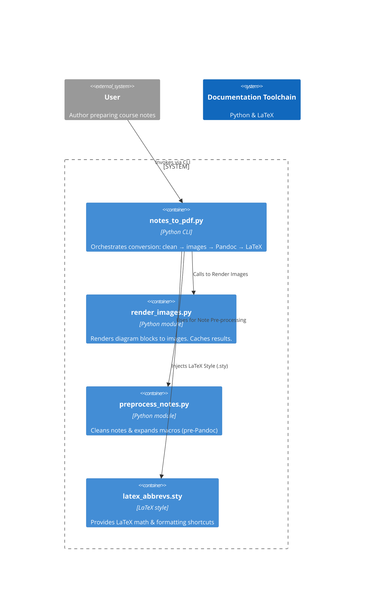

<!-- toc -->

- [`notes_to_pdf.py` - Flow Explanation](#notes_to_pdfpy---flow-explanation)
  * [Goal](#goal)
  * [Architecture diagram](#architecture-diagram)
  * [Steps](#steps)
  * [Dependencies](#dependencies)
    + [`preprocess_notes.py`](#preprocess_notespy)
    + [`render_images.py`](#render_imagespy)
    + [`latex_abbrevs.sty`](#latex_abbrevssty)

<!-- tocstop -->

# `notes_to_pdf.py` - Flow Explanation

This document walks through the **architecture** of the `notes_to_pdf.py`

## Goal

Convert a lightweight, annotation‑heavy **plain‑text notes file** (usually
`*.txt`) into a share‑ready document – **PDF**, **HTML**, or **Beamer slide
deck** – while:

* honouring rich Markdown features and custom shorthand,
* inlining auto‑generated diagrams (PlantUML, Mermaid, TikZ, Graphviz, LaTeX
  tables).

---

## Architecture diagram



---

## Steps

| Stage                           | Performed by          | Key idea                                                                                                                                                                                                                  |
| ------------------------------- | --------------------- | ------------------------------------------------------------------------------------------------------------------------------------------------------------------------------------------------------------------------- |
| **1 – Clean‑up & augmentation** | `preprocess_notes.py` | ‑ Normalises headers, expands arrow shorthand (`->` → `\rightarrow`), deals with comments, inserts Pandoc YAML front‑matter & optional navigation slides.                                                                 |
| **2 – Diagram extraction**      | `render_images.py`    | ‑ Scans code blocks (` ```plantuml``, etc.), renders via Docker containers, replaces the code with `\` include and comments out original block.<br>‑ Uses a SHA‑256 cache so unchanged diagrams are skipped. |
| **3 – Orchestration**           | `notes_to_pdf.py`     | ‑ Calls **1** & **2**, then Pandoc, then (for PDF) LaTeX. Flags control each sub‑action so you can skip, debug or re‑run steps individually.                                                                              |
| **4 – Document synthesis**      | **Pandoc + LaTeX**    | ‑ Pandoc converts Markdown → LaTeX (or HTML / Beamer). <br>‑ `latex_abbrevs.sty` is copied next to the generated `.tex` so vector/matrix macros (`\vv{}`, `\mat{}`), deep lists and colour helpers compile correctly.     |

---

## Dependencies

###   `preprocess_notes.py`

* **Input →** raw notes.
* **Output →** Pandoc‑ready Markdown.
* Handles banner frames, question formatting, colour commands (`\red{}` →
  `\textcolor{red}{...}`), TOC injection.

###   `render_images.py`

* Docker‑wrapper around _PlantUML_, _Mermaid CLI_, _TikZ → Ghostscript_,
  _Graphviz_.
* Produces deterministic filenames: `figs/<basename>.<index>.png` →
  diff‑friendly.

###   `latex_abbrevs.sty`

* House style for math: bold‑underlined vectors (`\vv{x}`), matrices, colour
  presets, 9‑level `enumitem` lists, symbol shorthands.
* Copied automatically; you rarely touch this unless you need new macros.

---