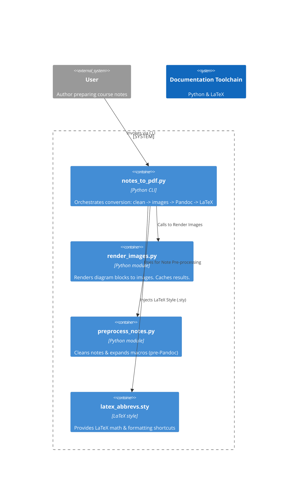

<!-- toc -->

- [`notes_to_pdf.py` - Flow Explanation](#notes_to_pdfpy---flow-explanation)
  * [Goal](#goal)
  * [Architecture diagram](#architecture-diagram)
  * [Steps](#steps)
  * [Dependencies](#dependencies)
    + [`preprocess_notes.py`](#preprocess_notespy)
    + [`render_images.py`](#render_imagespy)
    + [`latex_abbrevs.sty`](#latex_abbrevssty)

<!-- tocstop -->

# Flow Explanation

- This document walks through the architecture of the `notes_to_pdf.py` script

## Goal

- Convert a lightweight, annotated plain-text notes file (usually `*.txt`) into
  a share-ready document
  - Formats include PDF, HTML, or Beamer slide deck
- Ensure the following:
  - Honor rich Markdown features and custom shorthand
  - Inline auto-generated diagrams:
    - PlantUML
    - Mermaid
    - TikZ
    - Graphviz
    - LaTeX tables

## Architecture diagram

## Steps

1. **Clean-up & augmentation**
  - Performed by: `preprocess_notes.py`
  - Key ideas:
    - Normalizes headers
    - Expands arrow shorthand (`->` to `\rightarrow`)
    - Deals with comments
    - Inserts Pandoc YAML front-matter
    - Inserts optional navigation slides

2. **Diagram extraction**
  - Performed by: `render_images.py`
  - Key ideas:
    - Scans code blocks (e.g., ` plantuml)
    - Renders diagrams via Docker containers
    - Replaces the code with `` include
    - Comments out the original block
    - Uses a SHA-256 cache to skip unchanged diagrams

3. **Orchestration**
  - Performed by: `notes_to_pdf.py`
  - Key ideas:
    - Calls Stage 1 and Stage 2, then Pandoc, then (for PDF) LaTeX
    - Flags control each sub-action to allow skipping, debugging, or re-running
      steps individually

4. **Document synthesis**
  - Performed by: Pandoc + LaTeX
  - Key ideas:
    - Pandoc converts Markdown to LaTeX (or HTML / Beamer)
    - `latex_abbrevs.sty` is copied next to the generated `.tex` file
    - Ensures vector/matrix macros (`\vv{}`, `\mat{}`), deep lists, and color
      helpers compile correctly

## Dependencies

### `preprocess_notes.py`

- **Input: ** raw notes.
- **Output: ** Pandoc‑ready Markdown.
- Handles
  - formatting banner frames
  - question formatting
  - colour commands (`\red{}` -> `\textcolor{red}{...}`)
  - TOC injection

### `render_images.py`

- Docker‑wrapper around PlantUML, Mermaid CLI, TikZ, Graphviz to convert image
  description in a file, replacing the text with the picture
  `figs/<basename>.<index>.png`

### `latex_abbrevs.sty`

- Custom style for Latex documents, including:
  - Bold-underlined vectors (`\vv{x}`)
  - Matrices
  - Colour presets
  - 9-level `enumitem` lists
  - Symbol shorthands
- Copied automatically; you rarely touch this unless you need new macros.
