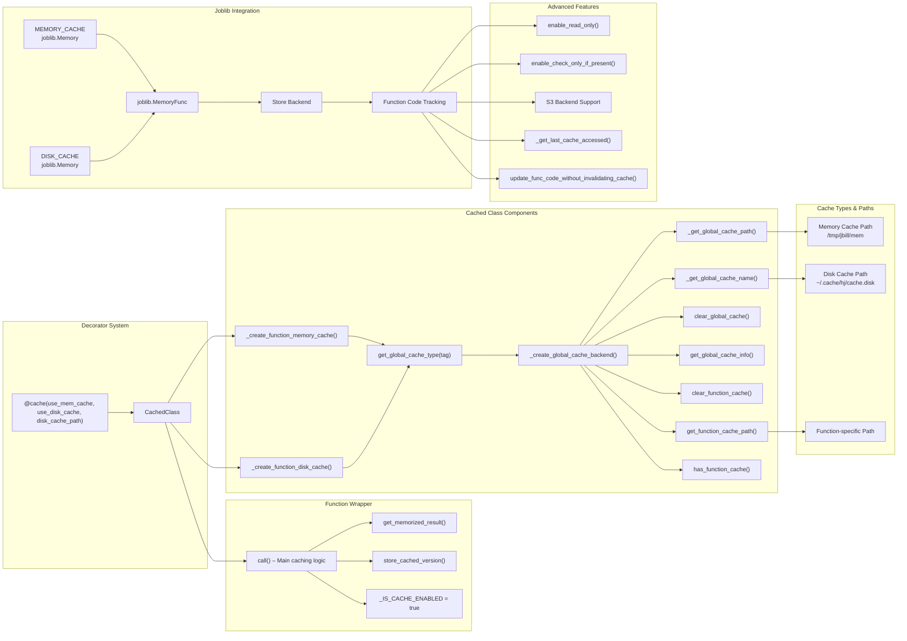

<!-- toc -->

- [Cache (Explanation)](#cache-explanation)
  * [Introduction / Motivation](#introduction--motivation)
  * [Core Concepts](#core-concepts)
  * [Design Rationale](#design-rationale)
  * [Trade-offs and Alternatives](#trade-offs-and-alternatives)
  * [Common Misunderstandings](#common-misunderstandings)
  * [Execution Flow Diagram](#execution-flow-diagram)

<!-- tocstop -->

# Cache (Explanation)

## Introduction / Motivation

In performance-sensitive systems, repeated evaluations of the same expensive
function can degrade efficiency. The `hcache` module addresses this through a
robust, dual-layer caching mechanism that reduces recomputation, enables
persistency across sessions, and improves responsiveness in both scripts and
interactive notebooks.

Unlike lightweight alternatives like `hcache_simple`, `hcache` is suited for
complex use cases where cache configuration, inspection, tagging, and sharing
are necessary. It supports memory- and disk-based layers, function-level
control, and tagged caches for environment separation (e.g., test vs prod).

## Core Concepts

- **Two-Level Cache**: `hcache` uses `joblib.Memory` for both in-memory (via
  tmpfs) and on-disk caching. First, the memory cache is checked; then disk;
  finally, the original function is executed.
- **Tagging**: Allows namespacing the cache (e.g., `unit_tests`, `dev`) to avoid
  collisions and keep environments isolated.
- **Global vs Function-Specific**:
  - _Global cache_: Default backend shared across functions in a Git repo.
  - _Function-specific cache_: Dedicated backend configured for individual
    functions or external persistence (e.g., S3).
- **Read-Only & Check-Only Modes**: Enforces deterministic behavior by raising
  exceptions when a cache miss occurs or prevents accessing cached values
  directly.

## Design Rationale

- **Use of `joblib.Memory`**: Supports both memory and disk caching, with better
  introspection and file system persistence than `functools.lru_cache`.
- **Global Caches**: Simplifies reuse across modules and functions. Tagging
  improves hygiene across test/production.
- **Function-Specific Caches**: Provides isolation for workflows that require
  sharing across machines or long-term retention.
- **Deep Copy on Retrieval**: Prevents accidental mutation of cached objects.

## Trade-offs and Alternatives

| Choice                                                              | Trade-off                                                      |
| ------------------------------------------------------------------- | -------------------------------------------------------------- |
| `joblib.Memory` over `lru_cache`                                    | More flexible and persistent, but slightly slower              |
| `copy.deepcopy()` on retrieval                                      | Ensures immutability but adds overhead                         |
| Global + function-specific backends                                 | Powerful but adds complexity for setup and cleanup             |
| Verbose cache control (`enable_read_only`, `check_only_if_present`) | Good for testing and debugging; may be overkill for casual use |

## Common Misunderstandings

- **Caches aren't auto-cleaned**: Old entries may accumulate; manual clearing is
  needed via `clear_global_cache()` or `clear_function_cache()`.
- **Not all functions are cache-safe**: Side effects, non-determinism (e.g.,
  random values or timestamps), and unhashable arguments can lead to incorrect
  or missing cache behavior.
- **Function code changes may invalidate cache**: `joblib` hashes the function
  code, so altering it causes cache misses unless overridden intentionally via
  `update_func_code_without_invalidating_cache()`.

## Execution Flow Diagram

