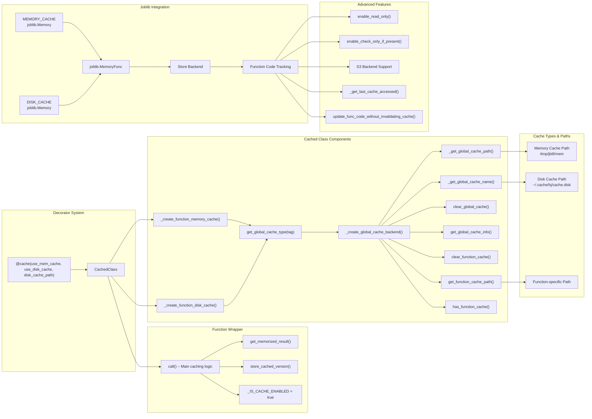

<!-- toc -->

- [Cache](#cache)
  * [Overview](#overview)
  * [Core Concepts](#core-concepts)
  * [How the `Cache` works](#how-the-cache-works)
    + [Disk level](#disk-level)
    + [Memory level](#memory-level)
  * [Global cache](#global-cache)
    + [Tagged global cache](#tagged-global-cache)
  * [Function-specific cache](#function-specific-cache)
  * [Design Rationale and Trade-offs](#design-rationale-and-trade-offs)
  * [Common Misunderstandings](#common-misunderstandings)
  * [Execution Flow Diagram](#execution-flow-diagram)

<!-- tocstop -->

# Cache

- This document explains the design and flow of a caching system implemented in
  [`/helpers/hcache.py`](/helpers/hcache.py).
- `hcache` provides a dual-layer cache (memory and disk) with tagging, global
  and function-specific isolation, and deterministic modes for complex projects,
  improving performance and persistency across sessions.

## Overview

In performance-sensitive systems, repeated evaluations of the same expensive
function can degrade efficiency (for example, calling an expensive function
twice with the same arguments returns instantly on the second call due to
caching). The `hcache` module addresses this through a robust, dual-layer
caching mechanism that reduces recomputation, enables persistency across
sessions, and improves responsiveness in both scripts and interactive notebooks.

Unlike lightweight alternatives like `hcache_simple`, `hcache` is suited for
complex use cases where cache configuration, inspection, tagging, and sharing
are necessary. It supports memory- and disk-based layers, function-level
control, and tagged caches for environment separation (e.g., test vs prod).

## Core Concepts

- **Source Code Tracking**: Detects changes in the wrapped function's bytecode
  pointer to invalidate stale cache entries.

- **Two-Level Cache**: Cascading lookup in memory first (via `joblib.Memory`
  over `tmpfs`), then on disk (via `joblib.Memory` at specified directory).

- **Lookup and Store Flow**: On function call, check memory → check disk →
  execute function if miss → store result in both layers.

- **Global Cache**: Default backend shared across all cached functions in a Git
  repo, located at `$GIT_ROOT/tmp.cache.{mem,disk}[.tag]`.

- **Tagged Global Cache**: Namespaces cache per `tag` parameter (e.g.,
  `unit_tests` vs default) to isolate environments.

- **Function-Specific Cache**: Customizable cache directories for individual
  functions managed via `.set_cache_directory()`, `.get_cache_directory()`, and
  `.clear_function_cache()`.

## How the `Cache` works

- `Cache` tracks changes in the source code of the wrapped function
  - For performance reasons, it checks the code only one time unless the pointer
    to the function is changed, e.g. in notebooks

- By default, it uses two levels of caching:
  - `Memory` level
  - `Disk` level

- When a call is made to the wrapped function:
  - Firstly the `Memory` level is being checked
  - If there's no hit in the `Memory`, the `Disk` level is checked
  - If there's no hit in `Disk` level, the wrapped function is called
  - The result is then stored in both `Disk` and `Memory` levels

- `Cache` is equipped with a `get_last_cache_accessed()` method to understand if
  the call hit the cache and on which level

### Disk level

- `Disk` level is implemented via
  [joblib.Memory](https://joblib.readthedocs.io/en/latest/generated/joblib.Memory.html)

### Memory level

- Initially, the idea was to use
  [functools.lru_cache](https://docs.python.org/3/library/functools.html#functools.lru_cache)
  for memory cache

- Pros:

  1. Standard library implementation
  2. Quietly fast in-memory implementation

- Cons:

  1. Only hashable arguments are supported
  2. No access to cache, it's not possible to check if an item is in cache or
     not
  3. It does not work properly in notebooks

- Because Cons outweighed Pros, we decided to implement `Memory` level as
  [joblib.Memory](https://joblib.readthedocs.io/en/latest/generated/joblib.Memory.html)
  over [`tmpfs`](https://uk.wikipedia.org/wiki/Tmpfs)
- In this way we reuse the same code for `Disk` level cache but over a RAM-based
  disk
  - This implementation overcomes the Cons listed above, although it is slightly
    slower than the pure `functools.lru_cache` approach

## Global cache

- By default, all cached functions save their cached values in the default
  global cache
- The cache is "global" in the sense that:
  - It is unique per-user and per Git client
  - It serves all the functions of a Git client
- The cached data stored in a folder `$GIT_ROOT/tmp.cache.{mem,disk}.[tag]`
- This global cache is being managed via global functions named
  `*_global_cache`, e.g., `set_global_cache()`

- TODO(gp): maybe a better name is
  - Global -> local_cache, client_cache
  - Function_specific -> global or shared

### Tagged global cache

- A global cache can be specific of different applications (e.g., for unit tests
  vs normal code)
  - It is controlled through the `tag` parameter
  - The global cache corresponds to `tag = None`

## Function-specific cache

- It is possible to create function-specific caches, e.g., to share the result
  of a function across clients and users
- In this case the client needs to set `disk_cache_directory` and / or
  `mem_cache_directory` parameters in the decorator or in the `Cached` class
  constructor
- If cache is set for the function, it can be managed with
  `.set_cache_directory()`, `.get_cache_directory()`, `.destroy_cache()` and
  `.clear_function_cache()` methods.

## Design Rationale and Trade-offs

Below is a summary of our key design choices and their trade-offs.

| Choice                                                              | Trade-off                                                      |
| ------------------------------------------------------------------- | -------------------------------------------------------------- |
| `joblib.Memory` over `lru_cache`                                    | More flexible and persistent, but slightly slower              |
| `copy.deepcopy()` on retrieval                                      | Ensures immutability but adds overhead                         |
| Global + function-specific backends                                 | Powerful but adds complexity for setup and cleanup             |
| Verbose cache control (`enable_read_only`, `check_only_if_present`) | Good for testing and debugging; may be overkill for casual use |

## Common Misunderstandings

- **Caches aren't auto-cleaned**: Old entries may accumulate; manual clearing is
  needed via `clear_global_cache()` or `clear_function_cache()`.
- **Not all functions are cache-safe**: Side effects, non-determinism (e.g.,
  random values or timestamps), and unhashable arguments can lead to incorrect
  or missing cache behavior.
- **Function code changes may invalidate cache**: `joblib` hashes the function
  code, so altering it causes cache misses unless overridden intentionally via
  `update_func_code_without_invalidating_cache()`.

## Execution Flow Diagram

**Figure:** Execution flow of the caching mechanism.

