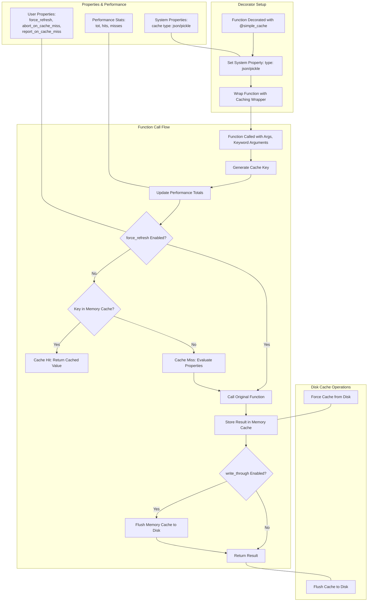

<!-- toc -->

- [Cache Simple](#cache-simple)
  * [Overview](#overview)
  * [Design Rationale and Trade-offs](#design-rationale-and-trade-offs)
  * [Memory Cache](#memory-cache)
  * [Disk Cache](#disk-cache)
  * [Cache Performance Monitoring](#cache-performance-monitoring)
  * [Cache Properties: User and System](#cache-properties-user-and-system)
  * [Decorator](#decorator)
  * [Common Misunderstandings](#common-misunderstandings)
  * [Execution Flow Diagram](#execution-flow-diagram)

<!-- tocstop -->

# Cache Simple

- This document explains the design and flow of a caching system implemented in
  [`/helpers/hcache_simple.py`](/helpers/hcache_simple.py).

- `hcache_simple` is a lightweight, decorator-based module designed for
  individual function caching, offering basic in‑memory and disk storage (via
  JSON or pickle) with manual management and simple performance tracking.
- In contrast to `hcache` which is a robust, global caching solution that
  supports tagged caches, automatic invalidation, and shared cache directories
  across multiple functions and users, using advanced tools
- Use `hcache` for robust, global caching in complex projects, and
  `hcache_simple` for lightweight, function-specific caching in simpler
  applications or notebooks.

## Overview

- The caching system supports two storage layers:
  - `Memory Cache`: A Python dictionary storing function results for rapid
    retrieval
  - `Disk Cache`: Persistent storage using either `JSON` or `pickle` files,
    ensuring that cached results persist across sessions

- Additionally, the system monitors cache performance and allows users to
  configure caching behavior via `user` and `system` properties

## Design Rationale and Trade-offs

- **Memory vs Disk**: Memory cache provides fast access but is volatile and
  non-persistent. Disk cache persists across sessions but comes with I/O
  overhead. The design allows combining both for flexibility.

- **Pickle vs JSON**: Pickle supports a wider range of Python-native types (like
  objects, sets, etc.), while JSON is more portable and human-readable but
  limited to basic types. The user can choose based on their use case.

- **Property Storage**: Properties are stored in separate `user` and `system`
  pickle files to separate runtime configuration (user behavior) from
  infrastructure-level settings (e.g., storage format).

- **Performance Tracking is Optional**: Monitoring is off by default to avoid
  runtime overhead and is opt-in via `enable_cache_perf`.

## Memory Cache

- Implementation:
  - A global dictionary `_CACHE` stores cached data
  - A different nested dictionary is used for each function name
  - The key is derived from the function's positional arguments (converted to
    string format), and the value is the function result

- Flow example:
  - When a decorated function is called with arguments `(3,)`, the system:
    - Checks if `_CACHE` contains the key `'{"args": [3], "kwargs": {}}'`
    - Returns the cached value if found `(cache hit)`
    - Otherwise, calls the function to compute the result, stores it in
      `_CACHE`, and then returns it

- Interface:
  - `get_cache(func_name)` returns the `in-memory cache` for a given function
  - `reset_mem_cache(func_name)` clears the `in-memory cache` for the function

## Disk Cache

- File naming convention:
  - Disk cache files are named using the pattern
    `cache.<func_name>.<extension>`, where the extension depends on the cache
    type:
    - `JSON`: `.json`
    - `Pickle`: `.pkl`

- Flow example:
  - When a cache is flushed to disk:
    - The system determines the file name by checking the system cache property
      `type` (set to `json` or `pickle`)
    - The memory cache (a small dictionary of keys and values) is written to the
      file using the appropriate format
    - On subsequent runs, if the memory cache is empty, the system will load
      cached results from disk

- Interface:
  - `flush_cache_to_disk` writes the current memory cache to the disk file
  - `force_cache_from_disk` loads the disk cache and updates the in-memory cache
  - `reset_disk_cache` is intended to remove disk cache files
    - It is marked with an `assert 0` to disable this functionality

## Cache Performance Monitoring

- This tracks how effective the caching is by recording total `calls`,
  `cache hits`, and `cache misses`

- Implementation:
  - A global dictionary `_CACHE_PERF` stores performance data per function
  - When enabled (via `enable_cache_perf`), it keeps counters:
    - `tot`: Total number of calls
    - `hits`: Number of times the cache returned a value
    - `misses`: Number of times the function had to be called due to a cache
      miss

- Flow example:
  - For a function call:
    - The system increments `tot`
    - If the `value` exists in the cache, `hits` is incremented
    - Otherwise, `miss` is incremented and the function is executed
    - The stats can then be printed with `get_cache_perf_stats` which returns a
      summary string

- Interface:
  - `enable_cache_perf`: to enable the cache performance
  - `disable_cache_perf`: to disable the cache performance
  - `get_cache_perf_stats` prints performance metrics

## Cache Properties: User and System

- There are two types of properties:
  - `User Properties`: Configurable by the user to alter caching behavior. For
    example:
    - `abort_on_cache_miss`: Whether to raise an error if a cache miss occurs
    - `report_on_cache_miss`: Whether to return a special value ("_cache_miss_")
      on a cache miss
    - `force_refresh`: Whether to bypass the cache and refresh the value
  - `System Properties`: These include internal settings such as the cache type
    (e.g., "json" or "pickle")

- Persistent storage:
  - Cache properties are stored on disk as pickle files:
    - User properties in `cache_property.user.pkl`
    - System properties in `cache_property.system.pkl`

- Flow example:
  - When a function is decorated, the system sets its system property (e.g., the
    cache type) using `set_cache_property(system, func_name, type, cache_type)`
  - Later, when retrieving a cached value, it checks user properties (like
    `force_refresh`) to decide whether to use the cached value or to recompute
    the result

- Interface:
  - `set_cache_property(type, func_name, property_name, value)`: set a property
  - `get_cache_property(type, func_name, property_name)`: get the value of a
    property
  - `reset_cache_property(type)`: reset Properties

## Decorator

- Purpose:
  - The decorator simplifies caching by wrapping any function so that its
    results are automatically stored and retrieved from cache

- Decorator flow:
  - Initialization:
    - When the function is decorated with, for example,
      `@simple_cache(cache_type="json")`, the decorator sets the system property
      for the cache type
  - Wrapper execution:
    - Key generation: The wrapper generates a `cache key` from both arguments
      and keyword arguments.
      - Exclude Keys: The wrapper excludes certain keys from the cache key by
        using the `exclude_keys` argument in the decorator. These keys are
        omitted from `kwargs` when forming the cache key.
    - Cache lookup:
      - If the key exists in the memory cache (and no force refresh is
        requested), it returns the cached value
      - If the key is missing (or a force refresh is requested), it calls the
        original function
    - Performance stats:
      - The system updates performance statistics for every call (incrementing
        total, hits, or misses accordingly)
    - Cache update:
      - After computing the value, the result is stored in the memory cache (and
        optionally written through to disk if `write_through` is set)

- Flow Example:
  - Suppose we have a function defined as follows:
    ```python
    @simple_cache(cache_type="json")
        def multiply_by_two(x):
        return x * 2
    ```
  - First call:
    - When you call `multiply_by_two(4)`, the cache key is generated (in this
      case, `{"args": [4], "kwargs": {}}` as a string)
    - Since the key is not in the cache, the function is executed, returning
      `8`, which is then stored in the `memory cache`.
  - Subsequent call:
    - Calling `multiply_by_two(4)` again finds the key in the cache and
      immediately returns `8` without executing the function again.
  - Force Refresh:
    - If the user property `force_refresh` is enabled for this function, even if
      the key exists in the cache, the function is executed again, and the cache
      is updated.

- Configuration examples:
  - Set Force Refresh:
    - With this property set, each call to `multiply_by_two(4)` will recompute
      the result and update the cache.
  - Enable `write_through`:
    - When using `@simple_cache(write_through=True)`, the decorator will flush
      the memory cache to disk immediately after updating.
  - Exclude certain keys from cache key:
    - Suppose we have a function that uses an OpenAI client to fetch
      completions, but the actual output depends only on the prompt. The
      `client` object should be excluded from the cache key because it varies
      per session:
      ```python
      @simple_cache(exclude_keys=["client"])
      def get_summary(prompt: str, client: Any):
          return client.complete(prompt=prompt)
      ```
    - Without `exclude_keys=["client"]`, each call with a different `client`
      instance (even for the same prompt) would result in a cache miss. This
      exclusion ensures the cache key is based only on the `prompt`, improving
      hit rates.

## Common Misunderstandings

- **Cached Function Must Be Deterministic**: The cache assumes the same inputs
  always produce the same outputs. Functions with side effects or
  non-deterministic behavior (e.g., randomness, time-based logic) may yield
  inconsistent results.

- **`force_refresh` Must Be Reset**: Once `force_refresh` is set, every call
  recomputes the result. Users must manually unset this flag if they want to
  resume normal caching.

- **Disk Cache Is Persistent**: Cache files on disk are not automatically
  cleaned up or rotated. Old or unused caches may accumulate over time.

- **write_through Only Applies to Disk**: Setting `write_through=True` will
  update the disk immediately after each cache write, which is useful for
  persistency but may impact performance.

## Execution Flow Diagram


