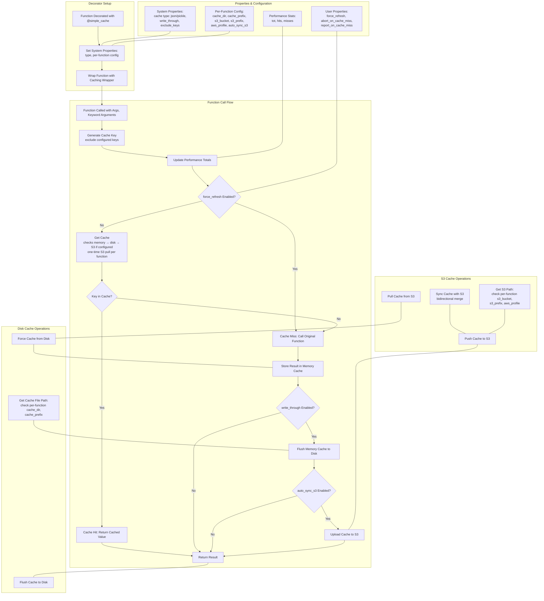

<!-- toc -->

- [Cache Simple](#cache-simple)
  * [Overview](#overview)
  * [Design Rationale and Trade-offs](#design-rationale-and-trade-offs)
  * [Memory Cache](#memory-cache)
  * [Disk Cache](#disk-cache)
  * [S3 Cache](#s3-cache)
  * [Per-Function Configuration](#per-function-configuration)
  * [Cache Performance Monitoring](#cache-performance-monitoring)
  * [Cache Inspection and Statistics](#cache-inspection-and-statistics)
  * [Cache Properties: User and System](#cache-properties-user-and-system)
  * [Decorator](#decorator)
  * [Mock Cache](#mock-cache)
  * [Usage Examples](#usage-examples)
  * [Common Misunderstandings](#common-misunderstandings)
  * [Execution Flow Diagram](#execution-flow-diagram)

<!-- tocstop -->

# Cache Simple

- This document explains the design and flow of the caching system implemented in
  [`/helpers/hcache_simple.py`](/helpers/hcache_simple.py).

- `hcache_simple` is a lightweight, decorator-based module designed for
  individual function caching, offering basic in‑memory and disk storage (via
  JSON or pickle) with manual management and performance tracking.
- In contrast to `hcache` which is a robust, global caching solution that
  supports tagged caches, automatic invalidation, and shared cache directories
  across multiple functions and users, using advanced tools

## Overview

- The caching system supports three storage layers:
  - `Memory Cache`: A Python dictionary storing function results for rapid
    retrieval
  - `Disk Cache`: Persistent storage using either `JSON` or `pickle` files,
    ensuring that cached results persist across sessions
  - `S3 Cache`: Cloud storage on Amazon S3 for sharing cache across machines and
    team members

- Additionally, the system monitors cache performance and allows users to
  configure caching behavior via `user` and `system` properties

- Cache files are stored in configurable locations:
  - Global configuration (applies to all functions by default):
    - Cache directory: Default is git root, configurable via
      `set_cache_dir(cache_dir)`
    - Cache file prefix: Default is `"tmp.cache_simple"`, configurable via
      `set_cache_file_prefix(prefix)`
    - S3 bucket: Configured via `set_s3_bucket(bucket)`
    - S3 prefix: Configured via `set_s3_prefix(prefix)`
    - AWS profile: Configured via `set_aws_profile(profile)`
  - Per-function configuration (overrides global settings):
    - Each function can specify its own cache directory, prefix, and S3 settings
      via decorator parameters
    - Enables organizing cache by project, team, or security requirements

## Design Rationale and Trade-offs

- **Memory vs Disk**: Memory cache provides fast access but is volatile and
  non-persistent. Disk cache persists across sessions but comes with I/O
  overhead. The design allows combining both for flexibility.

- **Pickle vs JSON**: Pickle supports a wider range of Python-native types (like
  objects, sets, etc.), while JSON is more portable and human-readable but
  limited to basic types. The user can choose based on their use case.

- **Property Storage**: Properties are stored in a single pickle file
  (`tmp.cache.property.pkl`) that contains both user and system properties for
  all cached functions.

- **Performance Tracking is Optional**: Monitoring is off by default to avoid
  runtime overhead and is opt-in via `enable_cache_perf`.

## Memory Cache

- Implementation:
  - A global dictionary `_CACHE` stores cached data
  - A different nested dictionary is used for each function name
  - The key is derived from the function's positional arguments (converted to
    string format), and the value is the function result

- Flow example:
  - When a decorated function is called with arguments `(3,)`, the system:
    - Checks if `_CACHE` contains the key `'{"args": [3], "kwargs": {}}'`
    - Returns the cached value if found `(cache hit)`
    - Otherwise, calls the function to compute the result, stores it in
      `_CACHE`, and then returns it

- Interface:
  - `get_cache(func_name)` returns the cache for a given function
    - Implements three-tier lookup: Memory → Disk → S3 (if configured)
    - If cache not in memory/disk and S3 is configured, automatically pulls from
      S3
    - Returns complete cache after checking all storage layers
  - `get_mem_cache(func_name)` returns only the in-memory cache without loading
    from disk or S3
  - `reset_mem_cache(func_name)` clears the in-memory cache for the function

## Disk Cache

- File naming convention:
  - Disk cache files are named using the pattern
    `<cache_prefix>.<func_name>.<extension>`, where:
    - `<cache_prefix>`: Default is `"tmp.cache_simple"`, configurable globally
      via `set_cache_file_prefix()` or per-function via decorator parameter
    - `<func_name>`: The name of the cached function
    - `<extension>`: Depends on cache type (`.json` or `.pkl`)
  - Examples:
    - Default: `tmp.cache_simple.expensive_function.json`
    - Customized: `my_cache.expensive_function.json`
  - Cache files are stored in the cache directory (configurable globally or
    per-function; git root by default)

- Flow example:
  - When a cache is flushed to disk:
    - The system determines the file name by checking the system cache property
      file for type (`json` or `pickle`), directory and prefix
    - The memory cache (a small dictionary of keys and values) is written to the
      file using the appropriate format
    - On subsequent runs, if the memory cache is empty, the system will load
      cached results from disk

- Interface:
  - `flush_cache_to_disk(func_name)` merges memory cache with disk cache (memory
    takes precedence) and writes to disk, then updates memory with merged result
    - If `func_name` is empty, flushes all functions with memory cache
  - `force_cache_from_disk(func_name)` loads the disk cache and updates the
    in-memory cache
    - If `func_name` is empty, loads all disk caches into memory
  - `reset_disk_cache(func_name, interactive)` removes disk cache files
    - If `func_name` is empty, resets all disk cache files
    - If `interactive=True`, prompts for confirmation before resetting
  - `reset_mem_cache(func_name)` clears the in-memory cache
    - If `func_name` is empty, resets all in-memory caches
  - `reset_cache(func_name, interactive)` resets both memory and disk cache
    - Combines `reset_mem_cache` and `reset_disk_cache`

## S3 Cache

- S3 serves as the third storage layer in the caching system:
  - Memory Cache (fastest, volatile) → Disk Cache (persistent, local) →
    S3 Cache (persistent, shared)
  - When `get_cache()` is called, it checks all three layers automatically
  - S3 enables sharing cache across multiple machines and team members

- Cache lookup with S3:
  - When a cached function is called, the system checks:
    1. Memory cache first (fastest)
    2. If not in memory, checks disk cache
    3. If not on disk and S3 is configured, automatically pulls from S3
       (one-time attempt per function per session)
    4. Cache miss is only reported if key is not found in ANY layer

- Global S3 configuration:
  - `set_s3_bucket(bucket)` - set S3 bucket for cache storage
    - Example: `set_s3_bucket("s3://my-cache-bucket")`
  - `set_s3_prefix(prefix)` - set S3 prefix path for cache files
    - Example: `set_s3_prefix("cache/project1")`
  - `set_aws_profile(profile)` - set AWS profile for S3 access
    - Default is `"ck"`
    - Example: `set_aws_profile("my-aws-profile")`

- S3 operations (manual control):
  - `push_cache_to_s3(func_name)` - upload local cache to S3
    - If `func_name` is empty, pushes all cached functions (including those with
      custom cache locations)
    - First flushes memory cache to disk, then uploads to S3
  - `pull_cache_from_s3(func_name)` - manually download cache from S3 to local
    - If `func_name` is empty, discovers and pulls all cached functions:
      - On local disk (in both global and custom cache directories, as defined in
        the `_CACHE_PROPERTY` file)
      - In global S3 bucket (including those that were cached on other machines)
    - IMPORTANT LIMITATION: Functions that were cached with custom `s3_bucket`
      on another machine require extra care 
      - The custom bucket location is stored only in `_CACHE_PROPERTY` on the
        originating machine
      - Without that property file, the pull will not be able to find them
      - Workaround options:
        - Share/sync `_CACHE_PROPERTY` file across team (e.g., commit to git)
        - Use global S3 bucket for cache that needs to be shared across machines
        - Manually set property before pulling:
          `set_cache_property("func", "s3_bucket", "s3://custom-bucket")`
    - After download, loads cache into memory
  - `sync_cache_with_s3(func_name)` - bidirectional merge between local and S3
    - Downloads S3 cache, merges with local (local takes precedence), uploads
      result back to S3
    - If `func_name` is empty, discovers all cached functions (using the same
      discovery logic as `pull_cache_from_s3("")`, see above)
    - Ensures local-only and S3-only functions are both discovered and synced

- Per-function S3 configuration:
  - Each function can have its own S3 settings via decorator parameters
  - Allows different functions to use different S3 buckets, prefixes, or AWS
    profiles
  - Per-function settings take precedence over global settings

- Auto-sync feature:
  - When `auto_sync_s3=True` in decorator, cache is automatically uploaded to S3
    after each update
  - Only works when `write_through=True` (default)

## Per-Function Configuration

- Each cached function can have its own cache configuration independent of global
  settings
- Per-function settings override global defaults
- Available per-function settings:
  - `cache_dir` - custom directory for this function's cache files
  - `cache_prefix` - custom prefix for this function's cache file names
  - `s3_bucket` - custom S3 bucket for this function
  - `s3_prefix` - custom S3 prefix for this function
  - `aws_profile` - custom AWS profile for this function
  - `auto_sync_s3` - enable automatic S3 sync after cache updates

- Benefits:
  - Organize cache files by project, team, or purpose
  - Use different S3 buckets for different security levels
  - Isolate expensive functions to separate storage
  - Share specific function caches while keeping others local

## Cache Performance Monitoring

- This tracks how effective the caching is by recording total `calls`,
  `cache hits`, and `cache misses`

- Implementation:
  - A global dictionary `_CACHE_PERF` stores performance data per function
  - When enabled (via `enable_cache_perf`), it keeps counters:
    - `tot`: Total number of calls
    - `hits`: Number of times the cache returned a value
    - `misses`: Number of times the function had to be called due to a cache
      miss

- Flow example:
  - For a function call:
    - The system increments `tot`
    - If the `value` exists in the cache, `hits` is incremented
    - Otherwise, `miss` is incremented and the function is executed
    - The stats can then be printed with `get_cache_perf_stats` which returns a
      summary string

- Interface:
  - `enable_cache_perf(func_name)`: enable cache performance tracking for a
    specific function
  - `disable_cache_perf(func_name)`: disable cache performance tracking
    - If `func_name` is empty, disables for all cached functions
  - `reset_cache_perf(func_name)`: reset performance counters to zero
    - If `func_name` is empty, resets all functions
  - `get_cache_perf(func_name)`: returns the performance dict (tot, hits,
    misses) or None
  - `get_cache_perf_stats(func_name)`: returns a formatted string with
    performance metrics including hit rate

## Cache Inspection and Statistics

- The system provides several utility functions for inspecting and debugging the
  cache state

- `cache_stats_to_str(func_name)`: Returns a pandas DataFrame showing cache
  statistics
  - If `func_name` is empty, returns stats for all locally cached functions
    (mem + disk)
  - Shows both memory and disk cache sizes for each function
  - Example output:
    ```
                 memory  disk
    find_email        -  1044
    verify_email      -  2322
    ```

- `get_cached_func_names(type_)`: Retrieves list of cached function names
  - `type_='mem'`: Returns only functions with memory cache
  - `type_='disk'`: Returns only functions with disk cache files
    - Discovers caches in both global and custom locations
    - Searches global cache directory for ALL cache files (any prefix)
    - Searches custom cache directories from `_CACHE_PROPERTY`
  - `type_='s3'`: Returns only functions in S3
    - Discovers caches in both global and custom S3 buckets
    - Searches global S3 bucket for ALL cache files (any prefix)
    - Searches custom S3 buckets from `_CACHE_PROPERTY`
  - `type_='local'`: Returns all functions with local cache (mem + disk)
  - `type_='all'`: Returns all cached functions (mem + disk + s3)

- `cache_property_to_str(func_name)`: Converts cache properties to string
  - If `func_name` is empty, returns properties for all cached functions
  - Shows all configured properties (both user and system) for each function

- `get_mem_cache(func_name)`: Directly retrieves the memory cache dictionary for
  a function

## Cache Properties: User and System

- There are two types of properties:
  - `User Properties`: Configurable by the user at runtime to alter caching
    behavior. These are typically temporary controls that can be reset. For
    example:
    - `abort_on_cache_miss`: Whether to raise an error if a cache miss occurs
    - `report_on_cache_miss`: Whether to return a special value ("_cache_miss_")
      on a cache miss
    - `force_refresh`: Whether to bypass the cache and refresh the value
  - `System Properties`: Internal settings configured via decorator parameters
    that define how the cache operates. These are preserved when
    `reset_cache_property()` is called. System properties include:
    - `type`: Cache storage format ("json" or "pickle")
    - `write_through`: Whether to flush cache to disk after each update
      - Can be modified at runtime via `set_cache_property()`
      - Changes take effect immediately on next cache update
    - `exclude_keys`: List of parameter names to exclude from cache key
      - Can be modified at runtime via `set_cache_property()`
      - Changes take effect immediately on next function call
    - `cache_dir`: Per-function cache directory (overrides global)
    - `cache_prefix`: Per-function cache file prefix (overrides global)
    - `s3_bucket`: Per-function S3 bucket (overrides global)
    - `s3_prefix`: Per-function S3 prefix path (overrides global)
    - `aws_profile`: Per-function AWS profile (overrides global)
    - `auto_sync_s3`: Whether to automatically sync cache to S3 after updates

- Persistent storage:
  - All cache properties are stored on disk in a single pickle file:
    `tmp.cache.property.pkl`
  - This file contains a nested dictionary: `func_name -> property_name ->
    value`

- Flow example:
  - When a function is decorated, the system sets its system property (e.g., the
    cache type) using `set_cache_property(func_name, "type", cache_type)`
  - Later, when retrieving a cached value, it checks user properties (like
    `force_refresh`) to decide whether to use the cached value or to recompute
    the result

- Interface:
  - `set_cache_property(func_name, property_name, value)`: set a property for a
    function and persist to disk
  - `get_cache_property(func_name, property_name)`: get the value of a property
    for a function
  - `reset_cache_property()`: reset user properties for all functions (preserves
    system properties including `type`, `write_through`, `exclude_keys`, and all
    per-function configuration settings like `cache_dir`, `s3_bucket`, etc.)
  - `cache_property_to_str(func_name)`: convert cache properties to string
    representation
  - `get_cache_property_file()`: get the path to the cache property file
    (`tmp.cache.property.pkl`)

## Decorator

- Purpose:
  - The decorator simplifies caching by wrapping any function so that its
    results are automatically stored and retrieved from cache

- Decorator parameters:

  - Basic cache parameters:
    - `cache_type`: The type of cache storage to use (`"json"` or `"pickle"`)
      - Default: `"json"`
      - JSON is human-readable but limited to basic types
      - Pickle supports any Python object but is not human-readable
    - `write_through`: If True, flush cache to disk immediately after each
      update
      - Default: `True`
      - Ensures persistence across sessions but may impact performance for
        frequently called functions
      - Set to `False` for better performance when persistence is not critical
      - **Runtime configurable**: Can be modified via
        `set_cache_property(func_name, "write_through", value)` and changes
        take effect on the next cache update
    - `exclude_keys`: List of keyword argument names to exclude from cache key
      generation
      - Default: `None` (empty list)
      - Useful for excluding session-specific or non-deterministic parameters
        like API clients, database connections, or logging objects
      - These parameters are still passed to the function but don't affect cache
        key matching
      - **Runtime configurable**: Can be modified via
        `set_cache_property(func_name, "exclude_keys", value)` and changes take
        effect on the next function call

  - Per-function cache location parameters (override global settings):
    - `cache_dir`: Custom directory for this function's cache files
      - Default: `None` (uses global cache directory)
      - Example: `"/tmp/project1_cache"`
    - `cache_prefix`: Custom prefix for this function's cache file names
      - Default: `None` (uses global prefix)
      - Example: `"my_project_cache"`

  - Per-function S3 parameters (override global settings):
    - `s3_bucket`: S3 bucket for this function's cache
      - Default: `None` (uses global S3 bucket)
      - Example: `"s3://my-project-cache"`
    - `s3_prefix`: S3 prefix path for this function's cache
      - Default: `None` (uses global S3 prefix)
      - Example: `"cache/llm_calls"`
    - `aws_profile`: AWS profile for S3 access
      - Default: `None` (uses global AWS profile)
      - Example: `"my-aws-profile"`
    - `auto_sync_s3`: If True, automatically sync to S3 after each cache update
      - Default: `False`
      - Requires `write_through=True` to work
      - Useful for immediately sharing results across team or machines

- Flow:
  - Initialization:
    - When the function is decorated with, for example,
      `@simple_cache(cache_type="json")`, the decorator sets the system property
      for the cache type
  - Wrapper execution:
    - Key generation: The wrapper generates a `cache key` from both arguments
      and keyword arguments.
      - Exclude Keys: The wrapper excludes certain keys from the cache key by
        using the `exclude_keys` argument in the decorator. These keys are
        omitted from `kwargs` when forming the cache key.
    - Cache lookup:
      - If the key exists in the memory cache (and no force refresh is
        requested), it returns the cached value
      - If the key is missing (or a force refresh is requested), it calls the
        original function
    - Performance stats:
      - The system updates performance statistics for every call (incrementing
        total, hits, or misses accordingly)
    - Cache update:
      - After computing the value, the result is stored in the memory cache (and
        optionally written through to disk if `write_through` is set)

- Runtime parameters:
  - Decorated functions accept special keyword arguments to control caching
    behavior at call time:
    - `force_refresh=True`: Bypass cache and recompute the result even if it
      exists in cache
    - `abort_on_cache_miss=True`: Raise a `ValueError` if cache miss occurs
      instead of computing the value
    - `report_on_cache_miss=True`: Return the sentinel string `"_cache_miss_"`
      instead of computing on cache miss
  - Alternative: Use `cache_mode` parameter with predefined modes:
    - `cache_mode="REFRESH_CACHE"`: Force cache refresh (equivalent to
      `force_refresh=True`)
    - `cache_mode="HIT_CACHE_OR_ABORT"`: Abort on cache miss (equivalent to
      `abort_on_cache_miss=True`)
    - `cache_mode="DISABLE_CACHE"`: Completely bypass caching for this call
      only, compute fresh result without reading from or writing to cache

- Flow Example:
  - Suppose we have a function defined as follows:
    ```python
    @simple_cache(cache_type="json")
        def multiply_by_two(x):
        return x * 2
    ```
  - First call:
    - When you call `multiply_by_two(4)`, the cache key is generated (in this
      case, `{"args": [4], "kwargs": {}}` as a string)
    - Since the key is not in the cache, the function is executed, returning
      `8`, which is then stored in the `memory cache`.
  - Subsequent call:
    - Calling `multiply_by_two(4)` again finds the key in the cache and
      immediately returns `8` without executing the function again.
  - Force Refresh:
    - If the user property `force_refresh` is enabled for this function, even if
      the key exists in the cache, the function is executed again, and the cache
      is updated.

- Configuration examples:
  - Set Force Refresh:
    - With this property set, each call to `multiply_by_two(4)` will recompute
      the result and update the cache.
  - Using runtime parameters:
    - Force a single cache refresh without changing global properties:
      ```python
      result = multiply_by_two(4, force_refresh=True)
      ```
    - Use cache_mode to control behavior:
      ```python
      # Disable cache for this specific call
      result = multiply_by_two(4, cache_mode="DISABLE_CACHE")
      # Ensure cache is hit or abort
      result = multiply_by_two(4, cache_mode="HIT_CACHE_OR_ABORT")
      ```
  - Enable `write_through`:
    - When using `@simple_cache(write_through=True)`, the decorator will flush
      the memory cache to disk immediately after updating.
  - Exclude certain keys from cache key:
    - Suppose we have a function that uses an OpenAI client to fetch
      completions, but the actual output depends only on the prompt. The
      `client` object should be excluded from the cache key because it varies
      per session:
      ```python
      @simple_cache(exclude_keys=["client"])
      def get_summary(prompt: str, client: Any):
          return client.complete(prompt=prompt)
      ```
    - Without `exclude_keys=["client"]`, each call with a different `client`
      instance (even for the same prompt) would result in a cache miss. This
      exclusion ensures the cache key is based only on the `prompt`, improving
      hit rates.

## Mock Cache

- Purpose:
  - The `mock_cache` function allows testing of cached functions without
    executing expensive operations (e.g., API calls, database queries, LLM
    calls)
  - Useful for unit testing when you want to simulate cached values without
    actually calling the real function

- Function signature:
  ```python
  def mock_cache_from_args_kwargs(func_name: str, args: Any, kwargs: Any, value: Any) -> None
  ```

- Parameters:
  - `func_name`: The name of the cached function to mock
  - `args`: The positional arguments for the function (as a tuple)
  - `kwargs`: The keyword arguments for the function (as a dict)
  - `value`: The value to store in the cache (the return value to mock)

- Safety requirement:
  - `mock_cache_from_args_kwargs` requires using a temporary cache directory (not the main cache
    directory) to prevent accidentally polluting the production cache
  - Use `set_cache_dir()` to configure a test-specific cache directory before
    calling `mock_cache_from_args_kwargs`

- Typical workflow:
  1. Set up a temporary cache directory (e.g., using `self.get_scratch_space()`
     in tests)
  2. (Optional) Warm up the cache by calling the function once to capture the
     real cached value
  3. (Optional) Read the cached value for later reuse
  4. Reset the cache to clear all cached data
  5. Use `mock_cache_from_args_kwargs()` to insert a known value for specific arguments
  6. Call the cached function with `abort_on_cache_miss=True` to verify the
     cache is hit

- Flow example:
  - Testing an expensive LLM call:
    ```python
    import helpers.hcache_simple as hcacsimp

    @hcacsimp.simple_cache(cache_type="json")
    def call_llm(prompt: str) -> str:
        # Expensive LLM API call.
        return expensive_llm_api(prompt)

    # In test:
    def test_llm_function():
        # Set up temporary cache directory.
        temp_dir = "/tmp/test_cache"
        hcacsimp.set_cache_dir(temp_dir)

        # Mock the cache with a known response.
        test_prompt = "Hello, world!"
        mock_response = "Mocked LLM response"
        hcacsimp.mock_cache_from_args_kwargs("call_llm", (test_prompt,), {}, mock_response)

        # Verify cache hit (function not actually called).
        result = call_llm(test_prompt, abort_on_cache_miss=True)
        assert result == mock_response
    ```

- Use cases:
  - Testing functions that call expensive external APIs (OpenAI, AWS, etc.)
  - Testing functions with non-deterministic behavior by providing fixed values
  - Creating reproducible test scenarios without network dependencies
  - Speeding up test suites by avoiding actual expensive computations

## Usage Examples

This section demonstrates common caching scenarios and how to achieve different
outcomes using `hcache_simple`.
- See also: [`/helpers/notebooks/hcache_simple.tutorial.ipynb`](/helpers/notebooks/hcache_simple.tutorial.ipynb)


### Basic Local Caching

- Scenario: Cache function results locally with JSON for human readability
- Use case: Simple caching for debugging, development, or inspecting cached
  values

```python
import helpers.hcache_simple as hcacsimp

@hcacsimp.simple_cache(cache_type="json")
def expensive_computation(n: int) -> int:
    # Expensive computation.
    return sum(range(n))

# First call - cache miss, computes result.
# Caching to `tmp.cache_simple.expensive_computation.json`.
result = expensive_computation(1000000)

# Second call - cache hit, returns instantly.
result = expensive_computation(1000000)
```

### Binary Data Caching

- Scenario: Cache complex Python objects (DataFrames, models, etc.)
- Use case: Caching ML models, large datasets, or objects that can't be
  JSON-serialized

```python
import pandas as pd
import helpers.hcache_simple as hcacsimp

@hcacsimp.simple_cache(cache_type="pickle")
def load_large_dataset(file_path: str) -> pd.DataFrame:
    # Load and process large dataset.
    df = pd.read_csv(file_path)
    # Complex transformations.
    return df

# Caching to `tmp.cache_simple.load_large_dataset.pkl`.
df = load_large_dataset("data.csv")
```

### Team Cache Sharing via S3

- Scenario: Share cache across team members or CI/CD pipelines
- Use case: Expensive LLM calls, data processing results that should be
  reused

```python
import helpers.hcache_simple as hcacsimp

# Configure global S3 settings.
hcacsimp.set_s3_bucket("s3://team-cache-bucket")
hcacsimp.set_s3_prefix("cache/project1")
hcacsimp.set_aws_profile("team-aws-profile")

@hcacsimp.simple_cache(cache_type="json", auto_sync_s3=True)
def call_expensive_llm(prompt: str, model: str) -> str:
    # Expensive LLM API call.
    response = llm_api.complete(prompt, model)
    return response

# First call on any machine - computes and uploads to S3.
result = call_expensive_llm("Summarize this document", "gpt-4")

# On another machine - cache automatically pulls from S3 on first call.
result = call_expensive_llm("Summarize this document", "gpt-4")
```

- `auto_sync_s3=True` automatically uploads after each cache update
- On new machines, first cache miss automatically pulls from S3 (no manual pull
  needed!)

### Per-Function Custom Cache Location

- Scenario: Different functions need different cache locations
- Use case: Organize cache by project, isolate sensitive data, or manage
  storage quotas

```python
import helpers.hcache_simple as hcacsimp

@hcacsimp.simple_cache(
    cache_dir="/project1/cache",
    cache_prefix="proj1_cache"
)
def project1_function(x: int) -> int:
    return x * 2

@hcacsimp.simple_cache(
    cache_dir="/project2/cache",
    cache_prefix="proj2_cache"
)
def project2_function(x: int) -> int:
    return x * 3

# Caching to `/project1/cache/proj1_cache.project1_function.json`.
project1_function(10)
# Caching to `/project2/cache/proj2_cache.project2_function.json`.
project2_function(10)
```

### Per-Function S3 Configuration

- Scenario: Different functions need different S3 buckets or permissions
- Use case: Separate public/private data, different AWS accounts, or
  security requirements

```python
import helpers.hcache_simple as hcacsimp

@hcacsimp.simple_cache(
    s3_bucket="s3://public-cache-bucket",
    s3_prefix="public/research",
    aws_profile="public-profile",
    auto_sync_s3=True
)
def public_research_function(query: str) -> dict:
    # Public research data that can be shared widely.
    return fetch_public_data(query)

@hcacsimp.simple_cache(
    s3_bucket="s3://private-cache-bucket",
    s3_prefix="confidential/internal",
    aws_profile="private-profile",
    auto_sync_s3=True
)
def internal_analysis_function(sensitive_data: str) -> dict:
    # Confidential analysis results.
    return analyze_sensitive_data(sensitive_data)

# Caching to `s3://public-cache-bucket/public/research/`.
public_research_function("climate data")
# Caching to `s3://private-cache-bucket/confidential/internal/`.
internal_analysis_function("user data")
```

### Manual S3 Sync Workflow

- Scenario: Control when to sync with S3 (batch operations)
- Use case: Development with occasional syncs, or optimizing S3 operations

```python
import helpers.hcache_simple as hcacsimp

# Configure S3 (without auto-sync).
hcacsimp.set_s3_bucket("s3://batch-cache")
hcacsimp.set_aws_profile("batch-profile")

@hcacsimp.simple_cache(cache_type="json")
def batch_processing(data_id: str) -> dict:
    # Process data.
    return process_data(data_id)

# Process multiple items (builds local cache).
for data_id in data_ids:
    result = batch_processing(data_id)

# Push all cache to S3 at once (manual batch upload).
hcacsimp.push_cache_to_s3("batch_processing")

# On another machine - auto-pull happens on first call, no manual pull needed.
result = batch_processing(data_ids[0])
```

### Bidirectional S3 Sync

- Scenario: Multiple team members working independently, need to merge
  caches
- Use case: Distributed team caching results, collaborative development

```python
import helpers.hcache_simple as hcacsimp

hcacsimp.set_s3_bucket("s3://team-cache")
hcacsimp.set_aws_profile("team-profile")

@hcacsimp.simple_cache(cache_type="json")
def collaborative_function(param: str) -> str:
    return expensive_operation(param)

# Team member A processes some data.
collaborative_function("task1")
collaborative_function("task2")
hcacsimp.push_cache_to_s3("collaborative_function")

# Team member B processes different data.
collaborative_function("task3")
collaborative_function("task4")

# Team member B sync merges both caches (local takes precedence on conflicts).
hcacsimp.sync_cache_with_s3("collaborative_function")

# Cache on S3 and on Team member B's local machine has results for task1, 
# task2, task3, task4.
```

### Excluding Session-Specific Parameters

- Scenario: Function has parameters that shouldn't affect cache key
- Use case: API clients, database connections, logging objects

```python
import helpers.hcache_simple as hcacsimp

@hcacsimp.simple_cache(exclude_keys=["client", "logger"])
def fetch_with_client(
    user_id: str,
    client: Any,
    logger: logging.Logger
) -> dict:
    logger.info("Fetching data for user: %s", user_id)
    return client.fetch_user_data(user_id)

# Save cache for this user id, ignoring other parameters.
result1 = fetch_with_client("user123", client1, logger1)
# Hit existing cache because the user id matches, despite different client and
# logger.
result2 = fetch_with_client("user123", client2, logger2)
```

### Testing with Mock Cache

- Scenario: Test cached functions without expensive operations
- Use case: Unit tests for LLM-dependent code, API calls, database queries

```python
import helpers.hcache_simple as hcacsimp
import helpers.hunit_test as hunitest

class TestLLMFunction(hunitest.TestCase):
    def test_llm_analysis(self) -> None:
        # Prepare inputs.
        scratch_dir = self.get_scratch_space()
        hcacsimp.set_cache_dir(scratch_dir)
        test_prompt = "Analyze sentiment"
        mock_response = "Positive sentiment detected"
        # Mock cache to avoid actual LLM call.
        hcacsimp.mock_cache_from_args_kwargs(
            "analyze_sentiment",
            args=(test_prompt,),
            kwargs={},
            value=mock_response
        )
        # Run.
        result = analyze_sentiment(test_prompt, abort_on_cache_miss=True)
        # Check.
        self.assertEqual(result, mock_response)

@hcacsimp.simple_cache(cache_type="json")
def analyze_sentiment(prompt: str) -> str:
    # Expensive LLM call.
    return llm_api.analyze(prompt)
```

- Fast and deterministic tests without actual expensive operations
- Requires manually providing mock function outputs

### Cache Management and Inspection

- Scenario: Debug cache behavior, understand what's cached
- Use case: Development, troubleshooting cache issues

```python
import helpers.hcache_simple as hcacsimp

# Get cache statistics.
stats = hcacsimp.cache_stats_to_str()
print(stats)
# Output:
#                      memory  disk
# expensive_function        5    10
# another_function          -     3

# Get cache properties.
props = hcacsimp.cache_property_to_str("expensive_function")
print(props)
# Output:
# # func_name=expensive_function
# type: json
# s3_bucket: s3://my-bucket
# auto_sync_s3: True

# List all cached functions (across mem, disk, and S3).
func_names = hcacsimp.get_cached_func_names("all")
print(func_names)
# Output: ['expensive_function', 'another_function']

# List only S3-cached functions.
s3_funcs = hcacsimp.get_cached_func_names("s3")
print(s3_funcs)

# List local functions only (mem + disk, not S3).
local_funcs = hcacsimp.get_cached_func_names("local")
print(local_funcs)

# Reset specific function cache.
hcacsimp.reset_cache("expensive_function", interactive=False)

# Reset all local caches (mem + disk).
hcacsimp.reset_cache("", interactive=False)
```

### Performance Monitoring

- Scenario: Track cache effectiveness
- Use case: Optimize cache strategy, identify cache misses

```python
import helpers.hcache_simple as hcacsimp

# Enable performance tracking.
hcacsimp.enable_cache_perf("expensive_function")

@hcacsimp.simple_cache(cache_type="json")
def expensive_function(x: int) -> int:
    return x * x

# Use the function.
for i in range(100):
    expensive_function(i % 10)

# Get performance stats.
stats = hcacsimp.get_cache_perf_stats("expensive_function")
print(stats)
# Output: expensive_function: hits=90 misses=10 tot=100 hit_rate=0.90
```

### Global vs Per-Function Configuration

- Scenario: Most functions share settings, few need custom config
- Use case: Project with common S3 bucket but some functions need different
  settings

```python
import helpers.hcache_simple as hcacsimp

# Set global defaults for most functions.
hcacsimp.set_cache_dir("/project/cache")
hcacsimp.set_s3_bucket("s3://project-cache")
hcacsimp.set_s3_prefix("project-prefix")
hcacsimp.set_aws_profile("project-profile")

@hcacsimp.simple_cache(cache_type="json", auto_sync_s3=True)
def standard_function(x: int) -> int:
    # Uses global settings.
    return x * 2

@hcacsimp.simple_cache(
    cache_type="json",
    s3_bucket="s3://special-cache",
    s3_prefix="special",
    auto_sync_s3=True
)
def special_function(x: int) -> int:
    # Uses custom S3 bucket and prefix.
    return x * 3

@hcacsimp.simple_cache(
    cache_type="pickle",
    cache_dir="/tmp/temp_cache",
    auto_sync_s3=False
)
def temporary_function(x: int) -> int:
    # Uses local temp directory, no auto sync to S3.
    return x * 4

# Caches locally to `/project/cache/`, syncs to `s3://project-cache/project-prefix`.
standard_function(10)
# Caches locally to `/project/cache/`, syncs to `s3://special-cache/special`.
special_function(10)
# Caches locally to `/tmp/temp_cache/`, no automatic S3 sync (would upload to
# `s3://project-cache/project-prefix` if synced manually).
temporary_function(10)
```

## Common Misunderstandings

- **Cached Function Must Be Deterministic**: The cache assumes the same inputs
  always produce the same outputs. Functions with side effects or
  non-deterministic behavior (e.g., randomness, time-based logic) may yield
  inconsistent results.

- **`force_refresh` Must Be Reset**: Once `force_refresh` is set, every call
  recomputes the result. Users must manually unset this flag if they want to
  resume normal caching.

- **Disk Cache Is Persistent**: Cache files on disk are not automatically
  cleaned up or rotated. Old or unused caches may accumulate over time.

- **write_through Default is True**: By default, `write_through=True` causes
  cache updates to be immediately written to disk. This ensures persistence but
  may impact performance for frequently cached operations. Set to `False` if you
  plan to manually flush caches.

- **Cache Keys Include Both Args and Kwargs**: The cache key is generated from
  both positional arguments and keyword arguments. Two calls with the same
  values but different parameter passing styles (positional vs keyword) may
  create different cache entries unless normalized.

- **S3 Cache Requires Configuration**: S3 operations will silently fail if S3
  bucket is not configured. Always configure S3 settings (globally or
  per-function) before using S3 features.

- **auto_sync_s3 Requires write_through**: Auto-sync to S3 only works when
  `write_through=True` (the default). If `write_through=False`, you must
  manually flush and push to S3.

- **Per-Function Settings Override Global**: When both global and per-function
  settings are configured, per-function settings take precedence. This allows
  fine-grained control but may cause confusion if not documented.

- **S3 Sync Is Not Automatic by Default**: Cache files are not automatically
  uploaded to S3 unless `auto_sync_s3=True` is set (default is 
  `auto_sync_s3=False`). Without this, you must manually call 
  `push_cache_to_s3()`.

- **S3 Is Part of Cache Lookup**: When S3 is configured, the
  system checks all three storage layers (memory → disk → S3) as part of the
  normal cache lookup via `get_cache()`. A cache "miss" only occurs if the key
  is not found in ANY layer. S3 is not checked "after" a miss - it's checked
  BEFORE determining whether a miss occurred. This happens automatically on the
  first call per function per session.

## Execution Flow Diagram


```mermaid
flowchart TD
    %% Decorator Setup %%
    subgraph "Decorator Setup"
        A1[Function Decorated with @simple_cache]
        A2[Set System Properties:<br>type, per-function config]
        A3[Wrap Function with Caching Wrapper]
        A1 --> A2
        A2 --> A3
    end

    %% Function Call Flow %%
    subgraph "Function Call Flow"
        B1[Function Called with Args, Keyword Arguments]
        B2[Generate Cache Key<br>exclude configured keys]
        B3[Update Performance Totals]
        B4{force_refresh Enabled?}
        B5[Get Cache<br>checks memory → disk → S3 if configured<br>one-time S3 pull per function]
        B6{Key in Cache?}
        B7[Cache Hit: Return Cached Value]
        B8[Cache Miss: Call Original Function]
        B9[Store Result in Memory Cache]
        B10{write_through Enabled?}
        B11[Flush Memory Cache to Disk]
        B12{auto_sync_s3 Enabled?}
        B13[Upload Cache to S3]
        B14[Return Result]

        A3 --> B1
        B1 --> B2
        B2 --> B3
        B3 --> B4
        B4 -- Yes --> B8
        B4 -- No --> B5
        B5 --> B6
        B6 -- Yes --> B7
        B6 -- No --> B8
        B7 --> B14
        B8 --> B9
        B9 --> B10
        B10 -- Yes --> B11
        B10 -- No --> B14
        B11 --> B12
        B12 -- Yes --> B13
        B12 -- No --> B14
        B13 --> B14
    end

    %% Disk Cache Operations %%
    subgraph "Disk Cache Operations"
        C1[Flush Cache to Disk]
        C2[Force Cache from Disk]
        C3[Get Cache File Path:<br>check per-function cache_dir,<br>cache_prefix]
    end

    %% S3 Cache Operations %%
    subgraph "S3 Cache Operations"
        E1[Push Cache to S3]
        E2[Pull Cache from S3]
        E3[Sync Cache with S3<br>bidirectional merge]
        E4[Get S3 Path:<br>check per-function s3_bucket,<br>s3_prefix, aws_profile]
    end

    %% Cache Properties & Performance %%
    subgraph "Properties & Configuration"
        D1[User Properties:<br>force_refresh, abort_on_cache_miss,<br>report_on_cache_miss]
        D2[System Properties:<br>cache type: json/pickle,<br>write_through, exclude_keys]
        D3[Per-Function Config:<br>cache_dir, cache_prefix,<br>s3_bucket, s3_prefix,<br>aws_profile, auto_sync_s3]
        D4[Performance Stats:<br>tot, hits, misses]
    end

    %% Connections for Reference %%
    B14 --- C1
    C2 --- B9
    C3 --- B11
    D1 --- B4
    D2 --- A2
    D3 --- A2
    D4 --- B3
    E1 --- B13
    E2 --- C2
    E3 --- E1
    E4 --- E1
```
