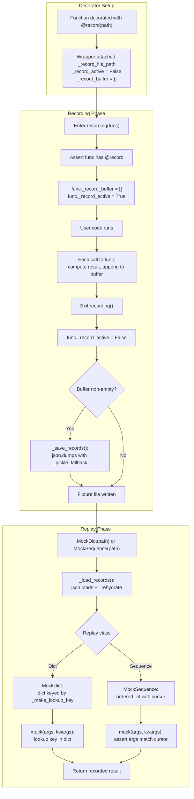

<!-- toc -->

- [hplayback](#hplayback)
  * [Overview](#overview)
  * [Design Rationale and Trade-offs](#design-rationale-and-trade-offs)
  * [Storage Layer](#storage-layer)
  * [`@record` Decorator](#record-decorator)
  * [`recording()` Context Manager](#recording-context-manager)
  * [`MockDict`](#mockdict)
  * [`MockSequence`](#mocksequence)
  * [Usage Examples](#usage-examples)
    + [Capture a Fixture](#capture-a-fixture)
    + [Replay with `MockDict`](#replay-with-mockdict)
    + [Replay with `MockSequence`](#replay-with-mocksequence)
    + [Patch a Function in a Test](#patch-a-function-in-a-test)
    + [Round-trip Complex Types](#round-trip-complex-types)
  * [Common Misunderstandings](#common-misunderstandings)
  * [Execution Flow Diagram](#execution-flow-diagram)

<!-- tocstop -->

# hplayback

- This document explains the design and flow of the record/replay system
  implemented in [`/helpers/hplayback.py`](/helpers/hplayback.py).

- `hplayback` captures `(args, kwargs, result)` triples from real function
  calls into a JSON fixture, then replays them in tests via `MockDict` or
  `MockSequence` without contacting the original backend.

- Tutorial:
  [`/helpers/notebooks/hplayback.tutorial.ipynb`](/helpers/notebooks/hplayback.tutorial.ipynb).

## Overview

- The system has three layers:
  - `Storage layer`: serializes records to JSON with a pickle fallback for
    values `json` cannot handle natively. Used by both recording and replay.
  - `Recording layer`: a `@record` decorator marks a function as recordable
    and a `recording()` context manager flips capture on/off for a scope.
  - `Replay layer`: `MockDict` and `MockSequence` load a fixture file and
    substitute a callable that returns the recorded result for each call.

- The decorator is inert by default. Recording is opt-in via the
  `recording()` context manager, so leaving `@record` on a function in
  production code adds only a single attribute check per call.

- The two replay classes target different usage patterns:
  - `MockDict`: order-independent `(args, kwargs) -> result` map.
  - `MockSequence`: ordered replay with per-call argument assertions.

## Design Rationale and Trade-offs

- **JSON envelope with pickle fallback**: Fixture files are JSON so they
  stay diff-friendly and human-readable for the common case of simple
  types. Values that `json` cannot serialize natively are wrapped in a
  `{"__pickle__": "<base64>"}` sentinel and round-trip through `pickle`.
  This avoids forcing the entire fixture into an opaque binary format just
  because one value happens to be non-JSON-native.

- **Decorator is inert by default**: A passive decorator left on a
  function in production has near-zero runtime cost (one attribute check
  per call). This lets the recording instrumentation stay glued to the
  function permanently, instead of being applied/removed at runtime via
  monkey-patching.

- **Per-function state on the wrapper**: The recording switch
  (`_record_active`) and buffer (`_record_buffer`) live as attributes on
  the wrapper itself, so each decorated function owns its state with no
  cross-talk and no global registry.

- **Trust boundary**: `pickle.loads()` executes arbitrary code, so a
  fixture file is as privileged as any other code in the repo. Only load
  fixtures produced by code you trust.

## Storage Layer

- Records are a `List[Dict[str, Any]]` where each entry has three keys:
  ```python
  {"args": [...], "kwargs": {...}, "result": ...}
  ```

- Serialization (`_save_records()`):
  - The records list is dumped with `json.dumps(..., indent=2,
    default=_pickle_fallback)`.
  - `_pickle_fallback()` is called by `json.dumps()` for any value `json`
    cannot serialize natively. It returns
    `{"__pickle__": base64.b64encode(pickle.dumps(value)).decode("ascii")}`
    so the blob is ASCII-safe and fits inside the JSON envelope.

- Deserialization (`_load_records()`):
  - The file is parsed with `json.loads()`.
  - `_rehydrate()` walks the structure: any dict whose only key is
    `__pickle__` is replaced with the pickled value; other dicts and lists
    are recursed into.

- Resulting on-disk format example:
  ```json
  [
    {"args": ["cmd1"], "kwargs": {}, "result": [{"id": "1"}]},
    {"args": ["alpha"], "kwargs": {}, "result": {"__pickle__": "gASVK..."}}
  ]
  ```
  Simple records remain inline; complex `result` values appear as
  base64-pickle sentinels.

## `@record` Decorator

- Purpose:
  - `record(file_path)` returns a decorator that wraps a function so its
    calls can be captured into `file_path`.

- Behavior:
  - The wrapper calls the wrapped function unconditionally, then appends
    `{"args": list(args), "kwargs": dict(kwargs), "result": result}` to a
    per-wrapper buffer **only when** `wrapper._record_active` is `True`.
  - The wrapper exposes three private attributes for state:
    - `_record_file_path`: where to flush the buffer.
    - `_record_active`: on/off switch read on every call.
    - `_record_buffer`: list of records pending flush.

- Interface:
  - Apply with `@hplayba.record("path/to/fixture.json")` at the top of the
    function definition.

## `recording()` Context Manager

- Purpose:
  - Open a window during which the decorated function records its calls.

- Behavior on entry:
  - Asserts the target function has been decorated with `@record`.
  - Drops any previously buffered records (`_record_buffer = []`).
  - Flips capture on (`_record_active = True`).

- Behavior on exit (always, including on exceptions):
  - Flips capture off (`_record_active = False`).
  - If the buffer is non-empty, flushes it to disk via `_save_records()`.
  - If the buffer is empty (e.g., the first call raised before any record
    was appended), nothing is written.

- Interface:
  - Use as `with hplayba.recording(decorated_func): ...`.

## `MockDict`

- Purpose:
  - Replay recorded calls as an order-independent
    `(args, kwargs) -> result` map.

- Behavior:
  - On construction, loads the fixture, builds a dict keyed by
    `_make_lookup_key(args, kwargs)` (a stable JSON serialization with
    sorted keys and `default=str` fallback). If the same key appears more
    than once in the fixture, the last entry wins.
  - On `__call__`, computes the same key for the current call and looks
    it up. A missing key raises an `AssertionError` with the unrecorded
    arguments named, which is treated as a test failure.

- Interface:
  - `MockDict(file_path)` constructor.
  - `mock(args, kwargs)` lookup.
  - `mock.patch(target)` returns a `unittest.mock.patch` object using the
    `MockDict` as `side_effect`.

- When to use:
  - The function under test is a pure mapping from inputs to outputs.
  - The same input may be called multiple times; you do not care about
    order.

## `MockSequence`

- Purpose:
  - Replay recorded calls in capture order, asserting each call's `args`
    and `kwargs` match the recorded ones at that position.

- Behavior:
  - On construction, loads the fixture into an ordered list and places
    the cursor at index 0.
  - On `__call__`, asserts the cursor has not run past the end of the
    sequence, asserts `args` and `kwargs` match the recorded values at
    the cursor position, returns the recorded result, and advances the
    cursor.
  - `reset()` returns the cursor to 0 so the sequence can be replayed
    again.

- Interface:
  - `MockSequence(file_path)` constructor.
  - `mock(args, kwargs)` consumes one recorded call.
  - `mock.reset()` rewinds.
  - `mock.patch(target)` returns a `unittest.mock.patch` object.

- When to use:
  - Call order matters (e.g., a stateful protocol).
  - The same function is called multiple times with distinct inputs and
    you want each call's arguments verified.

## Usage Examples

### Capture a Fixture

- Scenario: Record real calls to a `gh` CLI wrapper once so unit tests can
  replay them offline.

```python
import helpers.hplayback as hplayba

# Path inside the test fixture tree so the file moves with the repo.
_FIXTURE_FILE = "helpers/lib_tasks/test/input/test_lib_tasks_gh/_gh_run_and_get_json.json"


@hplayba.record(_FIXTURE_FILE)
def _gh_run_and_get_json(cmd: str) -> list:
    # Real implementation that shells out to `gh`.
    ...


def record_fixture() -> None:
    # Wrap the calls whose I/O you want captured.
    with hplayba.recording(_gh_run_and_get_json):
        list_open_prs("causify-ai/helpers")
        list_workflows("causify-ai/helpers")
    # On exit the fixture file is written.
```

### Replay with `MockDict`

- Scenario: Unit-test `list_open_prs()` without hitting GitHub. Calls map
  one-to-one to `gh` commands; order does not matter.

```python
import helpers.hplayback as hplayba

mock = hplayba.MockDict(_FIXTURE_FILE)
with mock.patch("helpers.lib_tasks.lib_tasks_gh._gh_run_and_get_json"):
    prs = list_open_prs("causify-ai/helpers")
    # `list_open_prs()` calls `_gh_run_and_get_json()` internally; the
    # patched mock returns the recorded result.
```

### Replay with `MockSequence`

- Scenario: Unit-test a stateful workflow where the same backend call
  happens multiple times with different arguments and the order matters.

```python
import helpers.hplayback as hplayba

mock_seq = hplayba.MockSequence(_FIXTURE_FILE)
with mock_seq.patch("helpers.lib_tasks.lib_tasks_gh._gh_run_and_get_json"):
    run_paginated_workflow("causify-ai/helpers")
    # Each internal `_gh_run_and_get_json()` call is asserted to match
    # the recorded args at its position. An unexpected call raises.
```

### Patch a Function in a Test

- Scenario: Drive a `hunit_test.TestCase` from a committed fixture so
  schema drift in the upstream tool is caught by CI.

- Prerequisite: the fixture file is generated once with `gh_create_mock_fixture`
  (or an equivalent recorder task) and **committed to the repo**.

```python
import helpers.hplayback as hplayba
import helpers.hunit_test as hunitest
import helpers.lib_tasks.lib_tasks_gh as hltltagh


class TestListOpenPrs(hunitest.TestCase):

    @classmethod
    def setUpClass(cls) -> None:
        # Load the committed fixture once per class run; `MockDict` is
        # stateless after construction.
        super().setUpClass()
        cls._mock = hplayba.MockDict(hltltagh._GH_FIXTURE_FILE)

    def test1(self) -> None:
        # Run test.
        with self._mock.patch(
            "helpers.lib_tasks.lib_tasks_gh._gh_run_and_get_json"
        ):
            prs = list_open_prs("causify-ai/helpers")
        # Check outputs.
        # Assert on properties of the helper's post-processing, not on
        # the literal recorded values - so cosmetic drift in `gh`'s
        # output (a new PR appears) does not break the test, but schema
        # drift (renamed field, changed type) does.
        for pr in prs:
            self.assertIsInstance(pr["id"], str)
            self.assertTrue(pr["id"].startswith("PR_"))
```

- When `gh`'s output schema changes:
  1. Re-run the recorder (e.g., `i gh_create_mock_fixture`) with real GitHub
     access.
  2. The git diff on the committed fixture file is the documented schema
     change.
  3. Tests that depend on the changed fields fail; update either the
     helpers or the assertions to match the new shape, then commit the
     fixture and the helper changes together.

### Round-trip Complex Types

- Scenario: Record a function whose result is a `pd.DataFrame` (which
  `json` cannot serialize natively).

```python
import pandas as pd
import helpers.hplayback as hplayba


@hplayba.record("/tmp/df_fixture.json")
def fetch_df(query: str) -> pd.DataFrame:
    ...


with hplayba.recording(fetch_df):
    fetch_df("select 1")
# The fixture contains a `{"__pickle__": "<base64>"}` sentinel for the
# DataFrame; the args (a string) stay inline as JSON.

# On replay, `_load_records()` rehydrates the sentinel back into the
# original DataFrame.
mock = hplayba.MockDict("/tmp/df_fixture.json")
df = mock("select 1")
assert isinstance(df, pd.DataFrame)
```

## Common Misunderstandings

- **The decorator does not enable recording on its own**: Decorating with
  `@record(path)` only marks the function as recordable. No fixture file
  is written until calls happen inside a `with recording(func):` block.

- **Calls outside `recording()` are not captured**: This is by design so
  the decorator is safe to leave on a function permanently in production.
  Production calls do not silently mutate fixture files.

- **`MockDict` and `MockSequence` are not interchangeable**: A fixture
  recorded with multiple calls to the same `(args, kwargs)` is fine for
  `MockSequence` (each call gets its own result) but collapses under
  `MockDict` (last-write-wins, earlier results are lost).

- **Pickle is not a stable wire format**: Anything stored via the pickle
  fallback is brittle across Python versions and across changes to the
  class definition of the pickled object. Fixtures containing pickle
  blobs may need regeneration when dependencies upgrade.

- **Pickle needs an importable class path**: Values whose class is
  defined inside a function (a local class), inside a comprehension, or
  in `__main__` (notebook cells) cannot be pickled - `pickle` resolves
  classes by their dotted import path and a local class has none. Move
  the class to module scope to use the pickle fallback.

- **`pickle.loads()` executes arbitrary code**: A fixture file is a code
  artifact. Treat it as you would any committed Python file: do not load
  fixtures whose origin you do not trust.

- **Lookup keys depend on argument representation**: The lookup key is
  `json.dumps({"args": list(args), "kwargs": kwargs}, sort_keys=True,
  default=str)`. Two calls with values that look equal but stringify
  differently (e.g., `1` vs `1.0`) will produce different keys.

- **`recording()` resets the buffer on entry**: Calls accumulated by a
  previous `recording()` block on the same function are dropped when the
  next block is entered. This avoids accidentally appending to stale
  buffers across runs.

## Execution Flow Diagram


