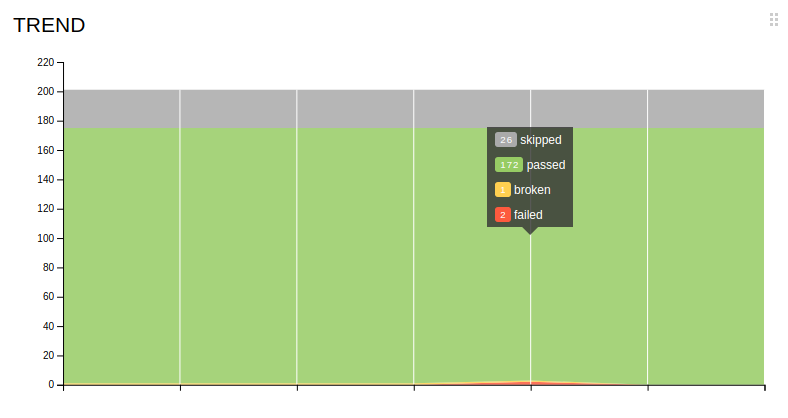
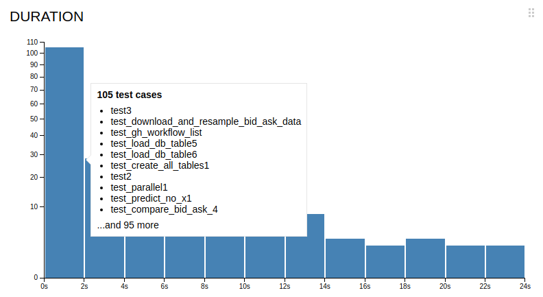

# Buildmeister

## Buildmeister Process

<!-- toc -->

- [General](#general)
- [Notification System](#notification-system)
- [Buildmeister Instructions](#buildmeister-instructions)
  * [`Update_Helpers_Submodule` Fails](#update_helpers_submodule-fails)
- [Daily Reporting and Handover Process](#daily-reporting-and-handover-process)
- [Buildmeister Dashboard](#buildmeister-dashboard)
  * [Logic Used to Determine Workflow Status](#logic-used-to-determine-workflow-status)
- [Allure Reports Analysis](#allure-reports-analysis)
- [Post-Mortem Analysis (TBD)](#post-mortem-analysis-tbd)

<!-- tocstop -->

## General

- The Buildmeister rotates according to the schedule
  - To see who is the Buildmeister now refer to
    [Buildmeister gsheet](https://docs.google.com/spreadsheets/d/12OhDW4hzSLekorrri2WfRkV8h3JcnB8WQd1JEL_n0D8/edit)
  - Each rotation should be confirmed following the
    [Handover Process](#handover-process) which includes a status report from
    the outgoing Buildmeister and acknowledgment from the new one
- The Buildmeister is responsible for:
  - Check build status using the
    [buildmeister dashboard](#buildmeister-dashboard) everyday
  - Pushing team members to fix broken tests
  - Conducting post-mortem analysis
    - Why did the break happen?
    - How can we avoid the problem next time, through process and automation?
- Refer to `.github` dir in the repo for update schedule of GH actions
- Additional information about tests:
  - [write tests](/docs/tools/unit_test/all.write_unit_tests.how_to_guide.md.figs)
  - [run tests](/docs/tools/unit_test/all.run_unit_tests.how_to_guide.md.figs)

## Notification System

- `Kaizen GitHub actions app` notifies the team about breaks via Slack channel
  [#build-notifications](https://causify.slack.com/archives/C07QS9P4N78)
- A notification contains:
  - Failing tests type: fast/slow/super-slow
  - Repo
  - Branch
  - Event
  - Link to a failing run

Example:

- 

## Buildmeister Instructions

- You receive a break notification from `Kaizen GitHub actions app`
- Have a look at the message
  - Do it right away, this is always your highest priority task
- Notify the team
  - If the break happened in `lemonade` repo, ping GP or Paul, since they are
    the only ones with write access

- Post on the
  [#build-notifications](https://causify.slack.com/archives/C07QS9P4N78) Slack
  channel what tests broke, e.g.,
  `FAILED knowledge_graph/vendors/test/test_utils.py::TestClean::test_clean`
  - If unsure about the cause of failure (there is a chance that a failure is
    temporary):
    - Do a quick run locally for the failed test
    - If the test is specific and can not be run locally, rerun the regressions
  - Ask if somebody knows what is the problem
    - If you know who is in charge of that test (you can use `git blame`) ask
      directly
  - If the offender says that it's fixing the bug right away, let him/her do it
  - Otherwise, file a bug to track the issue

- File an Issue on GH to report the failing tests and the errors
  - Example:
    [https://github.com/cryptokaizen/cmamp/issues/4386](https://github.com/cryptokaizen/cmamp/issues/4386)
  - Issue title template `Build fail - {repo} {test type} ({run number})`
    - Example: `Build fail - Cmamp fast_tests (1442077107)`
  - Paste the URL of the failing run
    - Example:
      [https://github.com/causify-ai/cmamp/actions/runs/12738914526](https://github.com/causify-ai/cmamp/actions/runs/12738914526)
  - Provide as much information as possible to give an understanding of the
    problem
  - List all the tests with FAILED status in a GitHub run, e.g.,
    ```bash
    FAILED knowledge_graph/vendors/test/test_p1_utils.py::TestClean::test_clean
    FAILED knowledge_graph/vendors/nbsc/test/test_nbsc_utils.py::TestExposeNBSCMetadata::test_expose_nbsc_metadata
    ```
  - Stack trace or part of it (if it's too large)
    ```bash
    Traceback (most recent call last): File
    "/.../automl/hypotheses/test/test*rh_generator.py", line 104, in test1
    kg_metadata, * = p1ut.load_release(version="0.5.2") File
    "/.../knowledge_graph/vendors/utils.py", line 53, in load_release % version,
    File "/.../amp/helpers/dbg.py", line 335, in dassert_dir_exists \_dfatal(txt,
    msg, \*args) File "/.../amp/helpers/dbg.py", line 97, in \_dfatal
    dfatal(dfatal_txt) File "/.../amp/helpers/dbg.py", line 48, in dfatal raise
    assertion_type(ret) AssertionError:
    ##############################################################################
    Failed assertion \*
      dir='/fsx/research/data/kg/releases/timeseries_db/v0.5.2' doesn't exist or
      it's not a dir The requested version 0.5.2 has directory associated with it.
    ```
  - If the failures are not connected to each other, file separate issues for
    each of the potential root cause
  - Keep issues grouped according to the codebase organization

- Post the issue reference on Slack channel
  [#build-notifications](https://causify.slack.com/archives/C07QS9P4N78)
  - You can quickly discuss there who will take care of the broken tests, assign
    that person
  - Otherwise, assign it to the person who can reroute

- Our policy is "fix it or revert"
  - The build needs to go back to green within 1 hr
    - Either the person responsible for the break fixes the issue within 1 hour,
      or you need to push the responsible person to disable the test
    - Do not make the decision about disabling the test yourself!
    - First, check with the responsible person, and if he / she is ok with
      disabling, do it
    - IMPORTANT: Disabling a test is not the first choice, it's a measure of
      last resort!

- Regularly check issues related to build breaks.
  - You have to update the break issues if the problem was solved or partially
    solved.
  - Pay special attention to the failures which resulted in disabling tests.

- When your time of the Buildmeister duties is over, confirm the rotation with
  the next responsible person in the related Slack channel.

### `Update_Helpers_Submodule` Fails

- When this happens, the first thing to do is attempt to update the `helpers`
  pointer manually

- Instructions:
  ```bash
  > cd src/cmamp1
  > git checkout master
  > git pull --recurse-submodules
  > cd helpers_root
  > git checkout master
  > git pull origin master
  > cd ..
  > git add helpers_root
  > git commit -m "Update helpers pointer"
  ```

## Daily Reporting and Handover Process

- The current Buildmeister must send a daily status report to eng@ at the start
  of each workday with the TODO email
  - The email subject should follow the format:
    `[BM Report] Build Status - YYYY-MM-DD`
  - The email should include:
    - Current status of all builds (green/red)
    - For any red (failing) builds:
      - Which tests are failing
      - Why they are failing (if known)
      - Who is responsible for fixing them
      - Expected timeline for fixes
    - Confirmation that all breaks are tracked with GitHub issues
      - Include links to all open issues related to build breaks
    - A screenshot of the current Buildmeister dashboard
      - This provides a visual overview of the build status
    - Any additional relevant information or concerns

- The current Buildmeister must also save the status report in a Log file at
  [Buildmesietr Log Doc](https://docs.google.com/document/d/12fm9068JwAEHjn2CE1H29cV9R7plAD_4NAGLoZJoBrY/edit?usp=drive_link)

- When a new Buildmeister takes over the role:
  - The new Buildmeister must respond to the most recent status report email
  - The response should:
    - Acknowledge receipt of the handover
    - Confirm understanding of current build status
    - Include "Acknowledged" in the subject line
    - CC the previous Buildmeister and eng@

- Example email format:

  ```text
  Subject: BuildMeister Status

  Build Status Summary:
  - cmamp/master: RED (2 failing tests)
  - helpers/master: GREEN
  - lemonade/master: GREEN

  Point each break to a git Issue:
  - https://github.com/cryptokaizen/cmamp/issues/4386

  Dashboard screenshot attached.

  Additional notes if needed:
  - The failing tests have been occurring since yesterday's deployment
  - We may need to update the data path configuration in our CI environment
  ```

## Buildmeister Dashboard

The Buildmeister dashboard is a tool that provides a quick overview of the
current state of the results of all GitHub Actions workflows. See
[run and publish the buildmeister dashboard](/dev_scripts_helpers/update_devops_packages/notebooks/Master_buildmeister_dashboard.ipynb)
for detailed information.


### Logic Used to Determine Workflow Status

The dashboard uses the following logic to determine the latest and most relevant
status of each GitHub Actions workflow:

- **Workflow Run Selection**:
  - For each workflow in each repo, the dashboard fetches the 10 most recent
    workflow runs on the `master` branch
  - For workflows such as `"Gitleaks Scan"`, the dashboard prioritizes the
    latest scheduled run (`event == "schedule"`) as these are used for CI health
    checks
  - If no scheduled run is found (or the workflow does not have scheduled runs),
    it falls back to the most recent completed run with a `conclusion` of
    `"success"` or `"failure"`

- **Overall Repository Status**:
  - A repository is marked as `Failed` if any of its workflows have a
    `conclusion` of `failure`
  - Otherwise, it is marked as `Success`
  - In Jupyter notebooks, these statuses are color-coded:
    - `Green`: `Success`
    - `Red`: `Failure`

- **Workflow Data and Display**:
  - For each workflow, the dashboard shows:
    - `repo_name`: repository name (e.g., `cryptokaizen/cmamp`)
    - `workflow_name`: name of the workflow (e.g., `"Allure fast tests"`)
    - `conclusion`: overall status (`"success"` or `"failure"`)
    - `url`: link to the specific workflow run
  - All URLs in the dashboard are rendered as clickable links
  - A timestamp indicating when the dashboard was last generated is included for
    reference

- **Handling Missing or Sparse Runs**:
  - If fewer than 10 runs are available for a workflow, the dashboard logs a
    warning and skips the workflow
  - This ensures that workflows which haven't run recently do not affect the
    overall dashboard accuracy

## Allure Reports Analysis

- For a background on Allure, refer to these docs
  - Detailed info can be found in the official
    [docs](https://allurereport.org/docs/)
  - [Allure Explanantion](/docs/build_system/all.pytest_allure.explanation.md)
  - [Allure How to Guide](/docs/build_system/all.pytest_allure.how_to_guide.md.figs)

- For now, the Buildmeister can get the link to the Allure reports by navigating
  GitHub Actions page
  [https://github.com/cryptokaizen/cmamp/actions](https://github.com/cryptokaizen/cmamp/actions)
  - Select a particular workflow (Allure fast tests, Allure slow tests, Allure
    superslow tests) based on the test types
  - Click on the particular run for which to get the report. Latest is on the
    top
  - Access the report URL by clicking `Report URL` in the run link. For e.g.:
    [https://github.com/cryptokaizen/cmamp/actions/runs/7210433549/job/19643566697](https://github.com/cryptokaizen/cmamp/actions/runs/7210433549/job/19643566697)
  - The report URL looks like:
    [http://172.30.2.44/allure_reports/cmamp/fast/report.20231212_013147](http://172.30.2.44/allure_reports/cmamp/fast/report.20231212_013147)

- Once a week the Buildmeister manually inspects
  [graph](https://allurereport.org/docs/gettingstarted-graphs/) section of the
  report
  - The overall goal is to:
    - Monitor the amount of skipped, failed, and broken tests using the
      `Trend Chart`. It shows how a certain value changed over time. Each
      vertical line corresponds to a certain version of the test report, with
      the last line on the right corresponding to the current version

      
    - Monitor the `Duration Trend` to check the time taken to the run all tests
      comparing to historical trends

      
    - Monitor the `Duration Distribution`, where all the tests are divided into
      groups based on how long it took to complete them, and manually compare
      with the last week results

      
    - Monitor the `Retries Trend` to check the number of retries occurred in a
      particular run

      
    - The idea is to make sure it doesn't have drastic change in the values

- Steps to perform if a test fails, timeouts or breaks
  - When a particular test fails, timeouts or breaks, Buildmeister should look
    in report for
    - How long it was the case, e.g., did it occur in the past? Include this
      info when filing an issue
    - The very first run when it happened and add that info to the issue. This
      could be useful for debugging purposes
    - These info can be extracted by navigating the `Packages` section of the
      report for that test. Any particular test has `history` and `retries`
      section which shows the history of success and number of retries occured
      for that test
  - The goal here is to provide more context when filing an issue so that we can
    make better decisions

## Post-Mortem Analysis (TBD)

- We want to understand on why builds are broken so that we can improve the
  system to make it more robust
  - In order to do that, we need to understand the failure modes of the system
  - For this reason we keep a log of all the issues and what was the root cause

- `Date` column:
  - Enter the date when the break took place
  - Keep the bug ordered in reverse chronological order (i.e., most recent dates
    first)

- `Repo` column:
  - Specify the repo where break occurred
    - `amp`
    - ...

- `Test type` column:
  - Specify the type of the failing tests
    - Fast
    - Slow
    - Super-slow

- `Link` column:
  - Provide a link to a failing run

- `Reason` column:
  - Specify the reason of the break
    - Merged a branch with broken tests
    - Master was not merged in a branch
    - Merged broken slow tests without knowing that
    - Underlying data changed

- `Issue` column:
  - Provide the link to the GH issue with the break description

- `Solution` column:
  - Provide the solution description of the problem
    - Problem that led to the break was solved
    - Failing tests were disabled, i.e. problem was not solved
