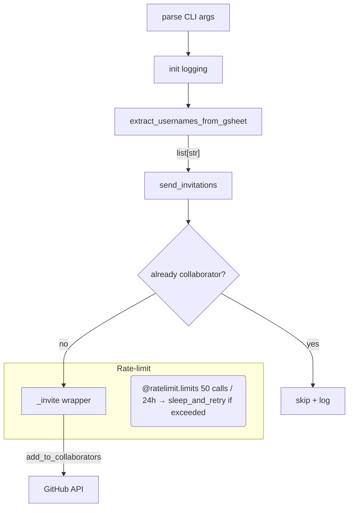

<!-- toc -->

- [`github_invite_collaborators.py` Explanation](#github_invite_collaboratorspy-explanation)
  * [Public interface](#public-interface)
  * [Execution flow](#execution-flow)
  * [Key implementation choices](#key-implementation-choices)

<!-- tocstop -->

# `github_invite_collaborators.py` Explanation

This document is about how this script works and flows.

## Public interface

```bash
dev_scripts_helpers/github/github_invite_collaborators.py \
    --drive_url <google‑sheet‑url>  \
    --gh_token  <github‑pat>       \
    --org_name  <github‑org>       \
    --repo_name <repo>             \
    [--log_level 20]
```

- **`drive_url`**: Spreadsheet containing a `GitHub user` column.
- **`gh_token`**: PAT with `repo` scope (or fine‑grained "Repository
  administration").
- **`org_name` / `repo_name`**: identify the target repository.
- **`log_level`**: standard Python numeric levels (10 = DEBUG, 20 = INFO).

## Execution flow



## Key implementation choices

- **Dependency auto‑install**: the small `pip install` loop avoids a separate
  requirements file when the script runs in fresh environments, at the cost of
  start‑up time.
- **Service‑account auth**: credentials path is hard‑coded but can be fed via
  env‑var if desired; the helper supports both.
- **Idempotence**: `repo.has_in_collaborators()` prevents duplicate invites
  counting toward the daily quota.
- **Sleep strategy**: we rely entirely on `ratelimit.sleep_and_retry`, so the
  process may block for hours. Even if the process is terminated, the
  idempotence measure will prevent the added names from contributing to the
  quota
