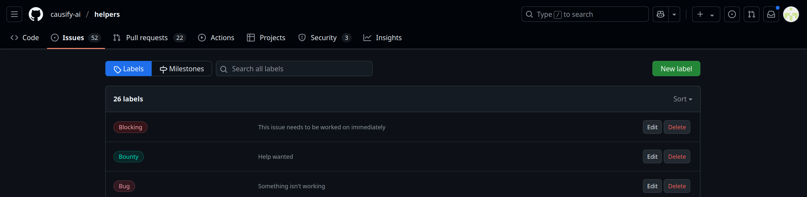
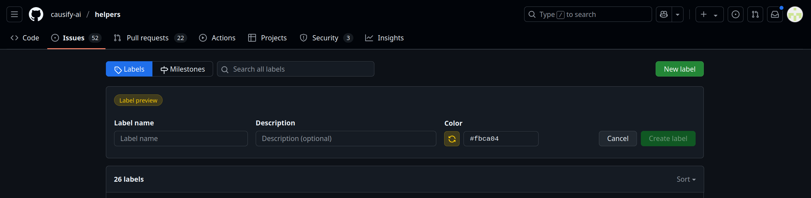

# Synchronize GH issue labels

<!-- toc -->

- [Things to consider](#things-to-consider)
  * [Label format](#label-format)
  * [Permissions and access](#permissions-and-access)
- [How to synchronize issue labels](#how-to-synchronize-issue-labels)
  * [Using GitHub](#using-github)
  * [Running the script manually](#running-the-script-manually)
  * [Using Invoke](#using-invoke)

<!-- tocstop -->

- GitHub labels help categorize and prioritize issues in a repository. You can
  find more information in the
  [`all.use_github.how_to_guide.md`](/docs/work_organization/all.use_github.how_to_guide.md).

- The `dev_scripts_{repo_name}/github/sync_gh_issue_labels.py` script
  synchronizes GitHub issue labels between a repository and a label inventory
  manifest file.

- The labels are stored in the
  `dev_scripts_{repo_name}/github/labels/gh_issues_labels.yml` file, which acts
  as a manifest for synchronization. You can create your own label file or use
  the default ones provided in the repository but you need to use only yaml
  file.

- The script includes options to back up existing labels before synchronization
  to prevent data loss.

## Things to consider

- When you want to create, update, or delete a label, update the
  `dev_scripts_{repo_name}/labels/gh_issues_labels.yml` file accordingly. If
  working with a different file, ensure to specify the correct path in the
  script.

- Run the script to synchronize the labels in the GitHub repository with the
  labels in the YAML file.

- The script uses the `PyGithub` library to interact with the GitHub API. Ensure
  you have it installed in your Python environment.

### Label format

- A GitHub label includes the following attributes:
  - `name`: The label's name.
  - `color`: The label's color in hex format (e.g., `#FF0000` for red).
  - `description`: A short description of the label.

- The `dev_scripts_{repo_name}/labels/gh_issues_labels.yml` file contains
  various label types, as shown below:

```yaml
# Priority Labels.
- name: P0
  description: High priority - needs immediate attention
  color: "#ff0000"
# Issue Types.
- name: Blocking
  description: This issue needs to be worked on immediately
  color: "#e11d21"
# Pull Request Guidelines.
- name: PR for authors
  description: The PR needs changes
  color: "#eb35f3"
# Issue Status.
- name: Paused
  description: An issue was started and then stopped
  color: "#cccccc"
# Contribution Types.
- name: Good first issue
  description: Simple tasks for newcomers
  color: "#7057ff"
```

### Permissions and access

- Ensure that your local Python environment contains a token with write access
  to the repository for the script to function.

- The script requires write access to the repository you want to update labels.

- If working with a different label file, ensure to specify the correct path in
  the script.

## How to synchronize issue labels

### Using GitHub

- Open the `Issues` section in the GitHub repository you want to update labels.
  

- Click on `Labels` on the right side of the page to view all the labels in the
  repository. 

- To edit or delete a label, click on the label and make the necessary changes.

- To create a new label, click on `New Label`, enter its name, description, and
  color, and click `Create Label`. 

- After saving the changes in GitHub, run the script manually to reflect the
  changes in the local label file. Follow the instructions in the sections
  below.

### Running the script manually

- Update the `dev_scripts_{repo_name}/labels/gh_issues_labels.yml` file with the
  labels you want to add, update, or delete or create your own Label file with
  your desired labels.

- Use the `sync_gh_issue_labels.py` script with the following options:
  - `--input_file`: Specify the path to the YAML file containing the labels.
  - `--owner` and `--repo`: Provide the owner and name of the GitHub repository.
  - `--token_env_var`: Specify the environment variable containing the GitHub
    access token.
  - `--backup`: (Optional) Create a backup of the current labels before
    synchronization.
  - `--prune`: (Optional) Remove labels not listed in the manifest file.
  - `--dry_run`: (Optional) Simulate the process without making changes.
  - `--no_interactive`: (Optional) Skip confirmation prompts.
  - Logs are saved in the
    `dev_scripts_{repo_name}/github/sync_gh_issue_labels.py.log` file.

- Run the script with the following command:

```bash
> python sync_gh_issue_labels.py \
    --input_file $FILENAME \
    --owner causify-ai \
    --repo sports_analytics \
    --token_env_var *******  \
    --backup
12:57:34 - INFO  hdbg.py init_logger:1013                               Saving log to file '$REPOLOCATION/dev_scripts_helpers/github/sync_gh_issue_labels.py.log'
12:57:34 - INFO  hdbg.py init_logger:1018                               > cmd='sync_gh_issue_labels.py --input_file $FILENAME --owner causify-ai --dry_run --repo helpers --token_env_var GITHUB_TOKEN --backup'
12:57:35 - INFO  sync_gh_issue_labels.py _main:205                      Labels backed up to $REPOLOCATION/tmp.labels.causify-ai.helpers.yaml
Are you sure you want to synchronize labels? [y/n] y
12:57:36 - INFO  sync_gh_issue_labels.py _main:263                      Label 'P0' not changed
12:57:36 - INFO  sync_gh_issue_labels.py _main:263                      Label 'P1' not changed
12:57:36 - INFO  sync_gh_issue_labels.py _main:263                      Label 'P2' not changed
12:57:36 - INFO  sync_gh_issue_labels.py _main:263                      Label 'Blocking' not changed
12:57:36 - INFO  sync_gh_issue_labels.py _main:263                      Label 'Bug' not changed
12:57:36 - INFO  sync_gh_issue_labels.py _main:263                      Label 'Enhancement' not changed
12:57:36 - INFO  sync_gh_issue_labels.py _main:263                      Label 'Epic' not changed
12:57:36 - INFO  sync_gh_issue_labels.py _main:263                      Label 'Design' not changed
12:57:36 - INFO  sync_gh_issue_labels.py _main:263                      Label 'Documentation' not changed
12:57:36 - INFO  sync_gh_issue_labels.py _main:263                      Label 'Cleanup' not changed
12:57:36 - INFO  sync_gh_issue_labels.py _main:263                      Label 'Customer' not changed
12:57:36 - INFO  sync_gh_issue_labels.py _main:263                      Label 'Readings' not changed
12:57:36 - INFO  sync_gh_issue_labels.py _main:263                      Label 'PR for authors' not changed
12:57:36 - INFO  sync_gh_issue_labels.py _main:263                      Label 'PR for integrators' not changed
12:57:36 - INFO  sync_gh_issue_labels.py _main:263                      Label 'PR for reviewers' not changed
12:57:36 - INFO  sync_gh_issue_labels.py _main:263                      Label 'Paused' not changed
12:57:36 - INFO  sync_gh_issue_labels.py _main:263                      Label 'To close' not changed
12:57:36 - INFO  sync_gh_issue_labels.py _main:263                      Label 'Good first issue' not changed
12:57:36 - INFO  sync_gh_issue_labels.py _main:263                      Label 'Good second issue' not changed
12:57:36 - INFO  sync_gh_issue_labels.py _main:263                      Label 'Outsource' not changed
12:57:36 - INFO  sync_gh_issue_labels.py _main:263                      Label 'Bounty' not changed
12:57:36 - INFO  sync_gh_issue_labels.py _main:264                      Label synchronization completed!
```

### Using Invoke

- You can run the script using the `invoke` command where `$FILENAME` is the
  name of the YAML file containing the labels as below:

```bash
> i sync_gh_issue_labels \
    --input_file $FILENAME \
    --owner causify-ai \
    --repo sports_analytics \
    --token_env_var *******  \
    --backup
```

- This command accepts the same arguments as the `sync_gh_issue_labels.py`
  script.
