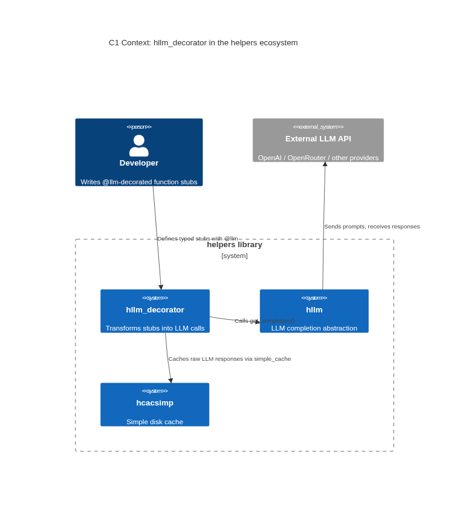
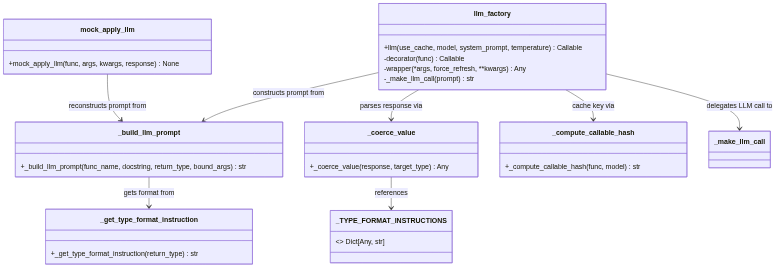
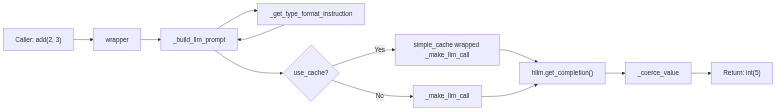
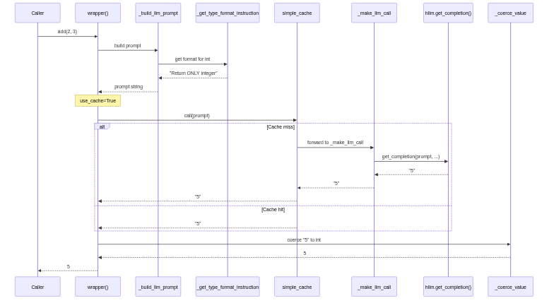

# Overview
- `hllm_decorator.py` provides a declarative `@llm` decorator that transforms a
  type-annotated Python function stub into an LLM call
- The decorated function's:
  - Docstring becomes the task description
  - Arguments become the prompt inputs
  - Return type annotation drives automatic coercion of the raw LLM response
    back into a Python value

- What the module solves: bridging Python function semantics with LLM-based
  computation
  - Developers write function signatures with typed parameters and return values
  - Calls are resolved by an LLM instead of by executing the function body

- Key design decisions visible from the code:
  - **Type-driven coercion**: Return type determines both the LLM format
    instruction and the post-processing parser
  - **Caching via composition**: Delegates caching to `hcacsimp.simple_cache`,
    wrapping only the LLM-call layer so cached results still go through the
    coercion pipeline
  - **Testability through cache mocking**: `mock_apply_llm()` pre-populates the
    disk cache so tests avoid external API calls

# Architecture (C4 Model)

## C1 - Context
- The module sits in the helpers infrastructure layer
- It depends on:
  - `hllm`: LLM abstraction layer for sending prompts and receiving responses
  - `hcacsimp`: Simple caching system for persisting raw LLM outputs on disk
<!--  rendered_images:begin -->
<!--  ```mermaid -->
<!--  C4Context -->
<!--    title C1 Context: hllm_decorator in the helpers ecosystem -->
<!--   -->
<!--    Person(developer, "Developer", "Writes @llm-decorated function stubs") -->
<!--    System_Ext(llm_api, "External LLM API", "OpenAI / OpenRouter / other providers") -->
<!--   -->
<!--    Boundary(helpers, "helpers library") { -->
<!--      System(hllmdec, "hllm_decorator", "Transforms stubs into LLM calls") -->
<!--      System(hllm, "hllm", "LLM completion abstraction") -->
<!--      System(hcache, "hcacsimp", "Simple disk cache") -->
<!--    } -->
<!--   -->
<!--    Rel(developer, hllmdec, "Defines typed stubs with @llm") -->
<!--    Rel(hllmdec, hllm, "Calls get_completion()") -->
<!--    Rel(hllmdec, hcache, "Caches raw LLM responses via simple_cache") -->
<!--    Rel(hllm, llm_api, "Sends prompts, receives responses") -->
<!--  ``` -->
<!--  rendered_images:end -->
<!--  render_images:begin -->

<!--  render_images:end -->

## C2 - Container
- The module has no classes
- It exposes one public decorator factory (`llm()`) and one public testing
  utility (`mock_apply_llm()`)
- Private helper functions each handle a distinct concern
<!--  rendered_images:begin -->
<!--  ```mermaid -->
<!--  classDiagram -->
<!--    class llm_factory { -->
<!--      +llm(use_cache, model, system_prompt, temperature) Callable -->
<!--      -decorator(func) Callable -->
<!--      -wrapper(*args, force_refresh, **kwargs) Any -->
<!--      -_make_llm_call(prompt) str -->
<!--    } -->
<!--    class mock_apply_llm { -->
<!--      +mock_apply_llm(func, args, kwargs, response) None -->
<!--    } -->
<!--    class _build_llm_prompt { -->
<!--      +_build_llm_prompt(func_name, docstring, return_type, bound_args) str -->
<!--    } -->
<!--    class _coerce_value { -->
<!--      +_coerce_value(response, target_type) Any -->
<!--    } -->
<!--    class _get_type_format_instruction { -->
<!--      +_get_type_format_instruction(return_type) str -->
<!--    } -->
<!--    class _compute_callable_hash { -->
<!--      +_compute_callable_hash(func, model) str -->
<!--    } -->
<!--    class _TYPE_FORMAT_INSTRUCTIONS { -->
<!--      <<static>> Dict[Any, str] -->
<!--    } -->
<!--   -->
<!--    llm_factory --> _build_llm_prompt : constructs prompt from -->
<!--    llm_factory --> _coerce_value : parses response via -->
<!--    llm_factory --> _compute_callable_hash : cache key via -->
<!--    llm_factory --> _make_llm_call : delegates LLM call to -->
<!--    _build_llm_prompt --> _get_type_format_instruction : gets format from -->
<!--    _coerce_value --> _TYPE_FORMAT_INSTRUCTIONS : references -->
<!--    mock_apply_llm --> _build_llm_prompt : reconstructs prompt from -->
<!--  ``` -->
<!--  rendered_images:end -->
<!--  render_images:begin -->

<!--  render_images:end -->

## C3 - Component
- The call flow for a decorated function invocation follows a straight pipeline:
  prompt construction -> LLM call (with optional caching) -> type coercion
<!--  rendered_images:begin -->
<!--  ```mermaid -->
<!--  flowchart LR -->
<!--    A["Caller: add(2, 3)"] --> B[wrapper] -->
<!--    B --> C[_build_llm_prompt] -->
<!--    C --> D[_get_type_format_instruction] -->
<!--    D --> C -->
<!--    C --> E{"use_cache?"} -->
<!--    E -->|Yes| F[simple_cache wrapped _make_llm_call] -->
<!--    E -->|No| G[_make_llm_call] -->
<!--    F --> H["hllm.get_completion()"] -->
<!--    G --> H -->
<!--    H --> I[_coerce_value] -->
<!--    I --> J["Return: int(5)"] -->
<!--  ``` -->
<!--  rendered_images:end -->
<!--  render_images:begin -->

<!--  render_images:end -->

## C4 - Code
- **Prompt construction** (`_build_llm_prompt`): Assembles the prompt from three
  sections
  - Function docstring (task description)
  - Serialized arguments as `name = repr(value)` lines
  - Format instruction from `_get_type_format_instruction`
  - Simple concatenation with no template engine

- **Type coercion** (`_coerce_value`): Walks the Python type annotation tree
  - Extracts origin and type arguments via `typing.get_origin()` and
    `typing.get_args()`
  - Dispatches to specific parsers for `int`, `float`, `bool`, `str`, `List`,
    `Dict`, `Union`
  - Notable design: `int` and `float` parsers strip non-numeric characters
    before casting, making coercion resilient to LLMs that wrap values in
    explanatory text

- **Cache integration**: `_make_llm_call` is decorated with
  `hcacsimp.simple_cache` when `use_cache=True`
  - Cache key: the prompt string
  - `force_refresh` keyword argument passes through to `simple_cache`, allowing
    cache bypass on demand

- **Function identity for caching**: `_compute_callable_hash` hashes function
  source (via `inspect.getsource`) with the model name
  - Source edits automatically invalidate cached results

# Key Functions and Call Flow

## Public API
| Function           | Signature                                                                      | Purpose                                                                  | Returns                                        |
| ------------------ | ------------------------------------------------------------------------------ | ------------------------------------------------------------------------ | ---------------------------------------------- |
| `llm()`            | `(*, use_cache=True, model="", system_prompt="", temperature=0.1) -> Callable` | Decorator factory that transforms a typed function stub into an LLM call | A decorator (`Callable[[Callable], Callable]`) |
| `mock_apply_llm()` | `(func, *, args=(), kwargs=None, response="") -> None`                         | Pre-populate the LLM response cache for a specific decorated call        | None (side-effect: writes cache entry)         |

## Private Helpers
| Function                                                           | Purpose                                                                                                                                      |
| ------------------------------------------------------------------ | -------------------------------------------------------------------------------------------------------------------------------------------- |
| `_get_type_format_instruction(return_type)`                        | Maps a Python type annotation to an LLM format instruction string (e.g., `int` -> "Return ONLY a single integer number")                     |
| `_coerce_value(response, target_type)`                             | Parses a raw LLM response string into the target Python type, handling `int`, `float`, `bool`, `str`, `List`, `Dict`, and `Union`/`Optional` |
| `_build_llm_prompt(func_name, docstring, return_type, bound_args)` | Assembles the full LLM prompt from function metadata and call arguments                                                                      |
| `_compute_callable_hash(func, model)`                              | Computes an MD5 hash over function source and model name for cache key stability                                                             |

## Call Flow
<!--  rendered_images:begin -->
<!--  ```mermaid -->
<!--  sequenceDiagram -->
<!--    participant Caller -->
<!--    participant Wrapper as wrapper() -->
<!--    participant Builder as _build_llm_prompt -->
<!--    participant Format as _get_type_format_instruction -->
<!--    participant Cache as simple_cache -->
<!--    participant LLM as _make_llm_call -->
<!--    participant hllm as hllm.get_completion() -->
<!--    participant Coerce as _coerce_value -->
<!--   -->
<!--    Caller->>Wrapper: add(2, 3) -->
<!--    Wrapper->>Builder: build prompt -->
<!--    Builder->>Format: get format for int -->
<!--    Format-->>Builder: "Return ONLY integer" -->
<!--    Builder-->>Wrapper: prompt string -->
<!--   -->
<!--    Note over Wrapper: use_cache=True -->
<!--   -->
<!--    Wrapper->>Cache: call(prompt) -->
<!--    alt Cache miss -->
<!--      Cache->>LLM: forward to _make_llm_call -->
<!--      LLM->>hllm: get_completion(prompt, ...) -->
<!--      hllm-->>LLM: "5" -->
<!--      LLM-->>Cache: "5" -->
<!--      Cache-->>Wrapper: "5" -->
<!--    else Cache hit -->
<!--      Cache-->>Wrapper: "5" -->
<!--    end -->
<!--   -->
<!--    Wrapper->>Coerce: coerce "5" to int -->
<!--    Coerce-->>Wrapper: 5 -->
<!--    Wrapper-->>Caller: 5 -->
<!--  ``` -->
<!--  rendered_images:end -->
<!--  render_images:begin -->

<!--  render_images:end -->

# External Dependencies
| Module / Library                     | Usage                                                                                         |
| ------------------------------------ | --------------------------------------------------------------------------------------------- |
| `helpers.hllm` (`hllm`)              | Provides `get_completion()` for the actual LLM API call                                       |
| `helpers.hcache_simple` (`hcacsimp`) | Provides `simple_cache` decorator and `mock_cache_from_args_kwargs` for caching LLM responses |
| `helpers.hdbg` (`hdbg`)              | Assertions (`dassert_isinstance`) for input validation                                        |
| `helpers.hprint` (`hprint`)          | Pretty-printing prompt text in debug logs                                                     |
| `functools`                          | `functools.wraps` to preserve function metadata through decoration                            |
| `inspect`                            | Function signature extraction, argument binding, and source code retrieval                    |
| `typing`                             | Type introspection (`get_origin`, `get_args`) for generic type handling                       |
| `hashlib`                            | MD5 hashing for cache key computation                                                         |
| `json`                               | JSON parsing for `List`/`Dict` return type coercion                                           |
| `re`                                 | Regex extraction of JSON arrays/objects from noisy LLM responses                              |

# Critique and Improvements

## Strengths
- **Clean separation of concerns** (fact): Prompt construction, type coercion,
  and LLM calling are in separate private functions, each testable in isolation
- **Graceful degradation in interactive environments** (fact):
  `_compute_callable_hash` falls back to the qualified name when
  `inspect.getsource` raises `OSError`, supporting REPL and notebook usage
- **Resilient coercion** (fact): `int` and `float` parsers strip non-numeric
  characters before casting, tolerating LLMs that wrap values in prose
- **Complete testing infrastructure** (fact): `mock_apply_llm()` enables full
  test coverage without LLM API calls

## Weaknesses
- **No structured output mode** (fact): The decorator instructs the LLM via text
  prompts rather than using the LLM provider's structured output / JSON mode API
  - Less reliable for complex return types because the LLM may ignore or
    misinterpret format instructions
  - The `hllm` module supports Pydantic-based structured output, but the
    decorator does not use it
- **Prompt injection surface** (fact): Function argument values are embedded
  directly into the prompt via `repr(param_value)`
  - No sanitization or boundary marking around argument values
  - Injected text could override the format instruction or add system-level
    commands
- **All-or-nothing caching** (fact): Cache granularity is per-prompt string
  - No support for partial cache invalidation (e.g., reusing cached responses
    when only some arguments change)
  - No time-based cache expiry
  - The only invalidation mechanisms are source-code-hash mismatch or explicit
    `force_refresh`

## Improvement Suggestions
1. **Support structured output mode** (high impact): Integrate with the LLM
   provider's JSON mode or structured output API when the return type is `List`,
   `Dict`, or a Pydantic model
   - This is assumed to be feasible since `hllm.get_completion` likely accepts a
     response format parameter

2. **Add input sanitization for prompt injection** (medium impact): Wrap
   argument values in delimiters (e.g., XML tags or markdown code fences) and
   validate that the format instruction appears after the arguments in the
   prompt

3. **Introduce cache TTL policies** (medium impact): Add a `cache_ttl` parameter
   to `llm()` so callers can set time-based expiration for functions whose
   results should degrade
   - Would require changes to `hcacsimp.simple_cache` to support TTL

4. **Extend type coercion coverage** (low impact): Add support for `set`,
   `tuple`, `frozenset`, and nested JSON structures in `Dict` values

- Assumption: the current `Dict` handler returns a plain `dict` without
  recursing into value types, but this may be intentional to keep the
  implementation simple
