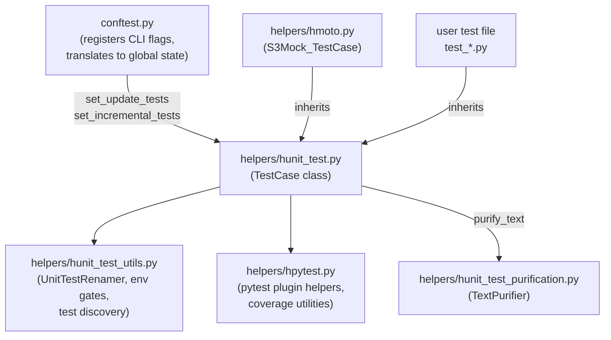
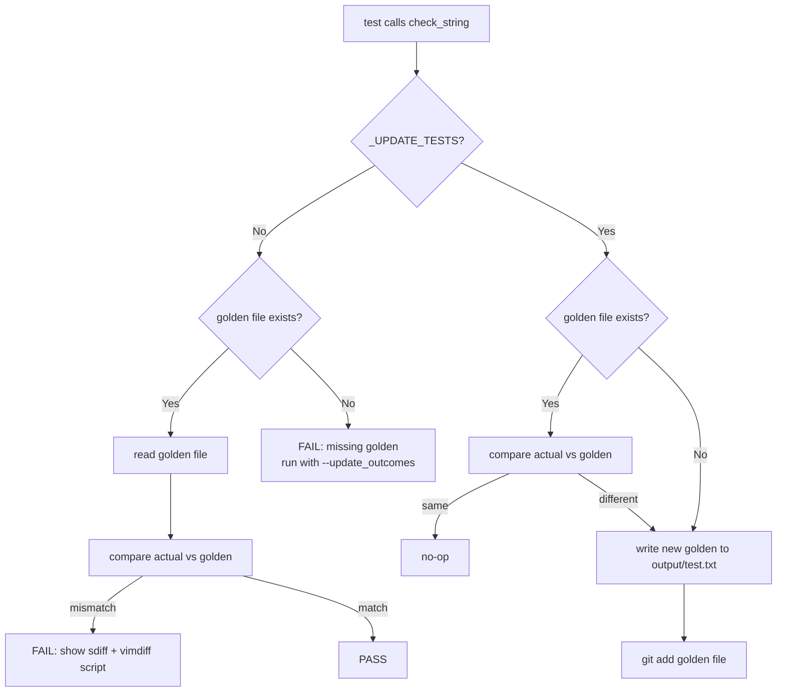

# Unit Test Framework
<!-- toc -->

- [Summary](#summary)
- [Module Map](#module-map)
  - [`conftest.py` role](#conftestpy-role)
- [Why We Extend `unittest.TestCase`](#why-we-extend-unittesttestcase)
  - [Reproducibility by default](#reproducibility-by-default)
  - [Golden file testing](#golden-file-testing)
  - [Consistent directory layout](#consistent-directory-layout)
- [Why `set_up_test` Instead of `setUp`](#why-set_up_test-instead-of-setup)
- [Golden File Testing Design](#golden-file-testing-design)
  - [Why files on disk instead of inline expected strings](#why-files-on-disk-instead-of-inline-expected-strings)
  - [How `--update_outcomes` works end-to-end](#how---update_outcomes-works-end-to-end)
- [Test Speed Tiers](#test-speed-tiers)
- [Development Tools](#development-tools)
  - [`UnitTestRenamer`](#unittestrenamer)
- [Further Reading](#further-reading)

<!-- tocstop -->

## Summary
- This document explains the **design decisions** behind our unit testing
  framework
- It answers the "why" questions; the "how-to" questions are covered in the
  companion guides:
  - [`all.write_unit_tests.how_to_guide.md`](/helpers/test/docs/all.write_unit_tests.how_to_guide.md)
  - [`all.run_unit_tests.how_to_guide.md`](/helpers/test/docs/all.run_unit_tests.how_to_guide.md)
- Our framework is built on top of the standard `unittest`/`pytest` stack and
  adds three main capabilities:
  1. **Reproducibility**: fixed random seeds, pandas display defaults, and timer
     measurement are set automatically before each test
  2. **Golden file testing**: test output is compared against a reference file
     stored in the repo rather than an inline expected string in the code
  3. **Standard directory layout**: every test class gets its own
     `input/`, `output/`, and `scratch/` directories derived from its name


## Module Map
The framework spans the following files:


| File | Role |
|------|------|
| `helpers/hunit_test.py` | Core `TestCase` base class — golden files, directory helpers, comparison methods |
| `helpers/hunit_test_utils.py` | Utilities — `UnitTestRenamer`, environment gates, test file discovery, `capture_system_calls()` |
| `helpers/hpytest.py` | Pytest plugin helpers and coverage utilities |
| `helpers/hunit_test_purification.py` | `TextPurifier` — strips machine-specific noise (paths, usernames) when `purify_text=True` |
| `helpers/hmoto.py` | `S3Mock_TestCase` — base class for tests that mock AWS S3 via `moto` |
| `conftest.py` | Wires pytest command-line flags into global variables in `hunit_test.py` |

### `conftest.py` Role
- `conftest.py` uses two standard pytest hooks to connect CLI flags to our
  framework:
  1. `pytest_addoption` — registers custom options:
     `--update_outcomes`, `--incremental`, `--update_llm_cache`,
     `--dbg_verbosity`
  2. `pytest_configure` — called after option parsing; translates the flags
     into calls that set global state in `hunit_test.py`:
     ```python
     hunitest.set_update_tests(True)      # --update_outcomes
     hunitest.set_incremental_tests(True) # --incremental
     hllm.set_update_llm_cache(True)      # --update_llm_cache
     ```
- This design keeps the flag registration close to the test runner (conftest)
  while keeping the actual behaviour in the library (`hunit_test.py`), so
  library code can read the flags without importing pytest directly


## Why We Extend `unittest.TestCase`

### Reproducibility by Default
- Floating-point operations, pandas display options, and matplotlib state vary
  across machines and library versions
- Our `TestCase.setUp()` runs before every test and:
  - Resets `random.seed` and `numpy.random.seed` to a fixed value (`20000101`)
  - Sets all `pandas` display options to known defaults (column widths, max
    rows, float precision, etc.)
  - Replaces `matplotlib.pyplot.show` with a no-op so tests never open a
    window
  - Starts a timer and prints elapsed time in `tearDown()` for visibility
- These resets happen without any user action — a test that inherits from
  `hunitest.TestCase` gets reproducibility for free

### Golden File Testing
- Instead of writing `self.assertEqual(actual, expected_string)` with long
  inline expected strings that make code hard to read, we store the expected
  output in a file on disk
- This makes it trivial to update expected outputs when behaviour changes
  intentionally (`--update_outcomes`), and it turns regressions into clear,
  diffable failures
- See [Golden File Testing Design](#golden-file-testing-design) below for details

### Consistent Directory Layout
- Every test has predictable directories derived from its class and method name:
  - `outcomes/TestFoo1.test_bar/input/` — static fixtures checked into git
  - `outcomes/TestFoo1.test_bar/output/` — golden files checked into git
  - `scratch/TestFoo1.test_bar/` — ephemeral artefacts deleted after the test
- This means anyone can find a test's data without reading the test code


## Why `set_up_test` Instead of `setUp`
- The standard `unittest.TestCase` provides `setUp()` / `tearDown()` hooks
- When pytest runs `unittest` tests, it wraps them in a compatibility layer; if
  both our base `TestCase.setUp()` and a subclass `setUp()` call `super()`, the
  call chain can produce double-setup or double-teardown bugs that are hard to
  diagnose
- Our solution: **never override `setUp`/`tearDown` in user test classes**
  - User setup code goes in `set_up_test()` / `tear_down_test()`
  - These are called from a `@pytest.fixture(autouse=True)` named
    `setup_teardown_test`, which guarantees teardown runs even if the test
    fails:
  ```python
  @pytest.fixture(autouse=True)
  def setup_teardown_test(self):
      self.set_up_test()
      yield
      self.tear_down_test()
  ```

- The `yield` in the fixture ensures `tear_down_test()` always runs, whereas a
  bare `setUp/tearDown` pair may skip teardown on test failure in some pytest
  versions
- For nested test hierarchies (parent/child test classes that both need setup),
  we add a numeric suffix: `set_up_test2()` in the child calls `set_up_test()`
  from the parent, avoiding fixture name collisions


## Golden File Testing Design

### Why Files on Disk Instead of Inline Expected Strings
| Inline expected string | Golden file |
|------------------------|-------------|
| Inline in test code — hard to read for large outputs | Stored as `output/test.txt` — easy to open and inspect |
| Must be updated manually by editing the test file | Updated automatically by running with `--update_outcomes` |
| Diff shown only in pytest output | Full diff available via the auto-generated vimdiff script |
| Hard to review in a PR for large outputs | Easy to review a separate `.txt` file change |

- The golden file approach is especially valuable when the output is a formatted
  DataFrame, a config object, or a multi-line report — things where a typo in
  the inline expected string is easy to miss

### How `--update_outcomes` Works End-to-end
1. Developer changes code that affects a test's output
2. Running `pytest` without flags → test fails with a diff
3. Developer confirms the new output is correct
4. Developer runs `pytest --update_outcomes` (or `i run_fast_tests --pytest-opts="--update_outcomes"`)
5. `conftest.py` calls `hunitest.set_update_tests(True)`
6. In `check_string()`: the actual output is written to `output/test.txt` and
   the file is staged via `git add`
7. Developer commits the updated golden file as part of the PR



## Test Speed Tiers
- Tests are classified by expected execution time using pytest markers

| Tier | Marker | Timeout | When to run |
|------|--------|---------|-------------|
| Fast | _(no marker)_ | 5 s | Every commit / PR |
| Slow | `@pytest.mark.slow` | 30 s | Before merging; after changes to slow areas |
| Superslow | `@pytest.mark.superslow` | 3600 s | Scheduled CI; long simulations |

- The classification is enforced by `pytest-timeout`
- `pytest-rerunfailures` re-runs timed-out fast tests twice and slow/superslow
  tests once to reduce flakiness from transient timing issues
- Additional markers for infrastructure requirements:
  - `@pytest.mark.requires_ck_infra` — needs CK cloud infra
  - `@pytest.mark.requires_ck_aws` — needs AWS connection
  - `@pytest.mark.requires_docker_in_docker` — needs Docker-in-Docker


## Development Tools

### `UnitTestRenamer`
- When a test class or method is renamed, both the Python source and the
  corresponding `outcomes/` directories on disk must be updated in sync
- `hunit_test_utils.UnitTestRenamer` automates this refactoring
  ```python
  import helpers.hunit_test_utils as hunteuti

  renamer = hunteuti.UnitTestRenamer(
      old_test_name="TestFooBar1",
      new_test_name="TestBazQux1",
      root_dir=".",
  )
  renamer.run()
  ```
  - Renames occurrences of `TestFooBar1` to `TestBazQux1` in every Python
    source file under `root_dir`
  - Renames the `outcomes/TestFooBar1.*/` directories to match the new name
  - Safe to run as a dry-run first by inspecting what it would change before
    calling `run()`

- The class enforces that both names start with `Test` and are different; if
  either constraint is violated it raises an assertion error early


## Further Reading
- [`all.write_unit_tests.how_to_guide.md`](/helpers/test/docs/all.write_unit_tests.how_to_guide.md)
  — how to write tests, naming conventions, mocking guidelines
- [`all.run_unit_tests.how_to_guide.md`](/helpers/test/docs/all.run_unit_tests.how_to_guide.md)
  — how to run tests, coverage, GH Actions
- [`helpers/hunit_test.py`](/helpers/hunit_test.py) — `TestCase` source
- [`helpers/hunit_test_utils.py`](/helpers/hunit_test_utils.py) —
  `UnitTestRenamer`, environment gates, test file discovery
- [Diataxis documentation framework](/docs/documentation_meta/all.diataxis.explanation.md)
