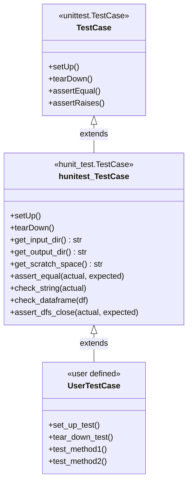
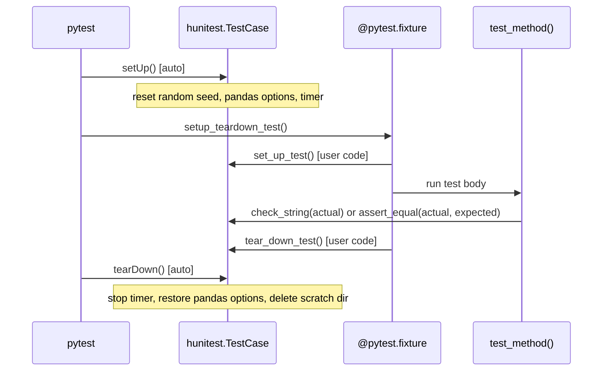

# Write Unit Tests
<!-- toc -->

- [Guidelines about writing unit tests](#guidelines-about-writing-unit-tests)
  - [What is a unit test?](#what-is-a-unit-test)
  - [Why is unit testing important?](#why-is-unit-testing-important)
  - [The Pragmatic Programming and unit testing](#the-pragmatic-programming-and-unit-testing)
  - [Unit testing tips](#unit-testing-tips)
  - [Conventions](#conventions)
    - [Naming and placement conventions](#naming-and-placement-conventions)
    - [Test code hygiene](#test-code-hygiene)
    - [Testing code layout](#testing-code-layout)
    - [Our framework to test using input / output data](#our-framework-to-test-using-input--output-data)
    - [Framework architecture diagrams](#framework-architecture-diagrams)
      - [`hunitest.TestCase` class hierarchy](#hunitesttestcase-class-hierarchy)
      - [Test lifecycle](#test-lifecycle)
      - [Golden file flow (`check_string`)](#golden-file-flow-check_string)
    - [DataFrame and Series assertion helpers](#dataframe-and-series-assertion-helpers)
    - [Test data rules](#test-data-rules)
    - [`check_string` vs `self.assertEqual`](#check_string-vs-selfassertequal)
    - [How to split unit test code in files](#how-to-split-unit-test-code-in-files)
    - [Template for unit test](#template-for-unit-test)
    - [Hierarchical `TestCase` approach](#hierarchical-testcase-approach)
    - [Assertion and comparison rules](#assertion-and-comparison-rules)
    - [In general, you want to budget the time to write unit tests](#in-general-you-want-to-budget-the-time-to-write-unit-tests)
    - [Write a template of unit tests and ask for a review if you are not sure how what to test](#write-a-template-of-unit-tests-and-ask-for-a-review-if-you-are-not-sure-how-what-to-test)
    - [Interesting testing functions](#interesting-testing-functions)
    - [Setup and teardown](#setup-and-teardown)
    - [Use setUpClass / tearDownClass](#use-setupclass--teardownclass)
- [Environment-conditional test skipping](#environment-conditional-test-skipping)
- [Update test tags](#update-test-tags)
- [Mocking](#mocking)
- [Helper base classes for testing `__repr__` / `__str__`](#helper-base-classes-for-testing-__repr__--__str__)
- [QA Testing outside Docker](#qa-testing-outside-docker)

<!-- tocstop -->

## Guidelines About Writing Unit Tests

### What Is a Unit Test?
- A unit test is a small, self-contained test of a (public) function or method
  of a library
- The test specifies the given inputs, any necessary state, and the expected
  output
- Running the test ensures that the actual output agrees with the expected
  output

### Why Is Unit Testing Important?
- Good unit testing improves software quality by:
  - Eliminating bugs (obvious)
  - Clarifying code design and interfaces ("Design to Test")
  - Making refactoring safer and easier ("Refactor Early, Refactor Often")
  - Documenting expected behavior and usage

### The Pragmatic Programming and Unit Testing
- Unit testing is an integral part of
  [The Pragmatic Programming](https://pragprog.com/titles/tpp20/the-pragmatic-programmer-20th-anniversary-edition/)
  approach

- Some of the tips that relate to unit testing are:
  - Design with Contracts
  - Refactor Early, Refactor Often
  - Test Your Software, or Your Users Will
  - Coding Ain't Done Till All the Tests Run
  - Test State Coverage, Not Code Coverage
  - You Can't Write Perfect Software
  - Crash Early
  - Design to Test
  - Test Early. Test Often. Test Automatically
  - Use Saboteurs to Test Your Testing
  - Find Bugs Once

- Read these wisdom pearls carefully and you will have made another step towards
  programming mastery

### Unit Testing Tips
- See actionable design principles (test one thing, self-contained tests,
  outside-in approach, script end-to-end testing) in
  [`testing.design — Test Design Principles`](/.claude/skills/testing.design/SKILL.md#test-design-principles)

### Conventions

#### Naming and Placement Conventions
- Tests live in `test/test_<module>.py` alongside the code they test
- Class and method naming follows discoverable conventions; see the full
  rules (including double-underscore pattern and the required `1` suffix) in
  [`testing.rules.md — Naming Conventions`](/.claude/skills/testing.rules.md#naming-conventions)

#### Test Code Hygiene
- See sync and quality rules in
  [`testing.design — Test Code Hygiene`](/.claude/skills/testing.design/SKILL.md#test-code-hygiene)

#### Testing Code Layout
- See file and directory placement rules in
  [`testing.rules.md — File Placement`](/.claude/skills/testing.rules.md#file-placement)

#### Our Framework to Test Using Input / Output Data
- See directory helpers and test-mode utilities in
  [`testing.rules.md`](/.claude/skills/testing.rules.md)
- See `check_string` and other assertion helpers in
  [`testing.assertions`](/.claude/skills/testing.assertions/SKILL.md)

#### Framework Architecture Diagrams

##### `hunitest.TestCase` Class Hierarchy

##### Test Lifecycle
- Each test method goes through a fixed lifecycle managed jointly by
  `unittest`/`pytest` and our framework

##### Golden File Flow (`check_string`)
- `check_string()` compares actual output against a frozen reference file stored
  in `outcomes/<TestClass.test_method>/output/test.txt`
- See the full decision flowchart in
  [Unit Test Framework Architecture — Golden File Testing Design](/helpers/test/docs/all.unit_test_framework.explanation.md#golden-file-testing-design)

#### DataFrame and Series Assertion Helpers
- `hunitest.TestCase` provides structured assertion helpers for pandas objects:
  `check_df_output`, `check_srs_output`, `assert_dfs_close`, `check_dataframe`
- See usage rules and full signatures in
  [`testing.assertions — DataFrame and Series Assertions`](/.claude/skills/testing.assertions/SKILL.md#dataframe-and-series-assertions)

#### Test Data Rules
- See text-vs-pickle and data size rules in
  [`testing.design — Test Data Rules`](/.claude/skills/testing.design/SKILL.md#test-data-rules)

#### `check_string` Vs `self.assertEqual`
- Use `assert_equal()` for simple string comparisons; use `check_string()` for
  large, externalized, or behavioral-regression outputs
- See full decision rules in
  [`testing.rules.md — Use Golden File Testing for Large Outputs`](/.claude/skills/testing.rules.md#use-golden-file-testing-for-large-outputs)

#### How to Split Unit Test Code in Files
- Start with one `test_<dirname>.py`; split into `test_<module>.py` files only
  when the single file grows too large
- See the file-placement rule in
  [`testing.rules.md — File Placement`](/.claude/skills/testing.rules.md#file-placement)

#### Template for Unit Test
- See the canonical template and class/method naming rules in
  [`testing.rules.md — Unit Test Code Structure`](/.claude/skills/testing.rules.md#unit-test-code-structure)

#### Hierarchical `TestCase` Approach
- When tested classes have an inheritance hierarchy, mirror it in test classes:
  parent provides private `_test...` helpers; child provides public `test...` methods
- See the full pattern and separator convention in
  [`testing.rules.md — Hierarchical TestCase Pattern`](/.claude/skills/testing.rules.md#hierarchical-testcase-pattern)

#### Assertion and Comparison Rules
- Use the most specific assertion available (`assertLess`, `assertIn`, etc.)
  for informative failure messages
- Never use `hdbg.dassert` in test code
- See the full assertion pattern guide, exception testing, and string-vs-data
  structure rules in
  [`testing.rules.md — Assertion Patterns`](/.claude/skills/testing.rules.md#assertion-patterns)

#### In General, You Want to Budget the Time to Write Unit Tests
- E.g., "I'm going to spend 3 hours writing unit tests". This is going to help
  you focus on what's important to test and force you to use an iterative
  approach rather than incremental (remember the Monalisa)

  

#### Write a Template of Unit Tests and Ask for a Review If You Are Not Sure How What to Test
- Aka "testing plan"

#### Interesting Testing Functions
- List of useful testing functions are:
  - [General Python](https://docs.python.org/2/library/unittest.html#test-cases)
  - [Numpy](https://docs.scipy.org/doc/numpy-1.15.0/reference/routines.testing.html)
  - [Pandas](https://pandas.pydata.org/pandas-docs/version/0.21/api.html#testing-functions)

#### Setup and Teardown
- Use `set_up_test()` / `tear_down_test()` instead of `setUp()` / `tearDown()`
- For nested inheritance, add a numeric suffix at each level:
  `set_up_test2()` / `tear_down_test2()`, etc
- See the canonical fixture pattern and all nested inheritance cases in
  [`testing.rules.md — Setup and Teardown`](/.claude/skills/testing.rules.md#setup-and-teardown)

#### Use setUpClass / tearDownClass
- Use only when setup must run once per class (expensive: DB connection, large
  fixture); for per-test setup use `set_up_test()` / `tear_down_test()` instead
- See pattern and when-to-use rules in
  [`testing.rules.md — setUpClass / tearDownClass`](/.claude/skills/testing.rules.md#setupclass--teardownclass)

## Environment-conditional Test Skipping
- Use helpers from `helpers/hunit_test_utils.py` to skip tests in environments
  where they should not run (CI, macOS, a specific repo)
- See usage rules and the full function table in
  [`testing.speed — Environment-Conditional Skipping`](/.claude/skills/testing.speed/SKILL.md#environment-conditional-skipping)

## Update Test Tags
- See tag update rules in
  [`testing.rules.md — Update Test Tags`](/.claude/skills/testing.rules.md#update-test-tags)

## Mocking
- See philosophy, rules, and concrete patterns in
  [`testing.mocking`](/.claude/skills/testing.mocking/SKILL.md)

## Helper Base Classes for Testing `__repr__` / `__str__`
- Use `hunteuti.Obj_to_str_TestCase` (from
  [`/helpers/hunit_test_utils.py`](/helpers/hunit_test_utils.py)) to
  standardise tests for objects that implement `__repr__`, `__str__`, or
  `to_config_str()`
- See usage rules, MRO requirement, and method table in
  [`testing.assertions — Repr / Str Testing`](/.claude/skills/testing.assertions/SKILL.md#repr--str-testing)

## QA Testing Outside Docker
- Use `hunitest.QaTestCase` (from
  [`/helpers/hunit_test.py`](/helpers/hunit_test.py)) for tests that validate
  container behaviour from the host machine and must never run inside Docker
- See usage rules and the container-skip mechanism in
  [`testing.assertions — QA Testing`](/.claude/skills/testing.assertions/SKILL.md#qa-testing)
