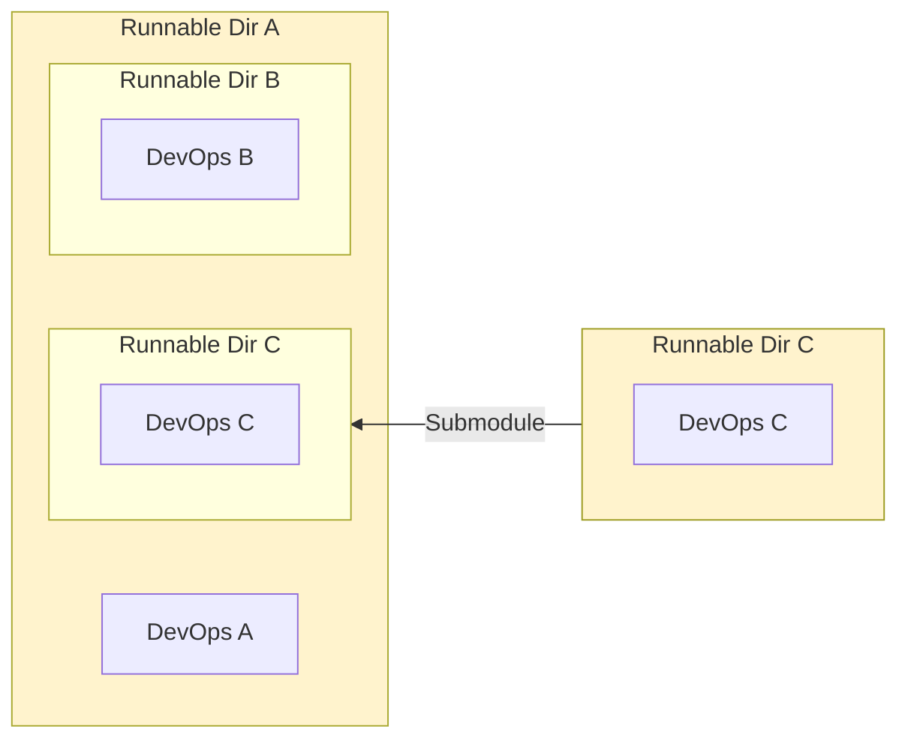
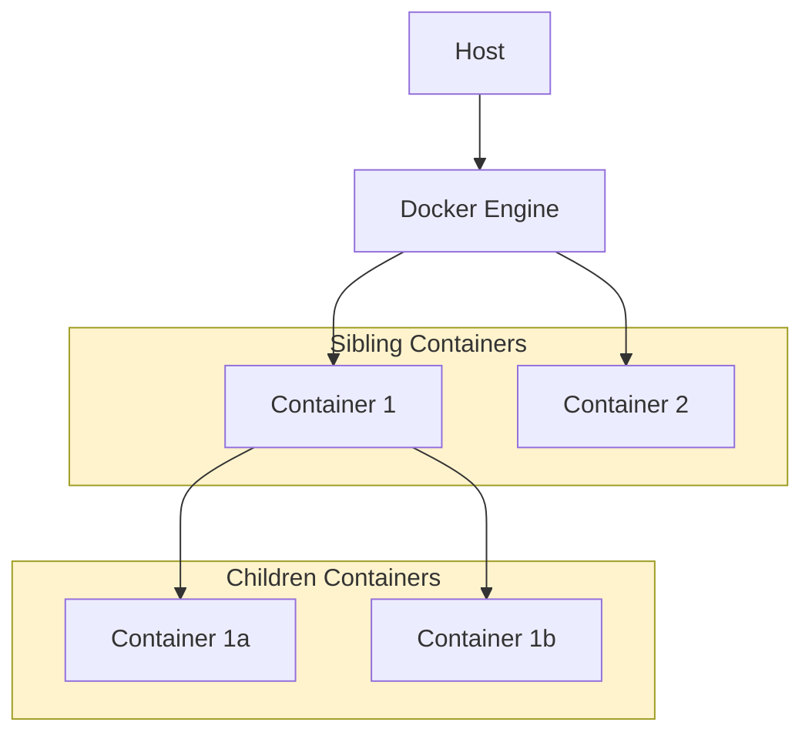
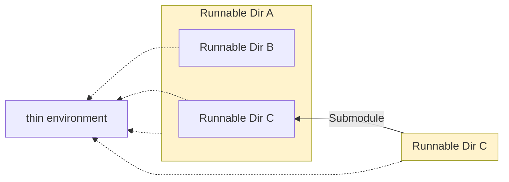
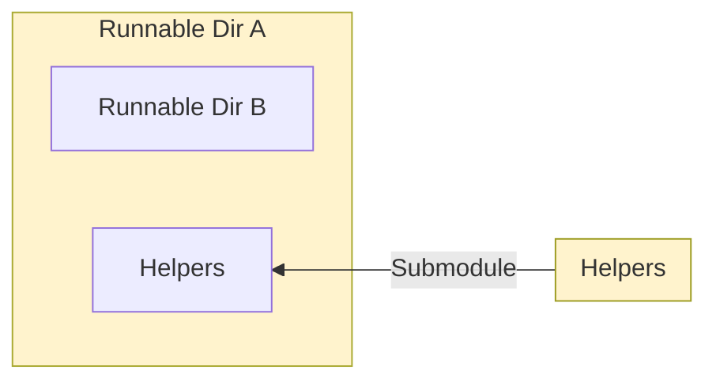
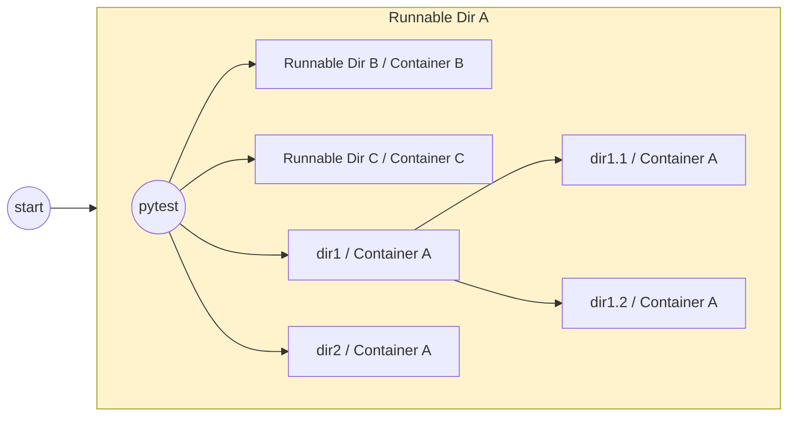

<!-- toc -->

- [Runnable Directories: The Solution to the Monorepo vs. Multi-repo Debate](#runnable-directories-the-solution-to-the-monorepo-vs-multi-repo-debate)
  * [1. Introduction](#1-introduction)
  * [2. Current landscape](#2-current-landscape)
    + [2.1. Monorepo](#21-monorepo)
    + [2.2. Multi-repo](#22-multi-repo)
    + [2.3. What is needed](#23-what-is-needed)
  * [3. Proposed approach](#3-proposed-approach)
    + [3.1. Overview](#31-overview)
    + [3.2. Runnable directory](#32-runnable-directory)
    + [3.3. Docker](#33-docker)
      - [3.3.1. Container-driven environment](#331-container-driven-environment)
      - [3.3.2. Stages of container development](#332-stages-of-container-development)
      - [3.3.3. Container interaction](#333-container-interaction)
    + [3.4. Thin environment](#34-thin-environment)
    + [3.5. Submodule of "helpers"](#35-submodule-of-helpers)
    + [3.6. Executing tests](#36-executing-tests)
    + [3.7. Dockerized executables](#37-dockerized-executables)
  * [4. Discussion](#4-discussion)
  * [Future directions](#future-directions)
  * [References](#references)

<!-- tocstop -->

# Runnable Directories: The Solution to the Monorepo vs. Multi-repo Debate

## 1. Introduction

Software development workflows are becoming more complex as they adapt to the
demands of large-scale systems and modern collaborative development practices.
As teams and codebases grow, companies face the challenge of organizing both
effectively. When it comes to structuring the codebase, two main approaches
emerge: monorepos and multi-repos[1]. Monorepos consolidate all code into a
single repository, simplifying version control but carrying a risk of
scalability and maintainability issues. Conversely, multi-repos store the code
in logically separated repositories, easier to manage and deploy but more
difficult to keep in sync.

In this paper, we present **Causify dev system**, an alternative hybrid
solution: a modular system architecture built around _runnable directories_.
Although independent, these directories maintain cohesion through shared tooling
and environments, offering a straightforward and scalable way to organize the
codebase while ensuring reliability in development, testing, and deployment.

In this paper, we first outline the current state-of-the-art (Section 2), then
describe our approach, with a particular focus on the containerized workflows
that support it (Section 3). We then discuss the strengths and limitations of
our approach compared to existing practices (Section 4), and conclude by
presenting potential avenues for future improvement (Section 5).

## 2. Current landscape

### 2.1. Monorepo

The monorepo approach involves storing all code for multiple applications within
a single repository. This strategy has been popularized by large tech companies
like Google[2], Meta[3], Microsoft[4] and Uber[5], proving that even codebases
with billions of lines of code can be effectively managed in a single
repository. The key benefits of this approach include:

- Consistency in environment: with everything housed in one repository, there's
  no risk of projects becoming incompatible due to conflicting versions of
  third-party packages.
- Simplified version control: there is a single commit history, which makes it
  easy to track and, if needed, revert changes globally.
- Reduced coordination overhead: developers work within the same repository,
  with easy access to all code, shared knowledge, tools and consistent coding
  standards.

However, as monorepo setups scale, users often face significant challenges. A
major downside is long CI/CD build times, as even small changes can trigger
massive rebuilds and tests throughout the entire codebase. To cope with this,
extra tooling, such as [Buck](https://buck2.build/) or
[Bazel](https://bazel.build/), must be configured, adding complexity to
workflows. Even something as simple as searching and browsing the code becomes
more difficult, often requiring specialized tools and IDE plug-ins.

Additionally, when everything is located in one place, it is harder to separate
concerns and maintain clear boundaries between projects. Managing permissions
also becomes more difficult when only selected developers should have access to
specific parts of the codebase.

### 2.2. Multi-repo

The multi-repo approach involves splitting code across several repositories,
with each one dedicated to a specific module or service. This modularity allows
teams to work independently on different parts of a system, making it easier to
manage changes and releases for individual components. Each repository can
evolve at its own pace, and developers can focus on smaller, more manageable
codebases.

However, the multi-repo strategy comes with its own set of challenges,
particularly when it comes to managing dependencies and ensuring version
compatibility across repositories. For instance, different repositories might
rely on two different versions of a third-party package, or even conflicting
packages, making synchronization complex or, in some cases, nearly impossible.
In general, propagating changes from one repository to another requires careful
coordination. Tools like [Jenkins](https://www.jenkins.io/) and
[GitHub Actions](https://github.com/features/actions) help streamline CI/CD
pipelines, but they often struggle when dealing with heterogeneous environments.

### 2.3. What is needed

An ideal strategy would combine the best of both worlds:

- The modularity of multi-repos, to keep the codebase scalable and simplify
  day-to-day development processes.
- The environment consistency of monorepos, to avoid synchronization issues and
  prevent errors that arise from executing code in misaligned environments.

Both are achieved through the hybrid approach proposed in this paper, which will
be discussed further in Section 3.

## 3. Proposed approach

### 3.1. Overview

In this section, we describe the design principles of our development system and
its supported functionalities:

- Runnable directories with code (Section 3.2) hosted on GitHub, with Git used
  for version control
- Shareable environments encapsulated in Docker containers (Section 3.3),
  ensuring alignment between development, deployment, and CI/CD systems, across
  various platforms and OSes
- A common lightweight (thin) virtual Python environment (Section 3.4) that
  packages essential dependencies to bootstrap workflows
- Composing code through Git submodules, including a specialized "helpers"
  submodule (Section 3.5) that provides a uniform development toolchain for all
  projects
- Maintaining shared files across separate repositories by utilizing symbolic
  links (Section 3.5) and automatic diffing
- Pipelines for extensive testing (Section 3.6) that adjust to the dependencies
  required by different directories
- "One-off" Docker containers created for running specific packages, referred to
  as "dockerized executables" (Section 3.7)

Many aspects of our approach are flexible and not strictly tied to particular
tools. For example, we use `poetry` for dependency management, but it can easily
be replaced with `conda` or another package manager.

### 3.2. Runnable directory

The core concept of the proposed approach is a **runnable directory** — a
self-contained, independently executable directory with code, equipped with a
dedicated DevOps setup. A GitHub repository is thus a special case of a runnable
directory. Developers typically work within a single runnable directory for a
given application, enabling them to test and deploy code without affecting other
parts of the codebase.

A runnable directory can contain other runnable directories as subdirectories.
For example, Figure 1 depicts three runnable directories: `A`, `B`, and `C`.
Here, `A` and `C` are repositories, with `C` incorporated into `A` as a
submodule, while `B` is a subdirectory within `A`. This setup provides the same
accessibility as if all the code were hosted in a single monorepo. Note that
each of `A`, `B`, and `C` has its own DevOps pipeline — a key feature of our
approach, which is discussed in more detail in Section 3.3.

Figure 1. Sample architecture of Causify's runnable directories.

### 3.3. Docker

#### 3.3.1. Container-driven environment

Docker is the backbone of our containerized development environment. Every
runnable directory contains Dockerfiles that allow it to build and run its own
Docker containers, which include the code, its dependencies, and the runtime
system. All of our Docker containers are versioned, with their version history
stored in changelog files.

This Docker-based approach addresses two important challenges. First, it ensures
consistency by isolating the application from variations in the host operating
system or underlying infrastructure. Our containers are compatible with
different OSes (Linux, macOS, Windows Subsystem for Linux) and support
multi-architecture builds (e.g., `x86` and `ARM`). Second, a specific package
(or package version) can be added to the container of a particular runnable
directory without affecting other parts of the codebase. This prevents
"bloating" the environment with packages required by all applications — a common
issue in monorepos — while also effectively mitigating the risk of conflicting
dependencies, which can arise in a multi-repo setup.

We simplify and standardize all workflows associated with containers — including
building, testing, retrieving, and deploying — by introducing Makefile-like
tools based on the Python `invoke` package.

#### 3.3.2. Stages of container development

Our approach supports multiple stages for container release:

- Local: used to work on updates to the container; accessible only to the
  developer who built it.
- Development: used by all team members in day-to-day development of new
  features.
- Production: used to run the system by end users.

This multi-stage workflow enables seamless progression from testing to system
deployment.

#### 3.3.3. Container interaction

Our systems ensure smooth interaction between different containers in our
infrastructure. Thus, development, testing, and deployment of multi-container
applications are supported through Docker Compose. It is also possible to run a
container within another container's environment in a Docker-in-Docker setup. In
this case, children containers are started directly inside a parent container,
allowing nested workflows or builds. Alternatively, sibling containers can run
side by side and share resources such as the host's Docker daemon, enabling
inter-container communication and orchestration.

Figure 2. Docker container flow.

### 3.4. Thin environment

To bootstrap development workflows, we use a thin client that installs a minimal
set of essential dependencies, such as Docker and invoke, in a lightweight
virtual environment. A single thin environment is shared across all runnable
directories which minimizes setup overhead (see Figure 3). This environment
contains everything that is needed to start development containers, which are in
turn specific to each runnable directory. With this approach, we ensure that
development and deployment remain consistent across different systems (e.g.,
server, personal laptop, CI/CD).

Figure 3. Thin environment shared across multiple runnable directories.

### 3.5. Submodule of "helpers"

All Causify repositories include a dedicated "helpers" repository as a
submodule. This repository contains common utilities and development toolchains,
such as the thin environment, Linter, Docker, and invoke workflows. By
centralizing these resources, we eliminate code duplication and ensure that all
teams, regardless of the project, use the same tools and procedures.

Additionally, it hosts symbolic link targets for files that must technically
reside in each repository but are identical across all of them (e.g., license
and certain configuration files). Manually keeping them in sync can be difficult
and error-prone over time. In our approach, these files are stored exclusively
in "helpers", and all other repositories utilize read-only symbolic links
pointing to them. This way, we avoid file duplication and reduce the risk of
introducing accidental discrepancies.

Figure 4. "Helpers" submodule integrated into a repository.

### 3.6. Executing tests

Our system features robust testing workflows that leverage the containerized
environment for comprehensive code validation. End-to-end and unit tests are
executed by `pytest` inside Docker containers to ensure consistency across
development and production environments, preventing discrepancies caused by
variations in host system configurations. Both Docker-in-Docker and sibling
container setup are supported. In the case of nested runnable directories, tests
are executed recursively within each directory's corresponding container, which
is automatically identified (see Figure 5). As a result, the entire test suite
can be run with a single command, while still allowing tests in subdirectories
to use dependencies that may not be compatible with the parent directory's
environment.

Figure 5. Recursive test execution in dedicated containers.

### 3.7. Dockerized executables

Sometimes, installing a package within a development container may not be
justified, particularly if it is large and will only be used occasionally. In
such cases, we use _dockerized executables_: when the package is needed, a
Docker container is dynamically created with only the specific dependencies
required for its installation. The package is then installed and executed within
the container, which is discarded once the task is complete. This prevents the
development environment from becoming bloated with dependencies that are rarely
used. If necessary, for example during test execution, a dockerized executable
can be run inside another Docker container, whether using the children or
sibling container approach.

## 4. Discussion

Causify's approach presents a strong alternative to existing code organization
solutions, offering scalability and efficiency for both small and large systems.

The proposed modular architecture is centered around runnable directories, which
operate as independent units with their own build and release lifecycles. This
design bypasses the bottlenecks common in large monorepos, where centralized
workflows can slow down CI/CD processes unless specialized tools like Buck or
Bazel are used. By leveraging Docker containers, we ensure consistent
application behavior across development, testing, and production environments,
avoiding problems caused by system configuration discrepancies. Dependencies are
isolated within each directory's dedicated container, reducing the risks of
issues that tight coupling or package incompatibility might create in a monorepo
or a multi-repo setup.

Unlike multi-repos, runnable directories can utilize shared utilities from
"helper" submodules, eliminating code duplication and promoting consistent
workflows across projects. They can even reside under a unified repository
structure which simplifies codebase management and reduces the overhead of
maintaining multiple repositories. With support for recursive test execution
spanning all components, runnable directories allow for end-to-end validation of
the whole codebase through a single command, removing the need for testing each
repository separately.

There are, however, several challenges that might arise in the adoption of our
approach. Teams that are unfamiliar with containerized environments may need
time and training to effectively transition to the new workflows. The reliance
on Docker may introduce additional resource demands, particularly when running
multiple containers concurrently on development machines. This would require
further optimization, possibly aided by customized tooling. These adjustments,
while ultimately beneficial, can add complexity to the system's rollout and
necessitate ongoing maintenance to ensure seamless integration with existing
CI/CD pipelines and development practices.

## Future directions

Looking ahead, there are several areas where the proposed approach can be
improved. One direction is the implementation of dependency-aware caching to
ensure that only the necessary components are rebuilt or retested when changes
are made. This would reduce the time spent on development tasks, making the
overall process more efficient. Further optimization could involve designing our
CI/CD pipelines to execute builds, tests, and deployments for multiple runnable
directories in parallel, which would allow us to take full advantage of
available compute resources.

Additional measures can also be taken to enhance security. Integrating automated
container image scanning and validation before deployment would help guarantee
compliance with organizational policies and prevent vulnerabilities from
entering production environments. In addition, fine-grained access controls
could be introduced for runnable directories in order to safeguard sensitive
parts of the codebase. These steps will bolster both the security and efficiency
of our workflows as the projects continue to scale.

## References

- [1]
  [Mono vs. multi-repo](https://free.gitkraken.com/hubfs/Mono_v_Multi-Repo_debate_2023.pdf)
- [2]
  [Why Google stores billions of lines of code in a single repository](https://dl.acm.org/doi/10.1145/2854146)
- [3]
  [What it is like to work in Meta's (Facebook's) monorepo](https://blog.3d-logic.com/2024/09/02/what-it-is-like-to-work-in-metas-facebooks-monorepo/)
- [4]
  [Microsoft: How "Mono-repo" and "One Infra" Help Us Deliver a Better Developer Experience](https://devblogs.microsoft.com/appcenter/how-mono-repo-and-one-infra-help-us-deliver-a-better-developer-experience/)
- [5]
  [Uber: Faster Together: Uber Engineering's iOS Monorepo](https://www.uber.com/blog/ios-monorepo/)
