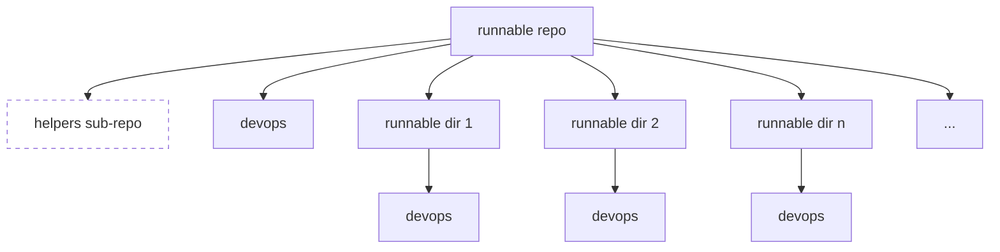
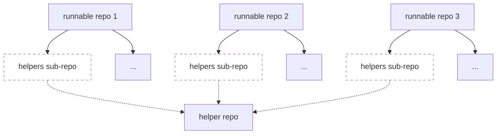
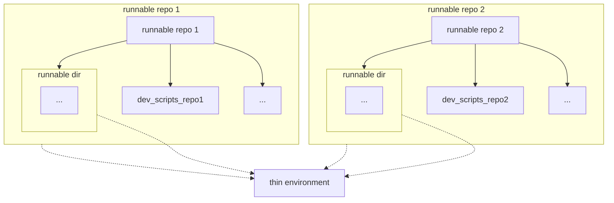
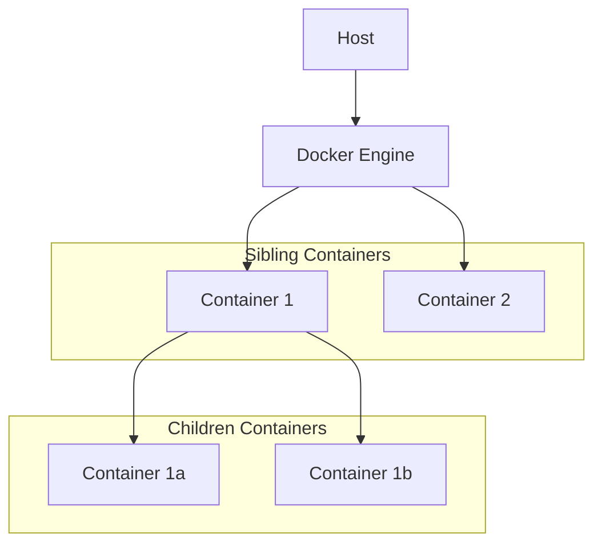

## Title

Modular Development Environments Using Runnable Repositories

Containerized Development Environments with Runnable Directories

## Abstract

- Modern software development requires scalable, modular, reproducible, and
  portable development environments to manage dependencies, facilitate
  collaboration, and ensure consistency in the development, testing, and
  deployment of applications.

- This paper introduces runnable directories, a modular system architecture that
  leverages lightweight containerized development environments to streamline
  software development, testing, and deployment.

- We explore the architecture of runnable directories, discuss the use of thin
  environments to bootstrap a minimal development environment for running our
  containerized development environment, and detail the containerized workflows
  that underpin the system.

- Our solution improves maintainability, testing reliability, and scalability,
  offering a robust alternative to current state-of-the-art practices.

## Introduction

- Software development workflows have grown increasingly complex with the advent
  of large-scale systems and collaborative development practices.

- Ensuring consistency across development, testing, and production environments
  requires robust tooling and architecture.

- Traditional mono-repos aggregate all code into a single repository,
  simplifying version control but often leading to scalability and
  maintainability issues.

- Conversely, multi-repos promote modularity but introduce challenges in
  dependency management and synchronization.

- This paper introduces a solution centered on runnable repositories and
  directories which offers a hybrid solution, which provides modularity while
  retaining cohesion through shared tooling and environments.

- The system allows for independent development and testing within a unified
  architecture by employing runnable directories with self-contained
  configurations.

## Problem statement

### Scalability in Development

- Mono-repos become monolithic and difficult to manage as codebases grow,
  leading to inefficiencies in CI/CD pipelines.

- Multi-repos require complex dependency management and synchronization across
  repositories.

### Consistency in Environment

- Ensuring consistent environments across developer workstations, CI pipelines,
  and production systems is challenging.

- Misaligned environments result in errors when the code is executed in
  different environments.

## State of the art

### Mono-repo vs Multi-repo

#### Mono-repo

- All code resides in a single repository, simplifying version control and
  reducing coordination overhead.

- Popularized by companies like Google and Facebook, mono-repos facilitate
  large-scale collaboration but lead to challenges like long CI/CD build times
  and difficulty in separating concerns.

**REF**

- [Why Google stores billions of lines of code in a single repository](https://dl.acm.org/doi/10.1145/2854146)

- [What it is like to work in Meta’s (Facebook’s) monorepo](https://blog.3d-logic.com/2024/09/02/what-it-is-like-to-work-in-metas-facebooks-monorepo/)

#### Multi-repo

- Code is split across multiple repositories, each representing a modular
  component or service.

- While modular, this approach introduces challenges in dependency
  synchronization, version compatibility, and configuration management.

### Existing Solutions

- CI/CD Systems: Tools like Jenkins and GitHub Actions streamline pipelines but
  often struggle with heterogeneous environments

- Monorepo Tooling: Tools such as Bazel and Buck address scalability issues but
  are complex to configure.
  - Buck by Meta: [https://buck2.build/](https://buck2.build/)
  - Bazel by Google: [https://bazel.build/](https://bazel.build/)

## Solution

### Runnable repository and runnable directories

#### Runnable repositories

- Runnable repositories are self-contained directories, each equipped with a
  dedicated DevOps directory.

- Every repository includes Docker files for containerizing its specific
  application to ensure consistency and portability across development and
  production environments

- This design ensures modularity by allowing independent development, testing,
  and deployment for each repository.

#### Runnable directories

- Runnable directories are specialized subdirectories, often part of a
  super-repo, designed to be independently executable with their own DevOps
  setups.

- Runnable directories can build and run their own Docker containers, tailored
  to their specific dependencies and requirements.

- As part of a larger repository, these directories leverage shared resources
  (e.g., helper sub-repositories) while maintaining their independence.

- Developers can test and deploy code from the runnable directory without
  impacting other parts of the repository.

- Each directory can customize Dockerfiles, scripts, and configurations to align
  with its specific needs​​​.



### Helper submodule

- A helper submodule can be set up to provide common utilities and development
  toolchains (e.g., thin environment, Docker, setenv, invoke workflows) shared
  by all the repositories.



### Thin environment

- Thin environments serve as lightweight Python virtual environments containing
  only the essential dependencies to bootstrap development workflows.

- This setup reduces the effort required to manage and synchronize dependencies
  across various systems

- Thin environments can be shared across repositories which minimizes setup
  overhead.



### Docker containers

- Docker is the backbone of our containerized development environment.

- Docker containers facilitate the creation of our reproducible, scalable, and
  portable environments

Key attributes include:

- Multi-Stage Workflows: Support for local, development, and production stages
  allows seamless progression from testing to deployment.

- Multi-Architecture Support: Ensures compatibility across diverse systems, such
  as x86 and ARM architectures.

- Isolation and Consistency: Each container packages the application code, its
  dependencies, and the runtime environment. This ensures consistent behavior
  across different systems, isolating the application from variations in the
  host operating system or underlying infrastructure​​​.

### Support for Children and Sibling Containers

- Children Containers: Containers that operate within another container’s
  environment, allowing nested workflows or builds to occur inside a parent
  container.

- Sibling Containers: Containers that run side by side and share resources such
  as the host's Docker daemon, enabling inter-container communication and
  orchestration​​.



### Executing tests

The system supports robust testing workflows that leverage the containerized
environment to provide comprehensive validation of code and configurations.

- Container-Based Testing: Tests are executed inside Docker containers to ensure
  consistency between development, testing, and production environments. This
  reduces discrepancies caused by differing host system configurations.

- Recursive Testing: The framework allows recursive test execution across
  multiple runnable directories. Each directory’s corresponding container is
  automatically identified and utilized for test execution.

- Support for Sibling and Children Containers: Tests can span sibling containers
  (running side-by-side) and children containers (nested containers).

Running tests for a runnable repo

  ```mermaid
  graph LR
    start((start))
    start --> container
    subgraph container[Container]
      direction LR
      pytest((pytest))
      pytest --> dir_1[dir 1]
      dir_1 --> dir_1a[dir 1a]
      dir_1a --> dir_1a_others[...]
      dir_1 --> dir_1b[dir 1b]
      dir_1 --> dir_1_others[...]
      pytest --> dir_2[dir 2]
      pytest --> dir_others[...]
    end
  ```

Running tests for runnable dirs

  ```mermaid
  graph LR
      start((start))
      start --> container_1
      start --> container_2
      start --> container_3
      start --> container_n
      subgraph container_1[container 1]
          direction LR
          pytest_1((pytest)) --> runnable_dir1[runnable dir 1]
      end
      subgraph container_2[container 2]
          direction LR
          pytest_2((pytest)) --> runnable_dir2[runnable dir 2]
      end
      subgraph container_3[container 3]
          direction LR
          pytest_3((pytest)) --> runnable_dir3[runnable dir 3]
      end
      subgraph container_n[container N]
          direction LR
          pytest_n((pytest)) --> runnable_dir_n[runnable dir N]
      end
  ```
## Discussion/Comment

The adoption of a containerized development environment centered around runnable
directories serves as a robust alternative approach to managing modern software
projects. This section discusses the broader implications, benefits, and
potential challenges of this appraoch.

### Strengths

- Enhanced Modularity: The introduction of runnable directories fosters a highly
  modular system where each directory operates as an independent unit. This
  modularity not only simplifies development but also enhances maintainability
  and scalability.

- Improved Workflow Efficiency: By decentralizing responsibility and leveraging
  Docker-based workflows, this approach mitigates bottlenecks commonly
  associated with mono-repos while reducing the redundancy inherent in
  multi-repo setups.

-

- Consistency Across Environments: Docker containers ensure that applications
  behave consistently across local development, testing, and production
  environments. This eliminates common issues stemming from discrepancies in
  system configurations.

- Streamlined Testing: Recursive testing workflows that align with the runnable
  directory structure make it easier to validate both isolated and integrated
  components. This approach ensures robustness without requiring excessive
  manual intervention.

- Flexibility in Scaling: The system is well-suited for both small-scale
  projects and large-distributed systems. Features like multi-architecture
  support and the ability to execute sibling and children container workflows
  enhance its adaptability to diverse use cases.

### Comparative Advantages

#### over the mono-repo approach

- Runnable directories allow individual components to maintain their own DevOps
  configurations, enabling independent development, testing, and deployment.
  This avoids the bottlenecks common in large mono-repos where centralized
  workflows can slow down CI/CD processes.

- By isolating dependencies within directories, runnable directories mitigate
  the tight coupling seen in mono-repos. This minimizes the risk of changes in
  one component inadvertently affecting others.

- Runnable directories reduce the need for advanced mono-repo tools like Bazel
  or Buck.

#### over the mono-repo approach

As an improvement to multi-repos, runnable directories

- Runnable directories can leverage shared utilities such as helper
  sub-repositories and thin environments. This reduces redundancy and ensures
  consistency across projects.

- Runnable directories reside under a unified super-repo structure which
  simplifies codebase management and reduces the overhead of maintaining
  multiple repositories.

- Runnable directories support recursive testing workflows that span across
  components of the system.

### Challenges and Considerations

- Learning Curve: Teams unfamiliar with containerized environments may require
  time and training to adopt this approach effectively.

- Maintenance of Dependencies: While isolation reduces coupling, it also
  introduces the challenge of ensuring compatibility between components,
  especially for projects with multiple interdependencies.

- Resource Overheads: The reliance on Docker may introduce additional system
  resource requirements, particularly when running multiple containers
  concurrently on development machines.

- Tooling Integration: While the approach reduces the need for advanced
  mono-repo tools, ensuring seamless integration with existing CI/CD pipelines
  and developer workflows might necessitate additional customization.

### Future Directions

#### Caching Mechanisms

- Use dependency-aware caching to ensure only necessary components are rebuilt
  or retested when changes are made.

#### Parallel Execution

- Design CI/CD pipelines to execute builds, tests, and deployments for multiple
  runnable directories simultaneously

#### Security Enhancement

- Scan and validate container images before deployment to ensure compliance with
  organizational policies

- Introduce fine-grained access controls for runnable directories

## Conclusion

## Reference

How big techs have been doing it

- [Why Google stores billions of lines of code in a single repository](https://dl.acm.org/doi/10.1145/2854146)

- [What it is like to work in Meta’s (Facebook’s) monorepo](https://blog.3d-logic.com/2024/09/02/what-it-is-like-to-work-in-metas-facebooks-monorepo/)

- [Microsoft: How "Mono-repo" and "One Infra" Help Us Deliver a Better Developer Experience](https://devblogs.microsoft.com/appcenter/how-mono-repo-and-one-infra-help-us-deliver-a-better-developer-experience/)

- [Netflix: Towards true continuous integration: distributed repositories and dependencies](https://netflixtechblog.com/towards-true-continuous-integration-distributed-repositories-and-dependencies-2a2e3108c051)

- [Meta: Build faster with Buck2: Our open source build system](https://engineering.fb.com/2023/04/06/open-source/buck2-open-source-large-scale-build-system/)

- [Uber: Faster Together: Uber Engineering’s iOS Monorepo](https://www.uber.com/blog/ios-monorepo/)

Mono repo vs multi repo

- [https://monorepo.tools/](https://monorepo.tools/)

- [MONO VS MULTI-REPO](https://free.gitkraken.com/hubfs/Mono_v_Multi-Repo_debate_2023.pdf)

More curated resources

- [https://github.com/korfuri/awesome-monorepo](https://github.com/korfuri/awesome-monorepo)

- [https://www.monorepo.party/](https://www.monorepo.party/)
