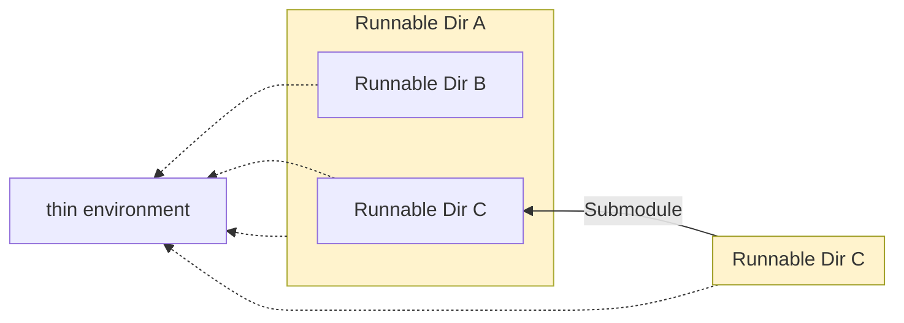
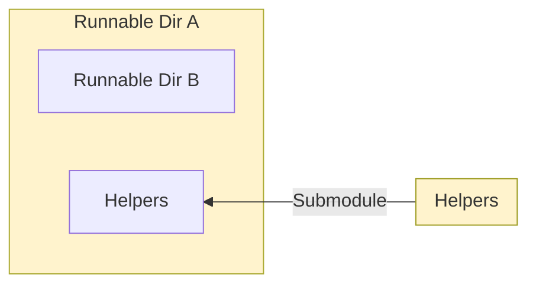
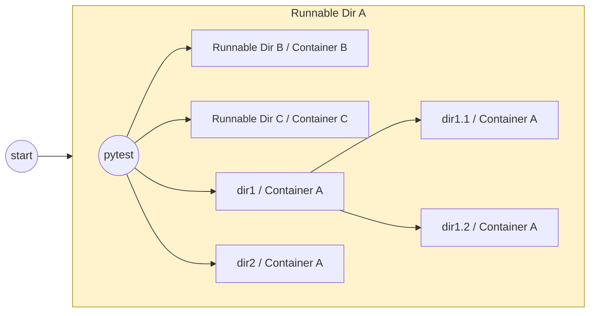

# Runnable Directories: The Solution to the Monorepo vs. Multi-repo Debate

## 1. Introduction

Software development workflows are becoming more complex as they adapt to the
demands of large-scale systems and modern collaborative development practices.
As teams and codebases grow, companies face the challenge of organizing both
effectively. When it comes to structuring the codebase, two main approaches
emerge: monorepos and multi-repos[1]. Monorepos consolidate all code into a
single repository, simplifying version control but carrying a risk of
scalability and maintainability issues. Conversely, multi-repos store the code
in logically separated repositories, easier to manage and deploy but more
difficult to keep in sync.

In this paper, we propose Causify dev system, an alternative hybrid solution: a
modular system architecture built around _runnable directories_. Although
independent, these directories maintain cohesion through shared tooling and
environments, offering a straightforward and scalable way to organize the
codebase while ensuring reliability in development, testing, and deployment.

In this paper, we first outline the current state-of-the-art (Section 2), then
describe our approach, with a particular focus on the containerized workflows
that support it (Section 3). We then discuss the strengths and limitations of
our approach compared to existing practices (Section 4), and conclude by
presenting potential avenues for future improvement (Section 5).

## 2. Current landscape

### 2.1. Monorepo

The monorepo approach involves storing all code for multiple applications within
a single repository. This strategy has been popularized by large tech companies
like Google[2], Meta[3], Microsoft[4] and Uber[5], proving that even codebases
with billions of lines of code can be effectively managed in a single
repository. The key benefits of this approach include:

- Consistency in environment: with everything housed in one repository, there's
  no risk of projects becoming incompatible due to conflicting versions of
  third-party packages.
- Simplified version control: there is a single commit history, which makes it
  easy to track and, if needed, revert changes globally.
- Reduced coordination overhead: developers work within the same repository,
  with easy access to all code, shared knowledge, tools and consistent coding
  standards.

However, as monorepo setups scale, users often face significant challenges. A
major downside is long CI/CD build times, as even small changes can trigger
massive rebuilds and tests throughout the entire codebase. To cope with this,
extra tooling, such as [Buck](https://buck2.build/) or
[Bazel](https://bazel.build/), must be configured, adding complexity to
workflows. Even something as simple as searching and browsing the code becomes
more difficult, often requiring specialized tools and IDE plug-ins.

Additionally, when everything is located in one place, it is harder to separate
concerns and maintain clear boundaries between projects. Managing permissions
also becomes more difficult when only selected developers should have access to
specific parts of the codebase.

### 2.2. Multi-repo

The multi-repo approach involves splitting code across several repositories,
with each one dedicated to a specific module or service. This modularity allows
teams to work independently on different parts of a system, making it easier to
manage changes and releases for individual components. Each repository can
evolve at its own pace, and developers can focus on smaller, more manageable
codebases.

However, the multi-repo strategy comes with its own set of challenges,
particularly when it comes to managing dependencies and ensuring version
compatibility across repositories. For instance, different repositories might
rely on two different versions of a third-party package, or even conflicting
packages, making synchronization complex or, in some cases, nearly impossible.
In general, propagating changes from one repository to another requires careful
coordination. Tools like [Jenkins](https://www.jenkins.io/) and
[GitHub Actions](https://github.com/features/actions) help streamline CI/CD
pipelines, but they often struggle when dealing with heterogeneous environments.

### 3.3. Thin environment

To bootstrap development workflows, we use a thin client that installs a minimal
set of essential dependencies, such as Docker and invoke, in a lightweight
virtual environment. A single thin environment is shared across all runnable
directories which minimizes setup overhead (see Figure 3). This environment
contains everything that is needed to start development containers, which are in
turn specific to each runnable directory. With this approach, we ensure that
development and deployment remain consistent across different systems (e.g.,
server, personal laptop, CI/CD).

Figure 3. Thin environment shared across multiple runnable directories.

### 3.4. Submodule of "helpers"

All Causify repositories include a dedicated "helpers" repository as a
submodule. This repository contains common utilities and development toolchains,
such as the thin environment, Linter, Docker, and invoke workflows. By
centralizing these resources, we eliminate code duplication and ensure that all
teams, regardless of the project, use the same tools and procedures.

Additionally, it hosts symbolic link targets for files that must technically
reside in each repository but are identical across all of them (e.g., license
and certain configuration files). Manually keeping them in sync can be difficult
and error-prone over time. In our approach, these files are stored exclusively
in "helpers", and all other repositories utilize read-only symbolic links
pointing to them. This way, we avoid file duplication and reduce the risk of
introducing accidental discrepancies.

Figure 4. "Helpers" submodule integrated into a repository.

#### 3.4.1. Git hooks

Our "helpers" submodule includes a set of Git hooks used to enforce policies
across our development process, including Git workflow rules, coding standards,
security and compliance, and other quality checks. These hooks are installed by
default when the user activates the thin environment. They perform essential
checks such as verifying the branch, author information, file size limits,
forbidden words, Python file compilation, and potential secret leaks...etc.

### 3.5. Executing tests

Our system supports robust testing workflows that leverage the containerized
environment for comprehensive code validation. Tests are executed inside Docker
containers to ensure consistency across development and production environments,
preventing discrepancies caused by variations in host system configurations. In
the case of nested runnable directories, tests are executed recursively within
each directory's corresponding container, which is automatically identified (see
Figure 5). As a result, the entire test suite can be run with a single command,
while still allowing tests in subdirectories to use dependencies that may not be
compatible with the parent directory's environment.

Figure 5. Recursive test execution in dedicated containers.

### 3.6. Dockerized executables

Sometimes, installing a package within a development container may not be
justified, particularly if it is large and will only be used occasionally. In
such cases, we use _dockerized executables_: when the package is needed, a
Docker container is dynamically created with only the specific dependencies
required for its installation. The package is then installed and executed within
the container, which is discarded once the task is complete. This prevents the
development environment from becoming bloated with dependencies that are rarely
used. If necessary, for example during test execution, a dockerized executable
can be run inside another Docker container, whether using the children or
sibling container approach, as discussed in Section 3.2.

## 4. Discussion

Causify's approach presents a strong alternative to existing code organization
solutions, offering scalability and efficiency for both small and large systems.

The proposed modular architecture is centered around runnable directories, which
operate as independent units with their own build and release lifecycles. This
design bypasses the bottlenecks common in large monorepos, where centralized
workflows can slow down CI/CD processes unless specialized tools like Buck or
Bazel are used. By leveraging Docker containers, we ensure consistent
application behavior across development, testing, and production environments,
avoiding problems caused by system configuration discrepancies. Dependencies are
isolated within each directory's dedicated container, reducing the risks of
issues that tight coupling or package incompatibility might create in a monorepo
or a multi-repo setup.

Unlike multi-repos, runnable directories can utilize shared utilities from
"helper" submodules, eliminating code duplication and promoting consistent
workflows across projects. They can even reside under a unified repository
structure which simplifies codebase management and reduces the overhead of
maintaining multiple repositories. With support for recursive test execution
spanning all components, runnable directories allow for end-to-end validation of
the whole codebase through a single command, removing the need for testing each
repository separately.

There are, however, several challenges that might arise in the adoption of our
approach. Teams that are unfamiliar with containerized environments may need
time and training to effectively transition to the new workflows. The reliance
on Docker may introduce additional resource demands, particularly when running
multiple containers concurrently on development machines. This would require
further optimization, possibly aided by customized tooling. These adjustments,
while ultimately beneficial, can add complexity to the system's rollout and
necessitate ongoing maintenance to ensure seamless integration with existing
CI/CD pipelines and development practices.

## Future directions

Looking ahead, there are several areas where the proposed approach can be
improved. One direction is the implementation of dependency-aware caching to
ensure that only the necessary components are rebuilt or retested when changes
are made. This would reduce the time spent on development tasks, making the
overall process more efficient. Further optimization could involve designing our
CI/CD pipelines to execute builds, tests, and deployments for multiple runnable
directories in parallel, which would allow us to take full advantage of
available compute resources.

Additional measures can also be taken to enhance security. Integrating automated
container image scanning and validation before deployment would help guarantee
compliance with organizational policies and prevent vulnerabilities from
entering production environments. In addition, fine-grained access controls
could be introduced for runnable directories in order to safeguard sensitive
parts of the codebase. These steps will bolster both the security and efficiency
of our workflows as the projects continue to scale.

# Buildmeister: Daily Accountability for CI Stability

## Motivation

Automated test pipelines are essential, but without accountability, they often
fall into disrepair. The Buildmeister routine introduces a rotating,
human-in-the-loop system designed to enforce green builds, identify root causes,
and ensure high-quality CI/CD hygiene. This mechanism aligns technical execution
with team responsibility, fostering a culture of operational ownership.

## Core Responsibilities

The Buildmeister is a rotating role assigned to a team member each week. Their
primary duties are:

- Monitor build health daily via the Buildmeister Dashboard
- Investigate failures and ensure GitHub Issues are filed promptly
- Push responsible team members to fix or revert breaking code
- Maintain test quality by analyzing trends in Allure reports
- Document breakage through a structured post-mortem log

The Buildmeister ensures builds are never "temporarily broken", our policy is:
"Fix it or revert within one hour."

## Handover and Daily Reporting

The routine begins each day with a status email to the team detailing:

- Overall build status (green/red)
- Failing test names and owners
- GitHub issue references
- Expected resolution timelines
- A screenshot of the Buildmeister dashboard

At the end of each rotation, the outgoing Buildmeister must confirm handover by
receiving an "Acknowledged" reply from the incoming one, ensuring continuity and
awareness.

## Workflow in Practice

When a build breaks:

- The team is alerted via Slack (#build-notifications) through our GitHub
  Actions bot
- The Buildmeister triages the issue:
  - Quickly reruns or replicates the failed tests if uncertain
  - Blames commits to identify the responsible party
  - Notifies the team and files a structured GitHub Issue
- All information including test names, logs, responsible engineer are
  transparently shared and tracked

If the issue is not resolved within one hour, the Buildmeister must escalate
and, if needed, disable the test with explicit owner consent.

## Tools and Analysis

### Buildmeister Dashboard

A centralized UI provides a real-time view of all builds across repos and
branches. It is the Buildmeister's daily launchpad.

### Allure Reports

- Every week, the Buildmeister reviews trends in skipped/failing tests, duration
  anomalies, and retry spikes
- This process:
  - Surfaces hidden test instability
  - Provides historical context to new breaks
  - Enables preventive action before regressions cascade

### Post-Mortem Log

Every build break is logged in a shared spreadsheet, capturing:

- Repo and test type
- Link to the failing GitHub run
- Root cause
- Owner and fix timeline
- Whether the issue was fixed or test was disabled

This living record forms the basis for failure mode analysis and future
automation improvements.

## Why It Matters

The Buildmeister is not just a rotating duty, it is a system of shared
accountability. It transforms test stability from an abstract ideal into a daily
operational habit, backed by clear expectations, defined processes, and human
enforcement. By combining automation with ownership, we achieve sustainable
reliability in a complex, multi-repo ecosystem.

# Coverage Tracking with Codecov: A Layer of Continuous Accountability

## Motivation

Maintaining comprehensive test coverage across a growing codebase requires more
than just writing tests, it demands visibility, automation, and enforcement. Our
integration with Codecov provides a system-wide view of test coverage,
structured into fast, slow, and superslow test suites. This setup ensures that
all code paths are exercised and that test coverage regressions are identified
early and reliably.

## Structured Coverage by Test Category

We categorize coverage tests into three suites based on runtime and scope:

- Fast tests run frequently (e.g., daily) and provide immediate feedback on
  high-priority code paths
- Slow tests cover broader logic and data scenarios
- Superslow tests are comprehensive, long-running regressions executed on a
  weekly cadence or on-demand

Each suite produces its own coverage report, which is flagged and uploaded
independently to Codecov, enabling targeted inspection and carryforward of data
when some suites are skipped.

## CI Integration and Workflow Behavior

Coverage reports are generated and uploaded automatically as part of our CI
pipelines. The workflow:

- Fails immediately on critical setup errors (e.g., dependency or configuration
  issues)
- Continues gracefully if fast or slow tests fail mid-pipeline, but surfaces
  those failures in a final gating step
- Treats superslow failures as critical, immediately halting the workflow

This behavior ensures resilience while preventing silent test degradation.

## Enforced Thresholds and Quality Gates

Coverage checks are enforced at both project and patch levels:

- Project-level threshold: Pull requests fail if overall coverage drops beyond a
  configured margin (e.g., >1%)
- Patch-level checks: Changes are required to maintain or improve coverage on
  modified lines
- Flags and branches: Checks are scoped per test suite and only enforced on
  critical branches

Together, these gates maintain coverage integrity while avoiding noise from
unrelated code paths.

## Visibility and Developer Experience

Codecov is integrated tightly into the developer workflow:

- PRs show inline coverage status and file-level diffs
- Optional summary comments detail total coverage, changes, and affected files
- Reports can be viewed in Codecov's UI or served locally as HTML
- Carryforward settings retain historical data when full test suites aren't
  executed

Developers can also generate and inspect local reports for any test suite using
standard coverage commands.

## Best Practices and Operational Consistency

To ensure effective usage:

- Coverage is always uploaded—even if tests fail—ensuring no blind spots
- Developers are encouraged to monitor coverage deltas in PRs
- The system defaults to global configuration, but supports fine-tuning via
  repo-specific overrides
- Weekly reviews of coverage trends and flags help spot regressions and
  low-tested areas

## Beyond the Basics

Our setup also supports:

- PR commenting: Optional automated comments on test impact
- Badges: Live indicators of coverage status
- Custom reporting: Layouts and thresholds can be adjusted to align with
  evolving policies

## Summary

Coverage tracking is more than a checkbox—it's an enforcement mechanism, a
feedback loop, and a source of engineering discipline. With structured test
categories, resilient workflows, and project-level gates, our Codecov-based
system transforms coverage data into actionable insights, reinforcing test
quality across all levels of the stack.

## References

- [1]
  [Mono vs. multi-repo](https://free.gitkraken.com/hubfs/Mono_v_Multi-Repo_debate_2023.pdf)
- [2]
  [Why Google stores billions of lines of code in a single repository](https://dl.acm.org/doi/10.1145/2854146)
- [3]
  [What it is like to work in Meta's (Facebook's) monorepo](https://blog.3d-logic.com/2024/09/02/what-it-is-like-to-work-in-metas-facebooks-monorepo/)
- [4]
  [Microsoft: How "Mono-repo" and "One Infra" Help Us Deliver a Better Developer Experience](https://devblogs.microsoft.com/appcenter/how-mono-repo-and-one-infra-help-us-deliver-a-better-developer-experience/)
- [5]
  [Uber: Faster Together: Uber Engineering's iOS Monorepo](https://www.uber.com/blog/ios-monorepo/)
