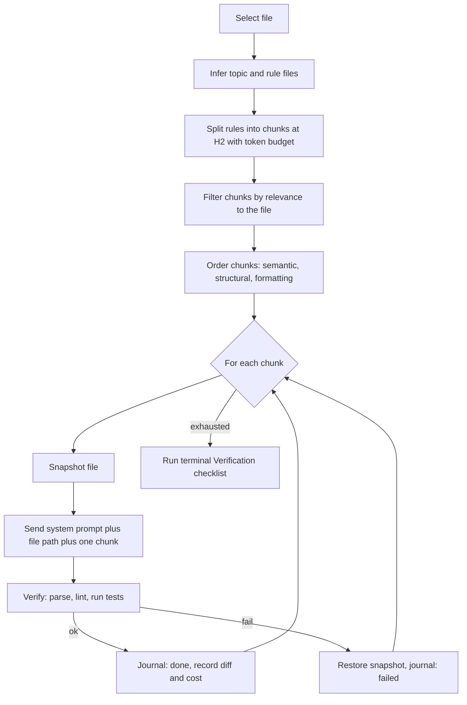

- Plan to improve the incremental application of rules in `linters2/lint_cc.py`
- Scope:
  - The `--apply_incrementally` code path in `linters2/lint_cc.py`
  - The `PromptSequencer` class in `dev_scripts_helpers/ai/cc_lib.py`
- Out of scope:
  - The `--topic`, `--skill`, and `--rule` code paths, except where code is
    factored out and shared

# Goal

- Turn `--apply_incrementally` into a reliable, resumable, and auditable linter
- Success criteria:
  - **Bounded**: each Claude interaction receives a rule of roughly uniform size
  - **Scoped**: only the target file can be modified
  - **Attributable**: every edit is traced back to the rule that caused it

# Current Behavior

- Invocation under analysis:
  ```bash
  > linters2/lint_cc.py \
    --files linters2/test/test_lint_cc.py \
    --apply_incrementally
  ```

- Control flow:
  - `_main()` selects files and calls `_process_file()`
  - `_process_file()` dispatches to `_process_file_incrementally()`
  - `_build_incremental_messages()` builds the message list:
    - Message 1: the role file content plus the "do not change behavior"
      instruction plus the template list
    - Message 2: the target file path
    - Messages 3 and following: one message per H1 section of the rule file
  - `PromptSequencer.execute()` sends all messages in a single
    `ClaudeSDKClient` session, preserving context across messages

- Observed run:
  - Topic inferred as `testing`, rule file `.claude/skills/testing.rules.md`
  - Nine H1 sections extracted, eleven messages sent
  - Run was interrupted mid-sequence and all progress was lost

# Target Pipeline



# Summary of Proposed CLI Options

| Option | Default | Purpose |
| :----- | :------ | :------ |
| `--incremental_mode` | `stateless` | One session per chunk (`stateless`) or one session for all chunks (`session`) |
| `--rule_level` | `2` | Header level at which rule files are split into chunks |
| `--max_chunk_tokens` | `1500` | Token budget used to pack small sections into one chunk |
| `--filter_rules` | on | Run a pre-pass that discards rules irrelevant to the file |
| `--verify_each_rule` | on | Parse, lint, and test the file after each chunk |
| `--journal` | `tmp.lint_cc.journal.json` | Path of the per-rule outcome journal |
| `--resume` | off | Skip chunks already marked `done` in the journal |

# Phase 1: Correctness Fixes

## Honor the `--model` Flag

- Problem:
  - `_process_file_incrementally()` logs that the model is "handled by the SDK"
    but never forwards it
  - `PromptSequencer.execute()` never sets `model` on `ClaudeAgentOptions`
- Change:
  - Add a `model` keyword argument to `PromptSequencer.__init__()`
  - Pass it through to `claude_agent_sdk.ClaudeAgentOptions(model=...)`
  - Forward `args.model` from `_process_file_incrementally()`
- Done when: `--model` changes the model used in incremental mode

## Restrict the Tool Surface

- Problem:
  - `PromptSequencer` is constructed with `permission_mode="acceptEdits"` and an
    empty `allowed_tools` list, so nothing binds edits to the target file
  - Claude can edit unrelated files, run shell commands, and touch git state
- Change:
  - Pass an explicit allow list, e.g., `["Read", "Edit", "Grep", "Glob"]`
  - Pass `disallowed_tools=["Bash", "Task", "WebFetch"]`
  - Add a `can_use_tool` callback that denies any edit whose `file_path` differs
    from the target file
- Done when: an attempt to edit a second file is denied and logged

## Run Post-Processing in Incremental Mode

- Problem:
  - `_main()` guards the `run_jupytext` and `run_lint` steps with
    `not args.apply_incrementally`
  - A notebook edited incrementally is never synced to its paired `.py` file
- Change:
  - Remove the guard so all modes share the same post-processing
- Done when: `--apply_incrementally` on an `.ipynb` file runs `jupytext --sync`

## Pin the Settings Sources

- Problem:
  - `ClaudeAgentOptions.setting_sources` defaults to `None`, which loads user
    settings, project settings, local settings, and every `CLAUDE.md`
  - The user global instructions and project hooks leak into the linter session
    and make results non-reproducible
- Change:
  - Pass `setting_sources=["project"]`, or `[]` combined with explicit rule
    injection
- Done when: two runs on the same input produce the same message stream

# Phase 2: Prompt Sequence Restructuring

## Move the Role into the System Prompt

- Problem:
  - Message 1 carries the role and message 2 carries only the file path
  - Both consume a full assistant turn and produce no edits
- Change:
  - Move the role content and the "do not change behavior" instruction into
    `ClaudeAgentOptions.system_prompt`
  - Interpolate the target file path into every rule message instead of stating
    it once
- Done when: the message list contains only rule messages

## Re-Anchor Every Turn on the Target File

- Problem:
  - Later rule messages refer to "the file", whose referent drifts once the
    context holds nine rule sections and several file reads
- Change:
  - Template each rule message as:
    ```text
    prompt> Re-read `{file_path}` from disk
    prompt> Apply ONLY the rule below to `{file_path}`
    prompt> Do not revisit rules applied earlier
    prompt> {rule_content}
    ```
- Done when: each message names the file explicitly

## Add a No-Op Contract

- Problem:
  - "Apply the following rule to the file" pressures an edit even when the file
    already complies, causing churn on clean files
- Change:
  - Require a structured reply:
    ```text
    LLM> NO-OP
    ```
    or
    ```text
    LLM> CHANGED: <one-line summary>
    ```
  - Parse the reply and record it as the per-rule outcome
- Done when: a compliant file produces `NO-OP` for every rule and zero edits

## Choose the Context Strategy

- Problem:
  - A single session grows monotonically: by the last rule the context holds all
    rule sections, all file reads, and all prior diffs
  - Attention degrades and the model re-litigates earlier edits
- Change:
  - Add `--incremental_mode` with two strategies:
    - **`stateless`** (default): a fresh `ClaudeSDKClient` per chunk, with the
      system prompt, the file path, and one rule
      - Gives uniform cost and full attention per rule
      - Makes per-rule attribution free
    - **`session`**: the current single-session behavior, kept for rules that
      depend on each other
- Done when: both strategies run end-to-end on the same file

# Phase 3: Rule Chunking and Filtering

## Split Rules at H2 with a Token Budget

- Problem:
  - H1 sections are wildly unequal in size
  - In `.claude/skills/testing.rules.md` the section `# Verification` is a short
    checklist while `# Writing Test Code` spans most of the file
  - A single oversized chunk reproduces the monolithic prompt it was meant to
    replace
- Change:
  - Split at the level given by `--rule_level`, defaulting to H2
  - Carry the parent H1 title into each chunk as context
  - Greedily pack consecutive small sections up to `--max_chunk_tokens`
  - Introduce a `RuleChunk` dataclass:
    ```python
    @dataclass
    class RuleChunk:
        title: str
        content: str
        order: int
    ```
- Done when: chunk sizes fall within a single order of magnitude

## Filter Rules by Relevance

- Problem:
  - A test file with no mocks still spends turns on the AWS mocking rules and the
    syscall mocking rules
- Change:
  - Add one cheap pre-pass that sends the chunk titles and the file, and asks for
    a JSON list of applicable titles
  - Run only the selected chunks, and log the discarded ones
- Done when: the turn count drops on files that exercise a subset of the rules

## Order Chunks by Dependency

- Problem:
  - Chunks are applied in file order, so interacting rules can fight each other
    - E.g., factoring code into helper methods versus ordering helper methods
      first versus consolidating inputs and outputs
  - The `# Verification` checklist is applied as one section among many rather
    than as a final gate
- Change:
  - Assign each chunk a category: semantic, structural, or formatting
  - Sort by category, then by file order
  - Always run the `# Verification` checklist last, as a terminal pass
- Done when: the verification checklist is the final message in every run

# Phase 4: Checkpointing and Resume

## Snapshot and Verify Each Chunk

- Problem:
  - Nothing checks that a rule left the file valid
  - The instruction not to change behavior is unverifiable when the target is
    itself a test file
- Change:
  - Before each chunk, read the file into memory as a snapshot
  - After each chunk, run an escalating gate:
    - `ast.parse()` on the file content, which is cheap and catches syntax breaks
    - `hlint.lint_file()` for the topics that request it
    - `pytest <file> -x -q` for the `testing` topic
  - On failure, restore the snapshot, mark the chunk failed, and continue with
    the next chunk instead of aborting the run
- Done when: a rule that breaks the file is rolled back and named in the log

## Journal Every Chunk Outcome

- Problem:
  - The observed run died partway through the sequence
  - Completed work was neither attributed nor resumable
  - `dev_scripts_helpers/ai/cc_lib.py` already defines `save_session_log()`, but
    `linters2/lint_cc.py` never calls it
- Change:
  - Write a JSON journal keyed by (`file_path`, `chunk_title`) holding:
    - `status`: one of `done`, `no_op`, `failed`, `skipped`
    - `diff`: the unified diff produced by the chunk
    - `cost_usd` and `num_turns`
  - Add `--resume` to skip entries already marked `done` or `no_op`
  - Reuse or extend `save_session_log()` rather than adding a parallel writer
- Done when: killing a run and rerunning with `--resume` continues where it
  stopped

## Bound Each Chunk

- Problem:
  - No per-prompt turn limit, so one rule can loop indefinitely
- Change:
  - Set `ClaudeAgentOptions.max_turns` to a small value per chunk
  - Treat a `max_turns` terminal reason as a chunk failure and roll back
- Done when: a pathological rule stops instead of hanging the run

# Phase 5: Observability

## Report Real Cost and Usage

- Problem:
  - `PromptSequencer.execute()` concatenates `str(message)` for every message,
    including full tool inputs, and retains the result only to log its length
- Change:
  - Drop the concatenation
  - Capture the fields already carried by `ResultMessage`:
    - `total_cost_usd`
    - `usage`
    - `num_turns`
    - `is_error`
    - `terminal_reason`
  - Surface them from `get_execution_stats()` and in the journal
- Done when: the run prints total cost and per-chunk cost

## Make Dry Run Inspectable

- Problem:
  - The dry run truncates each message to a short preview, so the plan cannot be
    reviewed
- Change:
  - Dump the full ordered message list to `tmp.lint_cc.messages.txt`
  - Keep the truncated preview on the console
- Done when: the dry run writes a file that reproduces the exact prompts

## Show Inner Progress

- Problem:
  - The `tqdm` bar wraps only the outer file loop, so a long chunk sequence gives
    no progress or estimate
- Change:
  - Add a nested `tqdm` bar over the chunks of the current file
- Done when: a multi-file run reports progress at both levels

# Refactoring

- Problem:
  - `_build_prompt()` and `_build_incremental_messages()` each assemble the role,
    the templates, and the "do not change behavior" instruction, so the two modes
    can drift
- Change:
  - Factor the shared assembly into one builder used by both modes
  - Introduce the helpers:
    ```python
    def _build_rule_chunks(topic_info, *, level=2, max_tokens=1500) -> List[RuleChunk]
    def _filter_relevant_chunks(file_path, chunks) -> List[RuleChunk]
    def _apply_chunk(file_path, chunk, opts) -> ChunkResult
    ```
- Done when: the role and template text exists in exactly one place

# Verification

- Unit tests to add in `linters2/test/test_lint_cc.py`:
  - `_build_rule_chunks()` splits at the requested level and respects the token
    budget
  - `_build_rule_chunks()` carries the parent H1 title into each chunk
  - Chunk ordering puts the verification checklist last
  - The journal round-trips and `--resume` skips completed chunks
  - A fenced `# comment` line does not create a spurious chunk
- End-to-end checks:
  - `--dry_run` on a Python file, a test file, and a markdown file
  - A full run on a file known to be compliant, expecting `NO-OP` throughout and
    an unchanged file
  - A full run interrupted partway, then rerun with `--resume`

# Risks and Trade-Offs

- **Stateless mode loses cross-rule memory**:
  - Mitigated by keeping `--incremental_mode session` available
- **The relevance filter can discard a rule that did apply**:
  - Mitigated by logging discarded chunks and biasing the pre-pass toward
    inclusion
- **Per-chunk test runs are slow on large test files**:
  - Mitigated by `--verify_each_rule`, which can drop back to the `ast.parse()`
    gate only
- **Restricting the tool surface can block a legitimate rule**:
  - E.g., a rule that requires reading a sibling file for context
  - Mitigated by allowing reads anywhere while restricting writes to the target
- **Pinning the settings sources changes behavior for existing users**:
  - Mitigated by landing the change with a note in `linters2/lint_cc.README.md`

# Suggested Order of Work

1. Phase 1, since the `--model` flag, the tool scoping, and the post-processing
   gap are outright defects
2. Phase 2, which removes two wasted turns and costs little
3. Phase 3, which cuts cost the most by making chunks uniform and fewer
4. Phase 4, which makes unattended runs safe
5. Phase 5, which is useful only once the earlier phases have settled
